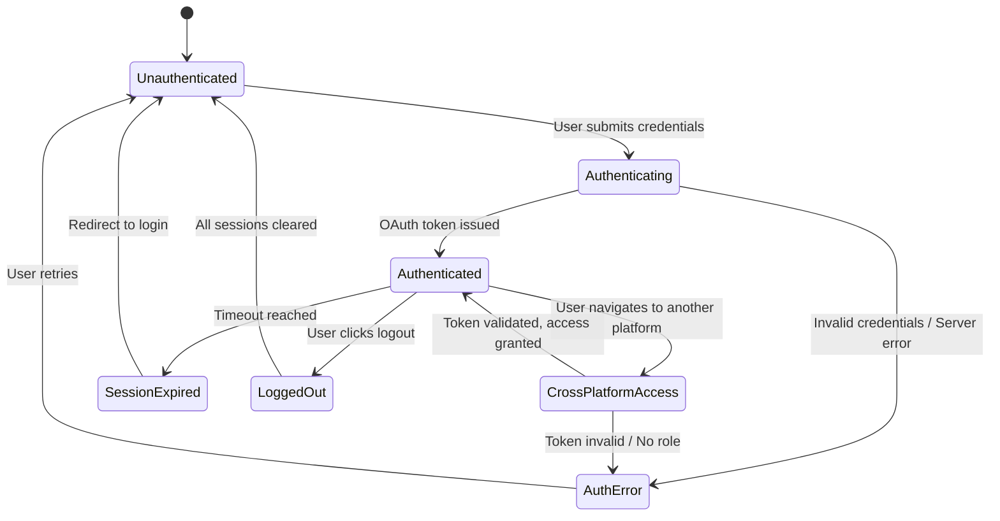

# Epic 1: Single Sign-On (SSO) & Unified Authentication
**Author/Owner**: Business Systems Analyst (BSA)
**Module**: Startup Partner O2O
**Date**: 2026-03-26
**Status**: ⚪ Draft

## Change Log

| Version | Date | Author | Changes |
|---------|------|--------|---------|
| 1.0 | 2026-03-26 | BSA | Initial draft extracted from BRD v2.0 |

**PRD Reference:** `docs/modules/startup-partner-o2o/startup-partner-o2o prd.md`
**BRD Reference:** `docs/modules/startup-partner-o2o/brd.md`
**Maps to:** FR-001, FR-002, FR-003, FR-004

---

### 1. Epic Information

| Field | Value |
|-------|-------|
| **Epic ID** | EPIC-01 |
| **Epic Name** | Single Sign-On (SSO) & Unified Authentication |
| **Epic Description** | Integrate with Authentication Center and Allkons ID for unified auth across all platforms |
| **Business Objective** | Provide seamless authentication across all Allkons M platforms (SP Portal, Buyer Portal, Seller Portal, Admin Portal) using OAuth 2.0 and Keycloak |
| **Target Release** | TBD |
| **Epic Owner** | BSA |
| **Epic Status** | Backlog |
| **Priority** | P0 |
| **Estimated Story Points** | TBD |

#### Epic User Story
As a user (SP/Buyer/Seller/Admin), I want to login once and access all authorized Allkons M platforms without re-authentication, so that I have a seamless experience across the ecosystem.

#### Epic Scope
**In Scope:**
- Integration with Authentication Center and Allkons ID modules
- Single credential management
- Cross-platform session management
- Profile synchronization

**Out of Scope:**
- Multi-factor authentication (MFA)
- Biometric authentication
- Social login (Google, Facebook)

#### Related Epics
| Epic ID | Epic Name | Relationship |
|---------|-----------|--------------|
| EPIC-02 | SP Registration & Onboarding | Depends on (SP registration uses Allkons ID for existing users) |

#### Epic Success Criteria
- [ ] Users can login once and access all authorized platforms without re-authentication
- [ ] Session timeout managed centrally
- [ ] Profile updates sync across platforms

---

### 2. User Stories

> Each user story follows the BRD structure: US -> AC (Given/When/Then) -> BR -> Validation -> Edge Cases -> Error Handling -> State Behavior. ID scheme: `US-01`, `US-02`, ... (scoped to this epic).

#### US-01: User Single Sign-On Across Platforms
**As a** user (SP/Buyer/Seller/Admin), **I want to** login once and access all authorized Allkons M platforms without re-authentication, **so that** I have a seamless experience across the ecosystem.

**Preconditions:**
- Authentication Center and Allkons ID modules are operational
- User has valid credentials (phone number + password)
- User has appropriate role assignments in Keycloak

**Business Rules:**
| Rule ID | Rule Description | Priority |
|---------|------------------|----------|
| BR-001 | Users must have one credential (phone number + password) across all Allkons M systems | P0 |
| BR-002 | Login via Authentication Center grants access to all authorized platforms based on Keycloak roles | P0 |
| BR-003 | Session token is OAuth 2.0 compliant and valid across all platforms | P0 |
| BR-004 | Session timeout is configurable by Authentication Center (default: 24 hours) | P1 |
| BR-005 | Logout from one platform logs out from all platforms via Authentication Center | P0 |

**Validation Rules:**
| Field | Validation Rule | Error Message |
|-------|-----------------|---------------|
| Phone Number | Must be 10 digits, Thai format (0X-XXXX-XXXX) | กรุณากรอกหมายเลขโทรศัพท์ให้ถูกต้อง (10 หลัก) |
| Password | Minimum 8 characters, at least 1 uppercase, 1 lowercase, 1 number | รหัสผ่านต้องมีอย่างน้อย 8 ตัวอักษร ประกอบด้วยตัวพิมพ์ใหญ่ ตัวพิมพ์เล็ก และตัวเลข |

**Acceptance Criteria:**
| # | Given | When | Then |
|---|-------|------|------|
| AC-01 | User is not logged in | User enters valid credentials in SP Portal | User is authenticated via Authentication Center and redirected to SP Portal dashboard |
| AC-02 | User is logged in to SP Portal | User navigates to Seller Portal URL | User is automatically authenticated and sees Seller Portal (if authorized) without re-login |
| AC-03 | User is logged in to multiple platforms | User clicks logout in any platform | User is logged out from all platforms and redirected to login page |
| AC-04 | User session is active | Session timeout period expires | User is automatically logged out from all platforms and must re-authenticate |
| AC-05 | User has "Remember Me" enabled | User closes browser and reopens | User session persists and user remains logged in across platforms |

**Edge Cases (minimum 3):**
| # | Scenario | Expected Behavior |
|---|----------|-------------------|
| EC-01 | User tries to access platform without appropriate Keycloak role | Display error "คุณไม่มีสิทธิ์เข้าถึงระบบนี้ กรุณาติดต่อผู้ดูแลระบบ" and redirect to login |
| EC-02 | Authentication Center is temporarily unavailable | Display error "ระบบไม่สามารถเชื่อมต่อได้ในขณะนี้ กรุณาลองใหม่อีกครั้ง" with retry option |
| EC-03 | User changes password in one platform | Password change syncs to Authentication Center and applies to all platforms immediately |
| EC-04 | Concurrent login from different devices | Both sessions remain active; logout from one device does not affect other device session |
| EC-05 | OAuth token expires during active session | System automatically refreshes token transparently without user interruption |

**Error Handling:**
| Error | Trigger | User Feedback | Recovery |
|-------|---------|---------------|----------|
| Invalid credentials | Wrong phone/password | ชื่อผู้ใช้หรือรหัสผ่านไม่ถูกต้อง | Allow retry, show "Forgot Password" link |
| Account blocked | User account suspended | บัญชีนี้ถูกระงับการใช้งาน กรุณาติดต่อผู้ดูแลระบบ | Contact support |
| Session expired | Timeout reached | เซสชันหมดอายุ กรุณาเข้าสู่ระบบใหม่อีกครั้ง | Redirect to login page |
| OAuth error | Token validation fails | เกิดข้อผิดพลาดในการยืนยันตัวตน กรุณาเข้าสู่ระบบใหม่ | Force re-login |

**State Behavior:**
| State | When | UI Requirements |
|-------|------|-----------------|
| Loading | Authentication in progress | Show loading spinner with "กำลังเข้าสู่ระบบ..." |
| Success | Authentication successful | Redirect to target platform dashboard |
| Error | Authentication fails | Display error message with retry option |
| Logged Out | User logs out or session expires | Clear all session data, redirect to login page |

#### US-02: Existing User Registration for SP Program
**As an** existing Allkons M user (Buyer or Seller), **I want to** register for the SP program using my existing credentials, **so that** I don't need to create a new account.

**Preconditions:**
- User has existing Allkons M account with verified phone number
- User is logged in via Allkons ID
- SP program registration is open

**Business Rules:**
| Rule ID | Rule Description | Priority |
|---------|------------------|----------|
| BR-006 | Existing users can register for SP program using their Allkons ID credentials | P0 |
| BR-007 | System recognizes existing user via Allkons ID and links SP profile to existing account | P0 |
| BR-008 | No need to create new password; existing password is used | P0 |
| BR-009 | User profile managed centrally by Allkons ID; updates sync across all platforms | P0 |

**Validation Rules:**
| Field | Validation Rule | Error Message |
|-------|-----------------|---------------|
| Phone Number | Must match existing Allkons ID account | หมายเลขโทรศัพท์นี้ไม่ตรงกับบัญชีที่เข้าสู่ระบบ |

**Acceptance Criteria:**
| # | Given | When | Then |
|---|-------|------|------|
| AC-06 | Existing user is logged in | User navigates to SP registration page | System pre-fills phone number and name from Allkons ID profile |
| AC-07 | Existing user submits SP application | User completes KYC and service area selection | SP profile is linked to existing Allkons ID account without creating new credentials |
| AC-08 | SP application is approved | Admin approves application | User can access SP Portal using existing Allkons ID credentials |

**Edge Cases (minimum 3):**
| # | Scenario | Expected Behavior |
|---|----------|-------------------|
| EC-06 | User already has SP profile | Display message "คุณมีบัญชี Startup Partner อยู่แล้ว" and redirect to SP Portal |
| EC-07 | User updates profile in Buyer Portal | Changes sync to Allkons ID and reflect in SP Portal immediately |
| EC-08 | User has multiple ORGs in Buyer/Seller role | SP profile is independent; user can switch between roles seamlessly |

**Error Handling:**
| Error | Trigger | User Feedback | Recovery |
|-------|---------|---------------|----------|
| Profile sync failure | Allkons ID unavailable | ไม่สามารถโหลดข้อมูลโปรไฟล์ได้ กรุณาลองใหม่อีกครั้ง | Retry button |
| Duplicate SP application | User already applied | คุณได้ยื่นใบสมัครแล้ว กรุณารอการอนุมัติ | Redirect to application status page |

**State Behavior:**
| State | When | UI Requirements |
|-------|------|-----------------|
| Loading | Fetching profile from Allkons ID | Show skeleton loader for form fields |
| Success | Profile loaded | Display pre-filled form with user data |
| Error | Profile fetch fails | Show error message with retry option |

---

### 3. Description

**Business Context:**
- **Problem Statement:** Users across the Allkons M ecosystem (SP Portal, Buyer Portal, Seller Portal, Admin Portal) currently face fragmented authentication experiences, requiring separate credentials for each platform.
- **Current State:** Multiple login credentials lead to poor user experience, password fatigue, and inconsistent profile data across platforms.
- **Desired State:** A unified SSO experience where users authenticate once via Authentication Center and Allkons ID, gaining seamless access to all authorized platforms with centrally managed sessions and synchronized profiles.
- **Business Value:** Reduces friction for user adoption, eliminates duplicate account management, improves security through centralized session control, and enables cross-platform user identity for analytics and personalization.

---

### 4. Prerequisites

| Prerequisite | Description | Status |
|--------------|-------------|--------|
| Authentication Center | Authentication Center module must be operational and expose OAuth 2.0 endpoints | [ ] |
| Allkons ID | Allkons ID module must be operational for identity management and profile synchronization | [ ] |
| Keycloak | Keycloak instance configured with realm, clients, and role mappings for all platforms | [ ] |

**Dependencies:**
- Authentication Center module (OAuth 2.0 provider)
- Allkons ID module (identity and profile management)
- Keycloak (role-based access control)

---

### 5. Terminology

| Term | Definition |
|------|------------|
| SSO (Single Sign-On) | Authentication mechanism allowing users to login once and access multiple platforms |
| OAuth 2.0 | Industry-standard protocol for authorization |
| Keycloak | Open-source identity and access management solution used for role-based access |
| Allkons ID | Centralized identity module managing user profiles across all Allkons M platforms |
| Authentication Center | Central authentication service providing OAuth 2.0 tokens for cross-platform SSO |
| Session Token | OAuth 2.0 compliant token valid across all platforms, with configurable timeout |

---

### 6. Role and Permission Matrix

| Role | Permission | Access Level |
|------|------------|--------------|
| SP (Startup Partner) | Access SP Portal | Read/Write |
| Buyer | Access Buyer Portal | Read/Write |
| Seller | Access Seller Portal | Read/Write |
| Admin | Access Admin Portal | Read/Write/Delete |
| SP (Pending/InfoRequested/Rejected) | Limited SP Portal access | Read only (Application Status, Profile, Documents, Logout) |

**Permission Definitions:**
- `auth:login` - Authenticate via Authentication Center
- `auth:logout` - Logout from all platforms
- `profile:view` - View own profile synced from Allkons ID
- `profile:edit` - Edit profile (syncs to Allkons ID)
- `platform:access` - Access authorized platform based on Keycloak roles

---

### 7. Information in the List

| Field Name | Format | Example | No Value | Condition |
|------------|--------|---------|----------|-----------|
| Phone Number | 0X-XXXX-XXXX | 09-1234-5678 | N/A (required) | Must be 10 digits, Thai format |
| Session Status | Text | Active / Expired | N/A | Derived from token validity |
| Platform Access | Tag list | SP Portal, Buyer Portal | No platforms assigned | Based on Keycloak role assignments |
| Last Login | DateTime | 2026-03-26 14:30 | Never logged in | From Authentication Center |

**Display Rules:**
- Phone number is always masked in UI except on the user's own profile (display as 09X-XXX-5678)
- Session status is derived from OAuth token validity, not stored separately
- Platform access tags reflect current Keycloak role assignments

---

### 8. Requirements

#### 8.1 General Information

| Field | Value |
|-------|-------|
| **Story Type** | New feature |
| **Application** | Allkons M Platform (SP Portal, Buyer Portal, Seller Portal, Admin Portal) |
| **Module** | Startup Partner O2O |
| **Pages** | `/login`, `/callback`, `/logout` |
| **Priority** | P0 |
| **Complexity** | High |

#### 8.2 Happy Path

1. User navigates to any Allkons M platform (e.g., SP Portal)
2. System redirects to Authentication Center login page
3. User enters phone number and password
4. Authentication Center validates credentials and issues OAuth 2.0 token
5. User is redirected back to the target platform dashboard with active session
6. User navigates to another platform (e.g., Seller Portal)
7. System detects valid OAuth token and grants access without re-login
8. User clicks logout in any platform
9. Authentication Center invalidates session across all platforms
10. User is redirected to login page

#### 8.3 Business Rules (consolidated from all US)

| Rule ID | Rule Description | Priority |
|---------|------------------|----------|
| BR-001 | Users must have one credential (phone number + password) across all Allkons M systems | P0 |
| BR-002 | Login via Authentication Center grants access to all authorized platforms based on Keycloak roles | P0 |
| BR-003 | Session token is OAuth 2.0 compliant and valid across all platforms | P0 |
| BR-004 | Session timeout is configurable by Authentication Center (default: 24 hours) | P1 |
| BR-005 | Logout from one platform logs out from all platforms via Authentication Center | P0 |
| BR-006 | Existing users can register for SP program using their Allkons ID credentials | P0 |
| BR-007 | System recognizes existing user via Allkons ID and links SP profile to existing account | P0 |
| BR-008 | No need to create new password; existing password is used | P0 |
| BR-009 | User profile managed centrally by Allkons ID; updates sync across all platforms | P0 |

#### 8.4 Validation Rules (consolidated)

| Field | Validation Rule | Error Message |
|-------|-----------------|---------------|
| Phone Number | Must be 10 digits, Thai format (0X-XXXX-XXXX) | กรุณากรอกหมายเลขโทรศัพท์ให้ถูกต้อง (10 หลัก) |
| Password | Minimum 8 characters, at least 1 uppercase, 1 lowercase, 1 number | รหัสผ่านต้องมีอย่างน้อย 8 ตัวอักษร ประกอบด้วยตัวพิมพ์ใหญ่ ตัวพิมพ์เล็ก และตัวเลข |
| Phone Number (existing user) | Must match existing Allkons ID account | หมายเลขโทรศัพท์นี้ไม่ตรงกับบัญชีที่เข้าสู่ระบบ |

---

### 9. Acceptance Criteria (consolidated)

#### 9.1 View Mode Scenarios

**Scenario: Loading State**

**Given** user has submitted credentials
**When** Authentication Center is processing the request
**Then** system displays loading spinner with "กำลังเข้าสู่ระบบ..."

**Scenario: Success State**

**Given** user has valid credentials
**When** Authentication Center validates successfully
**Then** user is redirected to target platform dashboard with active session

**Scenario: Error States**

**Given** user enters invalid credentials
**When** user submits login form
**Then** system displays "ชื่อผู้ใช้หรือรหัสผ่านไม่ถูกต้อง" with retry option

**Given** user account is suspended
**When** user attempts login
**Then** system displays "บัญชีนี้ถูกระงับการใช้งาน กรุณาติดต่อผู้ดูแลระบบ"

**Given** Authentication Center is unavailable
**When** user attempts login
**Then** system displays "ระบบไม่สามารถเชื่อมต่อได้ในขณะนี้ กรุณาลองใหม่อีกครั้ง" with retry option

#### 9.2 Action Mode Scenarios

**Scenario: SSO Login Success (AC-01)**

**Given** user is not logged in
**When** user enters valid credentials in SP Portal
**Then** user is authenticated via Authentication Center and redirected to SP Portal dashboard

**Scenario: Cross-Platform Access (AC-02)**

**Given** user is logged in to SP Portal
**When** user navigates to Seller Portal URL
**Then** user is automatically authenticated and sees Seller Portal (if authorized) without re-login

**Scenario: Global Logout (AC-03)**

**Given** user is logged in to multiple platforms
**When** user clicks logout in any platform
**Then** user is logged out from all platforms and redirected to login page

**Scenario: Session Timeout (AC-04)**

**Given** user session is active
**When** session timeout period expires
**Then** user is automatically logged out from all platforms and must re-authenticate

**Scenario: Remember Me (AC-05)**

**Given** user has "Remember Me" enabled
**When** user closes browser and reopens
**Then** user session persists and user remains logged in across platforms

**Scenario: Existing User SP Registration - Pre-fill (AC-06)**

**Given** existing user is logged in
**When** user navigates to SP registration page
**Then** system pre-fills phone number and name from Allkons ID profile

**Scenario: Existing User SP Registration - Link Account (AC-07)**

**Given** existing user submits SP application
**When** user completes KYC and service area selection
**Then** SP profile is linked to existing Allkons ID account without creating new credentials

**Scenario: Existing User SP Approval (AC-08)**

**Given** SP application is approved
**When** Admin approves application
**Then** user can access SP Portal using existing Allkons ID credentials

#### 9.3 Race Condition Scenarios

**Scenario: Concurrent Login from Multiple Devices**

**Given** user is logged in on Device A
**When** user logs in on Device B simultaneously
**Then** both sessions remain active; logout from one device does not affect other device session

**Scenario: Password Change During Active Session**

**Given** user is logged in on multiple platforms
**When** user changes password in one platform
**Then** password change syncs to Authentication Center and applies to all platforms immediately; existing sessions remain valid until next re-authentication

#### 9.4 Loading State Scenarios (Action Mode)

**Scenario: Loading during authentication**

**Given** user has submitted credentials
**When** system is communicating with Authentication Center
**Then** login button is disabled, loading spinner is displayed, form inputs are disabled

**Scenario: Loading during profile fetch (existing user)**

**Given** existing user navigates to SP registration
**When** system is fetching profile from Allkons ID
**Then** form displays skeleton loaders for pre-filled fields

#### 9.5 Field Validation Scenarios

**Scenario: Invalid phone number format**

**Given** user is on login page
**When** user enters phone number with fewer than 10 digits
**Then** validation error "กรุณากรอกหมายเลขโทรศัพท์ให้ถูกต้อง (10 หลัก)" is displayed and submission is blocked

**Scenario: Weak password**

**Given** user is on password change page
**When** user enters password without uppercase letter
**Then** validation error "รหัสผ่านต้องมีอย่างน้อย 8 ตัวอักษร ประกอบด้วยตัวพิมพ์ใหญ่ ตัวพิมพ์เล็ก และตัวเลข" is displayed and submission is blocked

#### 9.6 Edge Cases

**Scenario: Unauthorized platform access (EC-01)**

**Given** user is authenticated but lacks Keycloak role for a platform
**When** user attempts to access that platform
**Then** system displays "คุณไม่มีสิทธิ์เข้าถึงระบบนี้ กรุณาติดต่อผู้ดูแลระบบ" and redirects to login

**Scenario: OAuth token auto-refresh (EC-05)**

**Given** user has an active session
**When** OAuth token expires during usage
**Then** system automatically refreshes token transparently without user interruption

**Scenario: Duplicate SP profile (EC-06)**

**Given** existing user already has SP profile
**When** user navigates to SP registration
**Then** system displays "คุณมีบัญชี Startup Partner อยู่แล้ว" and redirects to SP Portal

---

### 10. Risk Assessment

| Risk ID | Risk Description | Category | Probability | Impact | Risk Level | Mitigation Strategy | Owner | Status |
|---------|------------------|----------|-------------|--------|------------|---------------------|-------|--------|
| R-001 | Authentication Center downtime prevents all platform access | Operational | M | H | High | Implement graceful degradation with cached tokens; deploy HA cluster for Authentication Center | Tech Lead | Open |
| R-002 | OAuth token interception enables unauthorized cross-platform access | Technical | L | H | High | Use HTTPS only, short-lived access tokens with refresh tokens, token binding | Tech Lead | Open |
| R-003 | Session synchronization delay causes inconsistent logout across platforms | Technical | M | M | Medium | Implement event-driven session invalidation via Authentication Center webhook | Tech Lead | Open |
| R-004 | Profile sync failure between Allkons ID and platform databases | Technical | M | M | Medium | Implement retry mechanism with exponential backoff; log sync failures for manual resolution | Tech Lead | Open |
| R-005 | Keycloak role misconfiguration grants unauthorized platform access | Compliance | L | H | High | Implement role assignment audit trail; require approval workflow for role changes | Admin | Open |
| R-006 | Password policy not enforced consistently across platforms | Compliance | L | M | Medium | Centralize password policy in Authentication Center; validate on all platforms | Tech Lead | Open |
| R-007 | Cross-platform SSO increases blast radius of credential compromise | Strategic | M | H | High | Plan MFA rollout for future phase; implement anomaly detection for suspicious login patterns | Product Owner | Open |

#### Risk Summary
- **Total Risks:** 7
- **Critical Risks:** 0
- **High Risks:** 3
- **Medium Risks:** 3
- **Low Risks:** 1

---

### 11. Data Dictionary

#### Entity: User Session (OAuth 2.0)

| Attribute Name | Data Type | Length | Required | Unique | Default Value | Description |
|----------------|-----------|--------|----------|--------|---------------|-------------|
| accessToken | string | - | Yes | Yes | - | OAuth 2.0 access token issued by Authentication Center |
| refreshToken | string | - | Yes | Yes | - | OAuth 2.0 refresh token for token renewal |
| expiresIn | number | - | Yes | No | 86400 (24h) | Token expiry in seconds, configurable |
| tokenType | string | 20 | Yes | No | "Bearer" | OAuth token type |
| scope | string | 255 | Yes | No | - | Authorized scopes/platforms |

#### Entity: StartupPartner (relevant fields for EPIC-01)

```typescript
interface StartupPartner {
  id: string; // UUID
  allkonsId: string; // Reference to Allkons ID account
  firstName: string;
  lastName: string;
  phoneNumber: string; // 10 digits, Thai format
  email?: string; // Optional
  applicationStatus: 'Pending' | 'Approved' | 'Rejected' | 'InfoRequested' | 'Suspended';
  createdAt: Date;
  updatedAt: Date;
  approvedAt?: Date;
  approvedBy?: string; // Admin ID
}
```

#### Relationships

| Related Entity | Relationship Type | Cardinality | Description |
|----------------|-------------------|-------------|-------------|
| Allkons ID Account | One-to-One | 1:1 | Each SP has exactly one Allkons ID account |
| Keycloak Role | Many-to-Many | N:M | Users can have multiple roles across platforms |

---

### 12. Audit Trail Requirements

| Action | Data to Capture | Retention Period |
|--------|-----------------|------------------|
| LOGIN | User ID, Timestamp, Platform, IP address, Device info, OAuth token ID | 1 year |
| LOGOUT | User ID, Timestamp, Platform, IP address, Logout type (manual/timeout/forced) | 1 year |
| SESSION_REFRESH | User ID, Timestamp, Old token ID, New token ID, IP address | 6 months |
| PASSWORD_CHANGE | User ID, Timestamp, IP address, Change source platform | 1 year |
| ROLE_CHANGE | User ID, Admin ID, Timestamp, Old roles, New roles, IP address | 2 years |
| SP_REGISTRATION_LINK | User ID (Allkons ID), Timestamp, SP Profile ID, IP address | 2 years |

---

### 13. Notes

- Authentication Center and Allkons ID are external modules; this epic depends on their API availability and stability.
- "Remember Me" functionality should use secure, HTTP-only cookies with appropriate expiration.
- Concurrent device sessions (EC-04) are allowed by design; this may need revisiting if security concerns arise.
- Profile synchronization between Allkons ID and platform databases should be near real-time but eventual consistency is acceptable.

### Questions for Tech Lead
- What is the expected latency for cross-platform session validation?
- Should we implement token caching at the platform level for performance?
- What is the fallback strategy if Authentication Center is unreachable?
- How should we handle token refresh for long-running API calls?
- What is the maximum number of concurrent sessions per user?

### Questions for UX Designer
- What should the loading state look like during cross-platform redirect?
- How should the "Remember Me" checkbox be presented on the login form?
- What is the desired UX for session timeout notification (silent redirect vs. modal warning)?
- Should there be a visible indicator of which platforms the user is currently authenticated on?

---

### 14. Draft Technical Design

#### 14.1 API Endpoints

| Method | Endpoint | Description | Authentication |
|--------|----------|-------------|----------------|
| POST | /auth/login | Authenticate user via Authentication Center | Not required |
| POST | /auth/logout | Logout user from all platforms | Required |
| POST | /auth/refresh | Refresh OAuth 2.0 access token | Required (refresh token) |
| GET | /auth/session | Validate current session | Required |
| GET | /auth/profile | Get user profile from Allkons ID | Required |
| POST | /auth/sp-register | Register existing user for SP program | Required |

#### 14.2 Database Schema

```sql
-- Session management (handled by Keycloak, documented for reference)
-- No custom session table needed; Keycloak manages sessions centrally

-- SP registration link to Allkons ID
CREATE TABLE sp_allkons_link (
    id UUID PRIMARY KEY DEFAULT gen_random_uuid(),
    sp_id UUID NOT NULL REFERENCES startup_partners(id),
    allkons_id VARCHAR(255) NOT NULL UNIQUE,
    linked_at TIMESTAMP NOT NULL DEFAULT NOW(),
    linked_by VARCHAR(50) NOT NULL, -- 'self' or admin ID
    CONSTRAINT fk_sp FOREIGN KEY (sp_id) REFERENCES startup_partners(id)
);

-- Audit log for authentication events
CREATE TABLE auth_audit_log (
    id UUID PRIMARY KEY DEFAULT gen_random_uuid(),
    user_id VARCHAR(255) NOT NULL,
    action VARCHAR(50) NOT NULL, -- LOGIN, LOGOUT, SESSION_REFRESH, PASSWORD_CHANGE
    platform VARCHAR(50) NOT NULL, -- SP_PORTAL, BUYER_PORTAL, SELLER_PORTAL, ADMIN_PORTAL
    ip_address INET,
    device_info JSONB,
    metadata JSONB,
    created_at TIMESTAMP NOT NULL DEFAULT NOW()
);
```

#### 14.3 State Diagram



#### 14.4 UI/UX Considerations

- Login page should be provided by Authentication Center (centralized login UI)
- Cross-platform redirect should be seamless with minimal visible delay (< 2 seconds)
- Session timeout warning should appear 5 minutes before expiry with option to extend
- Error messages must be in Thai language as specified in validation rules
- Skeleton loaders for profile pre-fill during SP registration (US-02)
- Accessible loading states with ARIA labels for screen readers

---

### 15. Testing Checklist

#### Pre-Testing
- [ ] Authentication Center is operational and accessible
- [ ] Allkons ID module is operational and accessible
- [ ] Keycloak is configured with correct realms, clients, and role mappings
- [ ] Test accounts created for SP, Buyer, Seller, and Admin roles
- [ ] Test accounts with multiple roles created

#### Functional Testing
- [ ] Login with valid credentials redirects to correct platform dashboard (AC-01)
- [ ] Cross-platform SSO works without re-login (AC-02)
- [ ] Global logout from any platform logs out all platforms (AC-03)
- [ ] Session timeout triggers automatic logout from all platforms (AC-04)
- [ ] "Remember Me" persists session across browser close/reopen (AC-05)
- [ ] Existing user SP registration pre-fills profile from Allkons ID (AC-06)
- [ ] SP profile links to existing Allkons ID without new credentials (AC-07)
- [ ] Approved SP can access SP Portal with existing credentials (AC-08)
- [ ] Unauthorized platform access shows correct error message (EC-01)
- [ ] Authentication Center unavailability shows retry option (EC-02)
- [ ] Password change syncs across all platforms (EC-03)
- [ ] Concurrent sessions from different devices work correctly (EC-04)
- [ ] OAuth token auto-refresh works transparently (EC-05)
- [ ] Duplicate SP registration shows appropriate message (EC-06)
- [ ] Profile sync from Buyer Portal reflects in SP Portal (EC-07)
- [ ] Multi-role user can switch between roles seamlessly (EC-08)

#### Security Testing
- [ ] Invalid credentials are rejected with correct error message
- [ ] Suspended accounts cannot login
- [ ] OAuth tokens are transmitted over HTTPS only
- [ ] Token expiration is enforced correctly
- [ ] Role-based access control prevents unauthorized platform access
- [ ] Session tokens cannot be reused after logout
- [ ] CSRF protection is in place for login/logout flows

#### Performance Testing
- [ ] Login response time < 2 seconds
- [ ] Cross-platform SSO redirect < 2 seconds
- [ ] Token refresh < 1 second
- [ ] Profile sync from Allkons ID < 3 seconds

#### Cross-Browser Testing
- [ ] Chrome
- [ ] Firefox
- [ ] Safari
- [ ] Edge

#### Mobile Testing
- [ ] Responsive login page on mobile devices
- [ ] Touch interactions work correctly on login form
- [ ] Cross-platform redirect works on mobile browsers

---

### 16. Approval

| Role | Name | Signature | Date |
|------|------|-----------|------|
| Product Owner | | | |
| Business Analyst | | | |
| Technical Lead | | | |
| QA Lead | | | |

---

**Document Version:** 1.0
**Last Updated:** 2026-03-26
**Author:** BSA
**Status:** Draft
