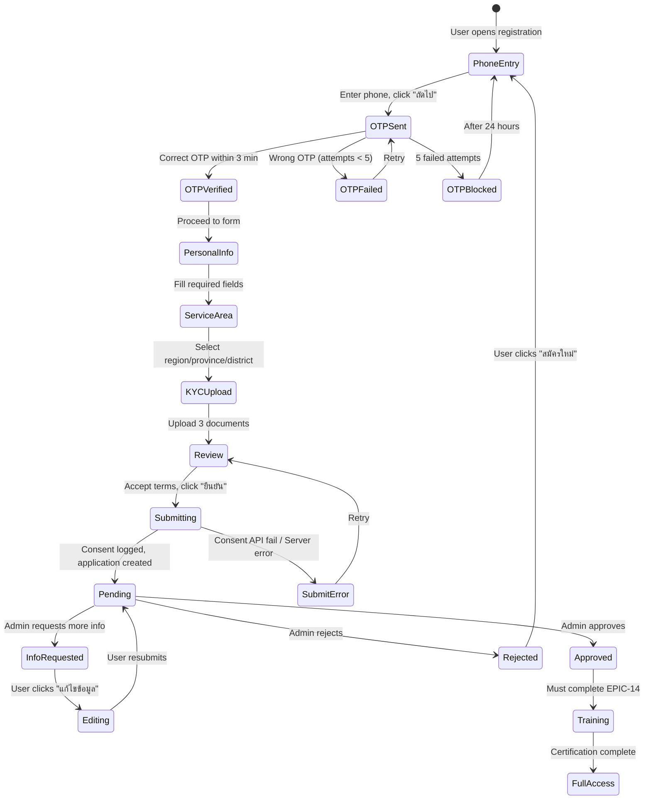

# Epic 2: SP Registration & Onboarding
**Author/Owner**: Business Systems Analyst (BSA)
**Module**: Startup Partner O2O
**Date**: 2026-03-26
**Status**: ⚪ Draft

## Change Log

| Version | Date | Author | Changes |
|---------|------|--------|---------|
| 1.0 | 2026-03-26 | BSA | Initial draft extracted from BRD v2.0 |

**PRD Reference:** `docs/modules/startup-partner-o2o/startup-partner-o2o prd.md`
**BRD Reference:** `docs/modules/startup-partner-o2o/brd.md`
**Maps to:** FR-005, FR-006, FR-007, FR-008, FR-009

---

### 1. Epic Information

| Field | Value |
|-------|-------|
| **Epic ID** | EPIC-02 |
| **Epic Name** | SP Registration & Onboarding |
| **Epic Description** | Standalone SP Portal for public freelance sales agent registration with KYC |
| **Business Objective** | Provide standalone SP Portal for public freelance sales agents to register, submit KYC documents, and select service areas |
| **Target Release** | TBD |
| **Epic Owner** | BSA |
| **Epic Status** | Backlog |
| **Priority** | P0 |
| **Estimated Story Points** | TBD |

#### Epic User Story
As a public freelance sales agent, I want to register as a Startup Partner by submitting my information and KYC documents, so that I can start earning commissions by connecting buyers with sellers.

#### Epic Scope
**In Scope:**
- Registration form
- KYC document upload
- OTP verification
- Service area selection
- Target shops selection
- Auto-generated password
- Application submission and tracking

**Out of Scope:**
- Automated KYC verification
- Video KYC
- In-person verification
- Multi-language support

#### Related Epics
| Epic ID | Epic Name | Relationship |
|---------|-----------|--------------|
| EPIC-01 | Single Sign-On (SSO) & Unified Authentication | Depends on (approved SPs authenticate via SSO) |
| EPIC-03 | Admin SP Management | Blocks (admin reviews and approves SP applications) |
| EPIC-04 | Seller Opt-In & Configuration | Related (target shop selection depends on seller opt-in) |
| EPIC-14 | SP Training & Certification | Related (approved SPs must complete training before live selling) |

#### Epic Success Criteria
- [ ] Public users can complete SP registration in under 10 minutes
- [ ] KYC documents uploaded successfully
- [ ] Application submitted for admin review

---

### 2. User Stories

> Each user story follows the BRD structure: US -> AC (Given/When/Then) -> BR -> Validation -> Edge Cases -> Error Handling -> State Behavior. ID scheme: `US-03`, `US-04`, ... (scoped to this epic).

#### US-03: Public SP Registration with KYC
**As a** public freelance sales agent, **I want to** register as a Startup Partner by submitting my information and KYC documents, **so that** I can start earning commissions by connecting buyers with sellers.

**Preconditions:**
- User has valid Thai ID card
- User has bank account
- User has smartphone with camera for selfie
- SP program registration is open

**Business Rules:**
| Rule ID | Rule Description | Priority |
|---------|------------------|----------|
| BR-010 | Phone number is primary identifier and becomes username | P0 |
| BR-011 | OTP must be verified before registration proceeds | P0 |
| BR-012 | OTP is 6 digits, expires in 3 minutes, maximum 5 attempts | P0 |
| BR-013 | ID card number must be 13 digits and unique in system | P0 |
| BR-014 | Service area selection uses Region -> Province -> District hierarchy | P0 |
| BR-015 | User selects Region first; system auto-populates all provinces in that region | P0 |
| BR-016 | User can select specific provinces; system auto-populates all districts in selected provinces | P0 |
| BR-017 | Database stores district-level service areas for granular control | P0 |
| BR-018 | Admin can adjust district-level scope after approval (EPIC-03 US-06) | P1 |
| BR-019 | Target shops selection is optional; only shops that opted-in to SP Program (US-08) are shown | P1 |
| BR-020 | Shop list filtered by: (1) Opted-in to SP Program, (2) Located in SP's selected service areas | P0 |
| BR-021 | All 3 KYC documents (ID card front/back, selfie with ID) are mandatory | P0 |
| BR-022 | Each KYC document must be JPG/PNG/HEIC/PDF, max 10MB | P0 |
| BR-023 | System auto-converts HEIC files to PNG format for storage | P0 |
| BR-024 | System generates preview images from PDF files (first page thumbnail); stores original PDF | P0 |
| BR-025 | User can preview uploaded files before submission | P0 |
| BR-026 | System auto-generates secure password and sends via LINE OA notification (with SMS as fallback) after approval | P0 |
| BR-027 | SP program terms and conditions must be accepted before submission | P0 |
| BR-028 | System logs consent to Consent Center API with timestamp, user ID, consent type, IP address | P0 |
| BR-029 | Consent Center API must respond successfully before application submission completes | P0 |
| BR-271 | SP must complete mandatory training and certification before accessing live selling features (RFQ creation, seller messaging, Magic Link generation) | P0 |
| BR-272 | Non-certified SPs can access portal in demo/read-only mode only | P0 |
| BR-273 | Training completion status must be tracked and visible in SP profile | P0 |
| BR-274 | All status change notifications (submitted, approved, rejected, info requested) must be sent via LINE OA as primary channel | P0 |

**Validation Rules:**
| Field | Validation Rule | Error Message |
|-------|-----------------|---------------|
| Phone Number | 10 digits, Thai format, not already registered | กรุณากรอกหมายเลขโทรศัพท์ให้ถูกต้อง (10 หลัก) |
| OTP | 6 digits, must match sent code | OTP ไม่ถูกต้อง กรุณากรอกใหม่ (เหลือ N ครั้ง) |
| First Name | Required, Thai characters only, max 100 chars | กรุณากรอกชื่อ (ภาษาไทยเท่านั้น) |
| Last Name | Required, Thai characters only, max 100 chars | กรุณากรอกนามสกุล (ภาษาไทยเท่านั้น) |
| Email | Valid email format, max 255 chars | กรุณากรอกอีเมลให้ถูกต้อง |
| ID Card Number | Exactly 13 digits, unique | กรุณากรอกเลขบัตรประชาชน 13 หลัก |
| Region | At least 1 region required | กรุณาเลือกภูมิภาคอย่างน้อย 1 ภาค |
| Province | At least 1 province in selected region required | กรุณาเลือกจังหวัดอย่างน้อย 1 จังหวัด |
| KYC Documents | JPG/PNG/HEIC/PDF, max 10MB each, all 3 required, auto-convert HEIC to PNG, auto-generate PDF preview | กรุณาอัปโหลดเอกสารให้ครบถ้วน (รูปภาพ JPG/PNG/HEIC/PDF ขนาดไม่เกิน 10MB) |
| Terms Consent | Must be checked, logged to Consent Center API | กรุณายอมรับเงื่อนไขการให้บริการ |

**Acceptance Criteria:**
| # | Given | When | Then |
|---|-------|------|------|
| AC-09 | User is on SP registration page | User enters phone number and clicks "ถัดไป" | System sends 6-digit OTP via SMS and shows OTP input screen |
| AC-10 | OTP sent to user | User enters correct OTP within 3 minutes | System verifies OTP and proceeds to personal info form |
| AC-11 | User completes personal info form | User fills all required fields and uploads 3 KYC documents | System validates all fields, shows file previews, and enables "ยืนยัน" button |
| AC-11a | User uploads HEIC file | User selects HEIC image from iPhone | System shows preview and auto-converts to PNG on upload |
| AC-12 | User selects service areas | User selects at least 1 region | System auto-populates all provinces in that region |
| AC-12b | User selects provinces | User selects at least 1 province from region | System auto-populates all districts in selected provinces |
| AC-12a | User views target shops | User clicks "เลือกร้านค้า" | System displays only shops that opted-in to SP Program in selected service areas |
| AC-13 | User accepts terms and submits | User checks terms consent and clicks "ยืนยัน" | System logs consent to Consent Center API, creates application with status "Pending", displays application ID, and shows status tracking page |
| AC-14 | Application submitted successfully | System processes submission | User receives LINE OA notification (with SMS as fallback) confirmation with application ID |

**Edge Cases (minimum 3):**
| # | Scenario | Expected Behavior |
|---|----------|-------------------|
| EC-09 | User enters OTP incorrectly 5 times | Block OTP verification for 24 hours, display "คุณกรอก OTP ผิดเกินจำนวนที่กำหนด กรุณาลองใหม่อีกครั้งใน 24 ชั่วโมง" |
| EC-10 | User uploads image larger than 10MB | Display error "ไฟล์มีขนาดใหญ่เกินไป กรุณาเลือกไฟล์ขนาดไม่เกิน 10MB" and prevent upload |
| EC-11 | User tries to register with duplicate ID card number | Display error "เลขบัตรประชาชนนี้ถูกใช้สมัครแล้ว กรุณาติดต่อผู้ดูแลระบบ" |
| EC-12 | User closes browser during registration | System saves progress; user can resume from last completed step when returning |
| EC-13 | User uploads non-supported file (DOCX, XLS) | Display error "กรุณาอัปโหลดไฟล์รูปภาพหรือ PDF (JPG, PNG, HEIC, PDF) เท่านั้น" |
| EC-14 | HEIC conversion fails | Display error "ไม่สามารถแปลงไฟล์ได้ กรุณาลองใหม่หรือใช้ไฟล์ JPG/PNG" and allow retry |
| EC-14a | PDF preview generation fails | Display error "ไม่สามารถสร้างตัวอย่างไฟล์ PDF ได้ กรุณาลองใหม่" but allow submission with original PDF |
| EC-14b | Corrupted PDF file uploaded | Display error "ไฟล์ PDF เสียหาย กรุณาอัปโหลดไฟล์ใหม่" and prevent upload |
| EC-15 | No shops opted-in in selected service area | Display "ยังไม่มีร้านค้าในพื้นที่นี้เข้าร่วมโปรแกรม SP" in target shops section |
| EC-15a | Region selected has no provinces with opted-in shops | Display "ยังไม่มีร้านค้าในภูมิภาคนี้เข้าร่วมโปรแกรม SP" |
| EC-16 | Consent Center API fails | Display error "ไม่สามารถบันทึกการยอมรับเงื่อนไขได้ กรุณาลองใหม่" and prevent submission |

**Error Handling:**
| Error | Trigger | User Feedback | Recovery |
|-------|---------|---------------|----------|
| OTP send failure | SMS gateway error | ไม่สามารถส่ง OTP ได้ กรุณาลองใหม่อีกครั้ง | Retry button |
| File upload failure | Network error during upload | การอัปโหลดไฟล์ล้มเหลว กรุณาลองใหม่ | Retry upload |
| Submission failure | Server error | ไม่สามารถส่งใบสมัครได้ กรุณาลองใหม่ภายหลัง | Save draft, allow retry |
| HEIC conversion failure | Image processing error | ไม่สามารถแปลงไฟล์ได้ กรุณาลองใหม่หรือใช้ไฟล์ JPG/PNG | Allow retry or file replacement |
| PDF preview generation failure | PDF processing error | ไม่สามารถสร้างตัวอย่างไฟล์ PDF ได้ | Allow submission with original PDF, log warning |
| Corrupted PDF file | Invalid PDF format | ไฟล์ PDF เสียหาย กรุณาอัปโหลดไฟล์ใหม่ | Reject upload, allow retry |
| Consent Center API failure | API unavailable or timeout | ไม่สามารถบันทึกการยอมรับเงื่อนไขได้ กรุณาลองใหม่ | Retry consent logging |
| Duplicate phone | Phone already registered | เบอร์โทรศัพท์นี้ถูกใช้สมัครแล้ว กรุณาใช้เบอร์อื่น | Clear form, allow new entry |

**State Behavior:**
| State | When | UI Requirements |
|-------|------|-----------------|
| Loading | OTP sending, file uploading, form submitting | Show loading spinner with appropriate message |
| Empty | Initial form load | Show empty form with placeholders |
| Success | Application submitted | Show success message with application ID and "ตรวจสอบสถานะ" button |
| Error | Validation fails or submission error | Highlight error fields with red border and show error messages |

#### US-04: Application Status Tracking
**As an** SP applicant, **I want to** track my application status and view admin feedback, **so that** I know the progress and can take action if needed.

**Preconditions:**
- User has submitted SP application
- User has application ID

**Business Rules:**
| Rule ID | Rule Description | Priority |
|---------|------------------|----------|
| BR-028 | Application status can be: Pending, InfoRequested, Approved, Rejected, Suspended | P0 |
| BR-029 | Application status tracking requires login (no public status checking) | P0 |
| BR-030 | Pending/InfoRequested/Rejected SPs can login but cannot access main SP Portal functions | P0 |
| BR-031 | Pending/InfoRequested/Rejected SPs can only access: Application Status page, Profile view, Document view, Logout | P0 |
| BR-032 | If status is "InfoRequested", user can edit application data and documents, then resubmit | P0 |
| BR-033 | Resubmission changes status from InfoRequested back to Pending for Admin review | P0 |
| BR-034 | If status is "Rejected", user can view rejection reason and reapply with new application | P0 |
| BR-035 | Admin feedback is displayed for "InfoRequested" and "Rejected" statuses | P0 |
| BR-163 | Application status tracking must require login | P0 |
| BR-164 | Logged-in applicant should see status, feedback, and requested actions | P0 |
| BR-165 | Only approved SPs may access full SP operational modules | P0 |
| BR-166 | Pending/Info Requested applicants may only access application follow-up features | P0 |
| BR-167 | Limited-access users cannot access RFQ creation, product search, quote comparison, Magic Link generation | P0 |

**Validation Rules:**
| Field | Validation Rule | Error Message |
|-------|-----------------|---------------|
| Application ID | Required, must exist in system | ไม่พบใบสมัครนี้ กรุณาตรวจสอบหมายเลขอีกครั้ง |

**Acceptance Criteria:**
| # | Given | When | Then |
|---|-------|------|------|
| AC-15 | User has application ID | User enters application ID on status page | System displays current status and timeline |
| AC-16 | Application status is "Pending" | User logs in and views status | Display "รอการตรวจสอบ" with estimated review time (< 48 hours) |
| AC-16a | SP status is Pending | SP logs in | System redirects to Application Status page only, disables main portal navigation |
| AC-17 | Application status is "InfoRequested" | User logs in and views status | Display admin message with reason and "แก้ไขข้อมูล" button, send LINE OA notification (with SMS as fallback) and Email notification |
| AC-17a | User clicks "แก้ไขข้อมูล" | User edits application | System pre-fills previous data, allows editing all fields and documents |
| AC-17b | User updates info and resubmits | User clicks "ส่งใบสมัครอีกครั้ง" | System changes status to Pending, notifies Admin, displays "ส่งใบสมัครอีกครั้งสำเร็จ" |
| AC-18 | Application status is "Approved" | User logs in and views status | Display "อนุมัติแล้ว" with credentials sent via LINE OA notification (with SMS as fallback) and Email, enable full portal access |
| AC-19 | Application status is "Rejected" | User logs in and views status | Display rejection reason via LINE OA notification (with SMS as fallback) and Email, allow viewing application data and documents, show "สมัครใหม่" button |
| AC-71 | Application approved | Admin approves | SP receives LINE OA notification (with SMS as fallback) and Email notification with credentials |
| AC-72 | Application rejected | Admin rejects | SP receives LINE OA notification (with SMS as fallback) and Email with rejection reason |
| AC-73 | Applicant logs in | Applicant accesses portal | System displays application status dashboard |
| AC-74 | Anonymous user tries to check status | User attempts status check without login | System redirects to login page |
| AC-75 | Pending applicant logs in | Applicant accesses portal | Can only access application status and resubmission, no RFQ/product search access |
| AC-76 | Pending applicant tries to create RFQ | Applicant clicks RFQ menu | System denies with "กรุณารอการอนุมัติใบสมัครก่อนใช้งาน" message |
| AC-77 | Approved SP logs in | SP accesses portal | Full access to all SP Portal features |

**Edge Cases (minimum 3):**
| # | Scenario | Expected Behavior |
|---|----------|-------------------|
| EC-17 | User checks status multiple times per day | System allows unlimited status checks without throttling |
| EC-18 | Admin requests info after 24 hours | User receives LINE OA notification (with SMS as fallback) with link to status page |
| EC-19 | User edits application after info request | Previous submission data is pre-filled; user can modify and resubmit |
| EC-20 | Pending SP tries to access RFQ creation | System blocks access, displays "กรุณารอการอนุมัติใบสมัครก่อนใช้งาน" |
| EC-21 | User resubmits without making changes | System allows resubmission, notifies Admin for re-review |

**Error Handling:**
| Error | Trigger | User Feedback | Recovery |
|-------|---------|---------------|----------|
| Invalid application ID | ID not found | ไม่พบใบสมัครนี้ กรุณาตรวจสอบหมายเลขอีกครั้ง | Allow re-entry |
| Status fetch failure | Server error | ไม่สามารถโหลดสถานะได้ กรุณาลองใหม่ | Retry button |

**State Behavior:**
| State | When | UI Requirements |
|-------|------|-----------------|
| Loading | Fetching status | Show loading spinner |
| Success | Status loaded | Display status timeline with current step highlighted |
| Error | Fetch fails | Show error message with retry option |

---

### 3. Description

**Business Context:**
- **Problem Statement:** Freelance sales agents who want to earn commissions by connecting buyers with sellers on the Allkons M platform have no self-service registration path. Manual onboarding is slow and does not scale.
- **Current State:** There is no public registration portal for Startup Partners. Onboarding is handled manually, leading to delays, inconsistent KYC verification, and poor applicant experience.
- **Desired State:** A streamlined, self-service SP registration portal where public freelance agents can register with OTP verification, submit KYC documents (ID card front/back, selfie), select service areas (Region/Province/District hierarchy), and track their application status in real time.
- **Business Value:** Enables rapid scaling of the SP network by removing manual bottlenecks; ensures KYC compliance through structured document collection; improves applicant experience with real-time status tracking and LINE OA notifications; supports the O2O business model by growing the sales agent ecosystem.

---

### 4. Prerequisites

| Prerequisite | Description | Status |
|--------------|-------------|--------|
| EPIC-01 SSO | Authentication Center and Allkons ID must be operational for login-based status tracking | [ ] |
| SMS Gateway | SMS gateway must be operational for OTP delivery | [ ] |
| LINE OA Integration | LINE OA notification channel must be configured for status notifications | [ ] |
| Consent Center API | Consent Center API must be available for terms consent logging | [ ] |
| File Storage | Secure file storage service must be available for KYC document uploads | [ ] |
| Region/Province/District Data | Geographic hierarchy data must be seeded in the database | [ ] |
| Seller Opt-In (EPIC-04) | For target shop selection to show results, sellers must have opted in to SP program | [ ] |

**Dependencies:**
- Authentication Center / Allkons ID (EPIC-01) for SSO and login
- SMS Gateway for OTP delivery
- LINE OA for notifications (primary channel)
- Consent Center API for terms consent logging
- Secure file storage for KYC documents (with HEIC-to-PNG conversion and PDF preview generation)
- EPIC-03 (Admin SP Management) for application review and approval
- EPIC-04 (Seller Opt-In) for target shop list filtering
- EPIC-14 (SP Training & Certification) for post-approval training flow

---

### 5. Terminology

| Term | Definition |
|------|------------|
| SP (Startup Partner) | Freelance sales agent who connects buyers with sellers on the Allkons M platform |
| KYC (Know Your Customer) | Identity verification process requiring ID card front/back and selfie with ID |
| OTP (One-Time Password) | 6-digit verification code sent via SMS, valid for 3 minutes, max 5 attempts |
| Service Area | Geographic area where SP operates, defined by Region -> Province -> District hierarchy |
| Target Shops | Preferred shops/stores the SP wants to work with, filtered by opt-in status and service area |
| Consent Center API | External API for logging user consent to terms and conditions with timestamp and IP address |
| LINE OA | LINE Official Account used as primary notification channel for status updates |
| HEIC | High Efficiency Image Container format used by iPhones; auto-converted to PNG on upload |
| InfoRequested | Application status indicating admin needs additional information from the applicant |
| Shadow Account | Temporary buyer account auto-provisioned during checkout flow (EPIC-10) |

---

### 6. Role and Permission Matrix

| Role | Permission | Access Level |
|------|------------|--------------|
| Public User (unauthenticated) | SP registration form, OTP verification, KYC upload, application submission | Write (registration only) |
| SP Applicant (Pending) | Application status view, profile view, document view, logout | Read only |
| SP Applicant (InfoRequested) | Application status view, edit application, resubmit, profile view, document view, logout | Read/Write (application only) |
| SP Applicant (Rejected) | Application status view, rejection reason view, reapply, profile view, document view, logout | Read/Write (new application only) |
| SP (Approved, not certified) | Portal access in demo/read-only mode, training modules | Read only |
| SP (Approved, certified) | Full SP Portal access (RFQ, product search, quotes, Magic Link, messaging) | Read/Write |
| Admin (SP Manager) | Review applications, approve/reject/request info | Read/Write/Delete |

**Permission Definitions:**
- `registration:submit` - Submit new SP registration application
- `application:view` - View own application status and details
- `application:edit` - Edit application when status is InfoRequested
- `application:resubmit` - Resubmit edited application
- `application:reapply` - Submit new application after rejection
- `portal:full_access` - Access all SP Portal features (requires Approved + Certified)
- `portal:demo_access` - Access SP Portal in demo/read-only mode (Approved, not certified)

---

### 7. Information in the List

| Field Name | Format | Example | No Value | Condition |
|------------|--------|---------|----------|-----------|
| Application ID | UUID (short display) | SP-2026-001234 | N/A (auto-generated) | Generated on submission |
| Applicant Name | Text | สมชาย ใจดี | N/A (required) | Thai characters only |
| Phone Number | 0X-XXXX-XXXX | 09-1234-5678 | N/A (required) | 10 digits Thai format |
| Email | Text | somchai@email.com | "-" (optional) | Valid email format |
| ID Card Number | Masked | XXXXX-XXXX-XX-X | N/A (required) | 13 digits, masked in list view |
| Service Area | Text (Region/Province) | ภาคกลาง / กรุงเทพฯ | N/A (required) | At least 1 region and 1 province |
| Application Status | Badge | Pending / Approved / Rejected / InfoRequested / Suspended | N/A | Color-coded badge |
| Submitted Date | DateTime | 26/03/2026 14:30 | N/A | Auto-populated on submission |
| KYC Documents | Count | 3/3 | 0/3 | Must be 3/3 for submission |

**Display Rules:**
- ID Card Number is always masked in list views; full number visible only in detail view by authorized admin
- Application Status uses color-coded badges: Pending (yellow), Approved (green), Rejected (red), InfoRequested (orange), Suspended (gray)
- Phone number displayed in Thai format with dashes (0X-XXXX-XXXX)
- Service areas displayed as "Region / Province" in list; full hierarchy in detail view
- Submitted Date in Thai locale format

---

### 8. Requirements

#### 8.1 General Information

| Field | Value |
|-------|-------|
| **Story Type** | New feature |
| **Application** | SP Portal (public-facing registration) |
| **Module** | Startup Partner O2O |
| **Pages** | `/register`, `/register/otp`, `/register/personal-info`, `/register/service-area`, `/register/kyc`, `/register/review`, `/register/success`, `/application-status` |
| **Priority** | P0 |
| **Complexity** | High |

#### 8.2 Happy Path

1. Public user navigates to SP registration page (`/register`)
2. User enters phone number and clicks "ถัดไป"
3. System sends 6-digit OTP via SMS
4. User enters OTP within 3 minutes; system verifies
5. System displays personal info form (First Name, Last Name, Email, ID Card Number)
6. User fills required fields (Thai characters for name, 13-digit ID card)
7. System displays service area selection (Region -> Province -> District)
8. User selects at least 1 region; system auto-populates provinces
9. User selects at least 1 province; system auto-populates districts
10. User optionally selects target shops from opted-in shops in service area
11. System displays KYC document upload (ID card front, ID card back, selfie with ID)
12. User uploads 3 KYC documents (JPG/PNG/HEIC/PDF, max 10MB each)
13. System shows file previews (auto-converts HEIC to PNG, generates PDF thumbnails)
14. User reviews all information on summary page
15. User accepts terms and conditions (consent logged to Consent Center API)
16. User clicks "ยืนยัน" to submit application
17. System creates application with status "Pending" and generates application ID
18. System displays success page with application ID and "ตรวจสอบสถานะ" button
19. User receives LINE OA notification (with SMS as fallback) confirmation with application ID

#### 8.3 Business Rules (consolidated from all US)

| Rule ID | Rule Description | Priority |
|---------|------------------|----------|
| BR-010 | Phone number is primary identifier and becomes username | P0 |
| BR-011 | OTP must be verified before registration proceeds | P0 |
| BR-012 | OTP is 6 digits, expires in 3 minutes, maximum 5 attempts | P0 |
| BR-013 | ID card number must be 13 digits and unique in system | P0 |
| BR-014 | Service area selection uses Region -> Province -> District hierarchy | P0 |
| BR-015 | User selects Region first; system auto-populates all provinces in that region | P0 |
| BR-016 | User can select specific provinces; system auto-populates all districts in selected provinces | P0 |
| BR-017 | Database stores district-level service areas for granular control | P0 |
| BR-018 | Admin can adjust district-level scope after approval (EPIC-03 US-06) | P1 |
| BR-019 | Target shops selection is optional; only shops that opted-in to SP Program (US-08) are shown | P1 |
| BR-020 | Shop list filtered by: (1) Opted-in to SP Program, (2) Located in SP's selected service areas | P0 |
| BR-021 | All 3 KYC documents (ID card front/back, selfie with ID) are mandatory | P0 |
| BR-022 | Each KYC document must be JPG/PNG/HEIC/PDF, max 10MB | P0 |
| BR-023 | System auto-converts HEIC files to PNG format for storage | P0 |
| BR-024 | System generates preview images from PDF files (first page thumbnail); stores original PDF | P0 |
| BR-025 | User can preview uploaded files before submission | P0 |
| BR-026 | System auto-generates secure password and sends via LINE OA notification (with SMS as fallback) after approval | P0 |
| BR-027 | SP program terms and conditions must be accepted before submission | P0 |
| BR-028 | System logs consent to Consent Center API with timestamp, user ID, consent type, IP address / Application status can be: Pending, InfoRequested, Approved, Rejected, Suspended | P0 |
| BR-029 | Consent Center API must respond successfully before application submission completes / Application status tracking requires login (no public status checking) | P0 |
| BR-030 | Pending/InfoRequested/Rejected SPs can login but cannot access main SP Portal functions | P0 |
| BR-031 | Pending/InfoRequested/Rejected SPs can only access: Application Status page, Profile view, Document view, Logout | P0 |
| BR-032 | If status is "InfoRequested", user can edit application data and documents, then resubmit | P0 |
| BR-033 | Resubmission changes status from InfoRequested back to Pending for Admin review | P0 |
| BR-034 | If status is "Rejected", user can view rejection reason and reapply with new application | P0 |
| BR-035 | Admin feedback is displayed for "InfoRequested" and "Rejected" statuses | P0 |
| BR-163 | Application status tracking must require login | P0 |
| BR-164 | Logged-in applicant should see status, feedback, and requested actions | P0 |
| BR-165 | Only approved SPs may access full SP operational modules | P0 |
| BR-166 | Pending/Info Requested applicants may only access application follow-up features | P0 |
| BR-167 | Limited-access users cannot access RFQ creation, product search, quote comparison, Magic Link generation | P0 |
| BR-271 | SP must complete mandatory training and certification before accessing live selling features (RFQ creation, seller messaging, Magic Link generation) | P0 |
| BR-272 | Non-certified SPs can access portal in demo/read-only mode only | P0 |
| BR-273 | Training completion status must be tracked and visible in SP profile | P0 |
| BR-274 | All status change notifications (submitted, approved, rejected, info requested) must be sent via LINE OA as primary channel | P0 |

#### 8.4 Validation Rules (consolidated)

| Field | Validation Rule | Error Message |
|-------|-----------------|---------------|
| Phone Number | 10 digits, Thai format, not already registered | กรุณากรอกหมายเลขโทรศัพท์ให้ถูกต้อง (10 หลัก) |
| OTP | 6 digits, must match sent code | OTP ไม่ถูกต้อง กรุณากรอกใหม่ (เหลือ N ครั้ง) |
| First Name | Required, Thai characters only, max 100 chars | กรุณากรอกชื่อ (ภาษาไทยเท่านั้น) |
| Last Name | Required, Thai characters only, max 100 chars | กรุณากรอกนามสกุล (ภาษาไทยเท่านั้น) |
| Email | Valid email format, max 255 chars | กรุณากรอกอีเมลให้ถูกต้อง |
| ID Card Number | Exactly 13 digits, unique | กรุณากรอกเลขบัตรประชาชน 13 หลัก |
| Region | At least 1 region required | กรุณาเลือกภูมิภาคอย่างน้อย 1 ภาค |
| Province | At least 1 province in selected region required | กรุณาเลือกจังหวัดอย่างน้อย 1 จังหวัด |
| KYC Documents | JPG/PNG/HEIC/PDF, max 10MB each, all 3 required, auto-convert HEIC to PNG, auto-generate PDF preview | กรุณาอัปโหลดเอกสารให้ครบถ้วน (รูปภาพ JPG/PNG/HEIC/PDF ขนาดไม่เกิน 10MB) |
| Terms Consent | Must be checked, logged to Consent Center API | กรุณายอมรับเงื่อนไขการให้บริการ |
| Application ID | Required, must exist in system | ไม่พบใบสมัครนี้ กรุณาตรวจสอบหมายเลขอีกครั้ง |

---

### 9. Acceptance Criteria (consolidated)

#### 9.1 View Mode Scenarios

**Scenario: Empty State (Registration Form)**

**Given** public user navigates to SP registration page
**When** page loads
**Then** system displays empty registration form with placeholders and "ถัดไป" button

**Scenario: Loading State (OTP Sending)**

**Given** user has entered phone number
**When** system is sending OTP via SMS
**Then** system displays loading spinner with "กำลังส่ง OTP..."

**Scenario: Loading State (Status Fetch)**

**Given** applicant is logged in
**When** system is fetching application status
**Then** system displays loading spinner

**Scenario: Success State (Application Submitted)**

**Given** user has completed all registration steps
**When** application is submitted successfully
**Then** system shows success message with application ID and "ตรวจสอบสถานะ" button

**Scenario: Success State (Status Loaded)**

**Given** applicant is logged in with valid application
**When** status is loaded
**Then** system displays status timeline with current step highlighted

**Scenario: Error States**

**Given** OTP verification fails
**When** user enters incorrect OTP
**Then** system displays "OTP ไม่ถูกต้อง กรุณากรอกใหม่ (เหลือ N ครั้ง)" with remaining attempts

**Given** file upload fails due to network error
**When** user attempts to upload KYC document
**Then** system displays "การอัปโหลดไฟล์ล้มเหลว กรุณาลองใหม่" with retry option

**Given** server error during submission
**When** user clicks "ยืนยัน"
**Then** system displays "ไม่สามารถส่งใบสมัครได้ กรุณาลองใหม่ภายหลัง", saves draft, allows retry

#### 9.2 Action Mode Scenarios

**Scenario: OTP Verification (AC-09, AC-10)**

**Given** user is on SP registration page
**When** user enters phone number and clicks "ถัดไป"
**Then** system sends 6-digit OTP via SMS and shows OTP input screen

**Given** OTP sent to user
**When** user enters correct OTP within 3 minutes
**Then** system verifies OTP and proceeds to personal info form

**Scenario: Personal Info & KYC Upload (AC-11, AC-11a)**

**Given** user completes personal info form
**When** user fills all required fields and uploads 3 KYC documents
**Then** system validates all fields, shows file previews, and enables "ยืนยัน" button

**Given** user uploads HEIC file
**When** user selects HEIC image from iPhone
**Then** system shows preview and auto-converts to PNG on upload

**Scenario: Service Area Selection (AC-12, AC-12a, AC-12b)**

**Given** user selects service areas
**When** user selects at least 1 region
**Then** system auto-populates all provinces in that region

**Given** user selects provinces
**When** user selects at least 1 province from region
**Then** system auto-populates all districts in selected provinces

**Given** user views target shops
**When** user clicks "เลือกร้านค้า"
**Then** system displays only shops that opted-in to SP Program in selected service areas

**Scenario: Application Submission (AC-13, AC-14)**

**Given** user accepts terms and submits
**When** user checks terms consent and clicks "ยืนยัน"
**Then** system logs consent to Consent Center API, creates application with status "Pending", displays application ID, and shows status tracking page

**Given** application submitted successfully
**When** system processes submission
**Then** user receives LINE OA notification (with SMS as fallback) confirmation with application ID

**Scenario: Status Tracking - Pending (AC-15, AC-16, AC-16a)**

**Given** user has application ID
**When** user enters application ID on status page
**Then** system displays current status and timeline

**Given** application status is "Pending"
**When** user logs in and views status
**Then** display "รอการตรวจสอบ" with estimated review time (< 48 hours)

**Given** SP status is Pending
**When** SP logs in
**Then** system redirects to Application Status page only, disables main portal navigation

**Scenario: Status Tracking - InfoRequested (AC-17, AC-17a, AC-17b)**

**Given** application status is "InfoRequested"
**When** user logs in and views status
**Then** display admin message with reason and "แก้ไขข้อมูล" button, send LINE OA notification (with SMS as fallback) and Email notification

**Given** user clicks "แก้ไขข้อมูล"
**When** user edits application
**Then** system pre-fills previous data, allows editing all fields and documents

**Given** user updates info and resubmits
**When** user clicks "ส่งใบสมัครอีกครั้ง"
**Then** system changes status to Pending, notifies Admin, displays "ส่งใบสมัครอีกครั้งสำเร็จ"

**Scenario: Status Tracking - Approved (AC-18, AC-71)**

**Given** application status is "Approved"
**When** user logs in and views status
**Then** display "อนุมัติแล้ว" with credentials sent via LINE OA notification (with SMS as fallback) and Email, enable full portal access

**Given** application approved
**When** admin approves
**Then** SP receives LINE OA notification (with SMS as fallback) and Email notification with credentials

**Scenario: Status Tracking - Rejected (AC-19, AC-72)**

**Given** application status is "Rejected"
**When** user logs in and views status
**Then** display rejection reason via LINE OA notification (with SMS as fallback) and Email, allow viewing application data and documents, show "สมัครใหม่" button

**Given** application rejected
**When** admin rejects
**Then** SP receives LINE OA notification (with SMS as fallback) and Email with rejection reason

**Scenario: Access Control (AC-73, AC-74, AC-75, AC-76, AC-77)**

**Given** applicant logs in
**When** applicant accesses portal
**Then** system displays application status dashboard

**Given** anonymous user tries to check status
**When** user attempts status check without login
**Then** system redirects to login page

**Given** pending applicant logs in
**When** applicant accesses portal
**Then** can only access application status and resubmission, no RFQ/product search access

**Given** pending applicant tries to create RFQ
**When** applicant clicks RFQ menu
**Then** system denies with "กรุณารอการอนุมัติใบสมัครก่อนใช้งาน" message

**Given** approved SP logs in
**When** SP accesses portal
**Then** full access to all SP Portal features

#### 9.3 Race Condition Scenarios

**Scenario: Concurrent Registration with Same Phone**

**Given** two users attempt registration with the same phone number simultaneously
**When** both submit OTP verification
**Then** only the first to complete registration succeeds; second receives "เบอร์โทรศัพท์นี้ถูกใช้สมัครแล้ว กรุณาใช้เบอร์อื่น"

**Scenario: Admin Action During Applicant Edit**

**Given** applicant is editing application (InfoRequested status)
**When** admin changes status to Rejected simultaneously
**Then** applicant's resubmission fails with message indicating status has changed; applicant sees updated status on refresh

**Scenario: Concurrent Duplicate ID Card**

**Given** two users attempt registration with the same ID card number
**When** both submit applications
**Then** only the first submission succeeds; second receives "เลขบัตรประชาชนนี้ถูกใช้สมัครแล้ว กรุณาติดต่อผู้ดูแลระบบ"

#### 9.4 Loading State Scenarios (Action Mode)

**Scenario: Loading during OTP send**

**Given** user has entered phone number
**When** system is sending OTP
**Then** "ถัดไป" button is disabled, loading spinner is displayed

**Scenario: Loading during file upload**

**Given** user is uploading KYC document
**When** file is being uploaded and processed
**Then** upload area shows progress indicator, form submission is blocked

**Scenario: Loading during application submission**

**Given** user has clicked "ยืนยัน"
**When** system is submitting application and logging consent
**Then** submit button is disabled, loading spinner is displayed, form inputs are disabled

**Scenario: Loading during status fetch**

**Given** applicant is viewing application status
**When** system is fetching status
**Then** loading spinner is displayed

#### 9.5 Field Validation Scenarios

**Scenario: Phone number validation**

**Given** user is on registration page
**When** user enters phone number with fewer than 10 digits
**Then** validation error "กรุณากรอกหมายเลขโทรศัพท์ให้ถูกต้อง (10 หลัก)" is displayed and "ถัดไป" is disabled

**Scenario: Name validation (Thai only)**

**Given** user is on personal info form
**When** user enters English characters in First Name
**Then** validation error "กรุณากรอกชื่อ (ภาษาไทยเท่านั้น)" is displayed

**Scenario: ID Card validation**

**Given** user is on personal info form
**When** user enters ID card number with fewer than 13 digits
**Then** validation error "กรุณากรอกเลขบัตรประชาชน 13 หลัก" is displayed

**Scenario: File size validation**

**Given** user is uploading KYC document
**When** user selects file larger than 10MB
**Then** validation error "ไฟล์มีขนาดใหญ่เกินไป กรุณาเลือกไฟล์ขนาดไม่เกิน 10MB" is displayed and upload is prevented

**Scenario: File type validation**

**Given** user is uploading KYC document
**When** user selects unsupported file type (DOCX, XLS)
**Then** validation error "กรุณาอัปโหลดไฟล์รูปภาพหรือ PDF (JPG, PNG, HEIC, PDF) เท่านั้น" is displayed

**Scenario: Region selection required**

**Given** user is on service area selection
**When** user tries to proceed without selecting any region
**Then** validation error "กรุณาเลือกภูมิภาคอย่างน้อย 1 ภาค" is displayed

**Scenario: Terms consent required**

**Given** user is on review page
**When** user tries to submit without checking terms checkbox
**Then** validation error "กรุณายอมรับเงื่อนไขการให้บริการ" is displayed and submission is blocked

#### 9.6 Edge Cases

**Scenario: OTP lockout (EC-09)**

**Given** user has entered OTP incorrectly 5 times
**When** user attempts 6th OTP entry
**Then** system blocks OTP verification for 24 hours, displays "คุณกรอก OTP ผิดเกินจำนวนที่กำหนด กรุณาลองใหม่อีกครั้งใน 24 ชั่วโมง"

**Scenario: Browser close during registration (EC-12)**

**Given** user has completed some registration steps
**When** user closes browser
**Then** system saves progress; user can resume from last completed step when returning

**Scenario: HEIC conversion failure (EC-14)**

**Given** user uploads HEIC file from iPhone
**When** server-side conversion fails
**Then** system displays "ไม่สามารถแปลงไฟล์ได้ กรุณาลองใหม่หรือใช้ไฟล์ JPG/PNG" and allows retry

**Scenario: PDF preview failure (EC-14a)**

**Given** user uploads PDF file
**When** PDF preview generation fails
**Then** system displays "ไม่สามารถสร้างตัวอย่างไฟล์ PDF ได้ กรุณาลองใหม่" but allows submission with original PDF

**Scenario: Corrupted PDF (EC-14b)**

**Given** user uploads corrupted PDF file
**When** system validates file integrity
**Then** system displays "ไฟล์ PDF เสียหาย กรุณาอัปโหลดไฟล์ใหม่" and prevents upload

**Scenario: No opted-in shops in service area (EC-15)**

**Given** user has selected service area
**When** no shops have opted-in in that area
**Then** system displays "ยังไม่มีร้านค้าในพื้นที่นี้เข้าร่วมโปรแกรม SP" in target shops section

**Scenario: Consent Center API failure (EC-16)**

**Given** user has accepted terms and clicked submit
**When** Consent Center API is unavailable
**Then** system displays "ไม่สามารถบันทึกการยอมรับเงื่อนไขได้ กรุณาลองใหม่" and prevents submission

**Scenario: Pending SP tries RFQ (EC-20)**

**Given** SP with Pending status is logged in
**When** SP tries to access RFQ creation
**Then** system blocks access, displays "กรุณารอการอนุมัติใบสมัครก่อนใช้งาน"

**Scenario: Resubmit without changes (EC-21)**

**Given** applicant has InfoRequested status
**When** applicant resubmits without modifying any data
**Then** system allows resubmission, notifies Admin for re-review

---

### 10. Risk Assessment

| Risk ID | Risk Description | Category | Probability | Impact | Risk Level | Mitigation Strategy | Owner | Status |
|---------|------------------|----------|-------------|--------|------------|---------------------|-------|--------|
| R-001 | SMS gateway failure prevents OTP delivery, blocking registration | Operational | M | H | High | Implement fallback OTP channels (LINE OA); retry mechanism with exponential backoff; queue failed OTPs | Tech Lead | Open |
| R-002 | Fraudulent KYC documents submitted (fake ID cards, manipulated selfies) | Compliance | H | H | Critical | Manual admin review of all KYC documents; duplicate ID card number check; plan automated KYC for future phase | Product Owner | Open |
| R-003 | HEIC-to-PNG conversion fails on certain iPhone image variants | Technical | M | M | Medium | Implement multiple conversion libraries as fallback; allow JPG/PNG as alternative; log conversion failures | Tech Lead | Open |
| R-004 | Consent Center API downtime blocks application submission | Technical | L | H | High | Implement retry with timeout; queue consent logging for async processing; display clear error message | Tech Lead | Open |
| R-005 | Large file uploads (close to 10MB) cause timeout on slow connections | Operational | M | M | Medium | Implement chunked upload; show progress indicator; allow resume on failure | Tech Lead | Open |
| R-006 | Duplicate registrations with same identity across multiple phone numbers | Compliance | M | H | High | 13-digit ID card uniqueness check; manual admin verification; flag suspicious patterns | Admin | Open |
| R-007 | LINE OA notification delivery failures for status updates | Operational | M | M | Medium | SMS as fallback channel; Email as secondary fallback; retry mechanism | Tech Lead | Open |
| R-008 | Registration data loss during browser close/network interruption | Technical | M | M | Medium | Implement draft saving at each step; allow resume from last completed step | Tech Lead | Open |
| R-009 | Sensitive KYC documents exposed through insecure storage | Compliance | L | H | High | Encrypt at rest; secure signed URLs with short expiry; access logging; regular security audits | Tech Lead | Open |
| R-010 | SP applicants overwhelm admin review capacity | Strategic | M | M | Medium | Implement priority queuing; dashboard with filters and sorting; batch review capabilities in future phase | Product Owner | Open |

#### Risk Summary
- **Total Risks:** 10
- **Critical Risks:** 1
- **High Risks:** 4
- **Medium Risks:** 5
- **Low Risks:** 0

---

### 11. Data Dictionary

#### Entity: StartupPartner

| Attribute Name | Data Type | Length | Required | Unique | Default Value | Description |
|----------------|-----------|--------|----------|--------|---------------|-------------|
| id | string (UUID) | 36 | Yes | Yes | Auto-generated | Unique identifier |
| allkonsId | string | 255 | Yes | Yes | - | Reference to Allkons ID account |
| firstName | string | 100 | Yes | No | - | Thai characters only |
| lastName | string | 100 | Yes | No | - | Thai characters only |
| phoneNumber | string | 10 | Yes | Yes | - | 10 digits, Thai format, becomes username |
| email | string | 255 | No | No | - | Valid email format |
| idCardNumber | string | 13 | Yes | Yes | - | Thai ID card, 13 digits |
| kycDocuments | KYCDocument[] | - | Yes | No | - | ID card front/back, selfie (3 required) |
| serviceAreas | ServiceArea[] | - | Yes | No | - | Region/Province/District hierarchy |
| region | string | 100 | No | No | - | Assigned region |
| province | string | 100 | No | No | - | Assigned province |
| district | string | 100 | No | No | - | Assigned district |
| assignedWorkAreas | WorkArea[] | - | No | No | - | 3-level hierarchy work areas |
| targetShops | string[] | - | No | No | [] | Preferred shop IDs (optional) |
| applicationStatus | enum | 20 | Yes | No | 'Pending' | Pending / Approved / Rejected / InfoRequested / Suspended |
| rejectionReason | string | 500 | No | No | - | Required when status is Rejected |
| infoRequestMessage | string | 500 | No | No | - | Required when status is InfoRequested |
| suspensionReason | string | 500 | No | No | - | Reason for suspension |
| leaderId | string | 36 | No | No | - | Reference to Leader (if Member) |
| supervisorId | string | 36 | No | No | - | Assigned supervisor ID |
| hierarchy | enum | 10 | Yes | No | 'Member' | Leader / Member |
| createdAt | Date | - | Yes | No | Now | Auto-populated |
| updatedAt | Date | - | Yes | No | Now | Auto-updated |
| approvedAt | Date | - | No | No | - | Set on approval |
| approvedBy | string | 36 | No | No | - | Admin ID who approved |

#### Entity: KYCDocument

```typescript
interface KYCDocument {
  id: string;
  type: 'IdCardFront' | 'IdCardBack' | 'Selfie';
  url: string; // Secure storage URL (PNG for images, PDF for documents)
  originalFormat: 'JPG' | 'PNG' | 'HEIC' | 'PDF'; // Track original upload format
  previewUrl?: string; // Preview image URL (for PDF files, first page thumbnail)
  uploadedAt: Date;
}
```

#### Entity: ServiceArea

```typescript
interface ServiceArea {
  region: string; // Region (ภาค)
  provinces: string[]; // Provinces in selected region
  districts: string[]; // Districts in selected provinces
  // UI: Region -> Province -> District hierarchy; system auto-populates at each level
}
```

#### Entity: WorkArea

```typescript
interface WorkArea {
  region: string; // Region (ภาค)
  province: string; // Province (จังหวัด)
  district: string; // District (อำเภอ)
}
```

#### Entity: ConsentRecord

```typescript
interface ConsentRecord {
  id: string;
  userId: string;
  consentType: 'SPProgramTerms';
  timestamp: Date;
  ipAddress: string;
  consentCenterApiResponse: string; // Response from Consent Center API
}
```

#### Relationships

| Related Entity | Relationship Type | Cardinality | Description |
|----------------|-------------------|-------------|-------------|
| Allkons ID Account | One-to-One | 1:1 | Each SP has exactly one Allkons ID account |
| KYCDocument | One-to-Many | 1:3 | Each SP has exactly 3 KYC documents |
| ServiceArea | One-to-Many | 1:N | Each SP has one or more service areas |
| WorkArea | One-to-Many | 1:N | Each SP has one or more work areas (district-level) |
| ConsentRecord | One-to-One | 1:1 | Each SP application has one consent record |
| Shop (target) | Many-to-Many | N:M | SPs can select multiple opted-in shops |

---

### 12. Audit Trail Requirements

| Action | Data to Capture | Retention Period |
|--------|-----------------|------------------|
| OTP_SENT | Phone number, Timestamp, IP address, OTP ID (not OTP value) | 6 months |
| OTP_VERIFIED | Phone number, Timestamp, IP address, Attempt count | 6 months |
| OTP_FAILED | Phone number, Timestamp, IP address, Attempt count, Remaining attempts | 6 months |
| OTP_BLOCKED | Phone number, Timestamp, IP address, Block expiry time | 1 year |
| REGISTRATION_STARTED | Phone number, Timestamp, IP address, Step reached | 6 months |
| KYC_UPLOADED | User ID, Timestamp, Document type, File size, Original format, IP address | 2 years |
| CONSENT_LOGGED | User ID, Timestamp, Consent type, IP address, Consent Center API response | 5 years |
| APPLICATION_SUBMITTED | User ID, Application ID, Timestamp, IP address | 2 years |
| APPLICATION_STATUS_CHANGED | Application ID, Old status, New status, Changed by (user/admin), Timestamp, Reason | 2 years |
| APPLICATION_EDITED | Application ID, User ID, Timestamp, Fields changed, IP address | 2 years |
| APPLICATION_RESUBMITTED | Application ID, User ID, Timestamp, IP address | 2 years |
| STATUS_VIEWED | Application ID, User ID, Timestamp, IP address | 6 months |
| NOTIFICATION_SENT | Application ID, Channel (LINE OA/SMS/Email), Timestamp, Status | 1 year |

---

### 13. Notes

- OTP is sent via SMS; LINE OA is the primary channel for status change notifications (submitted, approved, rejected, info requested), with SMS as fallback.
- HEIC-to-PNG conversion should happen server-side to ensure consistent output quality; client-side preview can use the original HEIC via browser canvas.
- PDF preview generation (first page thumbnail) should be asynchronous; if it fails, the original PDF is still stored and submission is not blocked.
- Consent Center API integration is a hard dependency -- application submission must fail gracefully if API is unavailable.
- Draft saving mechanism needs to handle browser storage limits and session expiry.
- After approval, SP must complete mandatory training (EPIC-14) before accessing live selling features.
- The 24-hour OTP lockout after 5 failed attempts is per phone number, not per IP address.

### Questions for Tech Lead
- What is the preferred HEIC-to-PNG conversion library (server-side)?
- Should draft registration data be stored in database or client-side (localStorage/sessionStorage)?
- What is the file storage strategy for KYC documents (S3, GCS, Azure Blob)?
- How should chunked upload be implemented for large files on slow connections?
- What is the expected throughput for concurrent registrations?
- Should OTP rate limiting be per phone number, per IP, or both?
- How should Consent Center API failures be handled -- queue for retry or block submission?

### Questions for UX Designer
- What is the step-by-step wizard layout for the registration flow?
- How should the Region -> Province -> District cascading selection be presented (dropdowns, chips, tree view)?
- What is the file upload UI pattern (drag-and-drop, button, or both)?
- How should file preview be displayed (inline thumbnail, modal viewer, or lightbox)?
- What is the design for the application status timeline visualization?
- How should admin feedback messages be displayed on InfoRequested and Rejected statuses?
- Should there be a visual progress indicator showing which registration steps are completed?
- How should the target shops selection UI work (searchable list, map view, or grid)?

---

### 14. Draft Technical Design

#### 14.1 API Endpoints

| Method | Endpoint | Description | Authentication |
|--------|----------|-------------|----------------|
| POST | /api/sp/register/otp/send | Send OTP to phone number | Not required |
| POST | /api/sp/register/otp/verify | Verify OTP code | Not required |
| POST | /api/sp/register/draft | Save registration draft | Not required (session-based) |
| GET | /api/sp/register/draft | Resume registration draft | Not required (session-based) |
| POST | /api/sp/register/kyc/upload | Upload KYC document | Not required (OTP-verified session) |
| DELETE | /api/sp/register/kyc/:documentId | Remove uploaded KYC document | Not required (OTP-verified session) |
| GET | /api/sp/register/regions | Get list of regions | Not required |
| GET | /api/sp/register/regions/:regionId/provinces | Get provinces in region | Not required |
| GET | /api/sp/register/provinces/:provinceId/districts | Get districts in province | Not required |
| GET | /api/sp/register/shops | Get opted-in shops in service area | Not required (OTP-verified session) |
| POST | /api/sp/register/submit | Submit SP application | Not required (OTP-verified session) |
| POST | /api/sp/register/consent | Log consent to Consent Center API | Not required (OTP-verified session) |
| GET | /api/sp/application/status | Get application status (requires login) | Required |
| PUT | /api/sp/application/edit | Edit application (InfoRequested only) | Required |
| POST | /api/sp/application/resubmit | Resubmit edited application | Required |

#### 14.2 Database Schema

```sql
-- Startup Partner registration
CREATE TABLE startup_partners (
    id UUID PRIMARY KEY DEFAULT gen_random_uuid(),
    allkons_id VARCHAR(255) UNIQUE,
    first_name VARCHAR(100) NOT NULL,
    last_name VARCHAR(100) NOT NULL,
    phone_number VARCHAR(10) NOT NULL UNIQUE,
    email VARCHAR(255),
    id_card_number VARCHAR(13) NOT NULL UNIQUE,
    application_status VARCHAR(20) NOT NULL DEFAULT 'Pending',
    rejection_reason VARCHAR(500),
    info_request_message VARCHAR(500),
    suspension_reason VARCHAR(500),
    leader_id UUID REFERENCES startup_partners(id),
    supervisor_id UUID,
    hierarchy VARCHAR(10) NOT NULL DEFAULT 'Member',
    created_at TIMESTAMP NOT NULL DEFAULT NOW(),
    updated_at TIMESTAMP NOT NULL DEFAULT NOW(),
    approved_at TIMESTAMP,
    approved_by UUID
);

-- KYC Documents
CREATE TABLE kyc_documents (
    id UUID PRIMARY KEY DEFAULT gen_random_uuid(),
    sp_id UUID NOT NULL REFERENCES startup_partners(id),
    type VARCHAR(20) NOT NULL, -- IdCardFront, IdCardBack, Selfie
    url TEXT NOT NULL,
    original_format VARCHAR(10) NOT NULL, -- JPG, PNG, HEIC, PDF
    preview_url TEXT, -- For PDF first page thumbnail
    uploaded_at TIMESTAMP NOT NULL DEFAULT NOW(),
    CONSTRAINT chk_type CHECK (type IN ('IdCardFront', 'IdCardBack', 'Selfie'))
);

-- Service Areas
CREATE TABLE sp_service_areas (
    id UUID PRIMARY KEY DEFAULT gen_random_uuid(),
    sp_id UUID NOT NULL REFERENCES startup_partners(id),
    region VARCHAR(100) NOT NULL,
    province VARCHAR(100) NOT NULL,
    district VARCHAR(100) NOT NULL
);

-- Target Shops (many-to-many)
CREATE TABLE sp_target_shops (
    sp_id UUID NOT NULL REFERENCES startup_partners(id),
    shop_id UUID NOT NULL,
    created_at TIMESTAMP NOT NULL DEFAULT NOW(),
    PRIMARY KEY (sp_id, shop_id)
);

-- Consent Records
CREATE TABLE consent_records (
    id UUID PRIMARY KEY DEFAULT gen_random_uuid(),
    user_id UUID NOT NULL,
    consent_type VARCHAR(50) NOT NULL DEFAULT 'SPProgramTerms',
    timestamp TIMESTAMP NOT NULL DEFAULT NOW(),
    ip_address INET NOT NULL,
    consent_center_api_response TEXT NOT NULL
);

-- OTP tracking
CREATE TABLE otp_records (
    id UUID PRIMARY KEY DEFAULT gen_random_uuid(),
    phone_number VARCHAR(10) NOT NULL,
    otp_hash VARCHAR(255) NOT NULL, -- Hashed OTP, never store plain text
    expires_at TIMESTAMP NOT NULL,
    attempts INT NOT NULL DEFAULT 0,
    max_attempts INT NOT NULL DEFAULT 5,
    blocked_until TIMESTAMP, -- Set when max attempts reached
    created_at TIMESTAMP NOT NULL DEFAULT NOW(),
    verified_at TIMESTAMP
);

-- Registration draft (for resume functionality)
CREATE TABLE registration_drafts (
    id UUID PRIMARY KEY DEFAULT gen_random_uuid(),
    phone_number VARCHAR(10) NOT NULL,
    step_reached INT NOT NULL DEFAULT 1,
    draft_data JSONB NOT NULL DEFAULT '{}',
    created_at TIMESTAMP NOT NULL DEFAULT NOW(),
    updated_at TIMESTAMP NOT NULL DEFAULT NOW(),
    expires_at TIMESTAMP NOT NULL -- Draft expiry
);

-- Audit log
CREATE TABLE sp_audit_log (
    id UUID PRIMARY KEY DEFAULT gen_random_uuid(),
    action VARCHAR(50) NOT NULL,
    entity_type VARCHAR(50) NOT NULL,
    entity_id UUID,
    user_id VARCHAR(255),
    ip_address INET,
    metadata JSONB,
    created_at TIMESTAMP NOT NULL DEFAULT NOW()
);
```

#### 14.3 State Diagram



#### 14.4 UI/UX Considerations

- Multi-step wizard pattern for registration flow with progress indicator
- OTP input should auto-focus next digit field and support paste from SMS
- Countdown timer displayed for OTP expiry (3 minutes) and remaining attempts
- File upload area should support both drag-and-drop and click-to-browse
- File preview should show inline thumbnail with zoom capability
- HEIC files should show preview immediately from browser canvas while server conversion processes
- Service area selection should use cascading dropdowns with chip tags for selected items
- Target shops should be displayed as a searchable, filterable list/grid
- Application status timeline should use a vertical stepper pattern with status-colored indicators
- Admin feedback for InfoRequested/Rejected should be prominently displayed in a card/alert component
- All error messages in Thai language as specified in validation rules
- Mobile-first responsive design for the registration flow (many users will register from smartphones)
- Loading states should use skeleton loaders for form fields and spinners for actions

---

### 15. Testing Checklist

#### Pre-Testing
- [ ] SMS gateway is operational and accessible
- [ ] LINE OA notification channel is configured
- [ ] Consent Center API is operational
- [ ] File storage service is configured with HEIC conversion support
- [ ] Region/Province/District data is seeded
- [ ] Test phone numbers configured for OTP testing
- [ ] Test accounts created for admin review workflow

#### Functional Testing
- [ ] Phone number entry sends OTP successfully (AC-09)
- [ ] Correct OTP within 3 minutes proceeds to personal info (AC-10)
- [ ] All required fields validated and KYC previews shown (AC-11)
- [ ] HEIC file auto-converted to PNG on upload (AC-11a)
- [ ] Region selection auto-populates provinces (AC-12)
- [ ] Province selection auto-populates districts (AC-12b)
- [ ] Target shops shows only opted-in shops in service area (AC-12a)
- [ ] Terms consent logged to Consent Center API on submission (AC-13)
- [ ] LINE OA notification sent after successful submission (AC-14)
- [ ] Application status displayed correctly for all statuses (AC-15 through AC-19)
- [ ] InfoRequested status allows edit and resubmit (AC-17a, AC-17b)
- [ ] Approved status enables full portal access (AC-18, AC-77)
- [ ] Rejected status shows reason and reapply option (AC-19)
- [ ] Pending/InfoRequested/Rejected SPs have limited portal access (AC-75, AC-76)
- [ ] Anonymous users redirected to login for status check (AC-74)
- [ ] LINE OA notifications sent on approval and rejection (AC-71, AC-72)
- [ ] OTP lockout after 5 failed attempts for 24 hours (EC-09)
- [ ] File size > 10MB rejected with error (EC-10)
- [ ] Duplicate ID card number rejected (EC-11)
- [ ] Registration progress saved on browser close (EC-12)
- [ ] Unsupported file types rejected (EC-13)
- [ ] HEIC conversion failure shows fallback message (EC-14)
- [ ] PDF preview failure allows submission with original (EC-14a)
- [ ] Corrupted PDF rejected (EC-14b)
- [ ] Empty shop list shows appropriate message (EC-15, EC-15a)
- [ ] Consent Center API failure prevents submission (EC-16)

#### Security Testing
- [ ] OTP values are never exposed in API responses or logs
- [ ] KYC documents accessible only via signed URLs with short expiry
- [ ] ID card numbers encrypted at rest
- [ ] Phone number rate limiting prevents OTP abuse
- [ ] File upload sanitization prevents malicious file execution
- [ ] CSRF protection on all form submissions
- [ ] XSS prevention on all user input fields

#### Performance Testing
- [ ] OTP delivery within 5 seconds
- [ ] File upload (10MB) completes within 30 seconds on 4G
- [ ] Registration form loads within 2 seconds
- [ ] Service area cascading selection responds within 1 second
- [ ] Application status page loads within 2 seconds
- [ ] Concurrent registrations (100+) handled without degradation

#### Cross-Browser Testing
- [ ] Chrome (desktop + mobile)
- [ ] Firefox
- [ ] Safari (desktop + iOS)
- [ ] Edge
- [ ] Samsung Internet (mobile)

#### Mobile Testing
- [ ] Responsive registration form on mobile devices
- [ ] Camera integration for KYC photo capture on iOS and Android
- [ ] HEIC upload from iPhone camera roll
- [ ] OTP auto-fill from SMS on mobile
- [ ] Touch interactions work correctly on all form elements
- [ ] File upload works via camera and gallery on mobile

---

### 16. Approval

| Role | Name | Signature | Date |
|------|------|-----------|------|
| Product Owner | | | |
| Business Analyst | | | |
| Technical Lead | | | |
| QA Lead | | | |

---

**Document Version:** 1.0
**Last Updated:** 2026-03-26
**Author:** BSA
**Status:** Draft
