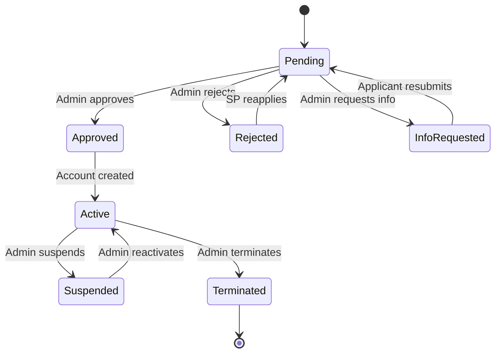

# Epic 3: Admin SP Management
**Author/Owner**: Business Systems Analyst (BSA)
**Module**: Startup Partner O2O
**Date**: 2026-03-26
**Status**: ⚪ Draft

## Change Log

| Version | Date | Author | Changes |
|---------|------|--------|---------|
| 1.0 | 2026-03-26 | BSA | Initial draft |

**Status:** ⚪ Draft / 🟡 In Review / 🟢 Final

> **💡 When updating:** Change Status to 🟢 Final / Approved ONLY AFTER explicit approval.

**PRD Reference:** `docs/modules/startup-partner-o2o/startup-partner-o2o prd.md` (provided by PO)
**BRD Reference:** `docs/modules/startup-partner-o2o/brd.md`
**Maps to:** FR-010, FR-011, FR-012, FR-013, FR-014, FR-079, FR-080, FR-081

---

### 1. Epic Information

| Field | Value |
|-------|-------|
| **Epic ID** | EPIC-03 |
| **Epic Name** | Admin SP Management |
| **Epic Description** | Enable Allkons M admins to review, approve, reject, or request additional information from SP applications, and manage the SP network |
| **Business Objective** | Ensure quality control and fraud prevention for SP applications; maintain SP network health; enable individual SP record management |
| **Target Release** | TBD |
| **Epic Owner** | BSA |
| **Epic Status** | Backlog |
| **Priority** | P0 |
| **Estimated Story Points** | TBD |

#### Epic User Story
As an Allkons M admin, I want to review, approve, and manage SP applications and the SP network, so that I can ensure quality control, prevent fraud, and maintain an effective SP ecosystem.

#### Epic Scope
**In Scope:**
- Application review dashboard with CIS integration
- KYC document verification
- Admin actions (approve/reject/request info)
- Service area assignment (Region/Province/District)
- Supervisor assignment
- Individual SP network management (edit work area, suspend access)
- Fraud detection
- Thammasorn SP auto-provisioning

**Out of Scope:**
- Automated KYC verification
- AI-powered fraud detection
- Bulk approval operations

#### Related Epics
| Epic ID | Epic Name | Relationship |
|---------|-----------|--------------|
| EPIC-02 | SP Registration & Onboarding | Depends on |
| EPIC-12 | SP Hierarchy Management | Related |
| EPIC-14 | SP Training & Certification | Related |

#### Epic Success Criteria
- [ ] Admins can review and approve SP applications in under 10 minutes with CIS data context
- [ ] Manual KYC verification completed
- [ ] SP network health monitored
- [ ] Individual SP records manageable

---

### 2. User Stories

> Each user story follows the BRD structure: US → AC (Given/When/Then) → BR → Validation → Edge Cases → Error Handling → State Behavior. ID scheme: `US-05`, `US-06A`, `US-06`, `US-06B`, `US-07` (scoped to this epic).

#### US-05: Admin Review SP Applications
**As an** Allkons M admin, **I want to** review SP applications and verify KYC documents, **so that** I can ensure quality control and prevent fraud.

**Preconditions:**
- Admin is logged in to Admin Portal
- Admin has "SP Manager" role
- SP applications exist in "Pending" status

**Business Rules:**
| Rule ID | Rule Description | Priority |
|---------|------------------|----------|
| BR-025 | Admin must manually review and verify all 3 KYC documents (ID card, bank book, selfie with ID) | P0 |
| BR-026 | Admin must verify ID card number is not duplicate in system | P0 |
| BR-027 | Admin can approve, reject, or request additional info | P0 |
| BR-028 | When approved, system auto-generates password and sends via LINE OA notification (with SMS as fallback) | P0 |
| BR-029 | When rejected, admin must provide rejection reason | P0 |
| BR-030 | When requesting info, admin must specify what is needed | P0 |
| BR-031 | Rejected SPs can reapply immediately (no cooldown period) | P0 |
| BR-032 | Manual fraud detection and review (no automated fraud detection in this iteration) | P0 |
| BR-140 | Service area assignment must support Region/Province/District 3-level hierarchy | P0 |
| BR-141 | Admin must be able to assign or update service area at all three levels during approval | P0 |
| BR-142 | Service area assignment applies during approval and later profile management | P0 |
| BR-143 | Admin must be able to assign Supervisor to SP during approval | P1 |
| BR-144 | Supervisor assignment must be editable later by Admin | P1 |
| BR-275 | Admin must see SP training/certification progress in application review and SP detail views | P0 |
| BR-276 | Admin receives LINE OA notification when new SP application is submitted | P1 |

**Validation Rules:**
| Field | Validation Rule | Error Message |
|-------|-----------------|---------------|
| Rejection Reason | Required when rejecting, max 500 chars | กรุณาระบุเหตุผลในการปฏิเสธ |
| Info Request Message | Required when requesting info, max 500 chars | กรุณาระบุข้อมูลที่ต้องการเพิ่มเติม |

**Acceptance Criteria:**
| # | Given | When | Then |
|---|-------|------|------|
| AC-20 | Admin is on application review dashboard | Admin views pending applications | System displays list of pending applications with filters (Status, Date, Service Area, Application ID) |
| AC-21 | Admin clicks on application | Admin views application detail | System displays all application info, uploaded KYC documents (viewable), and action buttons |
| AC-22 | Admin verifies KYC documents | Admin reviews ID card, bank book, selfie | Admin can zoom, download documents for verification |
| AC-23 | Admin approves application | Admin clicks "อนุมัติ", assigns service area (Region/Province/District), optionally assigns Supervisor, confirms | System generates credentials, sends LINE OA notification (with SMS as fallback) with username/password, updates status to "Approved", enables full portal access |
| AC-24 | Admin rejects application | Admin clicks "ปฏิเสธ", enters reason, confirms | System updates status to "Rejected", sends LINE OA notification (with SMS as fallback) with reason, allows SP to reapply |
| AC-25 | Admin requests additional info | Admin clicks "ขอข้อมูลเพิ่มเติม", specifies requirements, confirms | System updates status to "InfoRequested", sends LINE OA notification (with SMS as fallback), allows applicant to edit and resubmit |
| AC-57 | Admin assigns service area | Admin selects Region → Province → District hierarchy | System validates and saves 3-level service area assignment |
| AC-58 | Admin assigns Supervisor | Admin selects Supervisor from dropdown during approval | System assigns Supervisor and notifies both SP and Supervisor |
| AC-58a | Admin reviews SP application | Admin views application detail | System displays training progress section showing: modules completed, assessments passed, certification status |

**Edge Cases (minimum 3):**
| # | Scenario | Expected Behavior |
|---|----------|-------------------|
| EC-17 | Admin finds duplicate ID card number | System highlights duplicate warning; admin can flag for fraud investigation |
| EC-18 | KYC documents appear fraudulent (photoshopped) | Admin can flag application for fraud investigation and reject with reason |
| EC-19 | Admin accidentally approves wrong application | Admin can suspend SP account immediately and contact applicant |
| EC-20 | Multiple admins review same application concurrently | System uses optimistic locking; first admin action wins, second admin sees "ใบสมัครนี้ถูกดำเนินการแล้ว" |

**Error Handling:**
| Error | Trigger | User Feedback | Recovery |
|-------|---------|---------------|----------|
| Approval failure | SMS gateway error | ไม่สามารถส่ง SMS ได้ กรุณาลองใหม่ | Retry approval |
| Concurrent update | Another admin updated | ใบสมัครนี้ถูกดำเนินการแล้ว กรุณารีเฟรชหน้า | Refresh page |
| Document load failure | File storage error | ไม่สามารถโหลดเอกสารได้ กรุณาลองใหม่ | Retry button |

**State Behavior:**
| State | When | UI Requirements |
|-------|------|-----------------|
| Loading | Fetching applications or documents | Show loading spinner |
| Empty | No pending applications | Display "ไม่มีใบสมัครรอตรวจสอบ" with icon |
| Success | Applications loaded | Display list with filters and search |
| Error | Fetch fails | Show error message with retry option |

#### US-06A: Admin Review Application with CIS Integration
**As an** Allkons M admin, **I want to** view applicant's existing CIS data alongside new application data, **so that** I can make informed decisions based on complete user history.

**Preconditions:**
- Admin is reviewing SP application
- CIS integration is available
- Applicant may have existing account in CIS

**Business Rules:**
| Rule ID | Rule Description | Priority |
|---------|------------------|----------|
| BR-137 | System must integrate with CIS to retrieve existing account and user profile data | P0 |
| BR-138 | System must display previously available user information including KYC and bank account data | P0 |
| BR-139 | Admin must be able to review both new application data and historical CIS data in one context | P0 |

**Validation Rules:**
| Field | Validation Rule | Error Message |
|-------|-----------------|---------------|
| N/A | N/A | N/A |

**Acceptance Criteria:**
| # | Given | When | Then |
|---|-------|------|------|
| AC-54 | Admin reviews application | Admin opens application detail | System retrieves and displays CIS account data if exists |
| AC-55 | CIS data available | Admin views application | System shows previously stored KYC documents, bank information, and account history |
| AC-56 | Admin compares data | Admin reviews both datasets | Admin can compare new application data with existing CIS records side-by-side |

**Edge Cases (minimum 3):**
| # | Scenario | Expected Behavior |
|---|----------|-------------------|
| EC-24 | No CIS data exists for applicant | Display "ไม่พบข้อมูลในระบบ CIS" message, proceed with new application review only |
| EC-25 | CIS API timeout | Display warning "ไม่สามารถเชื่อมต่อ CIS ได้ กรุณาลองใหม่", allow Admin to proceed without CIS data |
| EC-26 | Conflicting data between application and CIS | Highlight differences, allow Admin to request clarification from applicant |

**Error Handling:**
| Error | Trigger | User Feedback | Recovery |
|-------|---------|---------------|----------|
| CIS API unavailable | Service down | ไม่สามารถดึงข้อมูล CIS ได้ในขณะนี้ | Allow review without CIS data, log for retry |
| CIS data incomplete | Partial response | แสดงข้อมูลบางส่วนจาก CIS | Display available data, note incomplete status |

**State Behavior:**
| State | When | UI Requirements |
|-------|------|-----------------|
| Loading | Fetching CIS data | Show loading spinner with "กำลังดึงข้อมูลจาก CIS..." |
| Success | CIS data loaded | Display CIS data panel alongside application data |
| Empty | No CIS data | Display "ไม่พบข้อมูลใน CIS" message |
| Error | CIS fetch fails | Show warning, allow proceeding without CIS data |

#### US-06: SP Network Management
**As an** Allkons M admin, **I want to** manage the SP network by viewing all active SPs, suspending or terminating accounts, and reassigning service areas, **so that** I can maintain network quality and handle issues.

**Preconditions:**
- Admin is logged in to Admin Portal
- Admin has "SP Manager" role
- Active SPs exist in system

**Business Rules:**
| Rule ID | Rule Description | Priority |
|---------|------------------|----------|
| BR-033 | Admin can view all SPs with status (Active, Suspended, Terminated) | P0 |
| BR-034 | Admin can suspend SP account (temporary) or terminate (permanent) | P0 |
| BR-035 | Admin can reassign SPs to different supervisors (Leaders) | P1 |
| BR-036 | Admin can update SP service area assignments (Region/Province/District) | P1 |
| BR-037 | Suspended SPs cannot login or perform operations | P0 |
| BR-038 | Terminated SPs cannot login; account is permanently disabled | P0 |
| BR-145 | Admin must be able to edit assigned work area for individual SP | P0 |
| BR-146 | Admin must be able to suspend SP usage/account access | P0 |
| BR-147 | Suspension must be reflected in status and access control rules | P0 |

**Validation Rules:**
| Field | Validation Rule | Error Message |
|-------|-----------------|---------------|
| Suspension Reason | Required when suspending, max 500 chars | กรุณาระบุเหตุผลในการระงับ |
| Termination Reason | Required when terminating, max 500 chars | กรุณาระบุเหตุผลในการยกเลิก |

**Acceptance Criteria:**
| # | Given | When | Then |
|---|-------|------|------|
| AC-26 | Admin is on SP network page | Admin views all SPs | System displays list with filters (Status, Service Area, Supervisor, Performance) |
| AC-27 | Admin suspends SP account | Admin clicks "ระงับ", enters reason, confirms | System updates status to "Suspended", sends LINE OA notification (with SMS as fallback), SP cannot login |
| AC-28 | Admin terminates SP account | Admin clicks "ยกเลิก", enters reason, confirms | System updates status to "Terminated", sends LINE OA notification (with SMS as fallback), SP account permanently disabled |
| AC-29 | Admin reassigns SP to different supervisor | Admin selects new supervisor, confirms | System updates SP hierarchy, notifies both old and new supervisors |
| AC-59 | Admin edits SP work area | Admin updates Region/Province/District assignment | System updates and notifies SP of service area change |
| AC-60 | Admin suspends SP | Admin clicks "ระงับ", enters reason | System blocks SP access to operational features, SP can only view suspension notice |

**Edge Cases (minimum 3):**
| # | Scenario | Expected Behavior |
|---|----------|-------------------|
| EC-21 | Admin suspends SP with active RFQs | System allows suspension; active RFQs remain accessible but SP cannot create new ones |
| EC-22 | Admin terminates SP with pending commissions | System flags pending commissions for manual review before termination |
| EC-23 | Admin tries to reassign SP to non-existent supervisor | Display error "ไม่พบหัวหน้าทีมนี้ กรุณาเลือกใหม่" |

**Error Handling:**
| Error | Trigger | User Feedback | Recovery |
|-------|---------|---------------|----------|
| Suspension failure | Server error | ไม่สามารถระงับบัญชีได้ กรุณาลองใหม่ | Retry button |
| SMS notification failure | SMS gateway error | บัญชีถูกระงับแล้ว แต่ไม่สามารถส่ง SMS แจ้งเตือนได้ | Log error, continue |

**State Behavior:**
| State | When | UI Requirements |
|-------|------|-----------------|
| Loading | Fetching SP list | Show loading spinner |
| Empty | No SPs in system | Display "ยังไม่มี Startup Partner ในระบบ" |
| Success | SP list loaded | Display table with filters, search, and actions |
| Error | Fetch fails | Show error message with retry option |

#### US-06B: Admin Manage Individual SP Records
**As an** Allkons M admin, **I want to** manage individual SP records including editing work areas and suspending access, **so that** I can maintain network quality and handle policy violations.

**Preconditions:**
- Admin is logged in to Admin Portal
- Admin has "SP Manager" role
- SP record exists in system

**Business Rules:**
| Rule ID | Rule Description | Priority |
|---------|------------------|----------|
| BR-145 | Admin must be able to edit assigned work area for individual SP | P0 |
| BR-146 | Admin must be able to suspend SP usage/account access | P0 |
| BR-147 | Suspension must be reflected in status and access control rules | P0 |

**Validation Rules:**
| Field | Validation Rule | Error Message |
|-------|-----------------|---------------|
| Suspension Reason | Required when suspending, max 500 chars | กรุณาระบุเหตุผลในการระงับ |
| Service Area | At least one Region/Province/District must be selected | กรุณาเลือกพื้นที่ให้บริการอย่างน้อย 1 พื้นที่ |

**Acceptance Criteria:**
| # | Given | When | Then |
|---|-------|------|------|
| AC-59 | Admin edits SP work area | Admin updates Region/Province/District assignment | System updates and notifies SP of service area change |
| AC-60 | Admin suspends SP | Admin clicks "ระงับ", enters reason | System blocks SP access to operational features, SP can only view suspension notice |
| AC-61 | Suspended SP logs in | SP attempts to access portal | System displays suspension notice with reason and contact support option |

**Edge Cases (minimum 3):**
| # | Scenario | Expected Behavior |
|---|----------|-------------------|
| EC-27 | Admin suspends SP with active RFQs | System allows suspension; active RFQs remain accessible but SP cannot create new ones |
| EC-28 | Admin suspends SP with pending commissions | System flags pending commissions for manual review; suspension proceeds |
| EC-29 | Admin changes work area to region with no stores | System warns "ไม่มีร้านค้าในพื้นที่นี้" but allows change |

**Error Handling:**
| Error | Trigger | User Feedback | Recovery |
|-------|---------|---------------|----------|
| Update failure | Server error | ไม่สามารถอัปเดตข้อมูลได้ กรุณาลองใหม่ | Retry button |
| Notification failure | SMS/Email error | อัปเดตสำเร็จ แต่ไม่สามารถส่งการแจ้งเตือนได้ | Log error, continue |

**State Behavior:**
| State | When | UI Requirements |
|-------|------|-----------------|
| Loading | Updating SP record | Show loading spinner with "กำลังอัปเดต..." |
| Success | Update completed | Display success message "อัปเดตข้อมูลสำเร็จ" |
| Error | Update fails | Show error message with retry option |

#### US-07: Thammasorn SP Auto-Provisioning
**As a** Thammasorn internal sales rep, **I want to** be automatically provisioned as a global SP Leader, **so that** I can supervise public SPs without going through application process.

**Preconditions:**
- User is Thammasorn employee
- User has valid Allkons M account
- User is designated as SP supervisor

**Business Rules:**
| Rule ID | Rule Description | Priority |
|---------|------------------|----------|
| BR-039 | Thammasorn sales reps are automatically provisioned as Leaders (no application required) | P0 |
| BR-040 | Leaders have global service area access (all provinces/districts) | P0 |
| BR-041 | Leaders cannot be demoted or removed by standard admins | P0 |
| BR-042 | Leaders can view and manage assigned Members | P1 |

**Validation Rules:**
| Field | Validation Rule | Error Message |
|-------|-----------------|---------------|
| N/A | N/A | N/A |

**Acceptance Criteria:**
| # | Given | When | Then |
|---|-------|------|------|
| AC-30 | Thammasorn employee is added to system | Admin provisions employee as Leader | System creates SP Leader account with global service areas, no application required |
| AC-31 | Leader logs in to SP Portal | Leader accesses dashboard | System displays Leader view with team management features |
| AC-32 | Leader views assigned Members | Leader clicks "ทีมของฉัน" | System displays list of assigned public SPs with performance metrics |

**Edge Cases (minimum 3):**
| # | Scenario | Expected Behavior |
|---|----------|-------------------|
| EC-24 | Standard admin tries to suspend Leader account | System prevents action, displays "ไม่สามารถระงับบัญชีหัวหน้าทีมได้ กรุณาติดต่อผู้ดูแลระบบระดับสูง" |
| EC-25 | Leader leaves Thammasorn company | Super admin can manually demote to Member or terminate account |
| EC-26 | Leader tries to access Member-only features | System allows access; Leaders have all Member permissions plus supervision features |

**Error Handling:**
| Error | Trigger | User Feedback | Recovery |
|-------|---------|---------------|----------|
| Provisioning failure | Server error | ไม่สามารถสร้างบัญชีได้ กรุณาลองใหม่ | Retry provisioning |

**State Behavior:**
| State | When | UI Requirements |
|-------|------|-----------------|
| Loading | Provisioning account | Show loading spinner |
| Success | Account created | Display success message and login credentials |
| Error | Provisioning fails | Show error message with retry option |

---

### 3. Description

**Business Context:**
- **Problem Statement:** Allkons M needs a structured process for reviewing SP applications, verifying KYC documents, detecting fraud, managing the SP network lifecycle, and auto-provisioning internal Thammasorn sales reps as Leaders.
- **Current State:** No admin tooling for SP application review, KYC verification, or network management. No CIS integration for historical data context. No automated provisioning for internal employees.
- **Desired State:** Admins can efficiently review and approve SP applications with CIS context in under 10 minutes, manage individual SP records (work area, suspension), and auto-provision Thammasorn employees as Leaders with global access.
- **Business Value:** Ensures platform quality by preventing fraudulent SPs, enables efficient SP lifecycle management, and reduces onboarding friction for internal Thammasorn employees.

---

### 4. Prerequisites

| Prerequisite | Description | Status |
|--------------|-------------|--------|
| Admin Portal | Admin portal must be deployed and accessible | [ ] |
| SP Registration (EPIC-02) | SP applications must exist in system | [ ] |
| CIS Integration | CIS API must be available for data retrieval | [ ] |
| LINE OA Integration | LINE OA messaging for notifications (with SMS fallback) | [ ] |
| Service Area Data | Region/Province/District hierarchy data loaded | [ ] |

**Dependencies:**
- EPIC-02 (SP Registration & Onboarding) must be implemented for applications to exist
- CIS system must provide API endpoints for account and profile data retrieval
- LINE OA and SMS gateway for notification delivery
- Thammasorn employee directory for auto-provisioning

---

### 5. Terminology

| Term | Definition |
|------|------------|
| SP (Startup Partner) | Freelance sales agent who connects buyers with sellers on the Allkons M platform |
| KYC | Know Your Customer — identity verification documents (ID card, bank book, selfie with ID) |
| CIS | Customer Information System — existing Allkons system storing user account and profile data |
| Leader | Thammasorn internal sales rep auto-provisioned as SP supervisor with global service area access |
| Member | Public freelance SP who applies through the registration process |
| Service Area | Region/Province/District 3-level hierarchy defining where an SP can operate |
| Optimistic Locking | Concurrency control mechanism to prevent conflicting admin actions on the same application |
| LINE OA | LINE Official Account — primary notification channel for SP communications |

---

### 6. Role and Permission Matrix

| Role | Permission | Access Level |
|------|------------|--------------|
| SP Manager (Admin) | sp-application:review | Read/Write |
| SP Manager (Admin) | sp-application:approve | Write |
| SP Manager (Admin) | sp-application:reject | Write |
| SP Manager (Admin) | sp-application:request-info | Write |
| SP Manager (Admin) | sp-network:view | Read |
| SP Manager (Admin) | sp-network:suspend | Write |
| SP Manager (Admin) | sp-network:terminate | Write |
| SP Manager (Admin) | sp-network:reassign | Write |
| SP Manager (Admin) | sp-network:edit-work-area | Write |
| Super Admin | sp-leader:provision | Write |
| Super Admin | sp-leader:demote | Write |
| Super Admin | sp-leader:terminate | Write |
| Leader | sp-team:view | Read |
| Leader | sp-team:manage | Read/Write |

**Permission Definitions:**
- `sp-application:review` - View and review SP applications with KYC documents
- `sp-application:approve` - Approve SP applications and assign service areas
- `sp-application:reject` - Reject SP applications with reason
- `sp-application:request-info` - Request additional information from applicants
- `sp-network:view` - View all SPs with status and filters
- `sp-network:suspend` - Temporarily suspend SP accounts
- `sp-network:terminate` - Permanently terminate SP accounts
- `sp-network:reassign` - Reassign SPs to different supervisors
- `sp-network:edit-work-area` - Edit SP service area assignments
- `sp-leader:provision` - Auto-provision Thammasorn employees as Leaders
- `sp-leader:demote` - Demote Leader to Member status
- `sp-leader:terminate` - Terminate Leader accounts
- `sp-team:view` - View assigned team members
- `sp-team:manage` - Manage assigned team members

---

### 7. Information in the List

| Field Name | Format | Example | No Value | Condition |
|------------|--------|---------|----------|-----------|
| Application ID | String | APP-2026-001 | N/A | Always present |
| Applicant Name | String | สมชาย ใจดี | N/A | Always present |
| Application Status | Enum | Pending / Approved / Rejected / InfoRequested | N/A | Always present |
| Submission Date | Date | 2026-03-26 | N/A | Always present |
| Service Area | String | กรุงเทพฯ / นนทบุรี / บางกะปิ | "ยังไม่ได้กำหนด" | Assigned on approval |
| Supervisor | String | วิชัย มั่นคง | "ยังไม่ได้กำหนด" | Optional on approval |
| SP Status | Enum | Active / Suspended / Terminated | N/A | Always present for network view |
| Training Progress | String | 3/5 modules completed | "ยังไม่เริ่มอบรม" | Visible in review and detail |

**Display Rules:**
- Application list sorted by submission date (newest first) by default
- SP network list sorted by status (Active first) then alphabetically
- Filters available: Status, Date range, Service Area, Application ID
- KYC documents viewable with zoom and download capabilities

---

### 8. Requirements

#### 8.1 General Information

| Field | Value |
|-------|-------|
| **Story Type** | New feature |
| **Application** | Admin Portal, SP Portal |
| **Module** | Startup Partner O2O |
| **Pages** | /admin/sp-applications, /admin/sp-network, /admin/sp-detail/:id |
| **Priority** | P0 |
| **Complexity** | High |

#### 8.2 Happy Path

1. Admin logs in to Admin Portal with "SP Manager" role
2. Admin navigates to SP Application Review dashboard
3. Admin views list of pending SP applications with filters
4. Admin clicks on an application to view details
5. System retrieves CIS data (if available) and displays alongside application data
6. Admin reviews KYC documents (ID card, bank book, selfie with ID)
7. Admin verifies ID card number is not a duplicate
8. Admin assigns service area (Region/Province/District)
9. Admin optionally assigns Supervisor
10. Admin clicks "อนุมัติ" to approve
11. System generates credentials, sends LINE OA notification (with SMS fallback)
12. SP status updated to "Approved" with full portal access

#### 8.3 Allowed Roles

- SP Manager (Admin)
- Super Admin

#### 8.4 Business Rules

| Rule ID | Rule Description | Priority |
|---------|------------------|----------|
| BR-025 | Admin must manually review and verify all 3 KYC documents (ID card, bank book, selfie with ID) | P0 |
| BR-026 | Admin must verify ID card number is not duplicate in system | P0 |
| BR-027 | Admin can approve, reject, or request additional info | P0 |
| BR-028 | When approved, system auto-generates password and sends via LINE OA notification (with SMS as fallback) | P0 |
| BR-029 | When rejected, admin must provide rejection reason | P0 |
| BR-030 | When requesting info, admin must specify what is needed | P0 |
| BR-031 | Rejected SPs can reapply immediately (no cooldown period) | P0 |
| BR-032 | Manual fraud detection and review (no automated fraud detection in this iteration) | P0 |
| BR-033 | Admin can view all SPs with status (Active, Suspended, Terminated) | P0 |
| BR-034 | Admin can suspend SP account (temporary) or terminate (permanent) | P0 |
| BR-035 | Admin can reassign SPs to different supervisors (Leaders) | P1 |
| BR-036 | Admin can update SP service area assignments (Region/Province/District) | P1 |
| BR-037 | Suspended SPs cannot login or perform operations | P0 |
| BR-038 | Terminated SPs cannot login; account is permanently disabled | P0 |
| BR-039 | Thammasorn sales reps are automatically provisioned as Leaders (no application required) | P0 |
| BR-040 | Leaders have global service area access (all provinces/districts) | P0 |
| BR-041 | Leaders cannot be demoted or removed by standard admins | P0 |
| BR-042 | Leaders can view and manage assigned Members | P1 |
| BR-137 | System must integrate with CIS to retrieve existing account and user profile data | P0 |
| BR-138 | System must display previously available user information including KYC and bank account data | P0 |
| BR-139 | Admin must be able to review both new application data and historical CIS data in one context | P0 |
| BR-140 | Service area assignment must support Region/Province/District 3-level hierarchy | P0 |
| BR-141 | Admin must be able to assign or update service area at all three levels during approval | P0 |
| BR-142 | Service area assignment applies during approval and later profile management | P0 |
| BR-143 | Admin must be able to assign Supervisor to SP during approval | P1 |
| BR-144 | Supervisor assignment must be editable later by Admin | P1 |
| BR-145 | Admin must be able to edit assigned work area for individual SP | P0 |
| BR-146 | Admin must be able to suspend SP usage/account access | P0 |
| BR-147 | Suspension must be reflected in status and access control rules | P0 |
| BR-275 | Admin must see SP training/certification progress in application review and SP detail views | P0 |
| BR-276 | Admin receives LINE OA notification when new SP application is submitted | P1 |

#### 8.5 Validation Rules

| Field | Validation Rule | Error Message |
|-------|-----------------|---------------|
| Rejection Reason | Required when rejecting, max 500 chars | กรุณาระบุเหตุผลในการปฏิเสธ |
| Info Request Message | Required when requesting info, max 500 chars | กรุณาระบุข้อมูลที่ต้องการเพิ่มเติม |
| Suspension Reason | Required when suspending, max 500 chars | กรุณาระบุเหตุผลในการระงับ |
| Termination Reason | Required when terminating, max 500 chars | กรุณาระบุเหตุผลในการยกเลิก |
| Service Area | At least one Region/Province/District must be selected | กรุณาเลือกพื้นที่ให้บริการอย่างน้อย 1 พื้นที่ |

---

### 9. Acceptance Criteria

> All acceptance criteria use **Given/When/Then** format. Cover all 6 scenario categories below.

#### 9.1 View Mode Scenarios

**Scenario: Empty State — No Pending Applications**

**Given** Admin is on application review dashboard
**When** No pending applications exist
**Then** System displays "ไม่มีใบสมัครรอตรวจสอบ" with icon

**Scenario: Empty State — No SPs in Network**

**Given** Admin is on SP network page
**When** No SPs exist in system
**Then** System displays "ยังไม่มี Startup Partner ในระบบ"

**Scenario: Loading State — Applications**

**Given** Admin navigates to application review dashboard
**When** System is fetching applications
**Then** Show loading spinner

**Scenario: Loading State — CIS Data**

**Given** Admin opens application detail
**When** System is fetching CIS data
**Then** Show loading spinner with "กำลังดึงข้อมูลจาก CIS..."

**Scenario: Success State — Applications Loaded**

**Given** Pending applications exist
**When** Admin views application review dashboard
**Then** System displays list of pending applications with filters (Status, Date, Service Area, Application ID)

**Scenario: Success State — CIS Data Loaded**

**Given** CIS data available for applicant
**When** Admin views application detail
**Then** System shows previously stored KYC documents, bank information, and account history alongside new application data

**Scenario: Error State — Fetch Fails**

**Given** Admin navigates to application review dashboard
**When** System encounters server error
**Then** Show error message with retry option

**Scenario: Error State — CIS API Unavailable**

**Given** Admin opens application detail
**When** CIS service is down
**Then** Display "ไม่สามารถดึงข้อมูล CIS ได้ในขณะนี้", allow review without CIS data

**Scenario: Error State — Document Load Failure**

**Given** Admin views KYC documents
**When** File storage error occurs
**Then** Display "ไม่สามารถโหลดเอกสารได้ กรุณาลองใหม่" with retry button

#### 9.2 Action Mode Scenarios

**Scenario: Approve Application Success**

**Given** Admin is viewing application detail with KYC verified
**When** Admin clicks "อนุมัติ", assigns service area (Region/Province/District), optionally assigns Supervisor, confirms
**Then** System generates credentials, sends LINE OA notification (with SMS as fallback) with username/password, updates status to "Approved", enables full portal access

**Scenario: Reject Application Success**

**Given** Admin is viewing application detail
**When** Admin clicks "ปฏิเสธ", enters rejection reason, confirms
**Then** System updates status to "Rejected", sends LINE OA notification (with SMS as fallback) with reason, allows SP to reapply

**Scenario: Request Additional Info Success**

**Given** Admin is viewing application detail
**When** Admin clicks "ขอข้อมูลเพิ่มเติม", specifies requirements, confirms
**Then** System updates status to "InfoRequested", sends LINE OA notification (with SMS as fallback), allows applicant to edit and resubmit

**Scenario: Suspend SP Account Success**

**Given** Admin is on SP network page viewing active SP
**When** Admin clicks "ระงับ", enters reason, confirms
**Then** System updates status to "Suspended", sends LINE OA notification (with SMS as fallback), SP cannot login

**Scenario: Terminate SP Account Success**

**Given** Admin is on SP network page viewing SP
**When** Admin clicks "ยกเลิก", enters reason, confirms
**Then** System updates status to "Terminated", sends LINE OA notification (with SMS as fallback), SP account permanently disabled

**Scenario: Reassign SP Supervisor Success**

**Given** Admin views SP detail
**When** Admin selects new supervisor, confirms
**Then** System updates SP hierarchy, notifies both old and new supervisors

**Scenario: Edit SP Work Area Success**

**Given** Admin views individual SP record
**When** Admin updates Region/Province/District assignment
**Then** System updates and notifies SP of service area change

**Scenario: Provision Leader Success**

**Given** Thammasorn employee is added to system
**When** Admin provisions employee as Leader
**Then** System creates SP Leader account with global service areas, no application required

**Scenario: Approval Failure — SMS Gateway Error**

**Given** Admin approves application
**When** SMS gateway encounters error
**Then** Display "ไม่สามารถส่ง SMS ได้ กรุณาลองใหม่" with retry button

**Scenario: Suspension Failure — Server Error**

**Given** Admin suspends SP account
**When** Server error occurs
**Then** Display "ไม่สามารถระงับบัญชีได้ กรุณาลองใหม่" with retry button

#### 9.3 Race Condition Scenarios

**Scenario: Concurrent Application Review**

**Given** Two admins are reviewing the same SP application
**When** First admin approves the application, then second admin tries to take action
**Then** System uses optimistic locking; first admin action wins, second admin sees "ใบสมัครนี้ถูกดำเนินการแล้ว"

#### 9.4 Loading State Scenarios (Action Mode)

**Scenario: Loading during approval**

**Given** Admin clicks "อนุมัติ" and confirms
**When** System is processing approval
**Then** Show loading spinner, disable action buttons, disable form

**Scenario: Loading during SP record update**

**Given** Admin updates SP work area or suspension
**When** System is processing update
**Then** Show loading spinner with "กำลังอัปเดต..."

#### 9.5 Field Validation Scenarios

**Scenario: Rejection without reason**

**Given** Admin clicks "ปฏิเสธ"
**When** Admin leaves rejection reason empty
**Then** Display "กรุณาระบุเหตุผลในการปฏิเสธ", submission blocked

**Scenario: Info request without message**

**Given** Admin clicks "ขอข้อมูลเพิ่มเติม"
**When** Admin leaves info request message empty
**Then** Display "กรุณาระบุข้อมูลที่ต้องการเพิ่มเติม", submission blocked

**Scenario: Suspension without reason**

**Given** Admin clicks "ระงับ"
**When** Admin leaves suspension reason empty
**Then** Display "กรุณาระบุเหตุผลในการระงับ", submission blocked

**Scenario: Service area not selected**

**Given** Admin edits SP work area
**When** No Region/Province/District is selected
**Then** Display "กรุณาเลือกพื้นที่ให้บริการอย่างน้อย 1 พื้นที่", submission blocked

#### 9.6 Edge Cases

**Scenario: Duplicate ID Card Number**

**Given** Admin reviews application
**When** Admin finds duplicate ID card number
**Then** System highlights duplicate warning; admin can flag for fraud investigation

**Scenario: Fraudulent KYC Documents**

**Given** Admin reviews KYC documents
**When** Documents appear fraudulent (photoshopped)
**Then** Admin can flag application for fraud investigation and reject with reason

**Scenario: Accidental Approval**

**Given** Admin accidentally approves wrong application
**When** Admin realizes the mistake
**Then** Admin can suspend SP account immediately and contact applicant

**Scenario: Suspend SP with Active RFQs**

**Given** Admin suspends SP who has active RFQs
**When** Suspension is processed
**Then** System allows suspension; active RFQs remain accessible but SP cannot create new ones

**Scenario: Terminate SP with Pending Commissions**

**Given** Admin terminates SP with pending commissions
**When** Termination is processed
**Then** System flags pending commissions for manual review before termination

**Scenario: Standard Admin Tries to Suspend Leader**

**Given** Standard admin views Leader account
**When** Admin tries to suspend Leader
**Then** System prevents action, displays "ไม่สามารถระงับบัญชีหัวหน้าทีมได้ กรุณาติดต่อผู้ดูแลระบบระดับสูง"

**Scenario: Work Area Change to Region with No Stores**

**Given** Admin edits SP work area
**When** Admin changes to region with no stores
**Then** System warns "ไม่มีร้านค้าในพื้นที่นี้" but allows change

**Scenario: CIS Data Conflicts with Application**

**Given** CIS data available and conflicts with application data
**When** Admin reviews both datasets
**Then** System highlights differences, allows Admin to request clarification from applicant

**Scenario: Suspended SP Attempts Login**

**Given** SP account has been suspended
**When** SP attempts to access portal
**Then** System displays suspension notice with reason and contact support option

---

### 10. Risk Assessment

| Risk ID | Risk Description | Category | Probability | Impact | Risk Level | Mitigation Strategy | Owner | Status |
|---------|------------------|----------|-------------|--------|------------|---------------------|-------|--------|
| R-001 | CIS API downtime prevents complete application review | Technical | M | M | Medium | Allow review without CIS data; log for retry | Tech Lead | Open |
| R-002 | Concurrent admin actions on same application cause data inconsistency | Technical | M | H | High | Implement optimistic locking; first action wins | Tech Lead | Open |
| R-003 | LINE OA / SMS gateway failure prevents credential delivery to approved SPs | Operational | L | H | Medium | Implement retry mechanism; fallback to manual notification | Operations | Open |
| R-004 | Fraudulent KYC documents bypass manual review | Operational | M | H | High | Train admins on fraud detection patterns; flag suspicious applications | Compliance | Open |
| R-005 | Unauthorized Leader account provisioning | Compliance | L | H | Medium | Restrict provisioning to Super Admin only; audit trail for all provisioning | Security | Open |
| R-006 | Service area data incomplete or incorrect | Operational | M | M | Medium | Validate Region/Province/District hierarchy data before launch | Data Team | Open |
| R-007 | SP suspension/termination with active business transactions | Financial | M | H | High | Flag pending commissions and active RFQs for manual review before action | Operations | Open |

#### Risk Summary
- **Total Risks:** 7
- **Critical Risks:** 0
- **High Risks:** 3
- **Medium Risks:** 4
- **Low Risks:** 0

---

### 11. Data Dictionary

#### Entity: SP Application

| Attribute Name | Data Type | Length | Required | Unique | Default Value | Description |
|----------------|-----------|--------|----------|--------|---------------|-------------|
| applicationId | String | 36 | Yes | Yes | UUID | Unique application identifier |
| applicantName | String | 200 | Yes | No | N/A | Full name of applicant |
| idCardNumber | String | 13 | Yes | Yes | N/A | Thai national ID card number |
| status | Enum | N/A | Yes | No | PENDING | Application status (PENDING, APPROVED, REJECTED, INFO_REQUESTED) |
| rejectionReason | String | 500 | No | No | null | Reason for rejection |
| infoRequestMessage | String | 500 | No | No | null | Info request details |
| serviceAreaRegion | String | 100 | No | No | null | Assigned region |
| serviceAreaProvince | String | 100 | No | No | null | Assigned province |
| serviceAreaDistrict | String | 100 | No | No | null | Assigned district |
| supervisorId | String | 36 | No | No | null | Assigned supervisor ID |
| submittedAt | DateTime | N/A | Yes | No | NOW() | Submission timestamp |
| reviewedAt | DateTime | N/A | No | No | null | Review timestamp |
| reviewedBy | String | 36 | No | No | null | Admin who reviewed |

#### Entity: Startup Partner

| Attribute Name | Data Type | Length | Required | Unique | Default Value | Description |
|----------------|-----------|--------|----------|--------|---------------|-------------|
| spId | String | 36 | Yes | Yes | UUID | Unique SP identifier |
| status | Enum | N/A | Yes | No | ACTIVE | SP status (ACTIVE, SUSPENDED, TERMINATED) |
| role | Enum | N/A | Yes | No | MEMBER | SP role (LEADER, MEMBER) |
| suspensionReason | String | 500 | No | No | null | Reason for suspension |
| terminationReason | String | 500 | No | No | null | Reason for termination |
| serviceAreaRegion | String | 100 | Yes | No | N/A | Assigned region |
| serviceAreaProvince | String | 100 | Yes | No | N/A | Assigned province |
| serviceAreaDistrict | String | 100 | Yes | No | N/A | Assigned district |
| supervisorId | String | 36 | No | No | null | Assigned supervisor (Leader) ID |
| isGlobalAccess | Boolean | N/A | No | No | false | Whether SP has global service area access (Leaders) |

#### Relationships

| Related Entity | Relationship Type | Cardinality | Description |
|----------------|-------------------|-------------|-------------|
| SP Application → Startup Partner | One-to-One | 1:1 | Approved application creates SP record |
| Startup Partner → Startup Partner (Supervisor) | Many-to-One | N:1 | Members assigned to Leader supervisor |
| Startup Partner → Service Area | Many-to-Many | N:N | SPs can have multiple service areas |

---

### 12. Audit Trail Requirements

| Action | Data to Capture | Retention Period |
|--------|-----------------|------------------|
| APPLICATION_REVIEWED | Admin ID, Timestamp, Application ID, Action taken (approve/reject/request-info), Reason, Service area assigned, Supervisor assigned, IP address | 7 years |
| SP_SUSPENDED | Admin ID, Timestamp, SP ID, Suspension reason, IP address | 7 years |
| SP_TERMINATED | Admin ID, Timestamp, SP ID, Termination reason, IP address | 7 years |
| SP_REASSIGNED | Admin ID, Timestamp, SP ID, Old supervisor, New supervisor, IP address | 7 years |
| SP_WORK_AREA_UPDATED | Admin ID, Timestamp, SP ID, Old service area, New service area, IP address | 7 years |
| LEADER_PROVISIONED | Super Admin ID, Timestamp, Employee ID, SP ID created, IP address | 7 years |
| LEADER_DEMOTED | Super Admin ID, Timestamp, SP ID, New role, IP address | 7 years |

---

### 13. Notes

- LINE OA is the primary notification channel; SMS is the fallback mechanism
- CIS integration is a dependency for full application review context but review can proceed without it
- Manual fraud detection is the approach for this iteration; automated fraud detection is out of scope
- Thammasorn Leader provisioning is a privileged operation restricted to Super Admin
- Service area assignment uses a 3-level hierarchy: Region → Province → District
- Optimistic locking is required for concurrent admin access to the same application

**Questions for Tech Lead / Designer:**
- What is the exact CIS API endpoint structure and authentication mechanism?
- How should the optimistic locking mechanism be implemented (version field, timestamp, etc.)?
- What is the UI design for side-by-side CIS data comparison?
- Should Leader provisioning be automated via HR system integration or manual Super Admin action?
- What is the retry policy for failed LINE OA / SMS notifications?

---

### 14. Draft Technical Design

#### 14.1 API Endpoints

| Method | Endpoint | Description | Authentication |
|--------|----------|-------------|----------------|
| GET | /api/admin/sp-applications | List SP applications with filters | Required (SP Manager) |
| GET | /api/admin/sp-applications/:id | Get application detail with CIS data | Required (SP Manager) |
| POST | /api/admin/sp-applications/:id/approve | Approve application | Required (SP Manager) |
| POST | /api/admin/sp-applications/:id/reject | Reject application | Required (SP Manager) |
| POST | /api/admin/sp-applications/:id/request-info | Request additional info | Required (SP Manager) |
| GET | /api/admin/sp-network | List all SPs with filters | Required (SP Manager) |
| GET | /api/admin/sp-network/:id | Get individual SP detail | Required (SP Manager) |
| PUT | /api/admin/sp-network/:id/service-area | Update SP service area | Required (SP Manager) |
| POST | /api/admin/sp-network/:id/suspend | Suspend SP account | Required (SP Manager) |
| POST | /api/admin/sp-network/:id/terminate | Terminate SP account | Required (SP Manager) |
| PUT | /api/admin/sp-network/:id/reassign | Reassign SP to new supervisor | Required (SP Manager) |
| POST | /api/admin/sp-leaders/provision | Provision Thammasorn employee as Leader | Required (Super Admin) |
| GET | /api/cis/accounts/:idCardNumber | Retrieve CIS account data | Required (Internal) |

#### 14.2 Database Schema

```sql
-- SP Applications
CREATE TABLE sp_applications (
    application_id UUID PRIMARY KEY DEFAULT gen_random_uuid(),
    applicant_name VARCHAR(200) NOT NULL,
    id_card_number VARCHAR(13) NOT NULL UNIQUE,
    status VARCHAR(20) NOT NULL DEFAULT 'PENDING',
    rejection_reason VARCHAR(500),
    info_request_message VARCHAR(500),
    service_area_region VARCHAR(100),
    service_area_province VARCHAR(100),
    service_area_district VARCHAR(100),
    supervisor_id UUID REFERENCES startup_partners(sp_id),
    submitted_at TIMESTAMP NOT NULL DEFAULT NOW(),
    reviewed_at TIMESTAMP,
    reviewed_by UUID,
    version INTEGER NOT NULL DEFAULT 1,
    CONSTRAINT chk_status CHECK (status IN ('PENDING', 'APPROVED', 'REJECTED', 'INFO_REQUESTED'))
);

-- Startup Partners
CREATE TABLE startup_partners (
    sp_id UUID PRIMARY KEY DEFAULT gen_random_uuid(),
    status VARCHAR(20) NOT NULL DEFAULT 'ACTIVE',
    role VARCHAR(10) NOT NULL DEFAULT 'MEMBER',
    suspension_reason VARCHAR(500),
    termination_reason VARCHAR(500),
    service_area_region VARCHAR(100) NOT NULL,
    service_area_province VARCHAR(100) NOT NULL,
    service_area_district VARCHAR(100) NOT NULL,
    supervisor_id UUID REFERENCES startup_partners(sp_id),
    is_global_access BOOLEAN DEFAULT FALSE,
    created_at TIMESTAMP NOT NULL DEFAULT NOW(),
    updated_at TIMESTAMP NOT NULL DEFAULT NOW(),
    CONSTRAINT chk_sp_status CHECK (status IN ('ACTIVE', 'SUSPENDED', 'TERMINATED')),
    CONSTRAINT chk_sp_role CHECK (role IN ('LEADER', 'MEMBER'))
);
```

#### 14.3 State Management



#### 14.4 UI/UX Considerations

- Application review dashboard with sortable/filterable table
- KYC document viewer with zoom and download capabilities
- Side-by-side CIS data comparison panel
- Cascading Region → Province → District dropdown for service area assignment
- Supervisor dropdown with search functionality
- Confirmation dialogs for all destructive actions (reject, suspend, terminate)
- Toast notifications for successful actions
- Optimistic locking conflict resolution with page refresh prompt

---

### 15. Testing Checklist

#### Pre-Testing
- [ ] All prerequisites are met (Admin Portal, CIS API, LINE OA, SMS gateway)
- [ ] Test environment is set up with sample SP applications
- [ ] Test data is prepared (pending applications, KYC documents, CIS records)
- [ ] Test accounts are created with SP Manager and Super Admin roles

#### Functional Testing
- [ ] Happy path: approve application with service area and supervisor assignment
- [ ] Happy path: reject application with reason
- [ ] Happy path: request additional info with message
- [ ] CIS data displays alongside application data
- [ ] CIS unavailable gracefully handled
- [ ] KYC documents viewable with zoom and download
- [ ] Duplicate ID card number detection works
- [ ] SP network list displays with filters
- [ ] SP suspension with reason works correctly
- [ ] SP termination with reason works correctly
- [ ] SP reassignment to new supervisor works
- [ ] SP work area edit works with notification
- [ ] Suspended SP cannot login
- [ ] Terminated SP cannot login
- [ ] Suspended SP sees suspension notice with reason
- [ ] Leader provisioning works (Super Admin only)
- [ ] Leader has global service area access
- [ ] Standard admin cannot suspend Leader
- [ ] Empty state displays correctly for all views
- [ ] Loading state displays correctly
- [ ] Error states display correctly for all error codes
- [ ] All validation rules work as expected
- [ ] Optimistic locking prevents concurrent conflicts

#### Security Testing
- [ ] Unauthorized access is blocked (non-SP Manager roles)
- [ ] Permission checks work correctly for all actions
- [ ] Super Admin-only actions restricted (Leader provisioning)
- [ ] SQL injection is prevented
- [ ] XSS is prevented
- [ ] CSRF protection is in place

#### Performance Testing
- [ ] Application list page load time is acceptable with large datasets
- [ ] CIS API response time is acceptable
- [ ] KYC document loading time is acceptable
- [ ] SP network list handles large number of SPs

#### Cross-Browser Testing
- [ ] Chrome
- [ ] Firefox
- [ ] Safari
- [ ] Edge

#### Mobile Testing
- [ ] Responsive design works on mobile
- [ ] Touch interactions work correctly

---

### 16. Approval

| Role | Name | Signature | Date |
|------|------|-----------|------|
| Product Owner | | | |
| Business Analyst | | | |
| Technical Lead | | | |
| QA Lead | | | |

---

**Document Version:** 1.0
**Last Updated:** 2026-03-26
**Author:** BSA
**Status:** Draft
