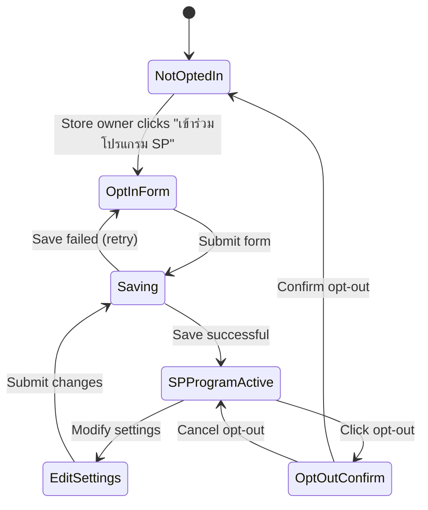

# Epic 4: Seller Opt-In & Configuration
**Author/Owner**: Business Systems Analyst (BSA)
**Module**: Startup Partner O2O
**Date**: 2026-03-26
**Status**: ⚪ Draft

## Change Log

| Version | Date | Author | Changes |
|---------|------|--------|---------|
| 1.0 | 2026-03-26 | BSA | Initial draft extracted from BRD v2.0 |

**PRD Reference:** `docs/modules/startup-partner-o2o/startup-partner-o2o prd.md`
**BRD Reference:** `docs/modules/startup-partner-o2o/brd.md`
**Maps to:** FR-015, FR-016, FR-017

---

### 1. Epic Information

| Field | Value |
|-------|-------|
| **Epic ID** | EPIC-04 |
| **Epic Name** | Seller Opt-In & Configuration |
| **Epic Description** | Enable stores/branches to opt-in to SP program and configure participation settings |
| **Business Objective** | Enable stores/branches to opt-in to SP program and configure participation settings so they can receive leads from Startup Partners in their area |
| **Target Release** | TBD |
| **Epic Owner** | BSA |
| **Epic Status** | Backlog |
| **Priority** | P1 |
| **Estimated Story Points** | TBD |

#### Epic User Story
As a store owner or branch manager, I want to opt-in to the SP program and configure my participation settings, so that I can receive leads from Startup Partners in my area.

#### Epic Scope
**In Scope:**
- Seller Portal enhancements for SP program opt-in
- Service area configuration
- RFQ notification preferences

**Out of Scope:**
- Automated store onboarding
- Bulk opt-in operations
- Commission negotiation

#### Related Epics
| Epic ID | Epic Name | Relationship |
|---------|-----------|--------------|
| EPIC-05 | Product Discovery & Sourcing | Blocks (opted-in stores are visible to SPs for product discovery) |
| EPIC-06 | RFQ Creation & Management | Blocks (opted-in stores can receive RFQs from SPs) |
| EPIC-08 | In-App SP-to-Seller Communication | Blocks (opted-in stores can communicate with SPs) |

#### Epic Success Criteria
- [ ] Stores can opt-in to SP program in under 5 minutes
- [ ] RFQ notifications delivered reliably

---

### 2. User Stories

> Each user story follows the BRD structure: US -> AC (Given/When/Then) -> BR -> Validation -> Edge Cases -> Error Handling -> State Behavior. ID scheme: `US-08` (scoped to this epic).

#### US-08: Seller Opt-In to SP Program
**As a** store owner or branch manager, **I want to** opt-in to the SP program and configure my participation settings, **so that** I can receive leads from Startup Partners in my area.

**Preconditions:**
- User is logged in to Seller Portal
- User has "Store Owner" or "Branch Manager" role
- Store/branch is verified and active

**Business Rules:**
| Rule ID | Rule Description | Priority |
|---------|------------------|----------|
| BR-043 | Stores can opt-in or opt-out of SP program at any time | P0 |
| BR-044 | Opt-in is per branch (not organization-wide) | P0 |
| BR-045 | Stores can configure which service areas they accept RFQs from | P1 |
| BR-046 | Stores can set RFQ notification preferences (in-app, SMS, email) | P1 |
| BR-047 | Opted-in stores are visible to SPs in their configured service areas | P0 |

**Validation Rules:**
| Field | Validation Rule | Error Message |
|-------|-----------------|---------------|
| Service Areas | At least 1 service area must be selected if opting in | กรุณาเลือกพื้นที่ให้บริการอย่างน้อย 1 พื้นที่ |
| Notification Preference | At least 1 notification method must be selected | กรุณาเลือกช่องทางการแจ้งเตือนอย่างน้อย 1 ช่องทาง |

**Acceptance Criteria:**
| # | Given | When | Then |
|---|-------|------|------|
| AC-33 | Store is not opted-in to SP program | Store owner clicks "เข้าร่วมโปรแกรม SP" in Seller Portal | System displays opt-in form with service area selector and notification preferences |
| AC-34 | Store owner completes opt-in form | Store owner selects service areas, notification preferences, and clicks "ยืนยัน" | System saves settings, updates store status to "SP Program Active", displays success message |
| AC-35 | Store is opted-in | Store appears in SP product search for selected service areas | SPs in those areas can see store products and send RFQs |

**Edge Cases (minimum 3):**
| # | Scenario | Expected Behavior |
|---|----------|-------------------|
| EC-27 | Store opts out while having active RFQs | System allows opt-out; existing RFQs remain active but store won't receive new ones |
| EC-28 | Store changes service areas after opt-in | System updates immediately; SPs in removed areas can no longer see store |
| EC-29 | Store has multiple branches with different opt-in status | Each branch manages opt-in independently |

**Error Handling:**
| Error | Trigger | User Feedback | Recovery |
|-------|---------|---------------|----------|
| Opt-in failure | Server error | ไม่สามารถบันทึกการตั้งค่าได้ กรุณาลองใหม่ | Retry button |

**State Behavior:**
| State | When | UI Requirements |
|-------|------|-----------------|
| Loading | Saving opt-in settings | Show loading spinner with "กำลังบันทึก..." |
| Success | Opt-in completed | Display success message "เข้าร่วมโปรแกรม SP สำเร็จ" |
| Error | Save fails | Show error message with retry option |

---

### 3. Description

**Business Context:**
- **Problem Statement:** Stores/branches on the Allkons M marketplace currently have no mechanism to participate in the Startup Partner program, meaning they cannot receive leads from freelance sales agents operating in their geographic areas.
- **Current State:** Stores operate independently on the marketplace without the ability to opt-in to external sales channel programs or configure how they receive inquiries from SP agents.
- **Desired State:** Stores and branches can self-service opt-in to the SP program, configure their service areas for RFQ acceptance, and set notification preferences, enabling them to receive qualified leads from Startup Partners.
- **Business Value:** Expands the store's sales channels by connecting them with SP agents who bring offline buyers online; increases order volume for participating stores; enables geographic targeting of RFQ acceptance.

---

### 4. Prerequisites

| Prerequisite | Description | Status |
|--------------|-------------|--------|
| Seller Portal | Seller Portal must be operational with store/branch management capabilities | [ ] |
| Store Verification | Store/branch must be verified and active on the platform | [ ] |
| Service Area Data | Geographic service area data (provinces, districts) must be available | [ ] |
| Notification Infrastructure | In-app, SMS, and email notification channels must be operational | [ ] |

**Dependencies:**
- Seller Portal (store management)
- Notification service (in-app, SMS, email)
- Geographic/service area data service

---

### 5. Terminology

| Term | Definition |
|------|------------|
| Opt-In | Store's voluntary enrollment in the SP program to receive leads from Startup Partners |
| Service Area | Geographic area (province + districts) where the store accepts RFQs from SPs |
| RFQ Notification Preference | Store's chosen channels (in-app, SMS, email) for receiving RFQ alerts |
| Branch | Individual store location that manages its own SP program participation independently |
| SP Program Active | Store status indicating the store is opted-in and visible to SPs in configured service areas |

---

### 6. Role and Permission Matrix

| Role | Permission | Access Level |
|------|------------|--------------|
| Store Owner | Manage SP program opt-in for all branches | Read/Write |
| Branch Manager | Manage SP program opt-in for own branch | Read/Write |
| Store Staff | View SP program status | Read |

**Permission Definitions:**
- `sp-optin:view` - View SP program opt-in status and settings
- `sp-optin:manage` - Opt-in/opt-out and configure SP program settings
- `sp-optin:configure-areas` - Configure service areas for RFQ acceptance
- `sp-optin:configure-notifications` - Set RFQ notification preferences

---

### 7. Information in the List

| Field Name | Format | Example | No Value | Condition |
|------------|--------|---------|----------|-----------|
| SP Program Status | Badge | Active / Inactive | Inactive | Based on opt-in status |
| Service Areas | Tag list | กรุงเทพฯ, นนทบุรี | ยังไม่ได้เลือก | Required if opted-in |
| Notification Preferences | Tag list | In-App, SMS, Email | ยังไม่ได้ตั้งค่า | Required if opted-in |
| Opt-In Date | DateTime | 2026-03-26 14:30 | - | Set when opted-in |
| Branch Name | Text | สาขาบางนา | N/A (required) | From store profile |

**Display Rules:**
- SP Program Status shows "Active" badge in green when opted-in, "Inactive" in gray when not opted-in
- Service areas displayed as tags showing province names
- Notification preferences displayed as icons with labels

---

### 8. Requirements

#### 8.1 General Information

| Field | Value |
|-------|-------|
| **Story Type** | New feature |
| **Application** | Seller Portal |
| **Module** | Startup Partner O2O |
| **Pages** | `/seller/sp-program`, `/seller/sp-program/settings` |
| **Priority** | P1 |
| **Complexity** | Medium |

#### 8.2 Happy Path

1. Store owner navigates to SP Program section in Seller Portal
2. System displays SP program information and "เข้าร่วมโปรแกรม SP" button
3. Store owner clicks "เข้าร่วมโปรแกรม SP"
4. System displays opt-in form with service area selector and notification preferences
5. Store owner selects service areas (at least 1)
6. Store owner selects notification preferences (at least 1 channel)
7. Store owner clicks "ยืนยัน"
8. System validates inputs and saves settings
9. System updates store status to "SP Program Active"
10. System displays success message "เข้าร่วมโปรแกรม SP สำเร็จ"
11. Store becomes visible to SPs in the selected service areas

#### 8.3 Allowed Roles

- Store Owner
- Branch Manager

#### 8.4 Business Rules (consolidated from all US)

| Rule ID | Rule Description | Priority |
|---------|------------------|----------|
| BR-043 | Stores can opt-in or opt-out of SP program at any time | P0 |
| BR-044 | Opt-in is per branch (not organization-wide) | P0 |
| BR-045 | Stores can configure which service areas they accept RFQs from | P1 |
| BR-046 | Stores can set RFQ notification preferences (in-app, SMS, email) | P1 |
| BR-047 | Opted-in stores are visible to SPs in their configured service areas | P0 |

#### 8.5 Validation Rules (consolidated)

| Field | Validation Rule | Error Message |
|-------|-----------------|---------------|
| Service Areas | At least 1 service area must be selected if opting in | กรุณาเลือกพื้นที่ให้บริการอย่างน้อย 1 พื้นที่ |
| Notification Preference | At least 1 notification method must be selected | กรุณาเลือกช่องทางการแจ้งเตือนอย่างน้อย 1 ช่องทาง |

---

### 9. Acceptance Criteria (consolidated)

#### 9.1 View Mode Scenarios

**Scenario: Empty State**

**Given** store has not opted-in to SP program
**When** store owner navigates to SP Program section
**Then** system displays SP program information with "เข้าร่วมโปรแกรม SP" button and program benefits overview

**Scenario: Loading State**

**Given** store owner has submitted opt-in form
**When** system is saving settings
**Then** system displays loading spinner with "กำลังบันทึก..."

**Scenario: Success State**

**Given** store is opted-in to SP program
**When** store owner views SP Program section
**Then** system displays current settings (service areas, notification preferences) with edit and opt-out options

**Scenario: Error States**

**Given** store owner submits opt-in form
**When** server returns error
**Then** system displays "ไม่สามารถบันทึกการตั้งค่าได้ กรุณาลองใหม่" with retry button

#### 9.2 Action Mode Scenarios

**Scenario: Opt-In Success (AC-33, AC-34)**

**Given** store is not opted-in to SP program
**When** store owner clicks "เข้าร่วมโปรแกรม SP", selects service areas and notification preferences, and clicks "ยืนยัน"
**Then** system saves settings, updates store status to "SP Program Active", and displays success message

**Scenario: Opt-Out Success**

**Given** store is opted-in to SP program
**When** store owner clicks opt-out and confirms
**Then** system updates store status to inactive; store is no longer visible to SPs; existing RFQs remain active (EC-27)

**Scenario: Update Service Areas (EC-28)**

**Given** store is opted-in to SP program
**When** store owner modifies selected service areas and saves
**Then** system updates immediately; SPs in removed areas can no longer see store

**Scenario: Update Notification Preferences**

**Given** store is opted-in to SP program
**When** store owner changes notification preferences and saves
**Then** system updates notification settings; future RFQ notifications use new preferences

#### 9.3 Race Condition Scenarios

**Scenario: Concurrent Opt-In from Multiple Branch Managers**

**Given** two branch managers attempt to modify opt-in settings simultaneously
**When** both submit changes at the same time
**Then** system applies last-write-wins strategy; both managers see the final saved state upon refresh

**Scenario: Opt-Out During Active RFQ Processing**

**Given** store is opted-in and an SP is creating an RFQ targeting this store
**When** store opts out before RFQ is submitted
**Then** store is removed from eligible stores; SP sees updated store list

#### 9.4 Loading State Scenarios (Action Mode)

**Scenario: Loading during opt-in save**

**Given** store owner has completed opt-in form
**When** system is saving settings
**Then** submit button is disabled, loading spinner is displayed with "กำลังบันทึก...", form inputs are disabled

#### 9.5 Field Validation Scenarios

**Scenario: No service area selected**

**Given** store owner is on opt-in form
**When** store owner attempts to submit without selecting any service area
**Then** validation error "กรุณาเลือกพื้นที่ให้บริการอย่างน้อย 1 พื้นที่" is displayed and submission is blocked

**Scenario: No notification preference selected**

**Given** store owner is on opt-in form
**When** store owner attempts to submit without selecting any notification method
**Then** validation error "กรุณาเลือกช่องทางการแจ้งเตือนอย่างน้อย 1 ช่องทาง" is displayed and submission is blocked

#### 9.6 Edge Cases

**Scenario: Opt-out with active RFQs (EC-27)**

**Given** store is opted-in and has active RFQs from SPs
**When** store owner opts out of SP program
**Then** system allows opt-out; existing RFQs remain active but store won't receive new ones

**Scenario: Service area change after opt-in (EC-28)**

**Given** store is opted-in with service areas configured
**When** store owner modifies service areas
**Then** system updates immediately; SPs in removed areas can no longer see store

**Scenario: Multiple branches with different opt-in status (EC-29)**

**Given** store organization has multiple branches
**When** some branches opt-in and others do not
**Then** each branch manages opt-in independently; only opted-in branches are visible to SPs

---

### 10. Risk Assessment

| Risk ID | Risk Description | Category | Probability | Impact | Risk Level | Mitigation Strategy | Owner | Status |
|---------|------------------|----------|-------------|--------|------------|---------------------|-------|--------|
| R-001 | Store opts out during active RFQ negotiations causing SP confusion | Operational | M | M | Medium | Allow opt-out but keep active RFQs running; notify SPs about store status change | Product Owner | Open |
| R-002 | Notification delivery failure causes stores to miss RFQs | Operational | M | H | High | Implement multi-channel notifications (in-app + SMS + email); retry logic for failed deliveries | Tech Lead | Open |
| R-003 | Service area data inconsistency between seller and SP configurations | Technical | L | M | Medium | Use centralized geographic data service; validate service area IDs against master data | Tech Lead | Open |
| R-004 | Branch-level opt-in creates confusion for store owners managing multiple branches | Operational | M | L | Medium | Clear UI showing opt-in status per branch; bulk management option in future phase | UX Designer | Open |
| R-005 | Unauthorized opt-in by non-authorized store staff | Compliance | L | M | Medium | Role-based access control; only Store Owner and Branch Manager roles can manage opt-in | Tech Lead | Open |

#### Risk Summary
- **Total Risks:** 5
- **Critical Risks:** 0
- **High Risks:** 1
- **Medium Risks:** 4
- **Low Risks:** 0

---

### 11. Data Dictionary

#### Entity: Store SP Configuration

| Attribute Name | Data Type | Length | Required | Unique | Default Value | Description |
|----------------|-----------|--------|----------|--------|---------------|-------------|
| id | UUID | - | Yes | Yes | auto-generated | Unique configuration ID |
| storeId | string | - | Yes | Yes | - | Reference to store/branch |
| spProgramActive | boolean | - | Yes | No | false | Whether store is opted-in to SP program |
| serviceAreas | ServiceArea[] | - | Yes (if active) | No | - | Configured service areas for RFQ acceptance |
| notificationPreferences | string[] | - | Yes (if active) | No | - | Selected notification channels (in-app, SMS, email) |
| optedInAt | Date | - | No | No | - | Timestamp when store opted-in |
| optedOutAt | Date | - | No | No | - | Timestamp when store opted-out |
| updatedAt | Date | - | Yes | No | - | Last configuration update timestamp |
| updatedBy | string | - | Yes | No | - | User ID who last updated settings |

#### Relationships

| Related Entity | Relationship Type | Cardinality | Description |
|----------------|-------------------|-------------|-------------|
| Store/Branch | One-to-One | 1:1 | Each branch has one SP configuration |
| ServiceArea | Many-to-Many | N:M | Store can accept RFQs from multiple service areas |
| RFQ | One-to-Many | 1:N | Opted-in store can receive multiple RFQs |

---

### 12. Audit Trail Requirements

| Action | Data to Capture | Retention Period |
|--------|-----------------|------------------|
| OPT_IN | User ID, Timestamp, Store/Branch ID, Service areas, Notification preferences, IP address | 2 years |
| OPT_OUT | User ID, Timestamp, Store/Branch ID, Previous settings, IP address | 2 years |
| UPDATE_SETTINGS | User ID, Timestamp, Store/Branch ID, Changed fields (old/new values), IP address | 2 years |

---

### 13. Notes

- Opt-in is per branch (BR-044), not organization-wide. Each branch of a store organization manages its SP program participation independently.
- When a store opts out, existing active RFQs continue to completion (EC-27), but the store will not receive new RFQs from SPs.
- Service area changes take effect immediately (EC-28), affecting SP product discovery in real-time.
- Notification preferences should support multiple channels simultaneously (e.g., both in-app and SMS).

### Questions for Tech Lead
- How should service area data be structured and synced between Seller Portal and SP Portal?
- What is the expected latency for service area changes to propagate to SP product search?
- Should there be a confirmation step or cooling-off period when a store opts out?
- How should notification delivery failures be handled and retried?

### Questions for UX Designer
- What should the opt-in onboarding experience look like (step-by-step wizard vs. single form)?
- How should multi-branch opt-in management be presented to store owners?
- What visual indicators should show opt-in status on the Seller Portal dashboard?
- How should the service area selector be designed (map-based vs. list-based)?

---

### 14. Draft Technical Design

#### 14.1 API Endpoints

| Method | Endpoint | Description | Authentication |
|--------|----------|-------------|----------------|
| GET | /api/seller/sp-program/status | Get store's SP program opt-in status and settings | Required |
| POST | /api/seller/sp-program/opt-in | Opt-in store to SP program with settings | Required |
| PUT | /api/seller/sp-program/settings | Update SP program settings (service areas, notifications) | Required |
| POST | /api/seller/sp-program/opt-out | Opt-out store from SP program | Required |
| GET | /api/seller/sp-program/service-areas | List available service areas for selection | Required |

#### 14.2 Database Schema

```sql
-- Store SP Program Configuration
CREATE TABLE store_sp_config (
    id UUID PRIMARY KEY DEFAULT gen_random_uuid(),
    store_id UUID NOT NULL UNIQUE,
    sp_program_active BOOLEAN NOT NULL DEFAULT false,
    notification_preferences JSONB NOT NULL DEFAULT '[]', -- ['in-app', 'sms', 'email']
    opted_in_at TIMESTAMP,
    opted_out_at TIMESTAMP,
    created_at TIMESTAMP NOT NULL DEFAULT NOW(),
    updated_at TIMESTAMP NOT NULL DEFAULT NOW(),
    updated_by VARCHAR(255) NOT NULL,
    CONSTRAINT fk_store FOREIGN KEY (store_id) REFERENCES stores(id)
);

-- Store SP Service Areas
CREATE TABLE store_sp_service_areas (
    id UUID PRIMARY KEY DEFAULT gen_random_uuid(),
    store_sp_config_id UUID NOT NULL,
    province VARCHAR(100) NOT NULL,
    district VARCHAR(100),
    created_at TIMESTAMP NOT NULL DEFAULT NOW(),
    CONSTRAINT fk_config FOREIGN KEY (store_sp_config_id) REFERENCES store_sp_config(id)
);

-- Audit log for SP opt-in events
CREATE TABLE store_sp_audit_log (
    id UUID PRIMARY KEY DEFAULT gen_random_uuid(),
    store_id UUID NOT NULL,
    user_id VARCHAR(255) NOT NULL,
    action VARCHAR(50) NOT NULL, -- OPT_IN, OPT_OUT, UPDATE_SETTINGS
    previous_settings JSONB,
    new_settings JSONB,
    ip_address INET,
    created_at TIMESTAMP NOT NULL DEFAULT NOW()
);
```

#### 14.3 State Diagram



#### 14.4 UI/UX Considerations

- Opt-in form should be a single-page form with service area selector and notification checkboxes
- Service area selector should support province/district hierarchy
- Notification preference checkboxes for in-app, SMS, and email
- Clear visual indicator of SP Program Active/Inactive status on Seller Portal dashboard
- Opt-out should require confirmation dialog to prevent accidental opt-out
- Error messages must be in Thai language as specified in validation rules
- Loading states during save operations with disabled form inputs

---

### 15. Testing Checklist

#### Pre-Testing
- [ ] Seller Portal is operational with store/branch management
- [ ] Test store accounts created with Store Owner and Branch Manager roles
- [ ] Service area data is available in the system
- [ ] Notification channels (in-app, SMS, email) are configured

#### Functional Testing
- [ ] Store owner can view SP program opt-in page (AC-33)
- [ ] Store owner can opt-in with service areas and notification preferences (AC-34)
- [ ] Opted-in store is visible to SPs in selected service areas (AC-35)
- [ ] Store owner can opt-out of SP program
- [ ] Opt-out preserves active RFQs (EC-27)
- [ ] Service area changes propagate immediately (EC-28)
- [ ] Multiple branches manage opt-in independently (EC-29)
- [ ] Validation prevents opt-in without service areas
- [ ] Validation prevents opt-in without notification preferences
- [ ] Error handling displays retry option on server failure

#### Security Testing
- [ ] Unauthorized roles cannot manage opt-in settings
- [ ] Store Owner can only manage their own stores
- [ ] Branch Manager can only manage their own branch
- [ ] CSRF protection is in place for opt-in/opt-out actions
- [ ] XSS prevention on all input fields

#### Performance Testing
- [ ] Opt-in form loads in under 2 seconds
- [ ] Settings save completes in under 3 seconds
- [ ] Service area selector loads available areas in under 2 seconds

#### Cross-Browser Testing
- [ ] Chrome
- [ ] Firefox
- [ ] Safari
- [ ] Edge

#### Mobile Testing
- [ ] Responsive design works on mobile devices
- [ ] Touch interactions work correctly on opt-in form
- [ ] Service area selector is usable on mobile

---

### 16. Approval

| Role | Name | Signature | Date |
|------|------|-----------|------|
| Product Owner | | | |
| Business Analyst | | | |
| Technical Lead | | | |
| QA Lead | | | |

---

**Document Version:** 1.0
**Last Updated:** 2026-03-26
**Author:** BSA
**Status:** Draft
