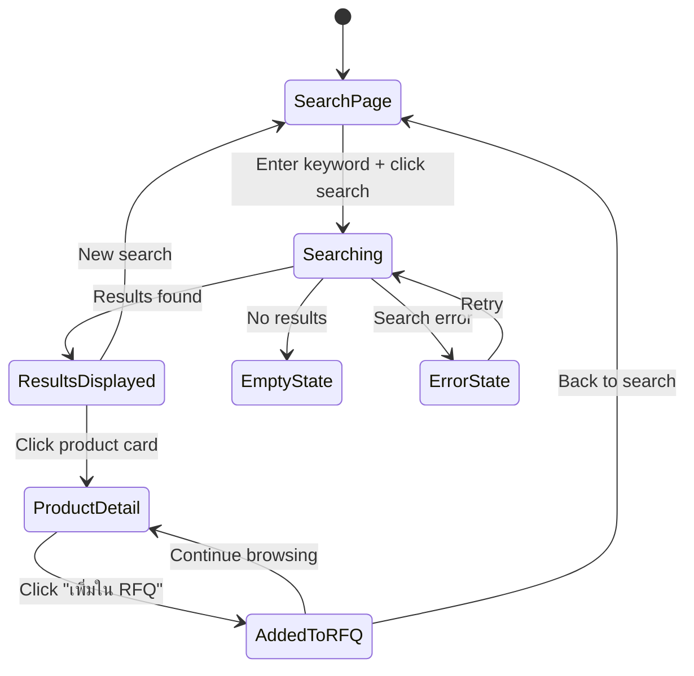

# Epic 5: Product Discovery & Sourcing
**Author/Owner**: Business Systems Analyst (BSA)
**Module**: Startup Partner O2O
**Date**: 2026-03-26
**Status**: ⚪ Draft

## Change Log

| Version | Date | Author | Changes |
|---------|------|--------|---------|
| 1.0 | 2026-03-26 | BSA | Initial draft extracted from BRD v2.0 |

**PRD Reference:** `docs/modules/startup-partner-o2o/startup-partner-o2o prd.md`
**BRD Reference:** `docs/modules/startup-partner-o2o/brd.md`
**Maps to:** FR-018, FR-019, FR-020

---

### 1. Epic Information

| Field | Value |
|-------|-------|
| **Epic ID** | EPIC-05 |
| **Epic Name** | Product Discovery & Sourcing |
| **Epic Description** | Enable SPs to search and discover products from participating stores in their assigned service areas and manage favorite stores |
| **Business Objective** | Enable SPs to search and discover products from participating stores in their assigned service areas so they can find the right products for their buyers |
| **Target Release** | TBD |
| **Epic Owner** | BSA |
| **Epic Status** | Backlog |
| **Priority** | P1 |
| **Estimated Story Points** | TBD |

#### Epic User Story
As a Startup Partner, I want to search for products by keyword across all participating stores in my service areas and manage favorite stores, so that I can find the right products for my buyers and quickly select preferred stores when creating RFQs.

#### Epic Scope
**In Scope:**
- Product search by keyword, category, store
- Service area filtering
- Product detail view
- Add to RFQ cart
- Favorite stores management

**Out of Scope:**
- AI-powered product recommendations
- Price comparison across stores
- Product reviews

#### Related Epics
| Epic ID | Epic Name | Relationship |
|---------|-----------|--------------|
| EPIC-04 | Seller Opt-In & Configuration | Depends on (only opted-in stores are searchable) |
| EPIC-06 | RFQ Creation & Management | Related (products discovered here are added to RFQs) |

#### Epic Success Criteria
- [ ] SPs can find products in under 30 seconds
- [ ] Search returns results in under 2 seconds
- [ ] Product details are accurate

---

### 2. User Stories

> Each user story follows the BRD structure: US -> AC (Given/When/Then) -> BR -> Validation -> Edge Cases -> Error Handling -> State Behavior. ID scheme: `US-09`, `US-09A` (scoped to this epic).

#### US-09: SP Search Products by Keyword
**As a** Startup Partner, **I want to** search for products by keyword across all participating stores in my service areas, **so that** I can find the right products for my buyers.

**Preconditions:**
- SP is logged in to SP Portal
- SP has assigned service areas
- Participating stores exist in SP's service areas

**Business Rules:**
| Rule ID | Rule Description | Priority |
|---------|------------------|----------|
| BR-048 | Product search is scoped to SP's assigned service areas only | P0 |
| BR-049 | Search returns products from opted-in stores only | P0 |
| BR-050 | Search supports Thai keyword matching (product name, SKU, category) | P0 |
| BR-051 | Search results display product name, image, price range, store name, location | P0 |
| BR-052 | Search results are paginated (20 products per page) | P1 |
| BR-053 | SP can filter results by category, price range, store, district | P1 |

**Validation Rules:**
| Field | Validation Rule | Error Message |
|-------|-----------------|---------------|
| Search Keyword | Minimum 2 characters | กรุณากรอกคำค้นหาอย่างน้อย 2 ตัวอักษร |

**Acceptance Criteria:**
| # | Given | When | Then |
|---|-------|------|------|
| AC-36 | SP is on product search page | SP enters keyword and clicks "ค้นหา" | System returns matching products from opted-in stores in SP's service areas within 2 seconds |
| AC-37 | Search returns results | SP views search results | System displays product cards with image, name, price range, store name, location |
| AC-38 | SP clicks on product card | SP views product detail | System displays full product info (description, specs, pricing, stock status, store contact) |
| AC-39 | SP wants to add product to RFQ | SP clicks "เพิ่มใน RFQ" on product detail | System adds product to RFQ cart and shows confirmation |

**Edge Cases (minimum 3):**
| # | Scenario | Expected Behavior |
|---|----------|-------------------|
| EC-30 | Search keyword matches no products | Display "ไม่พบสินค้าที่ค้นหา กรุณาลองคำค้นหาอื่น" with search suggestions |
| EC-31 | SP searches for product outside service areas | No results returned; display "ไม่พบสินค้าในพื้นที่ให้บริการของคุณ" |
| EC-32 | Product stock status changes during search | Display current stock status; if out of stock, show "สินค้าหมด" badge |

**Error Handling:**
| Error | Trigger | User Feedback | Recovery |
|-------|---------|---------------|----------|
| Search timeout | Query takes > 5 seconds | ระบบค้นหาช้ากว่าปกติ กรุณารอสักครู่ | Continue waiting or retry |
| Search service unavailable | Backend error | ไม่สามารถค้นหาได้ในขณะนี้ กรุณาลองใหม่ | Retry button |

**State Behavior:**
| State | When | UI Requirements |
|-------|------|-----------------|
| Loading | Search in progress | Show loading spinner with "กำลังค้นหา..." |
| Empty | No results found | Display empty state with search suggestions |
| Success | Results loaded | Display product grid with filters |
| Error | Search fails | Show error message with retry option |

#### US-09A: Manage Favorite Stores
**As a** Startup Partner, **I want to** mark stores as favorites and manage my favorite stores list, **so that** I can quickly select preferred stores when creating RFQs.

**Preconditions:**
- SP is logged in and approved
- SP has access to store directory
- Participating stores exist in SP's service areas

**Business Rules:**
| Rule ID | Rule Description | Priority |
|---------|------------------|----------|
| BR-053A | SP can mark any eligible store as favorite | P1 |
| BR-053B | Favorite stores are SP-specific (not shared across SPs) | P0 |
| BR-053C | SP can add/remove stores from favorites at any time | P1 |
| BR-053D | No limit on number of favorite stores | P1 |
| BR-053E | Favorite stores must still meet RFQ eligibility criteria (opted-in, service area match) | P0 |

**Validation Rules:**
| Field | Validation Rule | Error Message |
|-------|-----------------|---------------|
| Store | Store must be opted-in to SP program | ร้านค้านี้ยังไม่เข้าร่วมโปรแกรม SP |
| Store | Store must be active and not suspended | ร้านค้านี้ถูกระงับการใช้งาน |

**Acceptance Criteria:**
| # | Given | When | Then |
|---|-------|------|------|
| AC-39A | SP is viewing store list | SP clicks star icon on store card | System marks store as favorite and displays confirmation "เพิ่มร้านค้าโปรดสำเร็จ" |
| AC-39B | SP has favorite stores | SP navigates to "ร้านค้าโปรด" page | System displays list of all favorite stores with option to remove |
| AC-39C | SP wants to remove favorite | SP clicks "ลบออกจากรายการโปรด" | System removes store from favorites and displays confirmation |
| AC-39D | SP creates new RFQ | SP views store selection page | System shows favorite stores with star indicator for easy identification |

**Edge Cases (minimum 3):**
| # | Scenario | Expected Behavior |
|---|----------|-------------------|
| EC-32A | SP marks store as favorite, then store opts out | Favorite status persists but store won't appear in RFQ eligible stores |
| EC-32B | SP has no favorite stores | Display empty state "คุณยังไม่มีร้านค้าโปรด กรุณาเพิ่มร้านค้าที่คุณชื่นชอบ" |
| EC-32C | SP tries to favorite suspended store | Display error "ไม่สามารถเพิ่มร้านค้านี้เป็นรายการโปรดได้ ร้านค้าถูกระงับการใช้งาน" |

**Error Handling:**
| Error | Trigger | User Feedback | Recovery |
|-------|---------|---------------|----------|
| Add favorite fails | Server error | ไม่สามารถเพิ่มร้านค้าโปรดได้ กรุณาลองใหม่ | Retry button |
| Remove favorite fails | Server error | ไม่สามารถลบร้านค้าโปรดได้ กรุณาลองใหม่ | Retry button |

**State Behavior:**
| State | When | UI Requirements |
|-------|------|-----------------|
| Loading | Adding/removing favorite | Show loading spinner |
| Success | Favorite added/removed | Display success message and update UI |
| Error | Operation fails | Show error message with retry option |

---

### 3. Description

**Business Context:**
- **Problem Statement:** Startup Partners need to efficiently discover and source products from participating stores in their service areas to serve their offline buyers, but currently lack a centralized search and discovery tool scoped to their geographic regions.
- **Current State:** SPs have no dedicated product discovery interface that filters results by their assigned service areas and only shows products from opted-in stores.
- **Desired State:** A product search and discovery experience where SPs can search by keyword, filter by category/price/store/district, view product details, add products to RFQ carts, and manage favorite stores for quick access during RFQ creation.
- **Business Value:** Accelerates the SP's ability to find and source products for buyers, reducing time-to-quote; favorite stores feature improves efficiency for repeat interactions; service area scoping ensures SPs only see relevant products they can actually fulfill.

---

### 4. Prerequisites

| Prerequisite | Description | Status |
|--------------|-------------|--------|
| SP Portal | SP Portal must be operational with authenticated SP access | [ ] |
| EPIC-04 Seller Opt-In | Stores must have opted-in to SP program with service areas configured | [ ] |
| Product Catalog | Product catalog data must be available and searchable | [ ] |
| Elasticsearch | Elasticsearch service must be operational for product search | [ ] |
| Service Area Data | SP's assigned service areas must be available for search scoping | [ ] |

**Dependencies:**
- EPIC-04 Seller Opt-In & Configuration (opted-in stores)
- Elasticsearch Service (product search engine)
- Product catalog service
- Store/branch service

---

### 5. Terminology

| Term | Definition |
|------|------------|
| Startup Partner (SP) | Freelance sales agent who bridges offline buyers with online marketplace |
| Service Area | Geographic area (province + districts) where SP operates |
| Product Discovery | Process of searching and finding products from participating stores |
| RFQ Cart | Temporary collection of products that SP intends to include in a Request for Quotation |
| Favorite Stores | SP-designated preferred stores for quick selection during RFQ creation |
| Opted-In Store | Store that has enrolled in the SP program and is visible to SPs |
| Product Card | UI component displaying product summary (image, name, price range, store, location) |

---

### 6. Role and Permission Matrix

| Role | Permission | Access Level |
|------|------------|--------------|
| SP (Approved) | Search products, view details, add to RFQ, manage favorites | Read/Write |
| SP (Pending/InfoRequested/Rejected) | No access to product discovery | None |
| SP Leader | Search products, view details, add to RFQ, manage favorites | Read/Write |

**Permission Definitions:**
- `product:search` - Search products across participating stores
- `product:view` - View product detail information
- `rfq-cart:add` - Add products to RFQ cart
- `favorite-store:manage` - Add/remove stores from favorites list
- `favorite-store:view` - View favorite stores list

---

### 7. Information in the List

| Field Name | Format | Example | No Value | Condition |
|------------|--------|---------|----------|-----------|
| Product Name | Text | ท่อ PVC ขนาด 4 นิ้ว | N/A (required) | Thai keyword matching |
| Product Image | Thumbnail | 120x120px | Placeholder image | From product catalog |
| Price Range | Currency (THB) | ฿150 - ฿200 | ราคาติดต่อสอบถาม | From store pricing |
| Store Name | Text | ร้านวัสดุก่อสร้าง บางนา | N/A (required) | From opted-in store |
| Location | Text | บางนา, กรุงเทพฯ | N/A (required) | District, Province |
| Stock Status | Badge | In Stock / Out of Stock | N/A | Real-time from catalog |
| Favorite Status | Star icon | Filled / Outline | Outline (not favorite) | SP-specific |

**Display Rules:**
- Product cards displayed in grid layout (responsive)
- Search results paginated at 20 products per page
- Out-of-stock products show "สินค้าหมด" badge
- Favorite stores marked with filled star icon
- Filters displayed as sidebar or collapsible panel

---

### 8. Requirements

#### 8.1 General Information

| Field | Value |
|-------|-------|
| **Story Type** | New feature |
| **Application** | SP Portal |
| **Module** | Startup Partner O2O |
| **Pages** | `/sp/products`, `/sp/products/:id`, `/sp/favorite-stores` |
| **Priority** | P1 |
| **Complexity** | High |

#### 8.2 Happy Path

1. SP navigates to product search page in SP Portal
2. SP enters keyword (minimum 2 characters) in search field
3. SP clicks "ค้นหา" or presses Enter
4. System searches products from opted-in stores in SP's service areas
5. System returns matching products within 2 seconds
6. System displays product cards with image, name, price range, store name, location
7. SP optionally applies filters (category, price range, store, district)
8. SP clicks on a product card
9. System displays full product detail (description, specs, pricing, stock status, store contact)
10. SP clicks "เพิ่มใน RFQ" to add product to RFQ cart
11. System adds product to RFQ cart and shows confirmation

#### 8.3 Allowed Roles

- SP (Approved)
- SP Leader

#### 8.4 Business Rules (consolidated from all US)

| Rule ID | Rule Description | Priority |
|---------|------------------|----------|
| BR-048 | Product search is scoped to SP's assigned service areas only | P0 |
| BR-049 | Search returns products from opted-in stores only | P0 |
| BR-050 | Search supports Thai keyword matching (product name, SKU, category) | P0 |
| BR-051 | Search results display product name, image, price range, store name, location | P0 |
| BR-052 | Search results are paginated (20 products per page) | P1 |
| BR-053 | SP can filter results by category, price range, store, district | P1 |
| BR-053A | SP can mark any eligible store as favorite | P1 |
| BR-053B | Favorite stores are SP-specific (not shared across SPs) | P0 |
| BR-053C | SP can add/remove stores from favorites at any time | P1 |
| BR-053D | No limit on number of favorite stores | P1 |
| BR-053E | Favorite stores must still meet RFQ eligibility criteria (opted-in, service area match) | P0 |

#### 8.5 Validation Rules (consolidated)

| Field | Validation Rule | Error Message |
|-------|-----------------|---------------|
| Search Keyword | Minimum 2 characters | กรุณากรอกคำค้นหาอย่างน้อย 2 ตัวอักษร |
| Store (favorite) | Store must be opted-in to SP program | ร้านค้านี้ยังไม่เข้าร่วมโปรแกรม SP |
| Store (favorite) | Store must be active and not suspended | ร้านค้านี้ถูกระงับการใช้งาน |

---

### 9. Acceptance Criteria (consolidated)

#### 9.1 View Mode Scenarios

**Scenario: Empty State (Search)**

**Given** SP enters a keyword that matches no products
**When** search completes
**Then** system displays "ไม่พบสินค้าที่ค้นหา กรุณาลองคำค้นหาอื่น" with search suggestions

**Scenario: Empty State (Favorite Stores)**

**Given** SP has no favorite stores
**When** SP navigates to "ร้านค้าโปรด" page
**Then** system displays "คุณยังไม่มีร้านค้าโปรด กรุณาเพิ่มร้านค้าที่คุณชื่นชอบ"

**Scenario: Loading State**

**Given** SP has submitted a search query
**When** system is executing the search
**Then** system displays loading spinner with "กำลังค้นหา..."

**Scenario: Success State**

**Given** search returns results
**When** SP views search results
**Then** system displays product grid with filters and pagination

**Scenario: Error States**

**Given** search service is unavailable
**When** SP attempts to search
**Then** system displays "ไม่สามารถค้นหาได้ในขณะนี้ กรุณาลองใหม่" with retry button

**Given** search query takes longer than 5 seconds
**When** SP is waiting for results
**Then** system displays "ระบบค้นหาช้ากว่าปกติ กรุณารอสักครู่" with option to continue waiting or retry

#### 9.2 Action Mode Scenarios

**Scenario: Product Search Success (AC-36, AC-37)**

**Given** SP is on product search page
**When** SP enters keyword and clicks "ค้นหา"
**Then** system returns matching products from opted-in stores in SP's service areas within 2 seconds, displaying product cards with image, name, price range, store name, location

**Scenario: View Product Detail (AC-38)**

**Given** search results are displayed
**When** SP clicks on a product card
**Then** system displays full product info (description, specs, pricing, stock status, store contact)

**Scenario: Add Product to RFQ (AC-39)**

**Given** SP is viewing product detail
**When** SP clicks "เพิ่มใน RFQ"
**Then** system adds product to RFQ cart and shows confirmation

**Scenario: Add Favorite Store (AC-39A)**

**Given** SP is viewing store list
**When** SP clicks star icon on store card
**Then** system marks store as favorite and displays confirmation "เพิ่มร้านค้าโปรดสำเร็จ"

**Scenario: View Favorite Stores (AC-39B)**

**Given** SP has favorite stores
**When** SP navigates to "ร้านค้าโปรด" page
**Then** system displays list of all favorite stores with option to remove

**Scenario: Remove Favorite Store (AC-39C)**

**Given** SP is viewing favorite stores list
**When** SP clicks "ลบออกจากรายการโปรด"
**Then** system removes store from favorites and displays confirmation

**Scenario: Favorite Stores in RFQ (AC-39D)**

**Given** SP creates new RFQ
**When** SP views store selection page
**Then** system shows favorite stores with star indicator for easy identification

#### 9.3 Race Condition Scenarios

**Scenario: Product Stock Change During Search**

**Given** SP has search results displayed
**When** a product goes out of stock while SP is viewing results
**Then** product detail page shows current stock status; if out of stock, shows "สินค้าหมด" badge (EC-32)

**Scenario: Store Opts Out During SP Browse**

**Given** SP is browsing products from a store
**When** the store opts out of SP program
**Then** on next search/refresh, store's products are no longer returned; product detail pages for that store show appropriate message

#### 9.4 Loading State Scenarios (Action Mode)

**Scenario: Loading during product search**

**Given** SP has submitted a search query
**When** system is executing the search
**Then** search button is disabled, loading spinner is displayed with "กำลังค้นหา...", previous results are replaced with loading state

**Scenario: Loading during favorite store toggle**

**Given** SP clicks star icon on store card
**When** system is processing the favorite toggle
**Then** star icon shows loading state, click is disabled until operation completes

#### 9.5 Field Validation Scenarios

**Scenario: Search keyword too short**

**Given** SP is on product search page
**When** SP enters fewer than 2 characters and attempts to search
**Then** validation error "กรุณากรอกคำค้นหาอย่างน้อย 2 ตัวอักษร" is displayed and search is blocked

**Scenario: Attempt to favorite suspended store**

**Given** SP is viewing store list
**When** SP tries to favorite a suspended store
**Then** system displays "ไม่สามารถเพิ่มร้านค้านี้เป็นรายการโปรดได้ ร้านค้าถูกระงับการใช้งาน" (EC-32C)

#### 9.6 Edge Cases

**Scenario: No products in service area (EC-31)**

**Given** SP searches for a product
**When** no products match in SP's service areas
**Then** system displays "ไม่พบสินค้าในพื้นที่ให้บริการของคุณ"

**Scenario: Favorite store opts out (EC-32A)**

**Given** SP has marked a store as favorite
**When** that store opts out of SP program
**Then** favorite status persists but store won't appear in RFQ eligible stores

**Scenario: Product stock changes during search (EC-32)**

**Given** SP is viewing search results
**When** a product's stock status changes
**Then** display current stock status; if out of stock, show "สินค้าหมด" badge

---

### 10. Risk Assessment

| Risk ID | Risk Description | Category | Probability | Impact | Risk Level | Mitigation Strategy | Owner | Status |
|---------|------------------|----------|-------------|--------|------------|---------------------|-------|--------|
| R-001 | Elasticsearch downtime prevents product search | Technical | L | H | High | Implement fallback search using database queries; deploy Elasticsearch in HA cluster | Tech Lead | Open |
| R-002 | Search performance degrades with large product catalogs | Technical | M | M | Medium | Implement caching for frequent queries; optimize Elasticsearch indexing and query patterns | Tech Lead | Open |
| R-003 | Stale product data (price, stock) shown to SPs | Operational | M | M | Medium | Implement near-real-time index updates; display "last updated" timestamp on product cards | Tech Lead | Open |
| R-004 | SP sees products from stores outside their service area due to data sync delay | Technical | L | M | Medium | Validate service area at query time; implement event-driven service area propagation | Tech Lead | Open |
| R-005 | Thai keyword search returns irrelevant results | Operational | M | M | Medium | Implement Thai tokenizer/analyzer in Elasticsearch; conduct search relevance testing | Tech Lead | Open |
| R-006 | Favorite store becomes ineligible (opts out, suspended) causing confusion | Operational | M | L | Medium | Keep favorite status but clearly indicate ineligibility; filter out in RFQ store selection | UX Designer | Open |

#### Risk Summary
- **Total Risks:** 6
- **Critical Risks:** 0
- **High Risks:** 1
- **Medium Risks:** 5
- **Low Risks:** 0

---

### 11. Data Dictionary

#### Entity: FavoriteStore

| Attribute Name | Data Type | Length | Required | Unique | Default Value | Description |
|----------------|-----------|--------|----------|--------|---------------|-------------|
| id | string (UUID) | - | Yes | Yes | auto-generated | Unique favorite record ID |
| spId | string | - | Yes | No | - | Reference to StartupPartner |
| storeId | string | - | Yes | No | - | Reference to Store |
| addedAt | Date | - | Yes | No | NOW() | Timestamp when store was favorited |
| notes | string | 500 | No | No | - | Optional SP notes about this store |

```typescript
interface FavoriteStore {
  id: string; // UUID
  spId: string; // Reference to StartupPartner
  storeId: string; // Reference to Store
  addedAt: Date;
  notes?: string; // Optional SP notes about this store
}
```

#### Relationships

| Related Entity | Relationship Type | Cardinality | Description |
|----------------|-------------------|-------------|-------------|
| StartupPartner | Many-to-One | N:1 | Each favorite belongs to one SP |
| Store | Many-to-One | N:1 | Each favorite references one store |
| RFQ | Related | - | Favorite stores shown with indicator during RFQ store selection |

---

### 12. Audit Trail Requirements

| Action | Data to Capture | Retention Period |
|--------|-----------------|------------------|
| PRODUCT_SEARCH | SP ID, Timestamp, Search keyword, Filters applied, Results count, IP address | 6 months |
| PRODUCT_VIEW | SP ID, Timestamp, Product ID, Store ID, IP address | 6 months |
| ADD_TO_RFQ_CART | SP ID, Timestamp, Product ID, Store ID, IP address | 1 year |
| ADD_FAVORITE | SP ID, Timestamp, Store ID, IP address | 1 year |
| REMOVE_FAVORITE | SP ID, Timestamp, Store ID, IP address | 1 year |

---

### 13. Notes

- Product search is scoped to SP's assigned service areas only (BR-048) and returns products from opted-in stores only (BR-049). This is a critical security and business constraint.
- Search supports Thai keyword matching across product name, SKU, and category (BR-050). Thai language tokenization in Elasticsearch requires proper configuration.
- Favorite stores are SP-specific (BR-053B) and have no limit (BR-053D), but must still meet RFQ eligibility criteria (BR-053E) when used in RFQ creation.
- When a favorite store opts out of the SP program (EC-32A), the favorite status persists in the SP's list but the store will not appear in RFQ eligible stores.
- Search results pagination is set to 20 products per page (BR-052).

### Questions for Tech Lead
- What Elasticsearch configuration is needed for Thai keyword matching?
- How should product index updates be triggered (real-time vs. periodic)?
- What is the caching strategy for frequent search queries?
- How should the RFQ cart be implemented (session-based vs. persistent)?
- What is the maximum number of products in the search index?

### Questions for UX Designer
- Should product search results use grid view, list view, or both?
- How should filters be presented (sidebar, top bar, modal)?
- What should the product detail page layout look like?
- How should the "Add to RFQ" flow work (modal confirmation vs. inline)?
- Where should the favorite stores management be accessible from (dedicated page, search results, both)?

---

### 14. Draft Technical Design

#### 14.1 API Endpoints

| Method | Endpoint | Description | Authentication |
|--------|----------|-------------|----------------|
| GET | /api/sp/products/search | Search products by keyword with filters | Required |
| GET | /api/sp/products/:id | Get product detail by ID | Required |
| POST | /api/sp/rfq-cart/add | Add product to RFQ cart | Required |
| GET | /api/sp/favorite-stores | List SP's favorite stores | Required |
| POST | /api/sp/favorite-stores | Add store to favorites | Required |
| DELETE | /api/sp/favorite-stores/:storeId | Remove store from favorites | Required |

#### 14.2 Database Schema

```sql
-- Favorite stores
CREATE TABLE favorite_stores (
    id UUID PRIMARY KEY DEFAULT gen_random_uuid(),
    sp_id UUID NOT NULL REFERENCES startup_partners(id),
    store_id UUID NOT NULL,
    notes TEXT,
    added_at TIMESTAMP NOT NULL DEFAULT NOW(),
    CONSTRAINT uq_sp_store UNIQUE (sp_id, store_id)
);

-- RFQ Cart (session-based or persistent)
CREATE TABLE rfq_cart_items (
    id UUID PRIMARY KEY DEFAULT gen_random_uuid(),
    sp_id UUID NOT NULL REFERENCES startup_partners(id),
    product_id UUID NOT NULL,
    store_id UUID NOT NULL,
    quantity INTEGER DEFAULT 1,
    added_at TIMESTAMP NOT NULL DEFAULT NOW(),
    CONSTRAINT uq_sp_product UNIQUE (sp_id, product_id, store_id)
);

-- Search audit log
CREATE TABLE product_search_log (
    id UUID PRIMARY KEY DEFAULT gen_random_uuid(),
    sp_id UUID NOT NULL,
    keyword VARCHAR(200),
    filters JSONB,
    results_count INTEGER,
    response_time_ms INTEGER,
    ip_address INET,
    created_at TIMESTAMP NOT NULL DEFAULT NOW()
);
```

#### 14.3 State Diagram



#### 14.4 UI/UX Considerations

- Product search page with prominent search bar and filter panel
- Product cards in responsive grid layout showing image, name, price range, store name, location
- Product detail page with full specifications, pricing, stock status, and store contact
- "เพิ่มใน RFQ" button on product detail page with confirmation feedback
- Star icon on store cards for favorite toggle (filled = favorite, outline = not favorite)
- Dedicated "ร้านค้าโปรด" page accessible from navigation
- Pagination controls at bottom of search results (20 per page)
- Filter options: category, price range, store, district
- Out-of-stock products shown with "สินค้าหมด" badge
- Error messages must be in Thai language as specified in validation rules
- Search suggestions shown on empty results

---

### 15. Testing Checklist

#### Pre-Testing
- [ ] SP Portal is operational with authenticated SP access
- [ ] Test SP accounts with assigned service areas created
- [ ] Test stores opted-in to SP program with products in catalog
- [ ] Elasticsearch is operational and indexed with test products
- [ ] Product catalog contains test data with Thai product names

#### Functional Testing
- [ ] Product search returns results within 2 seconds (AC-36)
- [ ] Search results display product cards with correct fields (AC-37)
- [ ] Product detail page shows full information (AC-38)
- [ ] "เพิ่มใน RFQ" adds product to cart with confirmation (AC-39)
- [ ] Search is scoped to SP's service areas only (BR-048)
- [ ] Search returns products from opted-in stores only (BR-049)
- [ ] Thai keyword matching works correctly (BR-050)
- [ ] Pagination works at 20 products per page (BR-052)
- [ ] Filters work correctly (category, price range, store, district) (BR-053)
- [ ] Add favorite store works with confirmation (AC-39A)
- [ ] Favorite stores list displays correctly (AC-39B)
- [ ] Remove favorite store works with confirmation (AC-39C)
- [ ] Favorite stores shown with indicator in RFQ store selection (AC-39D)
- [ ] No results displays correct empty state message (EC-30)
- [ ] Out-of-service-area search shows correct message (EC-31)
- [ ] Stock status changes reflected in UI (EC-32)
- [ ] Favorite store that opts out handled correctly (EC-32A)
- [ ] Empty favorite stores shows correct message (EC-32B)
- [ ] Suspended store cannot be favorited (EC-32C)
- [ ] Search timeout handled with user feedback
- [ ] Search service unavailable handled with retry option

#### Security Testing
- [ ] Unapproved SP cannot access product search
- [ ] Search results respect SP's service area boundaries
- [ ] SQL injection/XSS prevention on search input
- [ ] API endpoints require authentication

#### Performance Testing
- [ ] Search response time < 2 seconds for typical queries
- [ ] Product detail page loads in under 2 seconds
- [ ] Pagination works smoothly with large result sets
- [ ] Favorite store toggle responds in under 1 second

#### Cross-Browser Testing
- [ ] Chrome
- [ ] Firefox
- [ ] Safari
- [ ] Edge

#### Mobile Testing
- [ ] Responsive product grid on mobile devices
- [ ] Touch interactions work on product cards and favorite toggle
- [ ] Search and filter experience is usable on mobile

---

### 16. Approval

| Role | Name | Signature | Date |
|------|------|-----------|------|
| Product Owner | | | |
| Business Analyst | | | |
| Technical Lead | | | |
| QA Lead | | | |

---

**Document Version:** 1.0
**Last Updated:** 2026-03-26
**Author:** BSA
**Status:** Draft
