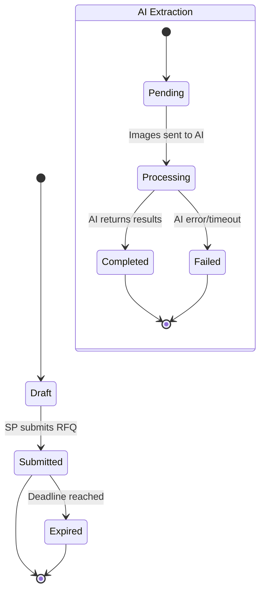

# Epic 6: RFQ Creation & Management
**Author/Owner**: Business Systems Analyst (BSA)
**Module**: Startup Partner O2O
**Date**: 2026-03-26
**Status**: ⚪ Draft

## Change Log

| Version | Date | Author | Changes |
|---------|------|--------|---------|
| 1.0 | 2026-03-26 | BSA | Initial draft |

**Status:** ⚪ Draft / 🟡 In Review / 🟢 Final

> **💡 When updating:** Change Status to 🟢 Final / Approved ONLY AFTER explicit approval.

**PRD Reference:** `docs/modules/startup-partner-o2o/startup-partner-o2o prd.md` (provided by PO)
**BRD Reference:** `docs/modules/startup-partner-o2o/brd.md`
**Maps to:** FR-021, FR-022, FR-023, FR-024, FR-050 to FR-070

---

### 1. Epic Information

| Field | Value |
|-------|-------|
| **Epic ID** | EPIC-06 |
| **Epic Name** | RFQ Creation & Management |
| **Epic Description** | Enable SPs to create buyer-centric, round-based RFQs with comprehensive commercial, delivery, and contact information to multiple stores using multiple product acquisition methods |
| **Business Objective** | Enable SPs to create and submit comprehensive RFQs efficiently, deliver RFQs to stores reliably with all commercial details, and track RFQ status accurately |
| **Target Release** | TBD |
| **Epic Owner** | BSA |
| **Epic Status** | Backlog |
| **Priority** | P1 |
| **Estimated Story Points** | TBD |

#### Epic User Story
As a Startup Partner, I want to create buyer-centric, round-based RFQs with comprehensive commercial, delivery, and contact information to multiple stores, so that I can get competitive quotes for my buyers efficiently.

#### Epic Scope
**In Scope:**
- RFQ creation form with project info, payment method, delivery type/address/time slot, contact info, tax invoice requirement, buyer type, buyer information, delivery requirements, delivery schedule
- Product selection (manual search, AI image analysis, hybrid)
- Quantity input
- Store selection with location-based and favorite filtering
- Deadline setting
- RFQ submission
- RFQ tracking
- RFQ expiration
- Buyer grouping
- AI text-based product sourcing
- Manual entry without Master SKU match
- Public RFQs
- Favorite stores (inline + settings page)
- Buyer name/phone privacy (not shared with seller)

**Out of Scope:**
- RFQ templates
- Bulk RFQ creation
- RFQ scheduling
- Automated payment method validation
- Real-time credit limit checking
- Automated Tax ID verification
- AI-powered store recommendation

#### Related Epics
| Epic ID | Epic Name | Relationship |
|---------|-----------|--------------|
| EPIC-05 | Product Discovery & Sourcing | Depends on |
| EPIC-04 | Seller Opt-In & Configuration | Depends on |
| EPIC-07 | Quote Comparison & Selection | Blocks |
| EPIC-09 | Magic Link Offer Generation | Blocks |

#### Epic Success Criteria
- [ ] SPs can create and submit comprehensive RFQ in under 10 minutes
- [ ] RFQs delivered to stores reliably with all commercial details
- [ ] RFQ status tracked accurately
- [ ] Store selection enhanced with location and favorite filtering
- [ ] Product list can be built from manual search, AI extraction, or hybrid methods
- [ ] AI extraction completes within 10 seconds (sync) or 5 minutes (async)

---

### 2. User Stories

> Each user story follows the BRD structure: US → AC (Given/When/Then) → BR → Validation → Edge Cases → Error Handling → State Behavior. ID scheme: `US-10`, `US-10C`, `US-10D`, `US-10E`, `US-10F` (scoped to this epic).

#### US-10: SP Create RFQ with Multiple Products
**As a** Startup Partner, **I want to** create an RFQ with multiple products and send it to multiple stores, **so that** I can get competitive quotes for my buyer.

**Preconditions:**
- SP is logged in to SP Portal
- SP has selected products via search/browse
- Participating stores exist in SP's service areas

**Business Rules:**
| Rule ID | Rule Description | Priority |
|---------|------------------|----------|
| BR-054 | RFQ must contain at least 1 product | P0 |
| BR-055 | RFQ can contain up to 50 products | P0 |
| BR-056 | Each product must have quantity specified (minimum 1 unit) | P0 |
| BR-057 | RFQ must be sent to at least 1 store | P0 |
| BR-058 | RFQ can be sent to up to 12 partner stores simultaneously (only opted-in stores) | P0 |
| BR-059 | RFQ deadline is mandatory (minimum 24 hours, maximum 7 days from creation) | P0 |
| BR-060 | RFQ automatically expires after deadline; no new quotes accepted | P0 |
| BR-061 | SP can add notes/special requirements to RFQ (optional, max 500 chars) | P1 |
| BR-062 | Buyer information is mandatory: First name, Last name, Phone number | P0 |
| BR-063 | Buyer phone must be 10 digits Thai format | P0 |
| BR-064 | Delivery location is mandatory (max 500 chars) | P0 |
| BR-065 | Delivery time is mandatory (must be after deadline + minimum 24 hours lead time) | P0 |
| BR-066 | Delivery schedule is optional; SP can specify multiple delivery rounds (max 5 rounds) | P1 |
| BR-067 | Each delivery round specifies: Round number, Location, Date/Time | P1 |
| BR-068 | SP reference (SP ID) is auto-populated from logged-in SP account | P0 |
| BR-069 | SP can view RFQs grouped by buyer for better customer management | P1 |
| BR-070 | Project Name is required for all RFQs (max 200 chars) | P0 |
| BR-071 | Project Name helps organize RFQs by buyer project | P1 |
| BR-072 | Payment Method is required for all RFQs | P0 |
| BR-073 | Payment Method affects quotation approval workflow | P0 |
| BR-074 | If Payment Method = Store Credit, store reviews buyer credit eligibility during quotation | P0 |
| BR-075 | Store Credit is seller-specific credit agreement (not Allkons credit product) | P0 |
| BR-076 | Store can approve/reject quotation based on credit policy for Store Credit payment method | P0 |
| BR-077 | Delivery Type is required (Self Pickup or Store Delivery) | P0 |
| BR-078 | If Delivery Type = Store Delivery, Delivery Address is required | P0 |
| BR-079 | If Delivery Type = Self Pickup, Delivery Address is optional | P1 |
| BR-080 | Google Maps Location Link is optional but recommended for Store Delivery | P1 |
| BR-081 | Delivery Date is required and must be future date (minimum 24 hours from RFQ submission) | P0 |
| BR-082 | Delivery Time Slot is required but can be set as Unspecified | P0 |
| BR-083 | Delivery information flows to quotation and affects delivery terms | P0 |
| BR-084 | Contact Name is required (max 100 chars) | P0 |
| BR-085 | Contact Phone Number is required (10 digits Thai format) | P0 |
| BR-086 | Contact Email is optional | P1 |
| BR-087 | Contact information is used for order communication and delivery coordination | P0 |
| BR-088 | Tax Invoice requirement must be explicitly captured (Yes/No) | P0 |
| BR-089 | Tax Invoice requirement affects quotation pricing and documentation | P0 |
| BR-090 | Additional Notes is optional (max 1000 chars) | P1 |
| BR-091 | Additional Notes can include special instructions, preferences, or requirements | P1 |
| BR-092 | System filters stores whose service areas include delivery address region/province/district | P0 |
| BR-093 | Within eligible stores, system sorts by proximity to delivery address | P1 |
| BR-094 | Proximity calculation uses geocoding of delivery address and store location | P1 |
| BR-095 | Location filter is applied automatically based on delivery address | P0 |
| BR-096 | SP can toggle "Show Favorite Stores Only" filter | P1 |
| BR-097 | Favorite filter only shows stores marked as favorite by that SP | P1 |
| BR-098 | Favorite filter respects service area and participation eligibility | P0 |
| BR-099 | If no favorite stores match criteria, display "No favorite stores available" message | P1 |
| BR-100 | Location and favorite filters can be combined | P1 |
| BR-101 | Filter priority: Service area eligibility → Favorite status → Proximity sort | P0 |
| BR-102 | Store selection remains constrained by existing participation and service area rules | P0 |
| BR-103 | System must support search by product name, barcode number, master SKU number, description | P0 |
| BR-104 | Search powered by Elasticsearch with Thai language support | P0 |
| BR-105 | Search scoped to SP service areas | P0 |
| BR-106 | SP can add products from search results to RFQ product list | P0 |
| BR-107 | Product list source type tracked as MANUAL_SEARCH | P1 |
| BR-108 | System must allow SP to upload images for AI product extraction | P0 |
| BR-109 | Max 5 images per upload, 10MB each, formats: JPG/PNG/HEIC | P0 |
| BR-110 | System sends images to external AI vendor (AI All in team) | P0 |
| BR-111 | AI vendor processes images and returns structured product list | P0 |
| BR-112 | AI processing supports synchronous (real-time) and asynchronous (job-based) modes | P0 |
| BR-113 | Synchronous mode: results within 10 seconds; Asynchronous mode: results via polling/webhook | P0 |
| BR-114 | AI results stored with extraction metadata (job ID, vendor name, timestamp) | P1 |
| BR-115 | Confidence scores logged internally but not displayed to SP | P1 |
| BR-116 | AI extraction status tracked: PENDING → PROCESSING → COMPLETED | FAILED | P0 |
| BR-117 | AI-extracted products displayed in editable review state | P0 |
| BR-118 | SP must review and confirm AI results before adding to RFQ | P0 |
| BR-119 | SP can edit product name, quantity, unit for each AI-extracted item | P1 |
| BR-120 | SP can remove unwanted AI-extracted items | P1 |
| BR-121 | SP can add additional products via manual search after AI extraction | P1 |
| BR-122 | Product list source type tracked as AI_IMAGE_ANALYSIS or HYBRID | P1 |
| BR-123 | HYBRID = AI extraction + manual additions/edits | P1 |
| BR-124 | RFQ submission blocked until SP confirms product list | P0 |
| BR-125 | SP can discard AI results and start over with manual search | P1 |
| BR-126 | Buyer Type is required (INDIVIDUAL or CORPORATE) | P0 |
| BR-127 | If requireTaxInvoice = Yes, tax invoice information is required | P0 |
| BR-128 | Tax invoice address option is required if requireTaxInvoice = Yes | P0 |
| BR-129 | Tax invoice address option: USE_DELIVERY_ADDRESS or PROVIDE_SEPARATE | P0 |
| BR-130 | If USE_DELIVERY_ADDRESS selected, delivery address auto-populates to tax invoice fields (editable) | P0 |
| BR-131 | If PROVIDE_SEPARATE selected, SP must enter separate tax invoice address | P0 |
| BR-132 | For INDIVIDUAL buyer type: Tax invoice requires full name and Tax ID (13 digits) | P0 |
| BR-133 | For CORPORATE buyer type: Tax invoice requires company name, Tax ID (13 digits), branch, company address, phone | P0 |
| BR-134 | Tax ID must be 13 digits for both individual and corporate | P0 |
| BR-135 | Branch field is optional for corporate (default "สำนักงานใหญ่" if not specified) | P1 |
| BR-136 | Tax invoice information flows to quotation and affects documentation | P0 |
| BR-277 | SP can paste or type long free-form text and AI will extract product info, quantities, delivery address, and contact information to auto-fill form fields | P1 |
| BR-278 | When product search returns no results, SP can manually enter product name/description without Master SKU match | P0 |
| BR-279 | Product unit field is optional — RFQ can be submitted without specifying unit | P1 |
| BR-280 | SP can mark an RFQ as "public" — any opted-in store in the service area can view and submit a QT | P1 |
| BR-281 | SP can mark stores as favorites via star icon during store selection or via My Favorite Stores in Profile/Settings | P1 |
| BR-282 | Favorite stores appear first in store selection list | P1 |
| BR-283 | Buyer name and phone number are optional fields in RFQ | P0 |
| BR-284 | CRITICAL: Even if buyer name/phone is provided, it must NOT be shared with Seller to prevent platform bypass | P0 |
| BR-285 | Delivery date is required; time slot options: ไม่ระบุ (unspecified), ช่วงเช้า (morning), ช่วงบ่าย (afternoon) | P0 |
| BR-286 | SP specifies buyer's preferred payment method: Direct transfer, Allkons Payment Gateway (Thai QR/Credit Card), or Store Credit | P1 |
| BR-287 | Store search must support text search term + location filter down to district level (อำเภอ) | P0 |

**Validation Rules:**
| Field | Validation Rule | Error Message |
|-------|-----------------|---------------|
| Project Name | Required, max 200 chars | กรุณากรอกชื่อโครงการ |
| Payment Method | Required, must be one of enum values | กรุณาเลือกวิธีการชำระเงิน |
| Delivery Type | Required, must be SELF_PICKUP or STORE_DELIVERY | กรุณาเลือกประเภทการจัดส่ง |
| Delivery Address | Required if Delivery Type = STORE_DELIVERY, max 500 chars | กรุณากรอกที่อยู่จัดส่ง |
| Google Maps Link | Optional, must be valid URL if provided | กรุณากรอก URL ที่ถูกต้อง |
| Delivery Date | Required, must be future date (min 24 hours ahead) | กรุณาเลือกวันที่จัดส่ง (อย่างน้อย 24 ชั่วโมงล่วงหน้า) |
| Delivery Time Slot | Required, must be MORNING, AFTERNOON, or UNSPECIFIED | กรุณาเลือกช่วงเวลาจัดส่ง |
| Contact Name | Required, max 100 chars | กรุณากรอกชื่อผู้ติดต่อ |
| Contact Phone | Required, 10 digits Thai format | กรุณากรอกหมายเลขโทรศัพท์ให้ถูกต้อง (10 หลัก) |
| Contact Email | Optional, valid email format if provided | กรุณากรอกอีเมลให้ถูกต้อง |
| Require Tax Invoice | Required, must be Yes or No | กรุณาระบุความต้องการใบกำกับภาษี |
| Additional Notes | Optional, max 1000 chars | หมายเหตุไม่เกิน 1000 ตัวอักษร |
| Buyer First Name | Required, Thai characters, max 100 chars | กรุณากรอกชื่อลูกค้า |
| Buyer Last Name | Required, Thai characters, max 100 chars | กรุณากรอกนามสกุลลูกค้า |
| Buyer Phone Number | Required, 10 digits Thai format | กรุณากรอกเบอร์โทรศัพท์ลูกค้า (10 หลัก) |
| Delivery Location | Required, max 500 chars | กรุณากรอกสถานที่จัดส่ง |
| Delivery Time | Required, must be after deadline + 24 hours | กรุณาเลือกเวลาจัดส่ง (หลังกำหนดเวลาอย่างน้อย 24 ชั่วโมง) |
| Delivery Schedule | Optional, max 5 rounds, each with location and time | รอบจัดส่งสูงสุด 5 รอบ |
| Product List | At least 1 product required | กรุณาเพิ่มสินค้าอย่างน้อย 1 รายการ |
| Product Quantity | Must be positive integer, max 9999 | กรุณากรอกจำนวนสินค้า (1-9999) |
| Store Selection | At least 1 store required, max 12 partner stores | กรุณาเลือกร้านค้าอย่างน้อย 1 ร้าน (สูงสุด 12 ร้าน) |
| Deadline | Must be 24 hours to 7 days from now | กรุณาเลือกกำหนดเวลา (24 ชั่วโมง - 7 วัน) |
| Notes | Max 500 characters | หมายเหตุต้องไม่เกิน 500 ตัวอักษร |
| Buyer Type | Required, must be INDIVIDUAL or CORPORATE | กรุณาเลือกประเภทผู้ซื้อ |
| Tax Invoice Address Option | Required if requireTaxInvoice = Yes | กรุณาเลือกวิธีระบุที่อยู่ใบกำกับภาษี |
| Tax ID (Individual) | Required if buyer type = INDIVIDUAL and requireTaxInvoice = Yes, 13 digits | กรุณากรอกเลขประจำตัวผู้เสียภาษี (13 หลัก) |
| Tax Invoice Name (Individual) | Required if buyer type = INDIVIDUAL and requireTaxInvoice = Yes, max 200 chars | กรุณากรอกชื่อผู้เสียภาษี |
| Tax Invoice Address (Individual) | Required if PROVIDE_SEPARATE selected, max 500 chars | กรุณากรอกที่อยู่ใบกำกับภาษี |
| Company Name | Required if buyer type = CORPORATE and requireTaxInvoice = Yes, max 200 chars | กรุณากรอกชื่อบริษัท |
| Company Tax ID | Required if buyer type = CORPORATE and requireTaxInvoice = Yes, 13 digits | กรุณากรอกเลขประจำตัวผู้เสียภาษีนิติบุคคล (13 หลัก) |
| Company Branch | Optional, max 100 chars, default "สำนักงานใหญ่" | สาขา (ถ้ามี) |
| Company Address | Required if buyer type = CORPORATE and requireTaxInvoice = Yes and PROVIDE_SEPARATE selected, max 500 chars | กรุณากรอกที่อยู่บริษัท |
| Company Phone | Required if buyer type = CORPORATE and requireTaxInvoice = Yes, 10 digits Thai format | กรุณากรอกเบอร์โทรศัพท์บริษัท (10 หลัก) |

**Acceptance Criteria:**
| # | Given | When | Then |
|---|-------|------|------|
| AC-40 | SP has products in RFQ cart | SP clicks "สร้าง RFQ" | System displays comprehensive RFQ creation form with all field groups: project info, payment method, delivery type/address/time slot, contact info, tax invoice, buyer info, delivery details, product list, store selector, deadline |
| AC-40a | SP enters project information | SP fills project name | System validates max 200 chars |
| AC-40b | SP selects payment method | SP selects from dropdown (4 options) | System displays selected payment method; if Store Credit selected, shows info message about credit approval during quotation |
| AC-40c | SP selects delivery type | SP selects Self Pickup or Store Delivery | If Store Delivery selected, delivery address field becomes required; if Self Pickup, address is optional/hidden |
| AC-40d | SP enters delivery details | SP fills delivery address, Google Maps link, delivery date, time slot | System validates delivery date is future date (min 24 hours ahead) |
| AC-40e | SP enters contact information | SP fills contact name, phone, email | System validates phone format (10 digits) |
| AC-40f | SP specifies tax invoice requirement | SP selects Yes or No | System captures tax invoice requirement |
| AC-40g | SP enters additional notes (optional) | SP fills additional notes field | System allows up to 1000 chars |
| AC-40h | SP enters buyer information | SP fills buyer first name, last name, phone number | System validates buyer phone format (10 digits) |
| AC-40i | SP enters delivery information | SP fills delivery location and delivery time | System validates delivery time is at least 24 hours after deadline |
| AC-40j | SP adds delivery schedule (optional) | SP adds multiple delivery rounds with location/time | System allows up to 5 delivery rounds |
| AC-40k | SP reference auto-populated | SP views RFQ form | System auto-fills SP ID from logged-in account (read-only) |
| AC-41 | SP completes RFQ form | SP fills all required fields and clicks "ส่ง RFQ" | System validates all fields, creates RFQ with complete commercial details, sends notifications to selected stores (max 12), displays RFQ ID and tracking page |
| AC-41a | SP views RFQ list | SP navigates to "RFQ ของฉัน" | System displays RFQs grouped by buyer name with expandable sections showing project name and payment method |
| AC-42 | RFQ submitted successfully | System processes submission | Selected stores receive RFQ notifications with all commercial details; SP receives LINE OA notification (with SMS as fallback) confirmation |
| AC-40m | SP selects buyer type | SP selects INDIVIDUAL or CORPORATE | System displays appropriate tax invoice fields based on buyer type |
| AC-40n | SP enables tax invoice requirement | SP selects requireTaxInvoice = Yes | System displays tax invoice address option selector |
| AC-40o | SP selects USE_DELIVERY_ADDRESS | SP chooses "Use Delivery Address" option | System auto-populates delivery address to tax invoice address fields (editable) |
| AC-40p | SP selects PROVIDE_SEPARATE | SP chooses "Provide Separate Information" | System displays empty tax invoice address fields for manual entry |
| AC-40q | SP enters individual tax invoice info | Buyer type = INDIVIDUAL, requireTaxInvoice = Yes | System requires: Tax invoice name, Tax ID (13 digits), Address (if PROVIDE_SEPARATE) |
| AC-40r | SP enters corporate tax invoice info | Buyer type = CORPORATE, requireTaxInvoice = Yes | System requires: Company name, Tax ID (13 digits), Branch (optional), Company address (if PROVIDE_SEPARATE), Company phone |
| AC-40s | SP edits auto-populated tax address | USE_DELIVERY_ADDRESS selected, SP modifies address | System allows editing of auto-populated tax invoice address |

**Edge Cases (minimum 3):**
| # | Scenario | Expected Behavior |
|---|----------|-------------------|
| EC-33 | SP tries to send RFQ to opted-out store | System filters out opted-out stores from selector; displays only partner stores |
| EC-34 | SP sets deadline less than 24 hours | Display validation error "กำหนดเวลาต้องมากกว่า 24 ชั่วโมงจากตอนนี้" |
| EC-35 | SP selects more than 12 stores | Display error "สามารถเลือกร้านค้าได้สูงสุด 12 ร้าน" and disable selection |
| EC-35a | SP adds more than 50 products | Display error "สามารถเพิ่มสินค้าได้สูงสุด 50 รายการ" and disable add button |
| EC-35b | SP sets delivery time before deadline | Display error "เวลาจัดส่งต้องหลังกำหนดเวลาอย่างน้อย 24 ชั่วโมง" |
| EC-35c | SP adds more than 5 delivery rounds | Display error "สามารถเพิ่มรอบจัดส่งได้สูงสุด 5 รอบ" and disable add button |
| EC-35d | Invalid buyer phone number format | Display error "กรุณากรอกเบอร์โทรศัพท์ให้ถูกต้อง (10 หลัก)" |
| EC-35e | SP selects Self Pickup but enters delivery address | System allows optional address entry; address not required for validation |
| EC-35f | SP selects Store Delivery but doesn't enter address | Display error "กรุณากรอกที่อยู่จัดส่งสำหรับการจัดส่งโดยร้านค้า" |
| EC-35g | SP enters invalid Google Maps URL | Display error "กรุณากรอก URL ของ Google Maps ที่ถูกต้อง" |
| EC-35h | SP selects Store Credit payment method | Display info message "ร้านค้าจะตรวจสอบวงเงินเครดิตของลูกค้าเมื่อสร้างใบเสนอราคา" |
| EC-35i | SP enters delivery date less than 24 hours ahead | Display error "กรุณาเลือกวันที่จัดส่งอย่างน้อย 24 ชั่วโมงล่วงหน้า" |
| EC-35j | SP enters contact phone in invalid format | Display error "กรุณากรอกหมายเลขโทรศัพท์ผู้ติดต่อให้ถูกต้อง (10 หลัก)" |
| EC-35k | SP changes buyer type after entering tax info | System clears tax invoice fields and displays appropriate fields for new buyer type |
| EC-35l | SP changes from USE_DELIVERY_ADDRESS to PROVIDE_SEPARATE | System clears auto-populated address, requires manual entry |
| EC-35m | SP changes delivery address after selecting USE_DELIVERY_ADDRESS | System updates tax invoice address automatically (if not manually edited) |
| EC-35n | SP enters invalid Tax ID format | Display error "กรุณากรอกเลขประจำตัวผู้เสียภาษีให้ถูกต้อง (13 หลัก)" |
| EC-35o | Corporate buyer doesn't specify branch | System defaults to "สำนักงานใหญ่" |

**Error Handling:**
| Error | Trigger | User Feedback | Recovery |
|-------|---------|---------------|----------|
| Submission failure | Server error | ไม่สามารถส่ง RFQ ได้ กรุณาลองใหม่ | Save draft, retry button |
| Notification failure | SMS/email gateway error | RFQ ถูกสร้างแล้ว แต่ไม่สามารถส่งการแจ้งเตือนได้ | Log error, continue |

**State Behavior:**
| State | When | UI Requirements |
|-------|------|-----------------|
| Loading | Submitting RFQ | Show loading spinner with "กำลังส่ง RFQ..." |
| Success | RFQ created | Display success message with RFQ ID and "ดู RFQ" button |
| Error | Submission fails | Show error message with retry option |

#### US-10C: Filter and Select Stores with Location and Favorites
**As a** Startup Partner, **I want to** filter eligible stores by location relevance and favorite status, **so that** I can quickly select the most appropriate stores for my RFQ.

**Preconditions:**
- SP is creating RFQ
- SP has entered delivery address (for location filtering)
- Eligible stores exist (opted-in, service area match)

**Business Rules:**
| Rule ID | Rule Description | Priority |
|---------|------------------|----------|
| BR-092 | System filters stores whose service areas include delivery address region/province/district | P0 |
| BR-093 | Within eligible stores, system sorts by proximity to delivery address | P1 |
| BR-094 | Proximity calculation uses geocoding of delivery address and store location | P1 |
| BR-095 | Location filter is applied automatically based on delivery address | P0 |
| BR-096 | SP can toggle "Show Favorite Stores Only" filter | P1 |
| BR-097 | Favorite filter only shows stores marked as favorite by that SP | P1 |
| BR-098 | Favorite filter respects service area and participation eligibility | P0 |
| BR-099 | If no favorite stores match criteria, display "No favorite stores available" message | P1 |
| BR-100 | Location and favorite filters can be combined | P1 |
| BR-101 | Filter priority: Service area eligibility → Favorite status → Proximity sort | P0 |
| BR-102 | Store selection remains constrained by existing participation and service area rules | P0 |

**Validation Rules:**
| Field | Validation Rule | Error Message |
|-------|-----------------|---------------|
| Delivery Address | Must be entered before location filtering can work | กรุณากรอกที่อยู่จัดส่งก่อนกรองร้านค้า |
| Store Selection | At least one store must remain eligible after filtering | ไม่พบร้านค้าที่ตรงกับเงื่อนไข กรุณาปรับการกรอง |
| Store Selection | Selected stores must not exceed 12-store limit | สามารถเลือกร้านค้าได้สูงสุด 12 ร้าน |

**Acceptance Criteria:**
| # | Given | When | Then |
|---|-------|------|------|
| AC-42A | SP enters delivery address in RFQ form | System processes address | System automatically filters stores by service area match to delivery address |
| AC-42B | Eligible stores are identified | System displays store list | Stores are sorted by proximity to delivery address (nearest first) with distance shown |
| AC-42C | SP wants to filter favorites | SP toggles "Show Favorite Stores Only" checkbox | System shows only SP's favorite stores that match service area criteria |
| AC-42D | Favorite filter is enabled | SP views filtered list | Only favorite stores are shown, still subject to service area and eligibility rules |
| AC-42E | SP views store list | System displays stores | Each store shows distance from delivery address in kilometers |
| AC-42F | SP selects stores for RFQ | SP selects 1-12 stores from filtered list | System allows selection up to 12 stores maximum |
| AC-42G | No stores match filters | System evaluates criteria | Display helpful message "ไม่พบร้านค้าที่ตรงกับเงื่อนไข กรุณาปรับการกรอง" with filter adjustment suggestions |

**Edge Cases (minimum 3):**
| # | Scenario | Expected Behavior |
|---|----------|-------------------|
| EC-35K | Delivery address is outside all store service areas | Display "ไม่มีร้านค้าให้บริการในพื้นที่นี้ กรุณาเปลี่ยนที่อยู่จัดส่ง" |
| EC-35L | SP has no favorite stores | Favorite filter shows empty list with "คุณยังไม่มีร้านค้าโปรด กรุณาเพิ่มร้านค้าที่คุณชื่นชอบ" |
| EC-35M | All favorite stores are outside delivery service area | Display "ร้านค้าโปรดของคุณไม่ให้บริการในพื้นที่นี้" with option to view all eligible stores |
| EC-35N | Delivery Type = Self Pickup | Location filter uses SP service area instead of delivery address |
| EC-35O | SP changes delivery address after selecting stores | System re-filters stores; previously selected stores outside new service area are deselected with notification |

**Error Handling:**
| Error | Trigger | User Feedback | Recovery |
|-------|---------|---------------|----------|
| Geocoding failure | Invalid delivery address | ไม่สามารถระบุตำแหน่งที่อยู่ได้ กรุณาตรวจสอบที่อยู่ | Allow manual address correction |
| No eligible stores | All stores filtered out | ไม่มีร้านค้าที่ตรงกับเงื่อนไข | Suggest removing filters or changing delivery address |

**State Behavior:**
| State | When | UI Requirements |
|-------|------|-----------------|
| Loading | Filtering stores by location | Show loading spinner with "กำลังค้นหาร้านค้า..." |
| Success | Stores filtered and sorted | Display store list with distance indicators and favorite badges |
| Empty | No stores match criteria | Display empty state with filter adjustment suggestions |
| Error | Filtering fails | Show error message with retry option |

#### US-10D: SP Create RFQ Product List via Manual Search
**As a** Startup Partner, **I want to** search for products by name, barcode, SKU, or description and add them to my RFQ, **so that** I can build an accurate product list for quotation.

**Preconditions:**
- SP is creating RFQ
- Elasticsearch service is operational
- Product catalog is available in SP's service areas

**Business Rules:**
| Rule ID | Rule Description | Priority |
|---------|------------------|----------|
| BR-103 | System must support search by product name, barcode number, master SKU number, description | P0 |
| BR-104 | Search powered by Elasticsearch with Thai language support | P0 |
| BR-105 | Search scoped to SP service areas | P0 |
| BR-106 | SP can add products from search results to RFQ product list | P0 |
| BR-107 | Product list source type tracked as MANUAL_SEARCH | P1 |

**Validation Rules:**
| Field | Validation Rule | Error Message |
|-------|-----------------|---------------|
| Search Query | Min 2 chars, max 200 chars | กรุณากรอกคำค้นหาอย่างน้อย 2 ตัวอักษร |
| Product Selection | At least 1 product must be added to RFQ | กรุณาเพิ่มสินค้าอย่างน้อย 1 รายการ |

**Acceptance Criteria:**
| # | Given | When | Then |
|---|-------|------|------|
| AC-42H | SP enters search query | SP types product name/barcode/SKU/description | System returns matching products from Elasticsearch |
| AC-42I | SP selects product from results | SP clicks "Add to RFQ" | Product added to RFQ product list with source=MANUAL_SEARCH |
| AC-42J | SP searches multiple times | SP performs multiple searches | SP can build product list incrementally from different searches |

**Edge Cases (minimum 3):**
| # | Scenario | Expected Behavior |
|---|----------|-------------------|
| EC-36 | No search results found | Display "ไม่พบสินค้าที่ตรงกับคำค้นหา กรุณาลองคำค้นหาอื่น" |
| EC-37 | Elasticsearch service unavailable | Display error "ไม่สามารถค้นหาได้ในขณะนี้ กรุณาลองใหม่อีกครั้ง" with retry button |
| EC-38 | SP adds duplicate product | System warns "สินค้านี้มีอยู่ในรายการแล้ว คุณต้องการเพิ่มจำนวนหรือไม่?" |

**Error Handling:**
| Error | Trigger | User Feedback | Recovery |
|-------|---------|---------------|----------|
| Search timeout | Elasticsearch timeout | การค้นหาใช้เวลานานเกินไป กรุณาลองใหม่ | Retry button |
| Service unavailable | Elasticsearch down | ไม่สามารถค้นหาได้ในขณะนี้ | Fallback to AI image upload or manual entry |

**State Behavior:**
| State | When | UI Requirements |
|-------|------|-----------------|
| Loading | Search in progress | Show loading spinner with "กำลังค้นหา..." |
| Success | Results loaded | Display product list with "Add to RFQ" buttons |
| Empty | No results | Display empty state with search suggestions |
| Error | Search fails | Show error message with retry option |

#### US-10E: SP Upload Images for AI Product Extraction
**As a** Startup Partner, **I want to** upload product images for AI analysis, **so that** the system can automatically extract product information and save me time.

**Preconditions:**
- SP is creating RFQ
- AI vendor service (AI All in team) is available
- SP has product images to upload

**Business Rules:**
| Rule ID | Rule Description | Priority |
|---------|------------------|----------|
| BR-108 | System must allow SP to upload images for AI product extraction | P0 |
| BR-109 | Max 5 images per upload, 10MB each, formats: JPG/PNG/HEIC | P0 |
| BR-110 | System sends images to external AI vendor (AI All in team) | P0 |
| BR-111 | AI vendor processes images and returns structured product list | P0 |
| BR-112 | AI processing supports synchronous (real-time) and asynchronous (job-based) modes | P0 |
| BR-113 | Synchronous mode: results within 10 seconds; Asynchronous mode: results via polling/webhook | P0 |
| BR-114 | AI results stored with extraction metadata (job ID, vendor name, timestamp) | P1 |
| BR-115 | Confidence scores logged internally but not displayed to SP | P1 |
| BR-116 | AI extraction status tracked: PENDING → PROCESSING → COMPLETED | FAILED | P0 |

**Validation Rules:**
| Field | Validation Rule | Error Message |
|-------|-----------------|---------------|
| Image Count | 1-5 images required | กรุณาอัปโหลดรูปภาพ 1-5 รูป |
| Image Size | Max 10MB per image | ขนาดไฟล์ต้องไม่เกิน 10MB |
| Image Format | JPG, PNG, HEIC only | รองรับเฉพาะไฟล์ JPG, PNG, HEIC |

**Acceptance Criteria:**
| # | Given | When | Then |
|---|-------|------|------|
| AC-42K | SP uploads images | SP selects 1-5 images and clicks "Upload" | System validates and sends to AI vendor |
| AC-42L | Synchronous mode selected | AI processes quickly | SP sees loading → results appear within 10 seconds |
| AC-42M | Asynchronous mode selected | AI processes slowly | SP sees "Processing..." → can continue other tasks → notified when ready |
| AC-42N | AI extraction completes | AI returns product list | Results displayed in editable review state (not auto-added to RFQ) |
| AC-42O | System logs AI metadata | AI extraction completes | System logs AI job ID, vendor name, extraction status |

**Edge Cases (minimum 3):**
| # | Scenario | Expected Behavior |
|---|----------|-------------------|
| EC-39 | AI vendor timeout (sync mode) | Display error "การวิเคราะห์ใช้เวลานานเกินไป กรุณาลองใหม่" after 30 seconds |
| EC-40 | Invalid image format uploaded | Display error "รองรับเฉพาะไฟล์ JPG, PNG, HEIC" |
| EC-41 | AI extraction fails | Display error "ไม่สามารถวิเคราะห์รูปภาพได้ กรุณาลองใหม่หรือใช้การค้นหาแบบปกติ" |
| EC-42 | No products detected in images | Display "ไม่พบรายการสินค้าในรูปภาพ กรุณาลองอัปโหลดรูปภาพอื่นหรือใช้การค้นหาแบบปกติ" |

**Error Handling:**
| Error | Trigger | User Feedback | Recovery |
|-------|---------|---------------|----------|
| Vendor unavailable | AI service down | ไม่สามารถเชื่อมต่อบริการ AI ได้ กรุณาลองใหม่ | Fallback to manual search |
| Timeout (sync) | 30 seconds elapsed | การวิเคราะห์ใช้เวลานานเกินไป | Retry or switch to async mode |
| Timeout (async) | 5 minutes elapsed | การวิเคราะห์ใช้เวลานานเกินไป | Retry or use manual search |
| Extraction failure | AI processing error | ไม่สามารถวิเคราะห์รูปภาพได้ | Retry or use manual search |

**State Behavior:**
| State | When | UI Requirements |
|-------|------|-----------------|
| Uploading | Images being uploaded | Show progress bar "กำลังอัปโหลด..." |
| Processing (Sync) | AI analyzing (< 10s) | Show spinner "กำลังวิเคราะห์..." |
| Processing (Async) | AI analyzing (> 10s) | Show "กำลังประมวลผล... คุณสามารถทำงานอื่นต่อได้" |
| Completed | AI extraction done | Display "วิเคราะห์เสร็จสิ้น" with review button |
| Failed | AI extraction failed | Show error message with retry option |

#### US-10F: SP Review and Refine AI-Extracted Product List
**As a** Startup Partner, **I want to** review and edit AI-extracted product suggestions, **so that** I can ensure accuracy before submitting the RFQ.

**Preconditions:**
- AI extraction completed successfully
- AI results available for review

**Business Rules:**
| Rule ID | Rule Description | Priority |
|---------|------------------|----------|
| BR-117 | AI-extracted products displayed in editable review state | P0 |
| BR-118 | SP must review and confirm AI results before adding to RFQ | P0 |
| BR-119 | SP can edit product name, quantity, unit for each AI-extracted item | P1 |
| BR-120 | SP can remove unwanted AI-extracted items | P1 |
| BR-121 | SP can add additional products via manual search after AI extraction | P1 |
| BR-122 | Product list source type tracked as AI_IMAGE_ANALYSIS or HYBRID | P1 |
| BR-123 | HYBRID = AI extraction + manual additions/edits | P1 |
| BR-124 | RFQ submission blocked until SP confirms product list | P0 |
| BR-125 | SP can discard AI results and start over with manual search | P1 |

**Validation Rules:**
| Field | Validation Rule | Error Message |
|-------|-----------------|---------------|
| Product List | At least 1 product must remain after review | กรุณาเก็บสินค้าอย่างน้อย 1 รายการ |

**Acceptance Criteria:**
| # | Given | When | Then |
|---|-------|------|------|
| AC-42P | AI results available | SP views review screen | AI results displayed with "Review & Confirm" UI |
| AC-42Q | SP wants to edit item | SP clicks edit on AI-extracted item | SP can modify product name, quantity, unit |
| AC-42R | SP wants to add more products | SP clicks "Add More Products" | SP can search and add products (source becomes HYBRID) |
| AC-42S | SP confirms product list | SP clicks "Confirm Product List" | Products added to RFQ with source metadata (AI_IMAGE_ANALYSIS or HYBRID) |
| AC-42T | SP discards AI results | SP clicks "Discard and Start Over" | Returns to empty product list, can use manual search |

**Edge Cases (minimum 3):**
| # | Scenario | Expected Behavior |
|---|----------|-------------------|
| EC-43 | All AI items removed by SP | Display warning "กรุณาเก็บสินค้าอย่างน้อย 1 รายการหรือเพิ่มสินค้าใหม่" |
| EC-44 | SP adds manual items after AI | Source type changes to HYBRID automatically |
| EC-45 | SP discards and retries AI | Previous AI results cleared, can upload new images |

**Error Handling:**
| Error | Trigger | User Feedback | Recovery |
|-------|---------|---------------|----------|
| Validation failure on confirm | No products remaining | กรุณาเก็บสินค้าอย่างน้อย 1 รายการ | Add products before confirming |

**State Behavior:**
| State | When | UI Requirements |
|-------|------|-----------------|
| Review | AI results loaded | Display editable product list with confirm/discard buttons |
| Editing | SP modifying items | Show inline edit fields |
| Confirming | SP clicks confirm | Show loading "กำลังบันทึก..." |
| Confirmed | Products added to RFQ | Display success message, return to RFQ form |

---

### 3. Description

**Business Context:**
- **Problem Statement:** SPs need an efficient way to create comprehensive RFQs that include all commercial details (project info, payment method, delivery requirements, contact info, tax invoice requirements) and send them to multiple stores simultaneously, while supporting multiple product acquisition methods (manual search, AI image analysis, hybrid).
- **Current State:** No digital RFQ creation workflow exists. SPs must manually contact stores individually, leading to slow and inconsistent quoting processes. Product list creation is manual and time-consuming.
- **Desired State:** SPs can create and submit comprehensive RFQs in under 10 minutes using manual search, AI image extraction, or a hybrid of both. Store selection is enhanced with location-based filtering and favorite store management. All commercial, delivery, and tax invoice details are captured in a single workflow and delivered to stores reliably.
- **Business Value:** Dramatically reduces time-to-quote for SPs, ensures consistent commercial information across all store communications, enables competitive quoting through multi-store RFQs, and leverages AI to accelerate product list creation.

---

### 4. Prerequisites

| Prerequisite | Description | Status |
|--------------|-------------|--------|
| SP Portal | SP portal must be deployed and accessible | [ ] |
| Product Catalog | Product catalog must be available in Elasticsearch | [ ] |
| Store Opt-In (EPIC-04) | Stores must have opted in to SP program | [ ] |
| Service Area Data | Region/Province/District hierarchy data loaded | [ ] |
| AI Vendor Integration | AI All in team service must be available | [ ] |
| Elasticsearch | Search service must be operational with Thai language support | [ ] |
| LINE OA Integration | LINE OA messaging for notifications (with SMS fallback) | [ ] |
| Geocoding Service | Address-to-coordinates conversion service | [ ] |

**Dependencies:**
- EPIC-04 (Seller Opt-In & Configuration) for store participation data
- EPIC-05 (Product Discovery & Sourcing) for product catalog access
- Elasticsearch for product search with Thai language support
- AI vendor (AI All in team) for image-based product extraction
- Geocoding service for delivery address to coordinates conversion
- LINE OA and SMS gateway for notification delivery

---

### 5. Terminology

| Term | Definition |
|------|------------|
| RFQ | Request for Quotation — formal request sent by SP to stores for product pricing |
| SP (Startup Partner) | Freelance sales agent who connects buyers with sellers on the Allkons M platform |
| Store Credit | Seller-specific credit agreement (not Allkons credit product) that requires store review of buyer credit eligibility |
| Delivery Type | Method of delivery: Self Pickup or Store Delivery |
| Delivery Time Slot | Time window for delivery: ไม่ระบุ (unspecified), ช่วงเช้า (morning), ช่วงบ่าย (afternoon) |
| Buyer Type | Classification of buyer: INDIVIDUAL or CORPORATE |
| Tax Invoice Address Option | How tax invoice address is specified: USE_DELIVERY_ADDRESS or PROVIDE_SEPARATE |
| MANUAL_SEARCH | Product list source type when products are added via search |
| AI_IMAGE_ANALYSIS | Product list source type when products are extracted via AI from uploaded images |
| HYBRID | Product list source type when AI extraction is combined with manual additions/edits |
| Public RFQ | An RFQ marked as public that any opted-in store in the service area can view and submit a quotation for |
| Favorite Store | A store marked as favorite by an SP for quick access during store selection |
| Master SKU | Standard product identifier in the Allkons product catalog |
| Elasticsearch | Search engine powering product search with Thai language support |
| AI All in team | External AI vendor for image-based product extraction |

---

### 6. Role and Permission Matrix

| Role | Permission | Access Level |
|------|------------|--------------|
| Startup Partner (SP) | rfq:create | Write |
| Startup Partner (SP) | rfq:view-own | Read |
| Startup Partner (SP) | rfq:edit-draft | Write |
| Startup Partner (SP) | rfq:submit | Write |
| Startup Partner (SP) | product:search | Read |
| Startup Partner (SP) | product:ai-extract | Write |
| Startup Partner (SP) | store:view-eligible | Read |
| Startup Partner (SP) | store:favorite | Write |

**Permission Definitions:**
- `rfq:create` - Create new RFQ with all commercial details
- `rfq:view-own` - View own RFQs and their status
- `rfq:edit-draft` - Edit draft RFQs before submission
- `rfq:submit` - Submit RFQ to selected stores
- `product:search` - Search products via Elasticsearch
- `product:ai-extract` - Upload images for AI product extraction
- `store:view-eligible` - View eligible stores based on service area and participation
- `store:favorite` - Mark/unmark stores as favorites

---

### 7. Information in the List

| Field Name | Format | Example | No Value | Condition |
|------------|--------|---------|----------|-----------|
| RFQ ID | String | RFQ-2026-001 | N/A | Always present |
| Project Name | String | โครงการบ้านสวนหลวง | N/A | Always present |
| Buyer Name | String | สมชาย ใจดี | "ไม่ระบุ" | Optional |
| Payment Method | Enum | Direct Transfer / Store Credit | N/A | Always present |
| Delivery Type | Enum | Self Pickup / Store Delivery | N/A | Always present |
| Delivery Date | Date | 2026-04-01 | N/A | Always present |
| Delivery Time Slot | Enum | ช่วงเช้า / ช่วงบ่าย / ไม่ระบุ | N/A | Always present |
| Store Count | Integer | 5 stores | N/A | Always present |
| Product Count | Integer | 12 products | N/A | Always present |
| Deadline | DateTime | 2026-03-30 18:00 | N/A | Always present |
| Status | Enum | Draft / Submitted / Expired | N/A | Always present |
| Tax Invoice | Boolean | Yes / No | N/A | Always present |
| Product Source | Enum | MANUAL_SEARCH / AI_IMAGE_ANALYSIS / HYBRID | N/A | Always present |

**Display Rules:**
- RFQ list grouped by buyer name with expandable sections
- Each section shows project name and payment method
- RFQs sorted by creation date (newest first) by default
- Expired RFQs marked but remain visible for reference
- Buyer name/phone NOT displayed in store-facing views (privacy protection)

---

### 8. Requirements

#### 8.1 General Information

| Field | Value |
|-------|-------|
| **Story Type** | New feature |
| **Application** | SP Portal |
| **Module** | Startup Partner O2O |
| **Pages** | /sp/rfq/create, /sp/rfq/list, /sp/rfq/:id |
| **Priority** | P1 |
| **Complexity** | High |

#### 8.2 Happy Path

1. SP logs in to SP Portal
2. SP clicks "สร้าง RFQ" to start RFQ creation
3. SP enters project name
4. SP selects payment method
5. SP selects delivery type (Self Pickup or Store Delivery)
6. SP enters delivery address (if Store Delivery), delivery date, and time slot
7. SP enters contact name, phone, and optionally email
8. SP selects buyer type (INDIVIDUAL or CORPORATE)
9. SP specifies tax invoice requirement (Yes/No)
10. SP enters tax invoice details if required
11. SP enters buyer information (name, phone)
12. SP searches for products via Elasticsearch and adds them to RFQ (or uploads images for AI extraction)
13. SP reviews and confirms product list
14. SP selects stores (filtered by location and optionally by favorites)
15. SP sets deadline (24 hours to 7 days)
16. SP optionally adds notes
17. SP clicks "ส่ง RFQ" to submit
18. System validates all fields, creates RFQ, sends notifications to selected stores
19. SP receives confirmation with RFQ ID and tracking page

#### 8.3 Allowed Roles

- Startup Partner (SP)

#### 8.4 Business Rules

| Rule ID | Rule Description | Priority |
|---------|------------------|----------|
| BR-054 | RFQ must contain at least 1 product | P0 |
| BR-055 | RFQ can contain up to 50 products | P0 |
| BR-056 | Each product must have quantity specified (minimum 1 unit) | P0 |
| BR-057 | RFQ must be sent to at least 1 store | P0 |
| BR-058 | RFQ can be sent to up to 12 partner stores simultaneously (only opted-in stores) | P0 |
| BR-059 | RFQ deadline is mandatory (minimum 24 hours, maximum 7 days from creation) | P0 |
| BR-060 | RFQ automatically expires after deadline; no new quotes accepted | P0 |
| BR-061 | SP can add notes/special requirements to RFQ (optional, max 500 chars) | P1 |
| BR-062 | Buyer information is mandatory: First name, Last name, Phone number | P0 |
| BR-063 | Buyer phone must be 10 digits Thai format | P0 |
| BR-064 | Delivery location is mandatory (max 500 chars) | P0 |
| BR-065 | Delivery time is mandatory (must be after deadline + minimum 24 hours lead time) | P0 |
| BR-066 | Delivery schedule is optional; SP can specify multiple delivery rounds (max 5 rounds) | P1 |
| BR-067 | Each delivery round specifies: Round number, Location, Date/Time | P1 |
| BR-068 | SP reference (SP ID) is auto-populated from logged-in SP account | P0 |
| BR-069 | SP can view RFQs grouped by buyer for better customer management | P1 |
| BR-070 | Project Name is required for all RFQs (max 200 chars) | P0 |
| BR-071 | Project Name helps organize RFQs by buyer project | P1 |
| BR-072 | Payment Method is required for all RFQs | P0 |
| BR-073 | Payment Method affects quotation approval workflow | P0 |
| BR-074 | If Payment Method = Store Credit, store reviews buyer credit eligibility during quotation | P0 |
| BR-075 | Store Credit is seller-specific credit agreement (not Allkons credit product) | P0 |
| BR-076 | Store can approve/reject quotation based on credit policy for Store Credit payment method | P0 |
| BR-077 | Delivery Type is required (Self Pickup or Store Delivery) | P0 |
| BR-078 | If Delivery Type = Store Delivery, Delivery Address is required | P0 |
| BR-079 | If Delivery Type = Self Pickup, Delivery Address is optional | P1 |
| BR-080 | Google Maps Location Link is optional but recommended for Store Delivery | P1 |
| BR-081 | Delivery Date is required and must be future date (minimum 24 hours from RFQ submission) | P0 |
| BR-082 | Delivery Time Slot is required but can be set as Unspecified | P0 |
| BR-083 | Delivery information flows to quotation and affects delivery terms | P0 |
| BR-084 | Contact Name is required (max 100 chars) | P0 |
| BR-085 | Contact Phone Number is required (10 digits Thai format) | P0 |
| BR-086 | Contact Email is optional | P1 |
| BR-087 | Contact information is used for order communication and delivery coordination | P0 |
| BR-088 | Tax Invoice requirement must be explicitly captured (Yes/No) | P0 |
| BR-089 | Tax Invoice requirement affects quotation pricing and documentation | P0 |
| BR-090 | Additional Notes is optional (max 1000 chars) | P1 |
| BR-091 | Additional Notes can include special instructions, preferences, or requirements | P1 |
| BR-092 | System filters stores whose service areas include delivery address region/province/district | P0 |
| BR-093 | Within eligible stores, system sorts by proximity to delivery address | P1 |
| BR-094 | Proximity calculation uses geocoding of delivery address and store location | P1 |
| BR-095 | Location filter is applied automatically based on delivery address | P0 |
| BR-096 | SP can toggle "Show Favorite Stores Only" filter | P1 |
| BR-097 | Favorite filter only shows stores marked as favorite by that SP | P1 |
| BR-098 | Favorite filter respects service area and participation eligibility | P0 |
| BR-099 | If no favorite stores match criteria, display "No favorite stores available" message | P1 |
| BR-100 | Location and favorite filters can be combined | P1 |
| BR-101 | Filter priority: Service area eligibility → Favorite status → Proximity sort | P0 |
| BR-102 | Store selection remains constrained by existing participation and service area rules | P0 |
| BR-103 | System must support search by product name, barcode number, master SKU number, description | P0 |
| BR-104 | Search powered by Elasticsearch with Thai language support | P0 |
| BR-105 | Search scoped to SP service areas | P0 |
| BR-106 | SP can add products from search results to RFQ product list | P0 |
| BR-107 | Product list source type tracked as MANUAL_SEARCH | P1 |
| BR-108 | System must allow SP to upload images for AI product extraction | P0 |
| BR-109 | Max 5 images per upload, 10MB each, formats: JPG/PNG/HEIC | P0 |
| BR-110 | System sends images to external AI vendor (AI All in team) | P0 |
| BR-111 | AI vendor processes images and returns structured product list | P0 |
| BR-112 | AI processing supports synchronous (real-time) and asynchronous (job-based) modes | P0 |
| BR-113 | Synchronous mode: results within 10 seconds; Asynchronous mode: results via polling/webhook | P0 |
| BR-114 | AI results stored with extraction metadata (job ID, vendor name, timestamp) | P1 |
| BR-115 | Confidence scores logged internally but not displayed to SP | P1 |
| BR-116 | AI extraction status tracked: PENDING → PROCESSING → COMPLETED | FAILED | P0 |
| BR-117 | AI-extracted products displayed in editable review state | P0 |
| BR-118 | SP must review and confirm AI results before adding to RFQ | P0 |
| BR-119 | SP can edit product name, quantity, unit for each AI-extracted item | P1 |
| BR-120 | SP can remove unwanted AI-extracted items | P1 |
| BR-121 | SP can add additional products via manual search after AI extraction | P1 |
| BR-122 | Product list source type tracked as AI_IMAGE_ANALYSIS or HYBRID | P1 |
| BR-123 | HYBRID = AI extraction + manual additions/edits | P1 |
| BR-124 | RFQ submission blocked until SP confirms product list | P0 |
| BR-125 | SP can discard AI results and start over with manual search | P1 |
| BR-126 | Buyer Type is required (INDIVIDUAL or CORPORATE) | P0 |
| BR-127 | If requireTaxInvoice = Yes, tax invoice information is required | P0 |
| BR-128 | Tax invoice address option is required if requireTaxInvoice = Yes | P0 |
| BR-129 | Tax invoice address option: USE_DELIVERY_ADDRESS or PROVIDE_SEPARATE | P0 |
| BR-130 | If USE_DELIVERY_ADDRESS selected, delivery address auto-populates to tax invoice fields (editable) | P0 |
| BR-131 | If PROVIDE_SEPARATE selected, SP must enter separate tax invoice address | P0 |
| BR-132 | For INDIVIDUAL buyer type: Tax invoice requires full name and Tax ID (13 digits) | P0 |
| BR-133 | For CORPORATE buyer type: Tax invoice requires company name, Tax ID (13 digits), branch, company address, phone | P0 |
| BR-134 | Tax ID must be 13 digits for both individual and corporate | P0 |
| BR-135 | Branch field is optional for corporate (default "สำนักงานใหญ่" if not specified) | P1 |
| BR-136 | Tax invoice information flows to quotation and affects documentation | P0 |
| BR-277 | SP can paste or type long free-form text and AI will extract product info, quantities, delivery address, and contact information to auto-fill form fields | P1 |
| BR-278 | When product search returns no results, SP can manually enter product name/description without Master SKU match | P0 |
| BR-279 | Product unit field is optional — RFQ can be submitted without specifying unit | P1 |
| BR-280 | SP can mark an RFQ as "public" — any opted-in store in the service area can view and submit a QT | P1 |
| BR-281 | SP can mark stores as favorites via star icon during store selection or via My Favorite Stores in Profile/Settings | P1 |
| BR-282 | Favorite stores appear first in store selection list | P1 |
| BR-283 | Buyer name and phone number are optional fields in RFQ | P0 |
| BR-284 | CRITICAL: Even if buyer name/phone is provided, it must NOT be shared with Seller to prevent platform bypass | P0 |
| BR-285 | Delivery date is required; time slot options: ไม่ระบุ (unspecified), ช่วงเช้า (morning), ช่วงบ่าย (afternoon) | P0 |
| BR-286 | SP specifies buyer's preferred payment method: Direct transfer, Allkons Payment Gateway (Thai QR/Credit Card), or Store Credit | P1 |
| BR-287 | Store search must support text search term + location filter down to district level (อำเภอ) | P0 |

#### 8.5 Validation Rules

| Field | Validation Rule | Error Message |
|-------|-----------------|---------------|
| Project Name | Required, max 200 chars | กรุณากรอกชื่อโครงการ |
| Payment Method | Required, must be one of enum values | กรุณาเลือกวิธีการชำระเงิน |
| Delivery Type | Required, must be SELF_PICKUP or STORE_DELIVERY | กรุณาเลือกประเภทการจัดส่ง |
| Delivery Address | Required if Delivery Type = STORE_DELIVERY, max 500 chars | กรุณากรอกที่อยู่จัดส่ง |
| Google Maps Link | Optional, must be valid URL if provided | กรุณากรอก URL ที่ถูกต้อง |
| Delivery Date | Required, must be future date (min 24 hours ahead) | กรุณาเลือกวันที่จัดส่ง (อย่างน้อย 24 ชั่วโมงล่วงหน้า) |
| Delivery Time Slot | Required, must be MORNING, AFTERNOON, or UNSPECIFIED | กรุณาเลือกช่วงเวลาจัดส่ง |
| Contact Name | Required, max 100 chars | กรุณากรอกชื่อผู้ติดต่อ |
| Contact Phone | Required, 10 digits Thai format | กรุณากรอกหมายเลขโทรศัพท์ให้ถูกต้อง (10 หลัก) |
| Contact Email | Optional, valid email format if provided | กรุณากรอกอีเมลให้ถูกต้อง |
| Require Tax Invoice | Required, must be Yes or No | กรุณาระบุความต้องการใบกำกับภาษี |
| Additional Notes | Optional, max 1000 chars | หมายเหตุไม่เกิน 1000 ตัวอักษร |
| Buyer First Name | Required, Thai characters, max 100 chars | กรุณากรอกชื่อลูกค้า |
| Buyer Last Name | Required, Thai characters, max 100 chars | กรุณากรอกนามสกุลลูกค้า |
| Buyer Phone Number | Required, 10 digits Thai format | กรุณากรอกเบอร์โทรศัพท์ลูกค้า (10 หลัก) |
| Delivery Location | Required, max 500 chars | กรุณากรอกสถานที่จัดส่ง |
| Delivery Time | Required, must be after deadline + 24 hours | กรุณาเลือกเวลาจัดส่ง (หลังกำหนดเวลาอย่างน้อย 24 ชั่วโมง) |
| Delivery Schedule | Optional, max 5 rounds, each with location and time | รอบจัดส่งสูงสุด 5 รอบ |
| Product List | At least 1 product required | กรุณาเพิ่มสินค้าอย่างน้อย 1 รายการ |
| Product Quantity | Must be positive integer, max 9999 | กรุณากรอกจำนวนสินค้า (1-9999) |
| Store Selection | At least 1 store required, max 12 partner stores | กรุณาเลือกร้านค้าอย่างน้อย 1 ร้าน (สูงสุด 12 ร้าน) |
| Deadline | Must be 24 hours to 7 days from now | กรุณาเลือกกำหนดเวลา (24 ชั่วโมง - 7 วัน) |
| Notes | Max 500 characters | หมายเหตุต้องไม่เกิน 500 ตัวอักษร |
| Buyer Type | Required, must be INDIVIDUAL or CORPORATE | กรุณาเลือกประเภทผู้ซื้อ |
| Tax Invoice Address Option | Required if requireTaxInvoice = Yes | กรุณาเลือกวิธีระบุที่อยู่ใบกำกับภาษี |
| Tax ID (Individual) | Required if buyer type = INDIVIDUAL and requireTaxInvoice = Yes, 13 digits | กรุณากรอกเลขประจำตัวผู้เสียภาษี (13 หลัก) |
| Tax Invoice Name (Individual) | Required if buyer type = INDIVIDUAL and requireTaxInvoice = Yes, max 200 chars | กรุณากรอกชื่อผู้เสียภาษี |
| Tax Invoice Address (Individual) | Required if PROVIDE_SEPARATE selected, max 500 chars | กรุณากรอกที่อยู่ใบกำกับภาษี |
| Company Name | Required if buyer type = CORPORATE and requireTaxInvoice = Yes, max 200 chars | กรุณากรอกชื่อบริษัท |
| Company Tax ID | Required if buyer type = CORPORATE and requireTaxInvoice = Yes, 13 digits | กรุณากรอกเลขประจำตัวผู้เสียภาษีนิติบุคคล (13 หลัก) |
| Company Branch | Optional, max 100 chars, default "สำนักงานใหญ่" | สาขา (ถ้ามี) |
| Company Address | Required if buyer type = CORPORATE and requireTaxInvoice = Yes and PROVIDE_SEPARATE selected, max 500 chars | กรุณากรอกที่อยู่บริษัท |
| Company Phone | Required if buyer type = CORPORATE and requireTaxInvoice = Yes, 10 digits Thai format | กรุณากรอกเบอร์โทรศัพท์บริษัท (10 หลัก) |
| Search Query | Min 2 chars, max 200 chars | กรุณากรอกคำค้นหาอย่างน้อย 2 ตัวอักษร |
| Image Count | 1-5 images required | กรุณาอัปโหลดรูปภาพ 1-5 รูป |
| Image Size | Max 10MB per image | ขนาดไฟล์ต้องไม่เกิน 10MB |
| Image Format | JPG, PNG, HEIC only | รองรับเฉพาะไฟล์ JPG, PNG, HEIC |
| Delivery Address (Store Filter) | Must be entered before location filtering can work | กรุณากรอกที่อยู่จัดส่งก่อนกรองร้านค้า |

---

### 9. Acceptance Criteria

> All acceptance criteria use **Given/When/Then** format. Cover all 6 scenario categories below.

#### 9.1 View Mode Scenarios

**Scenario: Empty State — No RFQs**

**Given** SP navigates to "RFQ ของฉัน"
**When** No RFQs exist
**Then** System displays empty state with "Create RFQ" call-to-action

**Scenario: Loading State — RFQ Form**

**Given** SP clicks "สร้าง RFQ"
**When** System is loading form data (stores, products)
**Then** Show loading spinner

**Scenario: Loading State — Store Filtering**

**Given** SP enters delivery address
**When** System is filtering stores by location
**Then** Show loading spinner with "กำลังค้นหาร้านค้า..."

**Scenario: Loading State — Product Search**

**Given** SP enters search query
**When** Search is in progress
**Then** Show loading spinner with "กำลังค้นหา..."

**Scenario: Success State — RFQ List**

**Given** SP has submitted RFQs
**When** SP views RFQ list
**Then** System displays RFQs grouped by buyer name with expandable sections showing project name and payment method

**Scenario: Success State — Store List Loaded**

**Given** SP enters delivery address
**When** Stores are filtered and sorted
**Then** Display store list with distance indicators and favorite badges

**Scenario: Error State — Store Filtering Fails**

**Given** SP enters delivery address
**When** Geocoding fails
**Then** Display "ไม่สามารถระบุตำแหน่งที่อยู่ได้ กรุณาตรวจสอบที่อยู่" with manual address correction option

**Scenario: Error State — Product Search Fails**

**Given** SP enters search query
**When** Elasticsearch is unavailable
**Then** Display "ไม่สามารถค้นหาได้ในขณะนี้ กรุณาลองใหม่อีกครั้ง" with retry button; fallback to AI image upload or manual entry

**Scenario: Error State — AI Vendor Unavailable**

**Given** SP uploads images for AI extraction
**When** AI service is down
**Then** Display "ไม่สามารถเชื่อมต่อบริการ AI ได้ กรุณาลองใหม่" with fallback to manual search

#### 9.2 Action Mode Scenarios

**Scenario: Create RFQ Success**

**Given** SP has filled all required fields (project info, payment method, delivery details, contact info, buyer info, products, stores, deadline)
**When** SP clicks "ส่ง RFQ"
**Then** System validates all fields, creates RFQ with complete commercial details, sends notifications to selected stores (max 12), displays RFQ ID and tracking page; SP receives LINE OA notification (with SMS as fallback) confirmation

**Scenario: AI Product Extraction Success (Sync)**

**Given** SP uploads 1-5 valid images
**When** AI processes quickly (< 10 seconds)
**Then** SP sees loading → results appear within 10 seconds in editable review state

**Scenario: AI Product Extraction Success (Async)**

**Given** SP uploads 1-5 valid images
**When** AI processes slowly (> 10 seconds)
**Then** SP sees "กำลังประมวลผล... คุณสามารถทำงานอื่นต่อได้" → notified when ready

**Scenario: Confirm AI Product List Success**

**Given** SP has reviewed AI-extracted products
**When** SP clicks "Confirm Product List"
**Then** Products added to RFQ with source metadata (AI_IMAGE_ANALYSIS or HYBRID)

**Scenario: Discard AI Results Success**

**Given** SP has AI extraction results
**When** SP clicks "Discard and Start Over"
**Then** Returns to empty product list, can use manual search

**Scenario: RFQ Submission Failure — Server Error**

**Given** SP submits RFQ
**When** Server error occurs
**Then** Display "ไม่สามารถส่ง RFQ ได้ กรุณาลองใหม่" with save draft and retry button

**Scenario: Notification Failure — Gateway Error**

**Given** RFQ created successfully
**When** SMS/email gateway error
**Then** Display "RFQ ถูกสร้างแล้ว แต่ไม่สามารถส่งการแจ้งเตือนได้"; log error, continue

#### 9.3 Race Condition Scenarios

**Scenario: RFQ Deadline Expires During Submission**

**Given** SP is submitting RFQ close to deadline boundary
**When** Deadline validation runs at submission time
**Then** System validates deadline is still valid at time of submission; if expired during submission, display error and ask SP to adjust deadline

#### 9.4 Loading State Scenarios (Action Mode)

**Scenario: Loading during RFQ submission**

**Given** SP clicks "ส่ง RFQ"
**When** System is processing submission
**Then** Show loading spinner with "กำลังส่ง RFQ...", submit button disabled, form disabled

**Scenario: Loading during AI image upload**

**Given** SP uploads images
**When** Images are being uploaded
**Then** Show progress bar "กำลังอัปโหลด..."

**Scenario: Loading during AI processing (sync)**

**Given** Images uploaded to AI vendor
**When** AI is analyzing (< 10s)
**Then** Show spinner "กำลังวิเคราะห์..."

**Scenario: Loading during product list confirmation**

**Given** SP clicks "Confirm Product List"
**When** System is saving products
**Then** Show loading "กำลังบันทึก..."

#### 9.5 Field Validation Scenarios

**Scenario: Missing required fields**

**Given** SP attempts to submit RFQ
**When** Required fields are empty (project name, payment method, delivery type, contact name, contact phone, buyer type, tax invoice requirement)
**Then** Display respective validation error messages, submission blocked

**Scenario: Invalid phone number format**

**Given** SP enters contact phone or buyer phone
**When** Phone number is not 10 digits Thai format
**Then** Display "กรุณากรอกหมายเลขโทรศัพท์ให้ถูกต้อง (10 หลัก)", submission blocked

**Scenario: Invalid Tax ID format**

**Given** SP enters Tax ID
**When** Tax ID is not 13 digits
**Then** Display "กรุณากรอกเลขประจำตัวผู้เสียภาษีให้ถูกต้อง (13 หลัก)", submission blocked

**Scenario: Deadline out of range**

**Given** SP sets deadline
**When** Deadline is less than 24 hours or more than 7 days from now
**Then** Display "กรุณาเลือกกำหนดเวลา (24 ชั่วโมง - 7 วัน)", submission blocked

**Scenario: Product quantity out of range**

**Given** SP enters product quantity
**When** Quantity is 0, negative, or greater than 9999
**Then** Display "กรุณากรอกจำนวนสินค้า (1-9999)", submission blocked

**Scenario: Image validation failure**

**Given** SP uploads images for AI extraction
**When** Image exceeds 10MB or unsupported format
**Then** Display "ขนาดไฟล์ต้องไม่เกิน 10MB" or "รองรับเฉพาะไฟล์ JPG, PNG, HEIC"

#### 9.6 Edge Cases

**Scenario: SP sends RFQ to opted-out store**

**Given** SP is selecting stores
**When** A store has opted out
**Then** System filters out opted-out stores from selector; displays only partner stores

**Scenario: SP selects more than 12 stores**

**Given** SP is selecting stores
**When** SP tries to select 13th store
**Then** Display "สามารถเลือกร้านค้าได้สูงสุด 12 ร้าน" and disable selection

**Scenario: SP adds more than 50 products**

**Given** SP is building product list
**When** SP tries to add 51st product
**Then** Display "สามารถเพิ่มสินค้าได้สูงสุด 50 รายการ" and disable add button

**Scenario: Delivery address outside all store service areas**

**Given** SP enters delivery address
**When** No stores serve that area
**Then** Display "ไม่มีร้านค้าให้บริการในพื้นที่นี้ กรุณาเปลี่ยนที่อยู่จัดส่ง"

**Scenario: SP changes delivery address after selecting stores**

**Given** SP has selected stores and changes delivery address
**When** System re-filters stores
**Then** Previously selected stores outside new service area are deselected with notification

**Scenario: SP changes buyer type after entering tax info**

**Given** SP has entered tax invoice info for one buyer type
**When** SP changes buyer type
**Then** System clears tax invoice fields and displays appropriate fields for new buyer type

**Scenario: All AI items removed by SP**

**Given** SP is reviewing AI-extracted products
**When** SP removes all items
**Then** Display warning "กรุณาเก็บสินค้าอย่างน้อย 1 รายการหรือเพิ่มสินค้าใหม่"

**Scenario: No products detected in AI images**

**Given** SP uploads images for AI extraction
**When** AI finds no products
**Then** Display "ไม่พบรายการสินค้าในรูปภาพ กรุณาลองอัปโหลดรูปภาพอื่นหรือใช้การค้นหาแบบปกติ"

**Scenario: SP adds duplicate product via search**

**Given** SP adds product already in list
**When** Duplicate detected
**Then** System warns "สินค้านี้มีอยู่ในรายการแล้ว คุณต้องการเพิ่มจำนวนหรือไม่?"

**Scenario: Corporate buyer doesn't specify branch**

**Given** Buyer type = CORPORATE with tax invoice required
**When** Branch field left empty
**Then** System defaults to "สำนักงานใหญ่"

---

### 10. Risk Assessment

| Risk ID | Risk Description | Category | Probability | Impact | Risk Level | Mitigation Strategy | Owner | Status |
|---------|------------------|----------|-------------|--------|------------|---------------------|-------|--------|
| R-001 | AI vendor (AI All in team) service unavailability or timeout | Technical | M | H | High | Implement fallback to manual search; timeout handling for sync (30s) and async (5min) modes | Tech Lead | Open |
| R-002 | Elasticsearch downtime prevents product search | Technical | L | H | Medium | Implement retry mechanism; fallback to AI image upload or manual entry | Tech Lead | Open |
| R-003 | Geocoding service failure prevents store location filtering | Technical | L | M | Low | Allow manual store selection without location filtering | Tech Lead | Open |
| R-004 | Buyer privacy breach — buyer name/phone exposed to seller | Compliance | L | H | Medium | Strict API filtering to exclude buyer PII from seller-facing endpoints; automated tests for privacy | Security | Open |
| R-005 | RFQ submission failure with data loss | Technical | L | H | Medium | Implement auto-save draft mechanism; retry with preserved data | Tech Lead | Open |
| R-006 | LINE OA / SMS notification failure for store RFQ alerts | Operational | M | M | Medium | Implement retry mechanism; log failures; continue with RFQ creation | Operations | Open |
| R-007 | AI extraction returns inaccurate product data | Operational | M | M | Medium | Mandatory SP review and confirmation before adding to RFQ; editable results | Product | Open |
| R-008 | Store opt-out during RFQ creation leaves SP with no eligible stores | Operational | L | M | Low | Real-time store eligibility check at submission; notify SP if store becomes ineligible | Tech Lead | Open |
| R-009 | Tax ID validation insufficient (format only, no authority verification) | Compliance | M | M | Medium | Accept with note that automated Tax ID verification is out of scope for this iteration | Compliance | Open |
| R-010 | Large product lists (50 items) cause performance issues in RFQ form | Technical | M | M | Medium | Implement pagination/virtualization for product list UI; optimize API payload | Tech Lead | Open |

#### Risk Summary
- **Total Risks:** 10
- **Critical Risks:** 0
- **High Risks:** 1
- **Medium Risks:** 7
- **Low Risks:** 2

---

### 11. Data Dictionary

#### Entity: RFQ (Request for Quotation)

| Attribute Name | Data Type | Length | Required | Unique | Default Value | Description |
|----------------|-----------|--------|----------|--------|---------------|-------------|
| rfqId | String | 36 | Yes | Yes | UUID | Unique RFQ identifier |
| projectName | String | 200 | Yes | No | N/A | Project name for organization |
| paymentMethod | Enum | N/A | Yes | No | N/A | Payment method (DIRECT_TRANSFER, ALLKONS_PAYMENT_GATEWAY, STORE_CREDIT) |
| deliveryType | Enum | N/A | Yes | No | N/A | SELF_PICKUP or STORE_DELIVERY |
| deliveryAddress | String | 500 | Conditional | No | null | Required if STORE_DELIVERY |
| googleMapsLink | String | 500 | No | No | null | Optional Google Maps URL |
| deliveryDate | Date | N/A | Yes | No | N/A | Required future date (min 24h ahead) |
| deliveryTimeSlot | Enum | N/A | Yes | No | N/A | MORNING, AFTERNOON, or UNSPECIFIED |
| contactName | String | 100 | Yes | No | N/A | Contact person name |
| contactPhone | String | 10 | Yes | No | N/A | Contact phone (10 digits Thai) |
| contactEmail | String | 200 | No | No | null | Optional contact email |
| requireTaxInvoice | Boolean | N/A | Yes | No | N/A | Whether tax invoice is needed |
| buyerType | Enum | N/A | Yes | No | N/A | INDIVIDUAL or CORPORATE |
| buyerFirstName | String | 100 | No | No | null | Buyer first name (optional, privacy-protected) |
| buyerLastName | String | 100 | No | No | null | Buyer last name (optional, privacy-protected) |
| buyerPhone | String | 10 | No | No | null | Buyer phone (optional, privacy-protected) |
| deliveryLocation | String | 500 | Yes | No | N/A | Delivery location |
| deliveryTime | DateTime | N/A | Yes | No | N/A | Must be after deadline + 24h |
| additionalNotes | String | 1000 | No | No | null | Optional special instructions |
| notes | String | 500 | No | No | null | Optional SP notes |
| spId | String | 36 | Yes | No | N/A | Auto-populated from logged-in SP |
| deadline | DateTime | N/A | Yes | No | N/A | 24h to 7 days from creation |
| status | Enum | N/A | Yes | No | DRAFT | DRAFT, SUBMITTED, EXPIRED |
| isPublic | Boolean | N/A | No | No | false | Whether RFQ is publicly visible |
| productSourceType | Enum | N/A | Yes | No | N/A | MANUAL_SEARCH, AI_IMAGE_ANALYSIS, HYBRID |
| createdAt | DateTime | N/A | Yes | No | NOW() | Creation timestamp |
| updatedAt | DateTime | N/A | Yes | No | NOW() | Last update timestamp |

#### Entity: RFQ Product Item

| Attribute Name | Data Type | Length | Required | Unique | Default Value | Description |
|----------------|-----------|--------|----------|--------|---------------|-------------|
| itemId | String | 36 | Yes | Yes | UUID | Unique item identifier |
| rfqId | String | 36 | Yes | No | N/A | Parent RFQ reference |
| productName | String | 200 | Yes | No | N/A | Product name |
| masterSkuId | String | 36 | No | No | null | Master SKU reference (optional for manual entry) |
| barcode | String | 50 | No | No | null | Product barcode |
| quantity | Integer | N/A | Yes | No | N/A | Quantity (1-9999) |
| unit | String | 50 | No | No | null | Product unit (optional) |
| sourceType | Enum | N/A | Yes | No | N/A | MANUAL_SEARCH, AI_IMAGE_ANALYSIS, HYBRID |

#### Entity: RFQ Delivery Schedule

| Attribute Name | Data Type | Length | Required | Unique | Default Value | Description |
|----------------|-----------|--------|----------|--------|---------------|-------------|
| scheduleId | String | 36 | Yes | Yes | UUID | Unique schedule identifier |
| rfqId | String | 36 | Yes | No | N/A | Parent RFQ reference |
| roundNumber | Integer | N/A | Yes | No | N/A | Delivery round number (1-5) |
| location | String | 500 | Yes | No | N/A | Delivery location for this round |
| dateTime | DateTime | N/A | Yes | No | N/A | Scheduled date/time |

#### Entity: RFQ Store Selection

| Attribute Name | Data Type | Length | Required | Unique | Default Value | Description |
|----------------|-----------|--------|----------|--------|---------------|-------------|
| selectionId | String | 36 | Yes | Yes | UUID | Unique selection identifier |
| rfqId | String | 36 | Yes | No | N/A | Parent RFQ reference |
| storeId | String | 36 | Yes | No | N/A | Selected store reference |
| distanceKm | Decimal | N/A | No | No | null | Distance from delivery address |
| isFavorite | Boolean | N/A | No | No | false | Whether store is SP's favorite |

#### Entity: Tax Invoice Info

| Attribute Name | Data Type | Length | Required | Unique | Default Value | Description |
|----------------|-----------|--------|----------|--------|---------------|-------------|
| taxInvoiceId | String | 36 | Yes | Yes | UUID | Unique identifier |
| rfqId | String | 36 | Yes | No | N/A | Parent RFQ reference |
| addressOption | Enum | N/A | Yes | No | N/A | USE_DELIVERY_ADDRESS or PROVIDE_SEPARATE |
| taxId | String | 13 | Yes | No | N/A | 13-digit Tax ID |
| taxInvoiceName | String | 200 | Yes | No | N/A | Individual name or company name |
| taxInvoiceAddress | String | 500 | Conditional | No | null | Required if PROVIDE_SEPARATE |
| companyBranch | String | 100 | No | No | สำนักงานใหญ่ | Corporate branch (default HQ) |
| companyPhone | String | 10 | Conditional | No | null | Required for CORPORATE |

#### Entity: AI Product Extraction

| Attribute Name | Data Type | Length | Required | Unique | Default Value | Description |
|----------------|-----------|--------|----------|--------|---------------|-------------|
| extractionId | String | 36 | Yes | Yes | UUID | Unique extraction identifier |
| rfqId | String | 36 | Yes | No | N/A | Parent RFQ reference |
| aiJobId | String | 100 | Yes | No | N/A | External AI vendor job ID |
| vendorName | String | 100 | Yes | No | AI All in team | AI vendor name |
| status | Enum | N/A | Yes | No | PENDING | PENDING, PROCESSING, COMPLETED, FAILED |
| imageCount | Integer | N/A | Yes | No | N/A | Number of images uploaded (1-5) |
| createdAt | DateTime | N/A | Yes | No | NOW() | Extraction request timestamp |
| completedAt | DateTime | N/A | No | No | null | Extraction completion timestamp |

#### Relationships

| Related Entity | Relationship Type | Cardinality | Description |
|----------------|-------------------|-------------|-------------|
| RFQ → RFQ Product Item | One-to-Many | 1:N (1-50) | RFQ contains 1-50 product items |
| RFQ → RFQ Store Selection | One-to-Many | 1:N (1-12) | RFQ sent to 1-12 stores |
| RFQ → RFQ Delivery Schedule | One-to-Many | 1:N (0-5) | Optional delivery rounds |
| RFQ → Tax Invoice Info | One-to-One | 1:0..1 | Optional tax invoice info |
| RFQ → AI Product Extraction | One-to-Many | 1:N | AI extraction attempts |
| RFQ → Startup Partner | Many-to-One | N:1 | RFQ created by SP |

---

### 12. Audit Trail Requirements

| Action | Data to Capture | Retention Period |
|--------|-----------------|------------------|
| RFQ_CREATED | SP ID, Timestamp, RFQ ID, Product count, Store count, Deadline, Payment method, Delivery type, Product source type, IP address | 7 years |
| RFQ_SUBMITTED | SP ID, Timestamp, RFQ ID, Store IDs notified, IP address | 7 years |
| RFQ_EXPIRED | System, Timestamp, RFQ ID, Expiration reason | 7 years |
| PRODUCT_SEARCH | SP ID, Timestamp, Search query, Results count, IP address | 1 year |
| AI_EXTRACTION_REQUESTED | SP ID, Timestamp, RFQ ID, Image count, AI job ID, IP address | 7 years |
| AI_EXTRACTION_COMPLETED | System, Timestamp, AI job ID, Products extracted, Status, Processing time | 7 years |
| PRODUCT_LIST_CONFIRMED | SP ID, Timestamp, RFQ ID, Product count, Source type, IP address | 7 years |
| STORE_FAVORITED | SP ID, Timestamp, Store ID, Action (add/remove), IP address | 1 year |

---

### 13. Notes

- Buyer name and phone number are privacy-sensitive: even if provided, they must NOT be shared with sellers to prevent platform bypass (BR-284)
- Product unit field is optional per BR-279; RFQ can be submitted without specifying unit
- SP can manually enter product name/description without Master SKU match when search returns no results (BR-278)
- Public RFQs allow any opted-in store in the service area to view and respond (BR-280)
- AI text-based product sourcing (BR-277) allows SP to paste free-form text for auto-fill
- Tax ID validation is format-only (13 digits); automated Tax ID authority verification is out of scope
- Store Credit payment method triggers store-side credit eligibility review during quotation (not during RFQ creation)
- Delivery time slot options are Thai-language: ไม่ระบุ, ช่วงเช้า, ช่วงบ่าย

**Questions for Tech Lead / Designer:**
- What is the AI vendor (AI All in team) API contract for image upload and result retrieval?
- How should the sync-to-async mode transition be handled (automatic or user-selected)?
- What is the Elasticsearch index schema for product search with Thai language support?
- How should geocoding be implemented for delivery address to store proximity calculation?
- What is the optimal UI layout for the comprehensive RFQ form with many field groups?
- How should draft auto-save be implemented to prevent data loss?
- What is the mechanism for enforcing buyer privacy (name/phone not shared with seller) at the API level?
- How should public RFQs be surfaced to eligible stores?

---

### 14. Draft Technical Design

#### 14.1 API Endpoints

| Method | Endpoint | Description | Authentication |
|--------|----------|-------------|----------------|
| POST | /api/sp/rfq | Create new RFQ | Required (SP) |
| GET | /api/sp/rfq | List SP's RFQs (grouped by buyer) | Required (SP) |
| GET | /api/sp/rfq/:id | Get RFQ detail | Required (SP) |
| PUT | /api/sp/rfq/:id | Update draft RFQ | Required (SP) |
| POST | /api/sp/rfq/:id/submit | Submit RFQ to stores | Required (SP) |
| GET | /api/sp/products/search | Search products via Elasticsearch | Required (SP) |
| POST | /api/sp/products/ai-extract | Upload images for AI extraction | Required (SP) |
| GET | /api/sp/products/ai-extract/:jobId | Get AI extraction status/results | Required (SP) |
| GET | /api/sp/stores/eligible | Get eligible stores with location filter | Required (SP) |
| POST | /api/sp/stores/:storeId/favorite | Toggle store favorite status | Required (SP) |
| GET | /api/sp/stores/favorites | Get SP's favorite stores | Required (SP) |

#### 14.2 Database Schema

```sql
-- RFQs
CREATE TABLE rfqs (
    rfq_id UUID PRIMARY KEY DEFAULT gen_random_uuid(),
    project_name VARCHAR(200) NOT NULL,
    payment_method VARCHAR(50) NOT NULL,
    delivery_type VARCHAR(20) NOT NULL,
    delivery_address VARCHAR(500),
    google_maps_link VARCHAR(500),
    delivery_date DATE NOT NULL,
    delivery_time_slot VARCHAR(20) NOT NULL,
    contact_name VARCHAR(100) NOT NULL,
    contact_phone VARCHAR(10) NOT NULL,
    contact_email VARCHAR(200),
    require_tax_invoice BOOLEAN NOT NULL,
    buyer_type VARCHAR(20) NOT NULL,
    buyer_first_name VARCHAR(100),
    buyer_last_name VARCHAR(100),
    buyer_phone VARCHAR(10),
    delivery_location VARCHAR(500) NOT NULL,
    delivery_time TIMESTAMP NOT NULL,
    additional_notes VARCHAR(1000),
    notes VARCHAR(500),
    sp_id UUID NOT NULL REFERENCES startup_partners(sp_id),
    deadline TIMESTAMP NOT NULL,
    status VARCHAR(20) NOT NULL DEFAULT 'DRAFT',
    is_public BOOLEAN DEFAULT FALSE,
    product_source_type VARCHAR(30) NOT NULL,
    created_at TIMESTAMP NOT NULL DEFAULT NOW(),
    updated_at TIMESTAMP NOT NULL DEFAULT NOW(),
    CONSTRAINT chk_rfq_status CHECK (status IN ('DRAFT', 'SUBMITTED', 'EXPIRED')),
    CONSTRAINT chk_delivery_type CHECK (delivery_type IN ('SELF_PICKUP', 'STORE_DELIVERY')),
    CONSTRAINT chk_buyer_type CHECK (buyer_type IN ('INDIVIDUAL', 'CORPORATE')),
    CONSTRAINT chk_time_slot CHECK (delivery_time_slot IN ('MORNING', 'AFTERNOON', 'UNSPECIFIED')),
    CONSTRAINT chk_source_type CHECK (product_source_type IN ('MANUAL_SEARCH', 'AI_IMAGE_ANALYSIS', 'HYBRID'))
);

-- RFQ Product Items
CREATE TABLE rfq_product_items (
    item_id UUID PRIMARY KEY DEFAULT gen_random_uuid(),
    rfq_id UUID NOT NULL REFERENCES rfqs(rfq_id),
    product_name VARCHAR(200) NOT NULL,
    master_sku_id UUID,
    barcode VARCHAR(50),
    quantity INTEGER NOT NULL CHECK (quantity BETWEEN 1 AND 9999),
    unit VARCHAR(50),
    source_type VARCHAR(30) NOT NULL
);

-- RFQ Store Selections
CREATE TABLE rfq_store_selections (
    selection_id UUID PRIMARY KEY DEFAULT gen_random_uuid(),
    rfq_id UUID NOT NULL REFERENCES rfqs(rfq_id),
    store_id UUID NOT NULL,
    distance_km DECIMAL(10,2),
    is_favorite BOOLEAN DEFAULT FALSE
);

-- RFQ Delivery Schedules
CREATE TABLE rfq_delivery_schedules (
    schedule_id UUID PRIMARY KEY DEFAULT gen_random_uuid(),
    rfq_id UUID NOT NULL REFERENCES rfqs(rfq_id),
    round_number INTEGER NOT NULL CHECK (round_number BETWEEN 1 AND 5),
    location VARCHAR(500) NOT NULL,
    date_time TIMESTAMP NOT NULL
);

-- Tax Invoice Info
CREATE TABLE rfq_tax_invoices (
    tax_invoice_id UUID PRIMARY KEY DEFAULT gen_random_uuid(),
    rfq_id UUID NOT NULL REFERENCES rfqs(rfq_id),
    address_option VARCHAR(30) NOT NULL,
    tax_id VARCHAR(13) NOT NULL,
    tax_invoice_name VARCHAR(200) NOT NULL,
    tax_invoice_address VARCHAR(500),
    company_branch VARCHAR(100) DEFAULT 'สำนักงานใหญ่',
    company_phone VARCHAR(10),
    CONSTRAINT chk_addr_option CHECK (address_option IN ('USE_DELIVERY_ADDRESS', 'PROVIDE_SEPARATE'))
);

-- AI Product Extractions
CREATE TABLE ai_product_extractions (
    extraction_id UUID PRIMARY KEY DEFAULT gen_random_uuid(),
    rfq_id UUID NOT NULL REFERENCES rfqs(rfq_id),
    ai_job_id VARCHAR(100) NOT NULL,
    vendor_name VARCHAR(100) NOT NULL DEFAULT 'AI All in team',
    status VARCHAR(20) NOT NULL DEFAULT 'PENDING',
    image_count INTEGER NOT NULL CHECK (image_count BETWEEN 1 AND 5),
    created_at TIMESTAMP NOT NULL DEFAULT NOW(),
    completed_at TIMESTAMP,
    CONSTRAINT chk_ai_status CHECK (status IN ('PENDING', 'PROCESSING', 'COMPLETED', 'FAILED'))
);

-- SP Favorite Stores
CREATE TABLE sp_favorite_stores (
    sp_id UUID NOT NULL REFERENCES startup_partners(sp_id),
    store_id UUID NOT NULL,
    created_at TIMESTAMP NOT NULL DEFAULT NOW(),
    PRIMARY KEY (sp_id, store_id)
);
```

#### 14.3 State Management



#### 14.4 UI/UX Considerations

- Multi-section RFQ form with clear field grouping: project info, payment method, delivery details, contact info, buyer info, tax invoice, product list, store selector, deadline, notes
- Progressive disclosure: tax invoice fields shown only when requireTaxInvoice = Yes; delivery address shown only for Store Delivery
- Cascading dropdowns for delivery type and tax invoice address option
- Product list builder supporting both manual search and AI image upload tabs
- AI extraction review screen with inline editing capabilities
- Store selector with map view, distance indicators, favorite badges, and toggleable favorite filter
- Auto-save draft mechanism to prevent data loss
- Responsive design for mobile SP usage in the field
- Privacy indicators for buyer information fields (name/phone not shared with seller)

---

### 15. Testing Checklist

#### Pre-Testing
- [ ] All prerequisites are met (SP Portal, Elasticsearch, AI vendor, geocoding, LINE OA)
- [ ] Test environment is set up with product catalog and store data
- [ ] Test data is prepared (products, stores, service areas)
- [ ] Test SP accounts are created with appropriate service area assignments

#### Functional Testing
- [ ] Happy path: create and submit RFQ with all required fields
- [ ] Project name validation (required, max 200 chars)
- [ ] Payment method selection (all options including Store Credit info message)
- [ ] Delivery type toggle (Self Pickup hides address, Store Delivery requires address)
- [ ] Delivery date validation (min 24 hours ahead)
- [ ] Delivery time slot selection (morning, afternoon, unspecified)
- [ ] Contact info validation (name required, phone 10 digits, email optional)
- [ ] Buyer type selection (INDIVIDUAL/CORPORATE) toggles tax invoice fields
- [ ] Tax invoice: USE_DELIVERY_ADDRESS auto-populates correctly
- [ ] Tax invoice: PROVIDE_SEPARATE requires manual entry
- [ ] Tax ID validation (13 digits for both individual and corporate)
- [ ] Corporate branch defaults to "สำนักงานใหญ่"
- [ ] Buyer name/phone NOT visible in store-facing views (privacy)
- [ ] Product search via Elasticsearch (name, barcode, SKU, description)
- [ ] Product search with Thai language support
- [ ] Manual product entry without Master SKU match
- [ ] AI image upload (1-5 images, max 10MB, JPG/PNG/HEIC)
- [ ] AI sync mode (results within 10 seconds)
- [ ] AI async mode (processing notification, results via polling)
- [ ] AI product review: edit name, quantity, unit
- [ ] AI product review: remove items
- [ ] AI product review: add manual items (HYBRID source)
- [ ] AI product review: discard and start over
- [ ] Product list confirmation required before submission
- [ ] Store location filtering by delivery address
- [ ] Store proximity sorting (nearest first)
- [ ] Favorite store toggle and filter
- [ ] Store selection limit (1-12 stores)
- [ ] Public RFQ marking
- [ ] Deadline setting (24h to 7 days)
- [ ] RFQ submission with notification to stores
- [ ] RFQ list grouped by buyer
- [ ] RFQ expiration after deadline
- [ ] SP ID auto-populated (read-only)
- [ ] Draft auto-save
- [ ] All validation errors display correctly
- [ ] All edge cases handled

#### Security Testing
- [ ] Unauthorized access is blocked (non-SP roles)
- [ ] Buyer name/phone not exposed in store-facing API responses
- [ ] SQL injection is prevented
- [ ] XSS is prevented
- [ ] CSRF protection is in place
- [ ] File upload security (image validation, size limits)

#### Performance Testing
- [ ] RFQ form loads within acceptable time
- [ ] Product search response time (Elasticsearch) is acceptable
- [ ] AI extraction completes within SLA (sync: 10s, async: 5min)
- [ ] Store filtering/sorting with large store datasets
- [ ] RFQ with 50 products handles smoothly
- [ ] Image upload (5 x 10MB) completes reliably

#### Cross-Browser Testing
- [ ] Chrome
- [ ] Firefox
- [ ] Safari
- [ ] Edge

#### Mobile Testing
- [ ] Responsive design works on mobile (SP field usage)
- [ ] Touch interactions work correctly
- [ ] Image upload from mobile camera
- [ ] Multi-section form navigable on small screens

---

### 16. Approval

| Role | Name | Signature | Date |
|------|------|-----------|------|
| Product Owner | | | |
| Business Analyst | | | |
| Technical Lead | | | |
| QA Lead | | | |

---

**Document Version:** 1.0
**Last Updated:** 2026-03-26
**Author:** BSA
**Status:** Draft
