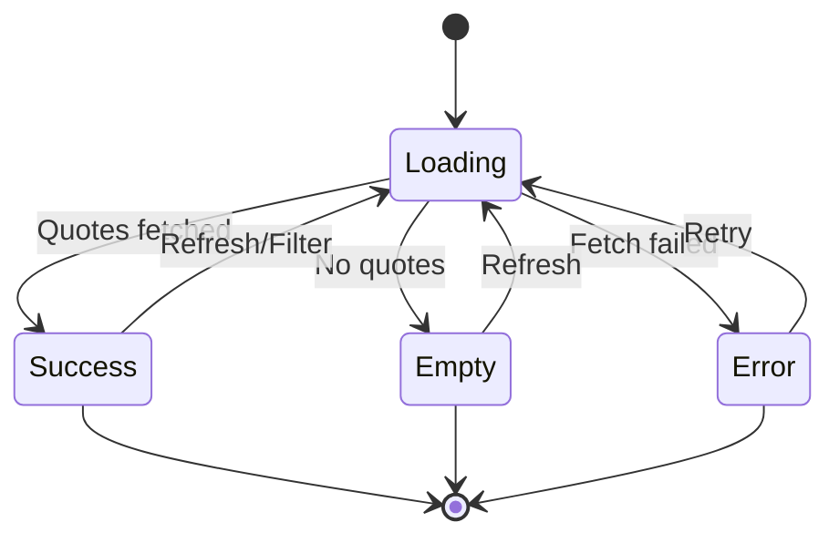

# Epic 7: Quote Comparison & Selection
**Author/Owner**: Business Systems Analyst (BSA)
**Module**: Startup Partner O2O
**Date**: 2026-03-26
**Status**: ⚪ Draft

## Change Log

| Version | Date | Author | Changes |
|---------|------|--------|---------|
| 1.0 | 2026-03-26 | BSA | Initial draft |

**Status:** ⚪ Draft / 🟡 In Review / 🟢 Final

> **💡 When updating:** Change Status to 🟢 Final / Approved ONLY AFTER explicit approval.

**PRD Reference:** `docs/modules/startup-partner-o2o/startup-partner-o2o prd.md` (Status: 🟢 Final / Approved v1.5)
**BRD Reference:** `docs/modules/startup-partner-o2o/brd.md`
**Maps to:** FR-025, FR-026, FR-027, FR-071, FR-072, FR-073, FR-074, FR-075

---

### 1. Epic Information

| Field | Value |
|-------|-------|
| **Epic ID** | EPIC-07 |
| **Epic Name** | Quote Comparison & Selection |
| **Epic Description** | Enable SPs to view and compare quotes from multiple stores side-by-side and select best combination for buyer |
| **Business Objective** | SPs can compare quotes in under 2 minutes; quote comparison is clear and accurate; SPs can select optimal combination; SPs can access quotes through RFQ context or centralized dashboard |
| **Target Release** | TBD |
| **Epic Owner** | TBD |
| **Epic Status** | Backlog |
| **Priority** | P1 |
| **Estimated Story Points** | TBD |

#### Epic User Story
As a Startup Partner, I want to view and compare quotes from multiple stores side-by-side and select the best combination, so that I can provide the most competitive offer to my buyer.

#### Epic Scope
**In Scope:**
- Quote display (Offer Hub)
- Side-by-side comparison
- Quote selection
- Multi-seller combination
- Quote validity tracking
- Individual quote detail view
- Centralized quote management dashboard
- Quote filtering/sorting
- Cross-RFQ quote tracking

**Out of Scope:**
- Automated quote ranking
- Price negotiation automation
- Quote analytics

#### Related Epics
| Epic ID | Epic Name | Relationship |
|---------|-----------|--------------|
| EPIC-06 | RFQ Creation & Management | Depends on |
| EPIC-08 | In-App SP-to-Seller Communication | Related |
| EPIC-09 | Magic Link Offer Generation | Blocks |

#### Epic Success Criteria
- [ ] SPs can compare quotes in under 2 minutes
- [ ] Quote comparison is clear and accurate
- [ ] SPs can select optimal combination
- [ ] SPs can access quotes through RFQ context or centralized dashboard

---

### 2. User Stories

> Each user story follows the BRD structure: US → AC (Given/When/Then) → BR → Validation → Edge Cases → Error Handling → State Behavior. ID scheme: `US-11`, `US-11A`, `US-11B` (scoped to this epic).

#### US-11: SP View and Compare Quotes Side-by-Side
**As a** Startup Partner, **I want to** view all received quotes side-by-side in a comparison table (Offer Hub), **so that** I can easily identify the best prices and terms for my buyer.

**Preconditions:**
- SP has submitted RFQ
- Stores have submitted quotes to RFQ
- Quotes are within validity period

**Business Rules:**
| Rule ID | Rule Description | Priority |
|---------|------------------|----------|
| BR-062 | Quotes displayed in side-by-side comparison table (Offer Hub) showing all quotes simultaneously | P0 |
| BR-063 | Comparison shows: Store name, product prices, total per store, delivery terms, payment terms | P0 |
| BR-064 | SP can sort quotes by: Total price, Store name, Quote date | P1 |
| BR-065 | Quote validity period is set by seller (displayed in quote) | P0 |
| BR-066 | Expired quotes are marked but remain visible for reference | P1 |
| BR-067 | Display up to 10 quotes simultaneously (responsive layout adapts for mobile/desktop) | P0 |
| BR-288 | Quote must display the date and time the store can deliver | P0 |
| BR-289 | Quote must indicate whether delivery price includes unloading (ค่ายกสินค้าลง) or not | P1 |
| BR-290 | Store can specify in QT whether buyer can purchase individual items or must buy the entire QT as a whole | P1 |
| BR-291 | AI analyzes all received QTs and suggests the optimal combination considering price, delivery terms, and availability | P1 |
| BR-292 | Total price display must separate: product cost (ค่าสินค้า), delivery cost (ค่าจัดส่ง), tax (ภาษี), and other fees | P0 |
| BR-293 | RFQ view must support buyer-centric grouping — group all RFQs by buyer across time | P1 |

**Validation Rules:**
| Field | Validation Rule | Error Message |
|-------|-----------------|---------------|
| N/A | N/A | N/A |

**Acceptance Criteria:**
| # | Given | When | Then |
|---|-------|------|------|
| AC-43 | SP has RFQ with received quotes | SP clicks "เปรียบเทียบใบเสนอราคา" | System displays Offer Hub with all quotes in side-by-side comparison table |
| AC-44 | SP views comparison table | SP sees all quote details | System displays store names, product-by-product pricing, totals, delivery terms, payment terms |
| AC-45 | SP wants to sort quotes | SP clicks column header to sort | System re-orders quotes by selected criterion |
| AC-46 | Quote validity expires | System checks quote validity | System marks expired quotes with "หมดอายุ" badge but keeps visible |

**Edge Cases (minimum 3):**
| # | Scenario | Expected Behavior |
|---|----------|-------------------|
| EC-36 | Only 1 store submits quote | Display single quote with message "รอใบเสนอราคาจากร้านค้าอื่น" |
| EC-37 | Stores quote different product sets (partial quotes) | Display all quotes; mark missing products as "ไม่มีสินค้า" |
| EC-38 | Quote prices vary significantly (outliers) | Highlight best price per product in green; no automatic filtering |

**Error Handling:**
| Error | Trigger | User Feedback | Recovery |
|-------|---------|---------------|----------|
| Quote load failure | Server error | ไม่สามารถโหลดใบเสนอราคาได้ กรุณาลองใหม่ | Retry button |

**State Behavior:**
| State | When | UI Requirements |
|-------|------|-----------------|
| Loading | Fetching quotes | Show loading spinner |
| Empty | No quotes received yet | Display "ยังไม่มีใบเสนอราคา กรุณารอร้านค้าตอบกลับ" |
| Success | Quotes loaded | Display comparison table with all quotes |
| Error | Fetch fails | Show error message with retry option |

#### US-11A: SP View Quote Details for Individual Store
**As a** Startup Partner, **I want to** view detailed information for a single store's quote from my RFQ, **so that** I can review complete quote details before making decisions.

**Preconditions:**
- SP has submitted RFQ
- Store has submitted quote to RFQ
- SP is viewing RFQ detail page

**Business Rules:**
| Rule ID | Rule Description | Priority |
|---------|------------------|----------|
| BR-074 | Quote detail shows complete store quote information (products, pricing, terms, validity) | P0 |
| BR-075 | Quote detail accessible from RFQ quote list | P0 |
| BR-076 | Quote detail shows quote status (Active, Expired, Accepted, Rejected) | P0 |

**Validation Rules:**
| Field | Validation Rule | Error Message |
|-------|-----------------|---------------|
| N/A | N/A | N/A |

**Acceptance Criteria:**
| # | Given | When | Then |
|---|-------|------|------|
| AC-47 | SP viewing RFQ with quotes | SP clicks individual quote in quote list | System displays quote detail modal/page with complete information |
| AC-48 | Quote detail displayed | SP reviews quote | System shows store name, contact, all products with pricing, delivery terms, payment terms, validity period, quote status |
| AC-49 | SP in quote detail view | SP wants to compare or return | System provides "เปรียบเทียบทั้งหมด" button to open Offer Hub and "กลับ" button to return to RFQ |

**Edge Cases (minimum 3):**
| # | Scenario | Expected Behavior |
|---|----------|-------------------|
| EC-39 | Quote expired | Display "หมดอายุ" badge with expiration date; disable selection actions |
| EC-40 | Partial quote (missing products) | Highlight missing products with "ไม่มีสินค้า" indicator; show available products only |
| EC-41 | Quote modified by store | Show modification history with timestamp and "แก้ไขล่าสุด" indicator |

**Error Handling:**
| Error | Trigger | User Feedback | Recovery |
|-------|---------|---------------|----------|
| Quote load failure | Server error | ไม่สามารถโหลดรายละเอียดใบเสนอราคาได้ กรุณาลองใหม่ | Retry button |

**State Behavior:**
| State | When | UI Requirements |
|-------|------|-----------------|
| Loading | Fetching quote details | Show loading spinner with "กำลังโหลด..." |
| Success | Quote loaded | Display complete quote information |
| Error | Fetch fails | Show error message with retry option |

#### US-11B: SP Access Quote Management Dashboard
**As a** Startup Partner, **I want to** view and manage all quotes across all my RFQs in a centralized dashboard, **so that** I can efficiently track quote status and respond to opportunities.

**Preconditions:**
- SP is logged in to SP Portal
- SP has submitted at least one RFQ

**Business Rules:**
| Rule ID | Rule Description | Priority |
|---------|------------------|----------|
| BR-077 | Quote dashboard displays all quotes from all RFQs | P0 |
| BR-078 | Quotes filterable by: Status (All, Pending, Received, Expired), RFQ, Store, Date range | P1 |
| BR-079 | Quotes sortable by: Date (newest/oldest), Price (low/high), Store name, RFQ | P1 |
| BR-080 | Each quote entry shows: RFQ reference, Store name, Total price, Status, Validity, Action buttons | P0 |

**Validation Rules:**
| Field | Validation Rule | Error Message |
|-------|-----------------|---------------|
| Date Range Filter | Start date must be before end date | กรุณาเลือกวันที่เริ่มต้นก่อนวันที่สิ้นสุด |

**Acceptance Criteria:**
| # | Given | When | Then |
|---|-------|------|------|
| AC-50 | SP logged in with RFQs | SP clicks "ใบเสนอราคา" menu | System displays quote dashboard with all quotes from all RFQs |
| AC-51 | SP viewing quote dashboard | SP applies filters (status, RFQ, store, date) | System updates quote list based on selected filters |
| AC-52 | SP viewing filtered quotes | SP clicks quote entry | System opens quote detail view (US-11A) |
| AC-53 | Quote dashboard displayed | SP views summary | Dashboard shows quote counts by status (Pending: 5, Received: 12, Expired: 3) |

**Edge Cases (minimum 3):**
| # | Scenario | Expected Behavior |
|---|----------|-------------------|
| EC-42 | No quotes yet (new SP) | Display empty state "ยังไม่มีใบเสนอราคา กรุณาสร้าง RFQ เพื่อรับใบเสนอราคา" with "สร้าง RFQ" button |
| EC-43 | All quotes expired | Show message "ใบเสนอราคาทั้งหมดหมดอายุแล้ว" with filter to view expired quotes |
| EC-44 | Large number of quotes (100+) | Implement pagination (20 quotes per page) with page navigation |

**Error Handling:**
| Error | Trigger | User Feedback | Recovery |
|-------|---------|---------------|----------|
| Dashboard load failure | Server error | ไม่สามารถโหลดรายการใบเสนอราคาได้ กรุณาลองใหม่ | Retry button |
| Filter application failure | Invalid filter params | ไม่สามารถกรองข้อมูลได้ กรุณาลองใหม่ | Reset filters |

**State Behavior:**
| State | When | UI Requirements |
|-------|------|-----------------|
| Loading | Fetching quotes | Show loading spinner with "กำลังโหลดใบเสนอราคา..." |
| Empty | No quotes exist | Display empty state with call-to-action |
| Success | Quotes loaded | Display quote list with filters and summary counts |
| Error | Fetch fails | Show error message with retry option |

---

### 3. Description

**Business Context:**
- **Problem Statement:** SPs need an efficient way to compare quotes from multiple stores to identify the best combination of price, delivery terms, and availability for their buyers.
- **Current State:** Without a structured comparison tool, SPs must manually review individual quotes, making it time-consuming and error-prone to identify optimal combinations.
- **Desired State:** SPs can view all quotes side-by-side in an Offer Hub, access individual quote details, and manage all quotes from a centralized dashboard with filtering and sorting.
- **Business Value:** Reduces quote comparison time to under 2 minutes, improves decision accuracy, and enables SPs to serve buyers more effectively with optimal price-delivery combinations.

---

### 4. Prerequisites

| Prerequisite | Description | Status |
|--------------|-------------|--------|
| EPIC-06 | RFQ Creation & Management must be functional | [ ] |
| Seller Quotes | Stores must be able to submit quotes to RFQs | [ ] |
| SP Authentication | SP must be authenticated via SSO (EPIC-01) | [ ] |

**Dependencies:**
- EPIC-06: RFQ Creation & Management (quotes are responses to RFQs)
- EPIC-01: SSO & Unified Authentication (SP login)
- Seller Portal: Stores must have ability to submit quotes

---

### 5. Terminology

| Term | Definition |
|------|------------|
| Offer Hub | Side-by-side quote comparison interface for SPs |
| RFQ | Request for Quotation — a formal request sent by SP to stores |
| QT | Quotation — a store's response to an RFQ with pricing and terms |
| Quote Validity | Time period during which a quote remains active and selectable |
| Partial Quote | A quote that does not cover all products in the RFQ |

---

### 6. Role and Permission Matrix

| Role | Permission | Access Level |
|------|------------|--------------|
| Startup Partner (SP) | quote:view | Read |
| Startup Partner (SP) | quote:compare | Read |
| Startup Partner (SP) | quote:select | Write |
| Startup Partner (SP) | quote:dashboard | Read |
| SP Leader | quote:view (team) | Read |

**Permission Definitions:**
- `quote:view` - View individual quote details
- `quote:compare` - Access Offer Hub comparison view
- `quote:select` - Select quotes for Magic Link generation
- `quote:dashboard` - Access centralized quote management dashboard

---

### 7. Information in the List

| Field Name | Format | Example | No Value | Condition |
|------------|--------|---------|----------|-----------|
| Store Name | Text | "ร้านวัสดุก่อสร้าง ABC" | — | Always displayed |
| Product Prices | Currency (THB) | "฿1,250.00" | "ไม่มีสินค้า" | Per product line |
| Total Price | Currency (THB) | "฿45,000.00" | — | Sum of all products |
| Product Cost | Currency (THB) | "฿40,000.00" | — | Separated from total (BR-292) |
| Delivery Cost | Currency (THB) | "฿3,000.00" | — | Separated from total (BR-292) |
| Tax | Currency (THB) | "฿2,000.00" | — | Separated from total (BR-292) |
| Delivery Date/Time | DateTime | "2026-04-01 10:00" | — | BR-288 |
| Unloading Included | Boolean | "รวมค่ายกสินค้าลง" / "ไม่รวม" | — | BR-289 |
| Partial Purchase Allowed | Boolean | "ซื้อแยกรายการได้" / "ต้องซื้อทั้ง QT" | — | BR-290 |
| Delivery Terms | Text | "จัดส่งภายใน 3 วัน" | — | Always displayed |
| Payment Terms | Text | "เครดิต 30 วัน" | — | Always displayed |
| Quote Status | Badge | "Active" / "หมดอายุ" | — | Always displayed |
| Quote Validity | Date | "2026-04-15" | — | Set by seller (BR-065) |
| RFQ Reference | Text | "RFQ-2026-0001" | — | Dashboard view (BR-080) |

**Display Rules:**
- Expired quotes are marked with "หมดอายุ" badge but remain visible (BR-066)
- Best price per product highlighted in green (EC-38)
- Missing products marked as "ไม่มีสินค้า" (EC-37)
- Up to 10 quotes displayed simultaneously with responsive layout (BR-067)
- Total price must separate: product cost, delivery cost, tax, and other fees (BR-292)

---

### 8. Requirements

#### 8.1 General Information

| Field | Value |
|-------|-------|
| **Story Type** | New feature |
| **Application** | SP Portal |
| **Module** | Startup Partner O2O |
| **Pages** | /sp/rfq/:rfqId/compare, /sp/quotes, /sp/rfq/:rfqId/quote/:quoteId |
| **Priority** | P1 |
| **Complexity** | High |

#### 8.2 Happy Path

1. SP logs in and navigates to RFQ with received quotes
2. SP clicks "เปรียบเทียบใบเสนอราคา" to open Offer Hub
3. System displays all quotes in side-by-side comparison table with store names, pricing, delivery terms, payment terms
4. SP sorts quotes by total price to find cheapest option
5. SP clicks individual quote to view full details (US-11A)
6. SP returns to Offer Hub and selects optimal combination
7. Alternatively, SP navigates to "ใบเสนอราคา" menu for centralized dashboard (US-11B)
8. SP filters quotes by status/RFQ/store/date and reviews across all RFQs

#### 8.3 Allowed Roles

- Startup Partner (SP)
- SP Leader (view team quotes)

#### 8.4 Business Rules

| Rule ID | Rule Description | Priority |
|---------|------------------|----------|
| BR-062 | Quotes displayed in side-by-side comparison table (Offer Hub) showing all quotes simultaneously | P0 |
| BR-063 | Comparison shows: Store name, product prices, total per store, delivery terms, payment terms | P0 |
| BR-064 | SP can sort quotes by: Total price, Store name, Quote date | P1 |
| BR-065 | Quote validity period is set by seller (displayed in quote) | P0 |
| BR-066 | Expired quotes are marked but remain visible for reference | P1 |
| BR-067 | Display up to 10 quotes simultaneously (responsive layout adapts for mobile/desktop) | P0 |
| BR-074 | Quote detail shows complete store quote information (products, pricing, terms, validity) | P0 |
| BR-075 | Quote detail accessible from RFQ quote list | P0 |
| BR-076 | Quote detail shows quote status (Active, Expired, Accepted, Rejected) | P0 |
| BR-077 | Quote dashboard displays all quotes from all RFQs | P0 |
| BR-078 | Quotes filterable by: Status (All, Pending, Received, Expired), RFQ, Store, Date range | P1 |
| BR-079 | Quotes sortable by: Date (newest/oldest), Price (low/high), Store name, RFQ | P1 |
| BR-080 | Each quote entry shows: RFQ reference, Store name, Total price, Status, Validity, Action buttons | P0 |
| BR-288 | Quote must display the date and time the store can deliver | P0 |
| BR-289 | Quote must indicate whether delivery price includes unloading (ค่ายกสินค้าลง) or not | P1 |
| BR-290 | Store can specify in QT whether buyer can purchase individual items or must buy the entire QT as a whole | P1 |
| BR-291 | AI analyzes all received QTs and suggests the optimal combination considering price, delivery terms, and availability | P1 |
| BR-292 | Total price display must separate: product cost (ค่าสินค้า), delivery cost (ค่าจัดส่ง), tax (ภาษี), and other fees | P0 |
| BR-293 | RFQ view must support buyer-centric grouping — group all RFQs by buyer across time | P1 |

#### 8.5 Validation Rules

| Field | Validation Rule | Error Message |
|-------|-----------------|---------------|
| Date Range Filter | Start date must be before end date | กรุณาเลือกวันที่เริ่มต้นก่อนวันที่สิ้นสุด |

---

### 9. Acceptance Criteria

> All acceptance criteria use **Given/When/Then** format. Cover all 6 scenario categories below.

#### 9.1 View Mode Scenarios

**Scenario: Empty State (No Quotes)**

**Given** SP has submitted an RFQ but no stores have responded
**When** SP opens the Offer Hub
**Then** System displays "ยังไม่มีใบเสนอราคา กรุณารอร้านค้าตอบกลับ"

**Scenario: Empty State (New SP on Dashboard)**

**Given** SP has no quotes yet (new SP)
**When** SP navigates to quote dashboard
**Then** System displays "ยังไม่มีใบเสนอราคา กรุณาสร้าง RFQ เพื่อรับใบเสนอราคา" with "สร้าง RFQ" button

**Scenario: Loading State**

**Given** SP navigates to Offer Hub or quote dashboard
**When** System is fetching quotes
**Then** System shows loading spinner (Offer Hub) or "กำลังโหลดใบเสนอราคา..." (dashboard)

**Scenario: Success State (Offer Hub)**

**Given** SP has RFQ with received quotes
**When** SP clicks "เปรียบเทียบใบเสนอราคา"
**Then** System displays Offer Hub with all quotes in side-by-side comparison table showing store names, product-by-product pricing, totals, delivery terms, payment terms

**Scenario: Success State (Quote Detail)**

**Given** SP is viewing RFQ with quotes
**When** SP clicks individual quote in quote list
**Then** System displays quote detail modal/page with store name, contact, all products with pricing, delivery terms, payment terms, validity period, quote status

**Scenario: Success State (Dashboard)**

**Given** SP logged in with RFQs
**When** SP clicks "ใบเสนอราคา" menu
**Then** System displays quote dashboard with all quotes from all RFQs and summary counts by status

**Scenario: Error State**

**Given** SP navigates to Offer Hub, quote detail, or dashboard
**When** Server returns an error
**Then** System displays appropriate error message with retry button

#### 9.2 Action Mode Scenarios

**Scenario: Sort Quotes**

**Given** SP views comparison table in Offer Hub
**When** SP clicks column header to sort
**Then** System re-orders quotes by selected criterion (Total price, Store name, Quote date)

**Scenario: Filter Quotes on Dashboard**

**Given** SP viewing quote dashboard
**When** SP applies filters (status, RFQ, store, date)
**Then** System updates quote list based on selected filters

**Scenario: Navigate to Quote Detail from Dashboard**

**Given** SP viewing filtered quotes on dashboard
**When** SP clicks quote entry
**Then** System opens quote detail view (US-11A)

**Scenario: Navigate from Quote Detail to Offer Hub**

**Given** SP in quote detail view
**When** SP clicks "เปรียบเทียบทั้งหมด" button
**Then** System opens Offer Hub with all quotes for that RFQ

#### 9.3 Race Condition Scenarios

**Scenario: Quote Expires During Comparison**

**Given** SP is viewing Offer Hub with active quotes
**When** A quote's validity period expires while SP is viewing
**Then** System marks the expired quote with "หมดอายุ" badge; quote remains visible but selection may be disabled

**Scenario: Store Modifies Quote During Viewing**

**Given** SP is viewing a quote detail
**When** Store modifies the quote
**Then** System shows modification history with timestamp and "แก้ไขล่าสุด" indicator on next refresh

#### 9.4 Loading State Scenarios (Action Mode)

**Scenario: Loading during filter application**

**Given** SP applies filters on quote dashboard
**When** System is processing filter request
**Then** System shows loading indicator; filter controls remain visible but results area shows spinner

#### 9.5 Field Validation Scenarios

**Scenario: Invalid date range filter**

**Given** SP is on quote dashboard
**When** SP selects start date after end date in date range filter
**Then** System displays "กรุณาเลือกวันที่เริ่มต้นก่อนวันที่สิ้นสุด" and blocks filter application

#### 9.6 Edge Cases

**Scenario: Single Quote Received**

**Given** Only 1 store submits quote to RFQ
**When** SP opens Offer Hub
**Then** System displays single quote with message "รอใบเสนอราคาจากร้านค้าอื่น"

**Scenario: Partial Quotes (Different Product Sets)**

**Given** Stores quote different product sets
**When** SP views Offer Hub
**Then** System displays all quotes; marks missing products as "ไม่มีสินค้า"

**Scenario: Significant Price Variation (Outliers)**

**Given** Quote prices vary significantly across stores
**When** SP views Offer Hub
**Then** System highlights best price per product in green; no automatic filtering

**Scenario: All Quotes Expired**

**Given** All quotes on dashboard have expired
**When** SP views quote dashboard
**Then** System shows message "ใบเสนอราคาทั้งหมดหมดอายุแล้ว" with filter to view expired quotes

**Scenario: Large Number of Quotes (100+)**

**Given** SP has more than 100 quotes across RFQs
**When** SP views quote dashboard
**Then** System implements pagination (20 quotes per page) with page navigation

---

### 10. Risk Assessment

| Risk ID | Risk Description | Category | Probability | Impact | Risk Level | Mitigation Strategy | Owner | Status |
|---------|------------------|----------|-------------|--------|------------|---------------------|-------|--------|
| R-001 | Slow quote loading with 10 simultaneous quotes on mobile devices | Technical | M | M | Medium | Implement lazy loading and responsive layout optimization | Tech Lead | Open |
| R-002 | AI recommendation engine (BR-291) provides inaccurate combinations | Technical | M | H | High | Implement confidence score display; allow SP to override AI suggestions | Tech Lead | Open |
| R-003 | Quote data becomes stale during comparison (expired/modified) | Operational | M | M | Medium | Implement real-time quote status polling or WebSocket updates | Tech Lead | Open |
| R-004 | Misalignment between quote comparison and actual checkout pricing | Financial | L | H | Medium | Ensure quote prices are locked at selection time; display price-lock timestamp | BSA | Open |
| R-005 | Non-compliance with price display regulations (tax separation) | Compliance | L | H | Medium | Enforce BR-292 price breakdown in all views; regular compliance review | BSA | Open |

#### Risk Summary
- **Total Risks:** 5
- **Critical Risks:** 0
- **High Risks:** 1
- **Medium Risks:** 4
- **Low Risks:** 0

---

### 11. Data Dictionary

#### Entity: Quote

| Attribute Name | Data Type | Length | Required | Unique | Default Value | Description |
|----------------|-----------|--------|----------|--------|---------------|-------------|
| quoteId | UUID | 36 | Yes | Yes | Auto-generated | Unique quote identifier |
| rfqId | UUID | 36 | Yes | No | — | Reference to parent RFQ |
| storeId | UUID | 36 | Yes | No | — | Store that submitted the quote |
| storeName | String | 255 | Yes | No | — | Display name of the store |
| totalPrice | Decimal | 12,2 | Yes | No | — | Total quote amount |
| productCost | Decimal | 12,2 | Yes | No | — | Product cost subtotal |
| deliveryCost | Decimal | 12,2 | Yes | No | — | Delivery cost |
| tax | Decimal | 12,2 | Yes | No | — | Tax amount |
| otherFees | Decimal | 12,2 | No | No | 0.00 | Other fees |
| deliveryDateTime | DateTime | — | Yes | No | — | Promised delivery date/time |
| unloadingIncluded | Boolean | — | Yes | No | false | Whether delivery includes unloading |
| partialPurchaseAllowed | Boolean | — | Yes | No | true | Whether individual items can be purchased |
| deliveryTerms | String | 500 | No | No | — | Delivery terms description |
| paymentTerms | String | 500 | No | No | — | Payment terms description |
| status | Enum | — | Yes | No | Active | Quote status (Active, Expired, Accepted, Rejected) |
| validUntil | DateTime | — | Yes | No | — | Quote validity expiration |
| createdAt | DateTime | — | Yes | No | Auto-generated | Quote creation timestamp |
| updatedAt | DateTime | — | No | No | — | Last modification timestamp |

#### Relationships

| Related Entity | Relationship Type | Cardinality | Description |
|----------------|-------------------|-------------|-------------|
| RFQ | Many-to-One | N:1 | Multiple quotes belong to one RFQ |
| Store | Many-to-One | N:1 | Multiple quotes from one store (across RFQs) |
| QuoteLineItem | One-to-Many | 1:N | One quote has multiple product line items |

---

### 12. Audit Trail Requirements

| Action | Data to Capture | Retention Period |
|--------|-----------------|------------------|
| VIEW | User ID, Timestamp, Quote ID, RFQ ID, IP address | 1 year |
| COMPARE | User ID, Timestamp, RFQ ID, Quote IDs viewed, IP address | 1 year |
| SELECT | User ID, Timestamp, Quote ID, RFQ ID, Selection details, IP address | 3 years |
| FILTER | User ID, Timestamp, Filter parameters, IP address | 6 months |

---

### 13. Notes

- AI optimal combination recommendation (BR-291) is P1 and may be delivered in a later phase
- Quote validity is controlled by the seller; SP cannot extend quote validity
- Price breakdown (BR-292) is mandatory for all views (Offer Hub, detail, dashboard)
- Buyer-centric RFQ grouping (BR-293) applies to the dashboard view

**Questions for Tech Lead / Designer:**
- Q42: What is the maximum number of columns in the comparison table before horizontal scroll is needed?
- Q43: Should the AI recommendation (BR-291) appear as a separate section or integrated into the comparison table?
- Q44: How should the quote detail modal/page handle very long product lists (50+ items)?
- Q45: What is the refresh strategy for quote status updates (polling interval vs WebSocket)?
- Q46: Should the dashboard support saved filter presets?

---

### 14. Draft Technical Design

#### 14.1 API Endpoints

| Method | Endpoint | Description | Authentication |
|--------|----------|-------------|----------------|
| GET | /api/rfq/:rfqId/quotes | List all quotes for an RFQ (Offer Hub) | Required |
| GET | /api/rfq/:rfqId/quotes/:quoteId | Get individual quote detail | Required |
| GET | /api/quotes | List all quotes across RFQs (dashboard) | Required |
| GET | /api/quotes/summary | Get quote counts by status | Required |
| POST | /api/rfq/:rfqId/quotes/ai-recommendation | Get AI optimal combination | Required |

#### 14.2 Database Schema

```sql
-- quotes
CREATE TABLE quotes (
    quote_id UUID PRIMARY KEY DEFAULT gen_random_uuid(),
    rfq_id UUID NOT NULL,
    store_id UUID NOT NULL,
    store_name VARCHAR(255) NOT NULL,
    total_price DECIMAL(12,2) NOT NULL,
    product_cost DECIMAL(12,2) NOT NULL,
    delivery_cost DECIMAL(12,2) NOT NULL,
    tax DECIMAL(12,2) NOT NULL,
    other_fees DECIMAL(12,2) DEFAULT 0.00,
    delivery_date_time TIMESTAMP NOT NULL,
    unloading_included BOOLEAN NOT NULL DEFAULT false,
    partial_purchase_allowed BOOLEAN NOT NULL DEFAULT true,
    delivery_terms VARCHAR(500),
    payment_terms VARCHAR(500),
    status VARCHAR(20) NOT NULL DEFAULT 'Active',
    valid_until TIMESTAMP NOT NULL,
    created_at TIMESTAMP NOT NULL DEFAULT NOW(),
    updated_at TIMESTAMP,
    CONSTRAINT fk_rfq FOREIGN KEY (rfq_id) REFERENCES rfqs(rfq_id),
    CONSTRAINT fk_store FOREIGN KEY (store_id) REFERENCES stores(store_id)
);

-- quote_line_items
CREATE TABLE quote_line_items (
    line_item_id UUID PRIMARY KEY DEFAULT gen_random_uuid(),
    quote_id UUID NOT NULL,
    product_id UUID,
    product_name VARCHAR(255) NOT NULL,
    quantity DECIMAL(10,2) NOT NULL,
    unit VARCHAR(50) NOT NULL,
    unit_price DECIMAL(12,2) NOT NULL,
    total_price DECIMAL(12,2) NOT NULL,
    available BOOLEAN NOT NULL DEFAULT true,
    CONSTRAINT fk_quote FOREIGN KEY (quote_id) REFERENCES quotes(quote_id)
);
```

#### 14.3 State Management



#### 14.4 UI/UX Considerations

- Responsive layout: side-by-side on desktop, stacked cards on mobile
- Horizontal scroll for more than 4 quotes on desktop
- Sticky product name column for easy cross-store comparison
- Color coding: green for best price per product, red badge for expired quotes
- Price breakdown always visible (product cost, delivery cost, tax, other fees)
- AI recommendation section visually distinct (if enabled)

---

### 15. Testing Checklist

#### Pre-Testing
- [ ] All prerequisites are met (EPIC-06 RFQ functional)
- [ ] Test environment is set up with quote data
- [ ] Test data is prepared (multiple RFQs with multiple quotes per RFQ)
- [ ] Test accounts are created with SP and SP Leader roles

#### Functional Testing
- [ ] Offer Hub displays quotes side-by-side correctly (AC-43, AC-44)
- [ ] Sorting works for all criteria: Total price, Store name, Quote date (AC-45)
- [ ] Expired quotes marked with "หมดอายุ" badge (AC-46)
- [ ] Quote detail view shows all information (AC-47, AC-48)
- [ ] Navigation between detail and Offer Hub works (AC-49)
- [ ] Dashboard displays all quotes from all RFQs (AC-50)
- [ ] Dashboard filters work: Status, RFQ, Store, Date range (AC-51)
- [ ] Dashboard navigation to quote detail works (AC-52)
- [ ] Dashboard summary counts display correctly (AC-53)
- [ ] Price breakdown displays separately: product cost, delivery cost, tax, other fees (BR-292)
- [ ] Delivery date/time displayed (BR-288)
- [ ] Unloading indicator displayed (BR-289)
- [ ] Partial purchase indicator displayed (BR-290)
- [ ] Empty state displays correctly for all views
- [ ] Loading state displays correctly for all views
- [ ] Error states display correctly with retry options
- [ ] All edge cases handled (EC-36 through EC-44)

#### Security Testing
- [ ] Unauthorized access is blocked (non-SP users)
- [ ] SP can only view own quotes (not other SPs' quotes)
- [ ] Permission checks work correctly for SP Leader
- [ ] SQL injection is prevented
- [ ] XSS is prevented
- [ ] CSRF protection is in place

#### Performance Testing
- [ ] Offer Hub loads within acceptable time with 10 quotes
- [ ] Dashboard loads within acceptable time with 100+ quotes
- [ ] Pagination works correctly for large datasets
- [ ] API response time is acceptable

#### Cross-Browser Testing
- [ ] Chrome
- [ ] Firefox
- [ ] Safari
- [ ] Edge

#### Mobile Testing
- [ ] Responsive design works on mobile (stacked cards)
- [ ] Touch interactions work correctly
- [ ] Horizontal scroll works on comparison table

---

### 16. Approval

| Role | Name | Signature | Date |
|------|------|-----------|------|
| Product Owner | | | |
| Business Analyst | | | |
| Technical Lead | | | |
| QA Lead | | | |

---

**Document Version:** 1.0
**Last Updated:** 2026-03-26
**Author:** BSA
**Status:** Draft
