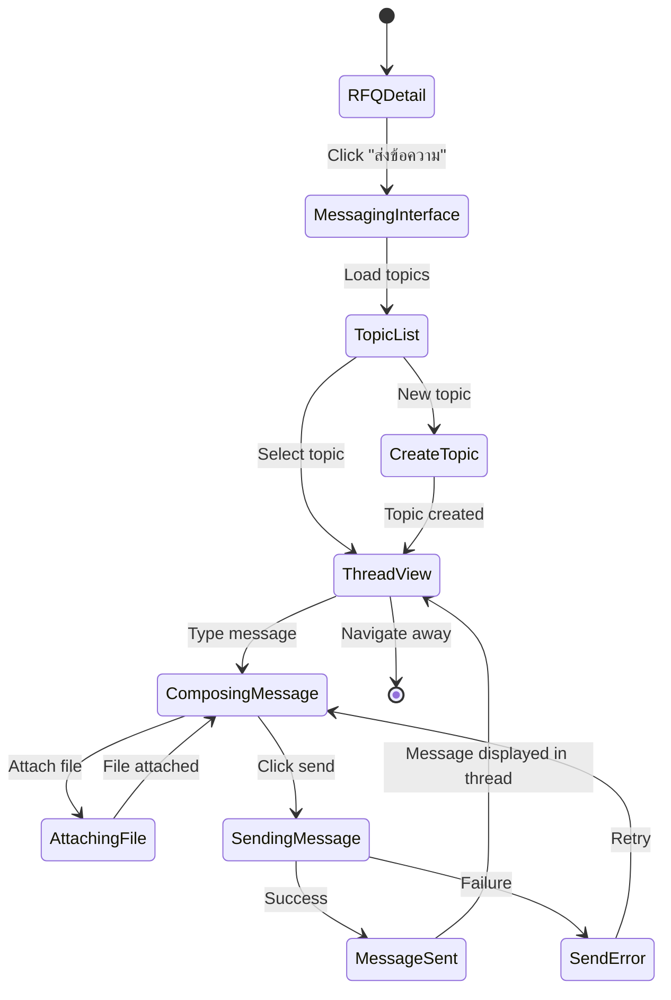

# Epic 8: In-App SP-to-Seller Communication
**Author/Owner**: Business Systems Analyst (BSA)
**Module**: Startup Partner O2O
**Date**: 2026-03-26
**Status**: ⚪ Draft

## Change Log

| Version | Date | Author | Changes |
|---------|------|--------|---------|
| 1.0 | 2026-03-26 | BSA | Initial draft extracted from BRD v2.0 |

**PRD Reference:** `docs/modules/startup-partner-o2o/startup-partner-o2o prd.md`
**BRD Reference:** `docs/modules/startup-partner-o2o/brd.md`
**Maps to:** FR-028, FR-029, FR-030, FR-084

---

### 1. Epic Information

| Field | Value |
|-------|-------|
| **Epic ID** | EPIC-08 |
| **Epic Name** | In-App SP-to-Seller Communication |
| **Epic Description** | Provide messaging system between SP and Store Sales rep for negotiation and clarification |
| **Business Objective** | Enable SPs and Store Sales reps to communicate via in-app messaging with topic-based threaded structure for pricing negotiation and product detail clarification |
| **Target Release** | TBD |
| **Epic Owner** | BSA |
| **Epic Status** | Backlog |
| **Priority** | P1 |
| **Estimated Story Points** | TBD |

#### Epic User Story
As a Startup Partner, I want to send messages to store sales reps to negotiate pricing and clarify product details, so that I can get the best deal for my buyer.

#### Epic Scope
**In Scope:**
- In-app messaging with topic-based threaded structure
- Message notifications
- Message history
- File attachments

**Out of Scope:**
- Video calls
- Voice calls
- Group chat
- Chatbot automation

#### Related Epics
| Epic ID | Epic Name | Relationship |
|---------|-----------|--------------|
| EPIC-04 | Seller Opt-In & Configuration | Depends on (store must be opted-in) |
| EPIC-06 | RFQ Creation & Management | Depends on (messaging is scoped to specific RFQ) |
| EPIC-07 | Quote Comparison & Selection | Related (messaging supports quote negotiation) |

#### Epic Success Criteria
- [ ] Messages delivered in under 3 seconds
- [ ] Message history persists
- [ ] Notifications delivered reliably
- [ ] Topics and threads organized clearly

---

### 2. User Stories

> Each user story follows the BRD structure: US -> AC (Given/When/Then) -> BR -> Validation -> Edge Cases -> Error Handling -> State Behavior. ID scheme: `US-12` (scoped to this epic).

#### US-12: SP Send Messages to Store Sales Rep
**As a** Startup Partner, **I want to** send messages to store sales reps to negotiate pricing and clarify product details, **so that** I can get the best deal for my buyer.

**Preconditions:**
- SP is logged in to SP Portal
- SP has active RFQ with store
- Store is opted-in to SP program

**Business Rules:**
| Rule ID | Rule Description | Priority |
|---------|------------------|----------|
| BR-068 | Messaging is scoped to specific RFQ (not general store chat) | P0 |
| BR-069 | Both SP and Store Sales rep can send messages | P0 |
| BR-070 | Messages support text (max 1000 chars) and file attachments (images, PDFs, max 10MB) | P0 |
| BR-071 | Message notifications sent via in-app and SMS | P0 |
| BR-072 | Message history persists for audit trail | P0 |
| BR-073 | Messages are timestamped and show read status | P1 |
| BR-168 | Chat must support topic creation | P0 |
| BR-169 | Chat must support threaded discussion under each topic | P0 |
| BR-170 | Users must be able to create a topic | P0 |
| BR-171 | Users must be able to reply within the thread of that topic | P0 |
| BR-172 | Message history must remain grouped under topic/thread context | P0 |

**Validation Rules:**
| Field | Validation Rule | Error Message |
|-------|-----------------|---------------|
| Message Text | Max 1000 characters | ข้อความต้องไม่เกิน 1000 ตัวอักษร |
| File Attachment | JPG/PNG/PDF, max 10MB | ไฟล์ต้องเป็น JPG, PNG หรือ PDF ขนาดไม่เกิน 10MB |

**Acceptance Criteria:**
| # | Given | When | Then |
|---|-------|------|------|
| AC-47 | SP is viewing RFQ detail | SP clicks "ส่งข้อความ" | System displays message input with text field and file upload |
| AC-48 | SP types message and clicks send | SP sends message | System delivers message to store, sends notification, displays in message thread |
| AC-49 | Store replies to message | Store sends message | SP receives in-app and SMS notification; message appears in thread |
| AC-50 | SP wants to attach file | SP clicks attach and selects file | System validates file, uploads, and includes in message |

**Edge Cases (minimum 3):**
| # | Scenario | Expected Behavior |
|---|----------|-------------------|
| EC-39 | SP sends message while store is offline | Message queued; delivered when store comes online; notification sent |
| EC-40 | File upload fails due to size | Display error "ไฟล์มีขนาดใหญ่เกินไป กรุณาเลือกไฟล์ขนาดไม่เกิน 10MB" |
| EC-41 | SP sends multiple messages rapidly | All messages delivered in order; no rate limiting for first 10 messages/minute |

**Error Handling:**
| Error | Trigger | User Feedback | Recovery |
|-------|---------|---------------|----------|
| Message send failure | Server error | ไม่สามารถส่งข้อความได้ กรุณาลองใหม่ | Retry button |
| File upload failure | Network error | การอัปโหลดไฟล์ล้มเหลว กรุณาลองใหม่ | Retry upload |

**State Behavior:**
| State | When | UI Requirements |
|-------|------|-----------------|
| Loading | Sending message | Show loading spinner on send button |
| Success | Message sent | Display message in thread with timestamp |
| Error | Send fails | Show error message with retry option |

---

### 3. Description

**Business Context:**
- **Problem Statement:** SPs need to negotiate pricing and clarify product details with store sales reps during the RFQ process, but currently have no in-app communication channel, forcing them to use external messaging apps which lack context and audit trail.
- **Current State:** Communication between SPs and store sales reps happens outside the platform (phone calls, LINE, etc.), making it difficult to track conversations, maintain context, and ensure audit compliance.
- **Desired State:** An in-app messaging system with topic-based threaded structure, scoped to specific RFQs, where SPs and store sales reps can exchange text messages and file attachments with full message history, read status, and notification delivery via in-app and SMS.
- **Business Value:** Keeps all negotiation and clarification within the platform for audit trail; reduces context switching for SPs and sellers; enables topic-based organization of discussions; improves deal closure speed through real-time communication.

---

### 4. Prerequisites

| Prerequisite | Description | Status |
|--------------|-------------|--------|
| SP Portal | SP Portal must be operational with authenticated SP access | [ ] |
| Seller Portal | Seller Portal must be operational with store sales rep access | [ ] |
| EPIC-06 RFQ Management | RFQ system must be operational (messaging is scoped to RFQs) | [ ] |
| Notification Service | In-app and SMS notification channels must be operational | [ ] |
| File Storage | Secure file storage service for message attachments | [ ] |

**Dependencies:**
- EPIC-04 Seller Opt-In & Configuration (store must be opted-in)
- EPIC-06 RFQ Creation & Management (messaging scoped to RFQ)
- Notification service (in-app, SMS)
- File storage service (attachments)
- SMS Gateway

---

### 5. Terminology

| Term | Definition |
|------|------------|
| Startup Partner (SP) | Freelance sales agent who bridges offline buyers with online marketplace |
| Store Sales Rep | Store's designated person who responds to SP inquiries and RFQs |
| Topic | Named subject/category within an RFQ message thread that organizes discussions |
| Thread | Sequence of messages under a specific topic within an RFQ conversation |
| Read Status | Indicator showing whether the recipient has read a message |
| RFQ-Scoped Messaging | Messages tied to a specific RFQ, not general store-to-SP communication |
| File Attachment | JPG, PNG, or PDF files (max 10MB) attached to messages |

---

### 6. Role and Permission Matrix

| Role | Permission | Access Level |
|------|------------|--------------|
| SP (Approved) | Send/receive messages on own RFQs | Read/Write |
| Store Sales Rep | Send/receive messages on RFQs directed to their store | Read/Write |
| Admin | View message history for dispute resolution | Read |

**Permission Definitions:**
- `message:send` - Send text messages and file attachments within RFQ scope
- `message:read` - Read messages in RFQ threads
- `message:view-history` - View full message history for audit
- `topic:create` - Create a new topic within an RFQ conversation
- `topic:reply` - Reply within a topic thread

---

### 7. Information in the List

| Field Name | Format | Example | No Value | Condition |
|------------|--------|---------|----------|-----------|
| Message Text | Text | สอบถามราคาท่อ PVC | N/A (required for text messages) | Max 1000 characters |
| Sender Name | Text | สมชาย (SP) / ร้านบางนา (Seller) | N/A (auto-populated) | From user profile |
| Timestamp | DateTime | 2026-03-26 14:30 | N/A (auto-generated) | System-generated |
| Read Status | Icon | Read / Unread | Unread | Updated when recipient views |
| File Attachment | File link | product_spec.pdf (2.5MB) | No attachment | JPG/PNG/PDF, max 10MB |
| Topic Name | Text | สอบถามราคา | N/A (required for topic) | Created by user |
| Thread Count | Number | 5 replies | 0 replies | Count of messages under topic |

**Display Rules:**
- Messages displayed in chronological order within topic threads
- Sender name and avatar displayed with each message
- Timestamp displayed in relative format (e.g., "5 นาทีที่แล้ว") for recent messages, absolute format for older messages
- Read status shown as double-check icon (read) or single-check icon (delivered)
- File attachments shown as clickable links with file type icon and size
- Topics listed with latest message preview and timestamp
- Unread message count shown as badge on topic

---

### 8. Requirements

#### 8.1 General Information

| Field | Value |
|-------|-------|
| **Story Type** | New feature |
| **Application** | SP Portal, Seller Portal |
| **Module** | Startup Partner O2O |
| **Pages** | `/sp/rfq/:id/messages`, `/seller/rfq/:id/messages` |
| **Priority** | P1 |
| **Complexity** | High |

#### 8.2 Happy Path

1. SP navigates to RFQ detail page
2. SP clicks "ส่งข้อความ" button
3. System displays messaging interface with topic list and message input
4. SP creates a new topic or selects existing topic
5. SP types message text (up to 1000 characters)
6. SP optionally attaches a file (JPG/PNG/PDF, max 10MB)
7. SP clicks send
8. System validates message and file attachment
9. System delivers message to store sales rep
10. System sends in-app and SMS notification to store sales rep
11. Message appears in thread with timestamp
12. Store sales rep opens notification and views message
13. System updates read status to "Read"
14. Store sales rep replies within the same topic thread
15. SP receives in-app and SMS notification of reply
16. SP views reply in the topic thread

#### 8.3 Allowed Roles

- SP (Approved)
- Store Sales Rep

#### 8.4 Business Rules (consolidated from all US)

| Rule ID | Rule Description | Priority |
|---------|------------------|----------|
| BR-068 | Messaging is scoped to specific RFQ (not general store chat) | P0 |
| BR-069 | Both SP and Store Sales rep can send messages | P0 |
| BR-070 | Messages support text (max 1000 chars) and file attachments (images, PDFs, max 10MB) | P0 |
| BR-071 | Message notifications sent via in-app and SMS | P0 |
| BR-072 | Message history persists for audit trail | P0 |
| BR-073 | Messages are timestamped and show read status | P1 |
| BR-168 | Chat must support topic creation | P0 |
| BR-169 | Chat must support threaded discussion under each topic | P0 |
| BR-170 | Users must be able to create a topic | P0 |
| BR-171 | Users must be able to reply within the thread of that topic | P0 |
| BR-172 | Message history must remain grouped under topic/thread context | P0 |

#### 8.5 Validation Rules (consolidated)

| Field | Validation Rule | Error Message |
|-------|-----------------|---------------|
| Message Text | Max 1000 characters | ข้อความต้องไม่เกิน 1000 ตัวอักษร |
| File Attachment | JPG/PNG/PDF, max 10MB | ไฟล์ต้องเป็น JPG, PNG หรือ PDF ขนาดไม่เกิน 10MB |

---

### 9. Acceptance Criteria (consolidated)

#### 9.1 View Mode Scenarios

**Scenario: Empty State**

**Given** SP has an active RFQ with a store but no messages have been exchanged
**When** SP opens the messaging interface
**Then** system displays empty state with prompt to start a conversation by creating a topic

**Scenario: Loading State**

**Given** SP opens messaging interface
**When** system is loading message history
**Then** system displays loading spinner

**Scenario: Success State**

**Given** messages exist for the RFQ
**When** SP views the messaging interface
**Then** system displays topics list with threaded messages, timestamps, and read status

**Scenario: Error States**

**Given** SP attempts to send a message
**When** server returns error
**Then** system displays "ไม่สามารถส่งข้อความได้ กรุณาลองใหม่" with retry button

**Given** SP attempts to upload a file
**When** network error occurs during upload
**Then** system displays "การอัปโหลดไฟล์ล้มเหลว กรุณาลองใหม่" with retry upload option

#### 9.2 Action Mode Scenarios

**Scenario: Open Messaging Interface (AC-47)**

**Given** SP is viewing RFQ detail
**When** SP clicks "ส่งข้อความ"
**Then** system displays message input with text field and file upload

**Scenario: Send Message Success (AC-48)**

**Given** SP types message and clicks send
**When** SP sends message
**Then** system delivers message to store, sends notification, displays in message thread

**Scenario: Receive Reply (AC-49)**

**Given** store replies to message
**When** store sends message
**Then** SP receives in-app and SMS notification; message appears in thread

**Scenario: Attach File (AC-50)**

**Given** SP wants to attach file
**When** SP clicks attach and selects file
**Then** system validates file, uploads, and includes in message

**Scenario: Create Topic**

**Given** SP is in the messaging interface
**When** SP creates a new topic with a name
**Then** system creates the topic and SP can post messages within it

**Scenario: Reply in Thread**

**Given** SP is viewing a topic
**When** SP types a reply and sends it
**Then** message appears under the topic thread in chronological order

#### 9.3 Race Condition Scenarios

**Scenario: Concurrent Messages from Both Parties**

**Given** SP and store sales rep are both composing messages simultaneously
**When** both send messages at the same time
**Then** both messages are delivered and displayed in correct chronological order in the thread

**Scenario: Message Sent While Recipient Goes Offline**

**Given** SP sends a message
**When** store sales rep goes offline during delivery
**Then** message is queued and delivered when store comes online; notification sent (EC-39)

#### 9.4 Loading State Scenarios (Action Mode)

**Scenario: Loading during message send**

**Given** SP has composed a message
**When** system is sending the message
**Then** send button shows loading spinner, message input is disabled until send completes

**Scenario: Loading during file upload**

**Given** SP has selected a file to attach
**When** system is uploading the file
**Then** upload progress indicator is shown, send button is disabled until upload completes

#### 9.5 Field Validation Scenarios

**Scenario: Message exceeds character limit**

**Given** SP is composing a message
**When** SP enters more than 1000 characters
**Then** validation error "ข้อความต้องไม่เกิน 1000 ตัวอักษร" is displayed and submission is blocked

**Scenario: Invalid file type**

**Given** SP wants to attach a file
**When** SP selects a file that is not JPG, PNG, or PDF
**Then** validation error "ไฟล์ต้องเป็น JPG, PNG หรือ PDF ขนาดไม่เกิน 10MB" is displayed and upload is blocked

**Scenario: File exceeds size limit**

**Given** SP wants to attach a file
**When** SP selects a file larger than 10MB
**Then** validation error "ไฟล์มีขนาดใหญ่เกินไป กรุณาเลือกไฟล์ขนาดไม่เกิน 10MB" is displayed and upload is blocked (EC-40)

#### 9.6 Edge Cases

**Scenario: Message to offline store (EC-39)**

**Given** SP sends a message
**When** store sales rep is offline
**Then** message is queued; delivered when store comes online; notification sent

**Scenario: File too large (EC-40)**

**Given** SP wants to attach a file
**When** file size exceeds 10MB
**Then** system displays "ไฟล์มีขนาดใหญ่เกินไป กรุณาเลือกไฟล์ขนาดไม่เกิน 10MB"

**Scenario: Rapid message sending (EC-41)**

**Given** SP sends multiple messages rapidly
**When** SP sends up to 10 messages per minute
**Then** all messages delivered in order; no rate limiting for first 10 messages/minute

---

### 10. Risk Assessment

| Risk ID | Risk Description | Category | Probability | Impact | Risk Level | Mitigation Strategy | Owner | Status |
|---------|------------------|----------|-------------|--------|------------|---------------------|-------|--------|
| R-001 | Message delivery delay exceeds 3-second SLA | Technical | M | M | Medium | Implement WebSocket for real-time delivery; fall back to polling; monitor delivery latency | Tech Lead | Open |
| R-002 | SMS notification delivery failure | Operational | M | M | Medium | Implement retry logic for SMS; fall back to in-app notification; log delivery failures | Tech Lead | Open |
| R-003 | File storage service downtime prevents attachments | Technical | L | M | Medium | Implement retry with exponential backoff; allow sending text-only messages when file storage is unavailable | Tech Lead | Open |
| R-004 | Message history data loss | Technical | L | H | High | Implement database replication; regular backups; message persistence verification | Tech Lead | Open |
| R-005 | Unauthorized message access (SP viewing another SP's messages) | Compliance | L | H | High | Strict RFQ-scoped access control; validate SP ownership of RFQ before displaying messages | Tech Lead | Open |
| R-006 | Malicious file upload (malware in attachments) | Technical | L | H | High | Implement file scanning; validate file types server-side; sandbox file preview | Tech Lead | Open |
| R-007 | Rapid message sending used for spam/abuse | Operational | L | M | Medium | Implement rate limiting (10 messages/minute); abuse detection and reporting | Tech Lead | Open |

#### Risk Summary
- **Total Risks:** 7
- **Critical Risks:** 0
- **High Risks:** 3
- **Medium Risks:** 4
- **Low Risks:** 0

---

### 11. Data Dictionary

#### Entity: Message Topic

| Attribute Name | Data Type | Length | Required | Unique | Default Value | Description |
|----------------|-----------|--------|----------|--------|---------------|-------------|
| id | UUID | - | Yes | Yes | auto-generated | Unique topic ID |
| rfqId | string | - | Yes | No | - | Reference to RFQ |
| topicName | string | 200 | Yes | No | - | Topic name/subject |
| createdBy | string | - | Yes | No | - | User ID who created the topic |
| createdAt | Date | - | Yes | No | NOW() | Topic creation timestamp |

#### Entity: Message

| Attribute Name | Data Type | Length | Required | Unique | Default Value | Description |
|----------------|-----------|--------|----------|--------|---------------|-------------|
| id | UUID | - | Yes | Yes | auto-generated | Unique message ID |
| topicId | string | - | Yes | No | - | Reference to topic |
| rfqId | string | - | Yes | No | - | Reference to RFQ |
| senderId | string | - | Yes | No | - | User ID of sender (SP or Store Sales Rep) |
| senderType | string | 20 | Yes | No | - | 'SP' or 'SELLER' |
| messageText | string | 1000 | No | No | - | Message content (required if no attachment) |
| attachments | Attachment[] | - | No | No | [] | File attachments |
| readAt | Date | - | No | No | null | Timestamp when recipient read the message |
| createdAt | Date | - | Yes | No | NOW() | Message send timestamp |

#### Entity: Attachment

| Attribute Name | Data Type | Length | Required | Unique | Default Value | Description |
|----------------|-----------|--------|----------|--------|---------------|-------------|
| id | UUID | - | Yes | Yes | auto-generated | Unique attachment ID |
| messageId | string | - | Yes | No | - | Reference to message |
| fileName | string | 255 | Yes | No | - | Original file name |
| fileType | string | 10 | Yes | No | - | File type (JPG, PNG, PDF) |
| fileSize | number | - | Yes | No | - | File size in bytes (max 10MB) |
| fileUrl | string | - | Yes | No | - | Secure storage URL |
| uploadedAt | Date | - | Yes | No | NOW() | Upload timestamp |

#### Relationships

| Related Entity | Relationship Type | Cardinality | Description |
|----------------|-------------------|-------------|-------------|
| RFQ | Many-to-One | N:1 | Messages are scoped to a specific RFQ |
| Topic | One-to-Many | 1:N | Each topic contains multiple messages (threads) |
| StartupPartner | Many-to-One | N:1 | SP sends/receives messages |
| Store | Many-to-One | N:1 | Store sales rep sends/receives messages |
| Attachment | One-to-Many | 1:N | Each message can have multiple attachments |

---

### 12. Audit Trail Requirements

| Action | Data to Capture | Retention Period |
|--------|-----------------|------------------|
| TOPIC_CREATE | User ID, Timestamp, RFQ ID, Topic name, IP address | 2 years |
| MESSAGE_SEND | User ID, Timestamp, RFQ ID, Topic ID, Message content, Attachment IDs, IP address | 2 years |
| MESSAGE_READ | User ID, Timestamp, Message ID, IP address | 1 year |
| FILE_UPLOAD | User ID, Timestamp, File name, File type, File size, IP address | 2 years |
| FILE_DOWNLOAD | User ID, Timestamp, File ID, IP address | 1 year |

---

### 13. Notes

- Messaging is scoped to specific RFQs (BR-068), not general store-to-SP communication. Each RFQ has its own message history.
- Chat must support topic creation (BR-168) and threaded discussion under each topic (BR-169). Users can create topics (BR-170) and reply within threads (BR-171). Message history must remain grouped under topic/thread context (BR-172).
- Both SP and Store Sales rep can send messages (BR-069). The interface should clearly identify the sender role.
- Messages support text (max 1000 chars) and file attachments (images, PDFs, max 10MB) per BR-070.
- Message notifications are sent via in-app and SMS (BR-071). SMS delivery failure should not block message delivery.
- Message history persists for audit trail (BR-072). Messages should never be deleted.
- No rate limiting for first 10 messages/minute (EC-41), but abuse detection should be considered.
- Messages sent to offline recipients are queued and delivered when they come online (EC-39).

### Questions for Tech Lead
- Should messaging use WebSocket for real-time delivery or polling?
- What is the expected message delivery latency SLA?
- How should file attachments be stored (S3, dedicated file service)?
- Should messages be encrypted at rest?
- How should read receipts be implemented (single read status vs. detailed tracking)?
- What is the maximum number of messages per RFQ?
- How should topic creation and threading be implemented at the database level?

### Questions for UX Designer
- What should the messaging interface layout look like (sidebar + chat area, full-page)?
- How should topics and threads be visually organized?
- How should file attachments be previewed (inline images, PDF preview)?
- What notification UI should be used (toast, badge, sound)?
- How should read status be displayed (checkmarks, "seen" text)?
- How should the topic list be sorted (by latest message, by creation date)?

---

### 14. Draft Technical Design

#### 14.1 API Endpoints

| Method | Endpoint | Description | Authentication |
|--------|----------|-------------|----------------|
| GET | /api/rfq/:rfqId/topics | List topics for an RFQ | Required |
| POST | /api/rfq/:rfqId/topics | Create a new topic | Required |
| GET | /api/rfq/:rfqId/topics/:topicId/messages | Get messages in a topic thread | Required |
| POST | /api/rfq/:rfqId/topics/:topicId/messages | Send a message in a topic | Required |
| POST | /api/rfq/:rfqId/topics/:topicId/messages/:messageId/read | Mark message as read | Required |
| POST | /api/rfq/:rfqId/messages/upload | Upload file attachment | Required |

#### 14.2 Database Schema

```sql
-- Message topics (scoped to RFQ)
CREATE TABLE message_topics (
    id UUID PRIMARY KEY DEFAULT gen_random_uuid(),
    rfq_id UUID NOT NULL,
    topic_name VARCHAR(200) NOT NULL,
    created_by VARCHAR(255) NOT NULL,
    created_at TIMESTAMP NOT NULL DEFAULT NOW(),
    CONSTRAINT fk_rfq FOREIGN KEY (rfq_id) REFERENCES rfqs(id)
);

-- Messages (threaded under topics)
CREATE TABLE messages (
    id UUID PRIMARY KEY DEFAULT gen_random_uuid(),
    topic_id UUID NOT NULL,
    rfq_id UUID NOT NULL,
    sender_id VARCHAR(255) NOT NULL,
    sender_type VARCHAR(20) NOT NULL CHECK (sender_type IN ('SP', 'SELLER')),
    message_text TEXT CHECK (char_length(message_text) <= 1000),
    read_at TIMESTAMP,
    created_at TIMESTAMP NOT NULL DEFAULT NOW(),
    CONSTRAINT fk_topic FOREIGN KEY (topic_id) REFERENCES message_topics(id),
    CONSTRAINT fk_rfq_msg FOREIGN KEY (rfq_id) REFERENCES rfqs(id)
);

-- Message attachments
CREATE TABLE message_attachments (
    id UUID PRIMARY KEY DEFAULT gen_random_uuid(),
    message_id UUID NOT NULL,
    file_name VARCHAR(255) NOT NULL,
    file_type VARCHAR(10) NOT NULL CHECK (file_type IN ('JPG', 'PNG', 'PDF')),
    file_size INTEGER NOT NULL CHECK (file_size <= 10485760), -- 10MB in bytes
    file_url TEXT NOT NULL,
    uploaded_at TIMESTAMP NOT NULL DEFAULT NOW(),
    CONSTRAINT fk_message FOREIGN KEY (message_id) REFERENCES messages(id)
);

-- Message notification log
CREATE TABLE message_notifications (
    id UUID PRIMARY KEY DEFAULT gen_random_uuid(),
    message_id UUID NOT NULL,
    recipient_id VARCHAR(255) NOT NULL,
    channel VARCHAR(20) NOT NULL CHECK (channel IN ('IN_APP', 'SMS')),
    status VARCHAR(20) NOT NULL DEFAULT 'PENDING', -- PENDING, SENT, DELIVERED, FAILED
    sent_at TIMESTAMP,
    delivered_at TIMESTAMP,
    created_at TIMESTAMP NOT NULL DEFAULT NOW(),
    CONSTRAINT fk_message_notif FOREIGN KEY (message_id) REFERENCES messages(id)
);
```

#### 14.3 State Diagram



#### 14.4 UI/UX Considerations

- Messaging interface accessible from RFQ detail page via "ส่งข้อความ" button
- Topic list panel showing all topics with latest message preview and timestamp
- Thread view showing messages in chronological order under selected topic
- Message bubbles with sender name, avatar, timestamp, and read status
- Text input field with character counter (max 1000)
- File attachment button with drag-and-drop support
- File type and size validation before upload
- Inline image preview for JPG/PNG attachments
- PDF shown as downloadable link with file icon
- Real-time message delivery with WebSocket (or polling fallback)
- Notification badges for unread messages
- Error messages must be in Thai language as specified in validation rules
- Mobile-responsive messaging interface

---

### 15. Testing Checklist

#### Pre-Testing
- [ ] SP Portal and Seller Portal are operational
- [ ] Test SP and Store Sales Rep accounts created
- [ ] Test RFQ created between SP and store
- [ ] Notification service (in-app, SMS) is configured
- [ ] File storage service is operational
- [ ] Test files prepared (JPG, PNG, PDF under 10MB; file over 10MB for validation)

#### Functional Testing
- [ ] SP can open messaging interface from RFQ detail (AC-47)
- [ ] SP can send text message successfully (AC-48)
- [ ] Store sales rep receives notification and can view message (AC-49)
- [ ] SP can attach and send file (AC-50)
- [ ] SP can create a new topic (BR-168, BR-170)
- [ ] Messages appear threaded under topics (BR-169, BR-171)
- [ ] Message history grouped under topic/thread context (BR-172)
- [ ] Both SP and Store Sales rep can send messages (BR-069)
- [ ] Messages display with timestamp and read status (BR-073)
- [ ] In-app and SMS notifications delivered (BR-071)
- [ ] Message history persists across sessions (BR-072)
- [ ] Message to offline store is queued and delivered (EC-39)
- [ ] File size validation prevents files over 10MB (EC-40)
- [ ] Rapid messaging delivers all messages in order (EC-41)
- [ ] Character limit enforced at 1000 characters
- [ ] Invalid file types rejected with error message
- [ ] Message send failure shows retry option
- [ ] File upload failure shows retry option

#### Security Testing
- [ ] SP can only access messages for their own RFQs
- [ ] Store sales rep can only access messages for their store's RFQs
- [ ] File attachments scanned for malware
- [ ] File type validation server-side (not just client-side)
- [ ] XSS prevention on message text
- [ ] CSRF protection on message send
- [ ] Unauthorized message access blocked

#### Performance Testing
- [ ] Messages delivered in under 3 seconds
- [ ] File upload completes in under 10 seconds for 10MB file
- [ ] Message history loads in under 2 seconds
- [ ] Concurrent messaging from multiple users handled correctly

#### Cross-Browser Testing
- [ ] Chrome
- [ ] Firefox
- [ ] Safari
- [ ] Edge

#### Mobile Testing
- [ ] Responsive messaging interface on mobile
- [ ] Touch interactions for send, attach, topic navigation
- [ ] File upload from mobile device camera/gallery

---

### 16. Approval

| Role | Name | Signature | Date |
|------|------|-----------|------|
| Product Owner | | | |
| Business Analyst | | | |
| Technical Lead | | | |
| QA Lead | | | |

---

**Document Version:** 1.0
**Last Updated:** 2026-03-26
**Author:** BSA
**Status:** Draft
