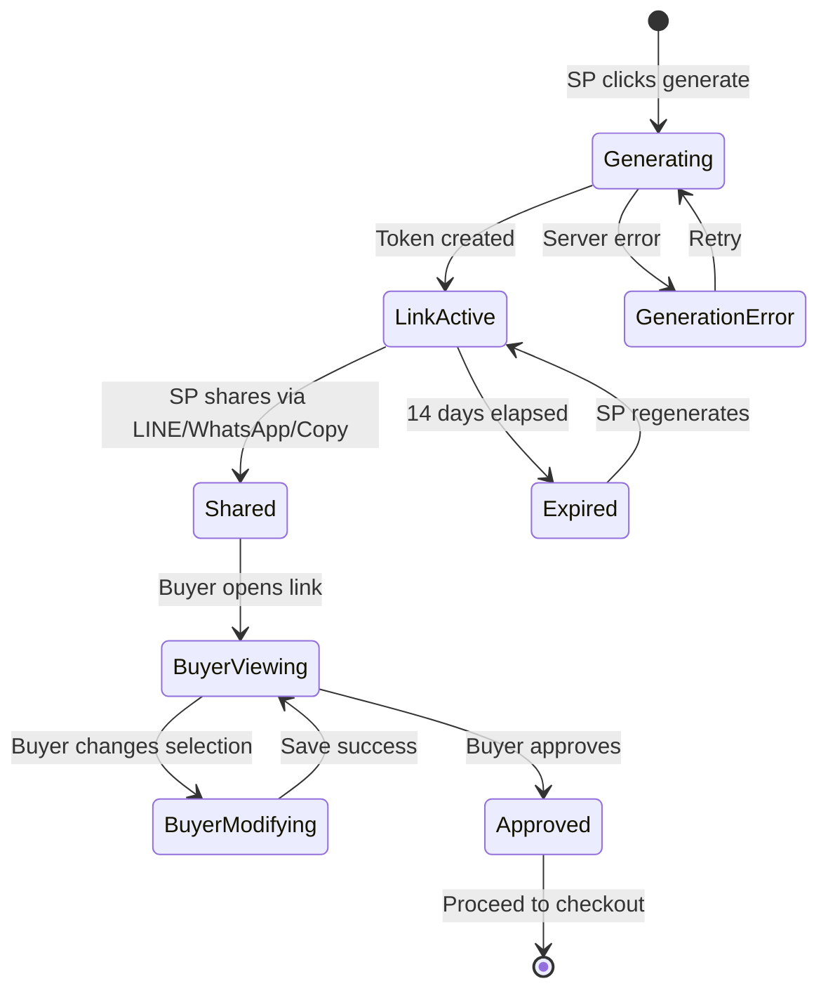

# Epic 9: Magic Link Offer Generation
**Author/Owner**: Business Systems Analyst (BSA)
**Module**: Startup Partner O2O
**Date**: 2026-03-26
**Status**: ⚪ Draft

## Change Log

| Version | Date | Author | Changes |
|---------|------|--------|---------|
| 1.0 | 2026-03-26 | BSA | Initial draft |

**Status:** ⚪ Draft / 🟡 In Review / 🟢 Final

> **💡 When updating:** Change Status to 🟢 Final / Approved ONLY AFTER explicit approval.

**PRD Reference:** `docs/modules/startup-partner-o2o/startup-partner-o2o prd.md` (provided by PO)
**BRD Reference:** `docs/modules/startup-partner-o2o/brd.md`
**Maps to:** FR-031, FR-032, FR-033, FR-034, FR-083

---

### 1. Epic Information

| Field | Value |
|-------|-------|
| **Epic ID** | EPIC-09 |
| **Epic Name** | Magic Link Offer Generation |
| **Epic Description** | Generate shareable web links (Magic Links) containing compared quotes for buyers to view and purchase |
| **Business Objective** | Enable SPs to share compared quotes with buyers via messaging apps (LINE, WhatsApp) through secure, time-limited links that support rich previews and buyer-side offer modification before approval |
| **Target Release** | TBD |
| **Epic Owner** | TBD |
| **Epic Status** | Backlog |
| **Priority** | P0 |
| **Estimated Story Points** | TBD |

#### Epic User Story
As a Startup Partner, I want to generate shareable Magic Links containing compared quotes, so that buyers can view offers and modify selections before approving and proceeding to checkout.

#### Epic Scope
**In Scope:**
- Link generation with secure tokens
- Link security (secure tokens that cannot be guessed or brute-forced)
- Link expiration (14 days)
- Buyer-side offer modification before approval
- Modification audit trail (lastModifiedBy, lastModifiedByName, lastModifiedAt)
- OGP metadata for rich previews
- Deep link support (LINE, WhatsApp)

**Out of Scope:**
- Custom link domains
- Link analytics
- Link password protection

#### Related Epics
| Epic ID | Epic Name | Relationship |
|---------|-----------|--------------|
| EPIC-07 | Quote Comparison & Selection | Depends on — SP must have compared quotes to generate link |
| EPIC-10 | Buyer O2O Checkout Flow | Blocks — Buyer checkout requires Magic Link to access Offer Hub |

#### Epic Success Criteria
- [ ] Links generated in under 2 seconds
- [ ] Links are secure and cannot be guessed
- [ ] Links work in all messaging apps (LINE, WhatsApp)
- [ ] Buyers can modify offer selection before approval
- [ ] Digital Quotation (approved via Magic Link) serves as legal source of truth

---

### 2. User Stories

> Each user story follows the BRD structure: US → AC (Given/When/Then) → BR → Validation → Edge Cases → Error Handling → State Behavior. ID scheme: `US-13`, `US-13A` (scoped to this epic).

#### US-13: SP Generate Magic Link for Buyer
**As a** Startup Partner, **I want to** generate a shareable Magic Link containing the compared quotes, **so that** I can send it to my buyer via LINE/WhatsApp for easy viewing and purchasing.

**Preconditions:**
- SP has received quotes from stores
- SP has selected quotes to share with buyer
- Quotes are within validity period

**Business Rules:**
| Rule ID | Rule Description | Priority |
|---------|------------------|----------|
| BR-074 | Magic Link contains secure token that cannot be guessed or brute-forced | P0 |
| BR-075 | Magic Link expires after 14 days from generation | P0 |
| BR-076 | Magic Link displays all selected quotes in Offer Hub format | P0 |
| BR-077 | Magic Link includes OGP metadata for rich link previews in messaging apps | P0 |
| BR-078 | Magic Link supports deep linking to LINE and WhatsApp | P1 |
| BR-079 | SP can regenerate expired links with same quote data | P1 |
| BR-080 | Digital Quotation (approved via Magic Link) serves as legal source of truth | P0 |

**Validation Rules:**
| Field | Validation Rule | Error Message |
|-------|-----------------|---------------|
| Quote Selection | At least 1 quote must be selected | กรุณาเลือกใบเสนอราคาอย่างน้อย 1 รายการ |

**Acceptance Criteria:**
| # | Given | When | Then |
|---|-------|------|------|
| AC-51 | SP has selected quotes | SP clicks "สร้าง Magic Link" | System generates secure link, displays link and sharing options (LINE, WhatsApp, Copy) |
| AC-52 | SP clicks "แชร์ผ่าน LINE" | SP shares via LINE | System opens LINE app with pre-filled message and link |
| AC-53 | SP clicks "คัดลอกลิงก์" | SP copies link | System copies link to clipboard and shows confirmation |
| AC-54 | Buyer opens Magic Link | Buyer clicks link in messaging app | System displays Offer Hub with all quotes, no login required for viewing |
| AC-55 | Magic Link expires after 14 days | System checks link validity | System displays "ลิงก์หมดอายุ กรุณาติดต่อ SP" with SP contact info |

**Edge Cases (minimum 3):**
| # | Scenario | Expected Behavior |
|---|----------|-------------------|
| EC-42 | SP generates link for expired quotes | System warns "ใบเสนอราคาบางรายการหมดอายุแล้ว" but allows link generation |
| EC-43 | Buyer opens link multiple times | Link remains valid; no usage limit |
| EC-44 | SP tries to regenerate expired link | System generates new link with same quote data and new 14-day expiration |

**Error Handling:**
| Error | Trigger | User Feedback | Recovery |
|-------|---------|---------------|----------|
| Link generation failure | Server error | ไม่สามารถสร้างลิงก์ได้ กรุณาลองใหม่ | Retry button |
| Invalid link token | Tampered or malformed link | ลิงก์ไม่ถูกต้อง กรุณาตรวจสอบอีกครั้ง | Contact SP |

**State Behavior:**
| State | When | UI Requirements |
|-------|------|-----------------|
| Loading | Generating link | Show loading spinner with "กำลังสร้างลิงก์..." |
| Success | Link generated | Display link with sharing buttons and copy option |
| Error | Generation fails | Show error message with retry option |

#### US-13A: Buyer Modify Offer Selection Before Approval
**As a** buyer, **I want to** modify the offer selection after receiving the Magic Link, **so that** I can adjust items or switch stores before final approval.

**Preconditions:**
- Buyer has opened Magic Link
- Buyer is viewing Offer Hub
- Quotes are within validity period

**Business Rules:**
| Rule ID | Rule Description | Priority |
|---------|------------------|----------|
| BR-151 | Buyer may modify offer composition before approval | P0 |
| BR-152 | Buyer can select items from different stores | P0 |
| BR-153 | Buyer can switch to full quotation from another store | P0 |
| BR-154 | System must save modified buyer-side selection | P0 |
| BR-155 | System must record audit information (lastModifiedBy, lastModifiedByName, lastModifiedAt) | P0 |
| BR-156 | Checkout may proceed only after buyer approval of final selected version | P0 |

**Validation Rules:**
| Field | Validation Rule | Error Message |
|-------|-----------------|---------------|
| Selection | At least 1 item must be selected | กรุณาเลือกสินค้าอย่างน้อย 1 รายการ |

**Acceptance Criteria:**
| # | Given | When | Then |
|---|-------|------|------|
| AC-65 | Buyer opens Magic Link | Buyer views Offer Hub | Buyer can view and modify offer selection |
| AC-66 | Buyer changes store selection | Buyer selects different store for item | System saves modification with audit trail (lastModifiedBy, lastModifiedByName, lastModifiedAt) |
| AC-67 | Buyer approves modified selection | Buyer clicks "อนุมัติและชำระเงิน" | System proceeds to checkout with modified selection |

**Edge Cases (minimum 3):**
| # | Scenario | Expected Behavior |
|---|----------|-------------------|
| EC-45 | Buyer modifies after quote expiration | System warns "ใบเสนอราคาบางรายการหมดอายุแล้ว" and prevents approval |
| EC-46 | Buyer removes all items | System prevents approval with "กรุณาเลือกสินค้าอย่างน้อย 1 รายการ" |
| EC-47 | Multiple buyers open same link | Each buyer's modifications are tracked separately by user session |

**Error Handling:**
| Error | Trigger | User Feedback | Recovery |
|-------|---------|---------------|----------|
| Save failure | Server error | ไม่สามารถบันทึกการเปลี่ยนแปลงได้ กรุณาลองใหม่ | Retry button |

**State Behavior:**
| State | When | UI Requirements |
|-------|------|-----------------|
| Loading | Saving modifications | Show loading spinner with "กำลังบันทึก..." |
| Success | Modifications saved | Display success message "บันทึกการเปลี่ยนแปลงสำเร็จ" |
| Error | Save fails | Show error message with retry option |

---

### 3. Description

**Business Context:**
- **Problem Statement:** SPs need a convenient way to share compared quotes with buyers who may not have an account on the platform. Traditional methods (email, screenshots) lack interactivity and security.
- **Current State:** SPs must manually share quote details via messaging apps, which is error-prone and does not allow buyers to interact with the data or modify selections.
- **Desired State:** SPs generate secure, time-limited Magic Links that display an interactive Offer Hub where buyers can view, compare, modify selections, and proceed to checkout — all within a single link.
- **Business Value:** Streamlines the quote-to-purchase flow, reduces friction for buyers, increases conversion rates, and maintains a legal audit trail for all modifications.

---

### 4. Prerequisites

| Prerequisite | Description | Status |
|--------------|-------------|--------|
| Quote Comparison | SP must have completed quote comparison and selection (EPIC-07) | [ ] |
| Store Quotes | At least one store must have provided quotes within validity period | [ ] |
| Messaging App Integration | LINE and WhatsApp deep link support configured | [ ] |

**Dependencies:**
- EPIC-07 (Quote Comparison & Selection) must be completed
- OGP metadata rendering service must be available
- Secure token generation service must be implemented

---

### 5. Terminology

| Term | Definition |
|------|------------|
| Magic Link | A shareable web URL containing a secure token that provides access to the Offer Hub with compared quotes |
| Offer Hub | The buyer-facing view displaying all selected quotes for comparison and purchase |
| OGP (Open Graph Protocol) | Metadata standard that enables rich link previews when shared in messaging apps |
| Deep Link | A URL that opens a specific app (LINE, WhatsApp) directly with pre-filled content |
| Shadow Account | An auto-provisioned buyer account created by the system when buyer details are entered in CRM |
| Digital Quotation | The approved offer selection via Magic Link that serves as legal source of truth |

---

### 6. Role and Permission Matrix

| Role | Permission | Access Level |
|------|------------|--------------|
| Startup Partner (SP) | magic-link:generate | Write |
| Startup Partner (SP) | magic-link:view | Read |
| Startup Partner (SP) | magic-link:regenerate | Write |
| Buyer (Guest) | offer-hub:view | Read |
| Buyer (Authenticated) | offer-hub:modify | Write |
| Buyer (Authenticated) | offer-hub:approve | Write |

**Permission Definitions:**
- `magic-link:generate` - Generate new Magic Link with selected quotes
- `magic-link:view` - View generated Magic Links and their status
- `magic-link:regenerate` - Regenerate expired Magic Links
- `offer-hub:view` - View Offer Hub content (no login required)
- `offer-hub:modify` - Modify offer selection before approval
- `offer-hub:approve` - Approve final selection and proceed to checkout

---

### 7. Information in the List

| Field Name | Format | Example | No Value | Condition |
|------------|--------|---------|----------|-----------|
| Magic Link URL | URL string | https://allkons.com/offer/abc123 | N/A | Always generated |
| Link Status | Badge | Active / Expired | N/A | Based on 14-day expiration |
| Generation Date | DD/MM/YYYY HH:mm | 26/03/2026 14:30 | N/A | Auto-populated |
| Expiry Date | DD/MM/YYYY HH:mm | 09/04/2026 14:30 | N/A | 14 days from generation |
| Quote Count | Integer | 3 | 0 | Number of quotes included |
| Buyer Name | Text | สมชาย ใจดี | - | From buyer info if available |

**Display Rules:**
- Active links display with green status badge
- Expired links display with red status badge and "Regenerate" button
- Link URL is truncated in list view with copy button

---

### 8. Requirements

#### 8.1 General Information

| Field | Value |
|-------|-------|
| **Story Type** | New feature |
| **Application** | Startup Partner Platform / Buyer Web |
| **Module** | Magic Link Offer Generation |
| **Pages** | /quotes/magic-link, /offer/{token} |
| **Priority** | P0 |
| **Complexity** | High |

#### 8.2 Happy Path

1. SP completes quote comparison and selects quotes to share
2. SP clicks "สร้าง Magic Link"
3. System generates secure token and creates Magic Link
4. System displays link with sharing options (LINE, WhatsApp, Copy)
5. SP shares link with buyer via preferred messaging app
6. Buyer opens link in messaging app (sees rich OGP preview)
7. Buyer views Offer Hub with all quotes (no login required)
8. Buyer modifies offer selection if needed (items, stores)
9. System saves modifications with audit trail
10. Buyer clicks "อนุมัติและชำระเงิน" to approve and proceed to checkout

#### 8.3 Allowed Roles

- Startup Partner (SP) — generate and share links
- Buyer (Guest) — view Offer Hub
- Buyer (Authenticated) — modify selection and approve

#### 8.4 Business Rules

| Rule ID | Rule Description | Priority |
|---------|------------------|----------|
| BR-074 | Magic Link contains secure token that cannot be guessed or brute-forced | P0 |
| BR-075 | Magic Link expires after 14 days from generation | P0 |
| BR-076 | Magic Link displays all selected quotes in Offer Hub format | P0 |
| BR-077 | Magic Link includes OGP metadata for rich link previews in messaging apps | P0 |
| BR-078 | Magic Link supports deep linking to LINE and WhatsApp | P1 |
| BR-079 | SP can regenerate expired links with same quote data | P1 |
| BR-080 | Digital Quotation (approved via Magic Link) serves as legal source of truth | P0 |
| BR-151 | Buyer may modify offer composition before approval | P0 |
| BR-152 | Buyer can select items from different stores | P0 |
| BR-153 | Buyer can switch to full quotation from another store | P0 |
| BR-154 | System must save modified buyer-side selection | P0 |
| BR-155 | System must record audit information (lastModifiedBy, lastModifiedByName, lastModifiedAt) | P0 |
| BR-156 | Checkout may proceed only after buyer approval of final selected version | P0 |

#### 8.5 Validation Rules

| Field | Validation Rule | Error Message |
|-------|-----------------|---------------|
| Quote Selection | At least 1 quote must be selected | กรุณาเลือกใบเสนอราคาอย่างน้อย 1 รายการ |
| Item Selection | At least 1 item must be selected (buyer side) | กรุณาเลือกสินค้าอย่างน้อย 1 รายการ |

---

### 9. Acceptance Criteria

> All acceptance criteria use **Given/When/Then** format. Cover all 6 scenario categories below.

#### 9.1 View Mode Scenarios

**Scenario: Empty State**

**Given** SP has no selected quotes
**When** SP tries to access Magic Link generation
**Then** System displays message "กรุณาเลือกใบเสนอราคาอย่างน้อย 1 รายการ" and disables generation button

**Scenario: Loading State**

**Given** SP clicks "สร้าง Magic Link"
**When** System is generating the link
**Then** Show loading spinner with "กำลังสร้างลิงก์..."

**Scenario: Success State**

**Given** SP has selected quotes
**When** SP generates Magic Link
**Then** System displays link with sharing buttons (LINE, WhatsApp, Copy) and link details

**Scenario: Error States**

**Given** SP clicks "สร้าง Magic Link"
**When** Server returns 500 error
**Then** Display "ไม่สามารถสร้างลิงก์ได้ กรุณาลองใหม่" with retry button

**Given** Buyer opens Magic Link
**When** Link token is invalid or tampered
**Then** Display "ลิงก์ไม่ถูกต้อง กรุณาตรวจสอบอีกครั้ง" with SP contact info

**Given** Buyer opens Magic Link
**When** Link has expired (past 14 days)
**Then** Display "ลิงก์หมดอายุ กรุณาติดต่อ SP" with SP contact info

#### 9.2 Action Mode Scenarios

**Scenario: Generate Magic Link Success**

**Given** SP has selected at least 1 quote within validity period
**When** SP clicks "สร้าง Magic Link"
**Then** System generates secure token, creates link, displays sharing options

**Scenario: Share via LINE Success**

**Given** Magic Link has been generated
**When** SP clicks "แชร์ผ่าน LINE"
**Then** System opens LINE app with pre-filled message and link

**Scenario: Copy Link Success**

**Given** Magic Link has been generated
**When** SP clicks "คัดลอกลิงก์"
**Then** System copies link to clipboard and shows confirmation toast

**Scenario: Buyer Modify Selection Success**

**Given** Buyer is viewing Offer Hub via Magic Link
**When** Buyer changes store selection for an item
**Then** System saves modification with audit trail (lastModifiedBy, lastModifiedByName, lastModifiedAt)

**Scenario: Buyer Approve Selection Success**

**Given** Buyer has finalized offer selection
**When** Buyer clicks "อนุมัติและชำระเงิน"
**Then** System proceeds to checkout with the approved selection

**Scenario: Regenerate Expired Link Success**

**Given** SP has an expired Magic Link
**When** SP clicks regenerate
**Then** System generates new link with same quote data and new 14-day expiration

#### 9.3 Race Condition Scenarios

**Scenario: Concurrent Modification by Multiple Sessions**

**Given** Multiple users have opened the same Magic Link
**When** Two users modify selection simultaneously
**Then** Each user's modifications are tracked separately by user session; no data conflicts

**Scenario: SP Regenerates Link While Buyer is Viewing**

**Given** Buyer is viewing Offer Hub via Magic Link
**When** SP regenerates the link (creating a new one)
**Then** Buyer's current session remains valid; new link creates separate session

#### 9.4 Loading State Scenarios (Action Mode)

**Scenario: Loading during link generation**

**Given** SP clicks "สร้าง Magic Link"
**When** System is processing
**Then** Generate button is disabled, spinner shown with "กำลังสร้างลิงก์...", form inputs disabled

**Scenario: Loading during buyer modification save**

**Given** Buyer modifies offer selection
**When** System is saving modifications
**Then** Show loading spinner with "กำลังบันทึก...", modification controls disabled

#### 9.5 Field Validation Scenarios

**Scenario: No quotes selected**

**Given** SP has not selected any quotes
**When** SP attempts to generate Magic Link
**Then** Validation error "กรุณาเลือกใบเสนอราคาอย่างน้อย 1 รายการ" displayed, generation blocked

**Scenario: Buyer removes all items**

**Given** Buyer is modifying offer selection
**When** Buyer removes all items
**Then** Validation error "กรุณาเลือกสินค้าอย่างน้อย 1 รายการ" displayed, approval blocked

#### 9.6 Edge Cases

**Scenario: SP generates link for expired quotes**

**Given** SP selects quotes where some have expired
**When** SP generates Magic Link
**Then** System warns "ใบเสนอราคาบางรายการหมดอายุแล้ว" but allows link generation

**Scenario: Buyer opens link multiple times**

**Given** Buyer has a valid Magic Link
**When** Buyer opens the link multiple times
**Then** Link remains valid with no usage limit

**Scenario: Buyer modifies after quote expiration**

**Given** Buyer is viewing Offer Hub
**When** Quoted items have expired since link was generated
**Then** System warns "ใบเสนอราคาบางรายการหมดอายุแล้ว" and prevents approval

---

### 10. Risk Assessment

| Risk ID | Risk Description | Category | Probability | Impact | Risk Level | Mitigation Strategy | Owner | Status |
|---------|------------------|----------|-------------|--------|------------|---------------------|-------|--------|
| R-001 | Magic Link token brute-force attack | Technical | M | H | High | Use cryptographically secure random tokens (min 128-bit); implement rate limiting on token validation endpoint | Tech Lead | Open |
| R-002 | Link shared to unintended recipients | Operational | M | M | Medium | Accept risk — links are designed to be shareable; no user-specific restrictions per BRD | BSA | Open |
| R-003 | OGP metadata not rendering correctly in all messaging apps | Technical | M | L | Medium | Test across LINE, WhatsApp, and other major apps; implement fallback text | Tech Lead | Open |
| R-004 | Expired quotes included in Magic Link mislead buyers | Financial | M | H | High | Display clear expiration warnings; prevent checkout for expired quotes | BSA | Open |
| R-005 | Audit trail data loss for buyer modifications | Compliance | L | H | Medium | Implement write-ahead logging for audit events; database-level constraints on audit fields | Tech Lead | Open |

#### Risk Summary
- **Total Risks:** 5
- **Critical Risks:** 0
- **High Risks:** 2
- **Medium Risks:** 3
- **Low Risks:** 0

---

### 11. Data Dictionary

#### Entity: MagicLink

| Attribute Name | Data Type | Length | Required | Unique | Default Value | Description |
|----------------|-----------|--------|----------|--------|---------------|-------------|
| id | UUID | 36 | Yes | Yes | Auto-generated | Primary key |
| token | String | 128 | Yes | Yes | Auto-generated | Secure random token for URL |
| rfqId | UUID | 36 | Yes | No | N/A | Reference to the RFQ |
| spId | UUID | 36 | Yes | No | N/A | Reference to the SP who generated the link |
| quoteIds | Array<UUID> | N/A | Yes | No | N/A | List of selected quote IDs |
| status | Enum | 20 | Yes | No | ACTIVE | ACTIVE / EXPIRED |
| expiresAt | DateTime | N/A | Yes | No | +14 days | Link expiration timestamp |
| ogpTitle | String | 200 | No | No | N/A | OGP title for rich preview |
| ogpDescription | String | 500 | No | No | N/A | OGP description for rich preview |
| ogpImageUrl | String | 500 | No | No | N/A | OGP image URL for rich preview |
| createdAt | DateTime | N/A | Yes | No | Now | Creation timestamp |
| updatedAt | DateTime | N/A | Yes | No | Now | Last update timestamp |

#### Entity: BuyerOfferModification

| Attribute Name | Data Type | Length | Required | Unique | Default Value | Description |
|----------------|-----------|--------|----------|--------|---------------|-------------|
| id | UUID | 36 | Yes | Yes | Auto-generated | Primary key |
| magicLinkId | UUID | 36 | Yes | No | N/A | Reference to the Magic Link |
| sessionId | String | 128 | Yes | No | N/A | Buyer session identifier |
| selectedItems | JSON | N/A | Yes | No | N/A | Modified item/store selections |
| lastModifiedBy | String | 100 | Yes | No | N/A | Identifier of the modifier |
| lastModifiedByName | String | 200 | Yes | No | N/A | Display name of the modifier |
| lastModifiedAt | DateTime | N/A | Yes | No | Now | Timestamp of last modification |
| approved | Boolean | N/A | Yes | No | false | Whether selection has been approved |
| createdAt | DateTime | N/A | Yes | No | Now | Creation timestamp |

#### Relationships

| Related Entity | Relationship Type | Cardinality | Description |
|----------------|-------------------|-------------|-------------|
| RFQ | Many-to-One | N:1 | Each Magic Link belongs to one RFQ |
| Quote | Many-to-Many | M:N | Each Magic Link contains multiple quotes |
| SP (User) | Many-to-One | N:1 | Each Magic Link is generated by one SP |
| BuyerOfferModification | One-to-Many | 1:N | Each Magic Link can have multiple buyer modifications |

---

### 12. Audit Trail Requirements

| Action | Data to Capture | Retention Period |
|--------|-----------------|------------------|
| GENERATE | SP ID, Timestamp, Magic Link ID, Quote IDs, IP address | 7 years |
| VIEW | Session ID, Timestamp, Magic Link ID, IP address, User Agent | 1 year |
| MODIFY | Session ID, Timestamp, Magic Link ID, Before/After selection, lastModifiedBy, lastModifiedByName, lastModifiedAt, IP address | 7 years |
| APPROVE | Buyer ID, Timestamp, Magic Link ID, Final selection, IP address | 7 years |
| EXPIRE | System, Timestamp, Magic Link ID | 7 years |
| REGENERATE | SP ID, Timestamp, Old Magic Link ID, New Magic Link ID, IP address | 7 years |

---

### 13. Notes

- Magic Link tokens must use cryptographically secure random generation (e.g., UUID v4 or similar) with minimum 128-bit entropy
- OGP metadata should include product images and price summary for rich previews
- Deep link integration with LINE and WhatsApp should follow each platform's URL scheme documentation
- The Digital Quotation (approved via Magic Link) serves as the legal source of truth — ensure immutability of approved selections
- Buyer modifications are tracked per session; multiple sessions on the same link operate independently

**Questions for Tech Lead / Designer:**
- What is the maximum number of quotes that can be included in a single Magic Link?
- Should the OGP preview image be dynamically generated or use a static template?
- What is the token format and length requirement for security compliance?
- How should deep link fallback work when LINE/WhatsApp apps are not installed?

---

### 14. Draft Technical Design

#### 14.1 API Endpoints

| Method | Endpoint | Description | Authentication |
|--------|----------|-------------|----------------|
| POST | /api/magic-links | Generate new Magic Link | Required (SP) |
| GET | /api/magic-links/:id | Get Magic Link details (SP view) | Required (SP) |
| GET | /api/offer/:token | Access Offer Hub via token (buyer view) | Not required |
| GET | /api/offer/:token/ogp | Get OGP metadata for link preview | Not required |
| PUT | /api/offer/:token/selection | Save buyer's modified selection | Session-based |
| POST | /api/offer/:token/approve | Approve final selection | Required (Buyer) |
| POST | /api/magic-links/:id/regenerate | Regenerate expired Magic Link | Required (SP) |

#### 14.2 Database Schema

```sql
-- Magic Links
CREATE TABLE magic_links (
    id UUID NOT NULL DEFAULT gen_random_uuid(),
    token VARCHAR(128) NOT NULL,
    rfq_id UUID NOT NULL,
    sp_id UUID NOT NULL,
    status VARCHAR(20) NOT NULL DEFAULT 'ACTIVE',
    expires_at TIMESTAMP NOT NULL,
    ogp_title VARCHAR(200),
    ogp_description VARCHAR(500),
    ogp_image_url VARCHAR(500),
    created_at TIMESTAMP NOT NULL DEFAULT NOW(),
    updated_at TIMESTAMP NOT NULL DEFAULT NOW(),
    PRIMARY KEY (id),
    CONSTRAINT uq_magic_link_token UNIQUE (token),
    CONSTRAINT fk_magic_link_rfq FOREIGN KEY (rfq_id) REFERENCES rfqs(id),
    CONSTRAINT fk_magic_link_sp FOREIGN KEY (sp_id) REFERENCES users(id)
);

-- Magic Link Quotes (junction table)
CREATE TABLE magic_link_quotes (
    magic_link_id UUID NOT NULL,
    quote_id UUID NOT NULL,
    PRIMARY KEY (magic_link_id, quote_id),
    CONSTRAINT fk_mlq_magic_link FOREIGN KEY (magic_link_id) REFERENCES magic_links(id),
    CONSTRAINT fk_mlq_quote FOREIGN KEY (quote_id) REFERENCES quotes(id)
);

-- Buyer Offer Modifications
CREATE TABLE buyer_offer_modifications (
    id UUID NOT NULL DEFAULT gen_random_uuid(),
    magic_link_id UUID NOT NULL,
    session_id VARCHAR(128) NOT NULL,
    selected_items JSONB NOT NULL,
    last_modified_by VARCHAR(100) NOT NULL,
    last_modified_by_name VARCHAR(200) NOT NULL,
    last_modified_at TIMESTAMP NOT NULL DEFAULT NOW(),
    approved BOOLEAN NOT NULL DEFAULT FALSE,
    created_at TIMESTAMP NOT NULL DEFAULT NOW(),
    PRIMARY KEY (id),
    CONSTRAINT fk_bom_magic_link FOREIGN KEY (magic_link_id) REFERENCES magic_links(id)
);
```

#### 14.3 State Management



#### 14.4 UI/UX Considerations

- Magic Link generation button should be prominently placed on the quote comparison page
- Sharing options (LINE, WhatsApp, Copy) should be displayed as icon buttons with labels
- Offer Hub (buyer view) must be responsive and work on mobile devices
- Expired link page should clearly show SP contact information for re-generation
- Buyer modification UI should clearly indicate which items/stores are selected
- Audit trail changes should be non-intrusive — no confirmation dialogs for auto-save

---

### 15. Testing Checklist

#### Pre-Testing
- [ ] All prerequisites are met (EPIC-07 completed)
- [ ] Test environment is set up with valid quotes
- [ ] Test data includes quotes from multiple stores
- [ ] LINE and WhatsApp deep link testing environment configured
- [ ] Test accounts are created for SP and Buyer roles

#### Functional Testing
- [ ] Magic Link generation with valid quotes succeeds
- [ ] Magic Link generation with expired quotes shows warning
- [ ] Link sharing via LINE opens app with pre-filled message
- [ ] Link sharing via WhatsApp opens app with pre-filled message
- [ ] Copy link copies to clipboard and shows confirmation
- [ ] Buyer can view Offer Hub without login
- [ ] Buyer can modify offer selection
- [ ] Modifications are saved with correct audit trail
- [ ] Buyer can approve selection and proceed to checkout
- [ ] Expired links show appropriate message with SP contact
- [ ] Invalid/tampered links show error message
- [ ] Link regeneration creates new valid link
- [ ] OGP metadata renders correctly in messaging app previews
- [ ] All validation rules work as expected
- [ ] All edge cases handled correctly

#### Security Testing
- [ ] Magic Link tokens cannot be guessed or brute-forced
- [ ] Rate limiting is in place for token validation endpoint
- [ ] Token generation uses cryptographically secure randomness
- [ ] Expired tokens are properly rejected
- [ ] Tampered tokens are properly rejected

#### Performance Testing
- [ ] Magic Link generation completes in under 2 seconds
- [ ] Offer Hub loads within acceptable time
- [ ] Buyer modification save is responsive

#### Cross-Browser Testing
- [ ] Chrome
- [ ] Firefox
- [ ] Safari
- [ ] Edge

#### Mobile Testing
- [ ] Responsive design works on mobile (Offer Hub)
- [ ] Deep links work on iOS and Android
- [ ] Touch interactions work correctly on Offer Hub

---

### 16. Approval

| Role | Name | Signature | Date |
|------|------|-----------|------|
| Product Owner | | | |
| Business Analyst | | | |
| Technical Lead | | | |
| QA Lead | | | |

---

**Document Version:** 1.0
**Last Updated:** 2026-03-26
**Author:** BSA
**Status:** Draft
