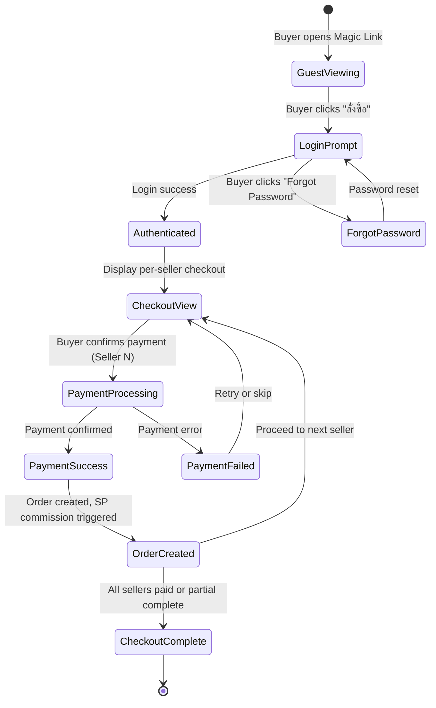

# Epic 10: Buyer O2O Checkout Flow
**Author/Owner**: Business Systems Analyst (BSA)
**Module**: Startup Partner O2O
**Date**: 2026-03-26
**Status**: ⚪ Draft

## Change Log

| Version | Date | Author | Changes |
|---------|------|--------|---------|
| 1.0 | 2026-03-26 | BSA | Initial draft |

**Status:** ⚪ Draft / 🟡 In Review / 🟢 Final

> **💡 When updating:** Change Status to 🟢 Final / Approved ONLY AFTER explicit approval.

**PRD Reference:** `docs/modules/startup-partner-o2o/startup-partner-o2o prd.md` (provided by PO)
**BRD Reference:** `docs/modules/startup-partner-o2o/brd.md`
**Maps to:** FR-035, FR-036, FR-037, FR-038, FR-039

---

### 1. Epic Information

| Field | Value |
|-------|-------|
| **Epic ID** | EPIC-10 |
| **Epic Name** | Buyer O2O Checkout Flow |
| **Epic Description** | Provide streamlined Offer Hub checkout for buyers with auto-provisioned Shadow Accounts and KYC exemption for non-credit payments |
| **Business Objective** | Enable buyers to view offers without login, authenticate with pre-provisioned credentials, and complete multi-seller decoupled checkout with flexible payment sequencing |
| **Target Release** | TBD |
| **Epic Owner** | TBD |
| **Epic Status** | Backlog |
| **Priority** | P0 |
| **Estimated Story Points** | TBD |

#### Epic User Story
As a buyer, I want to view and purchase from the Offer Hub using my pre-provisioned account, so that I can complete the purchase with minimal friction and flexible payment options.

#### Epic Scope
**In Scope:**
- Offer Hub display with guest viewing (no login required)
- Auto-provisioned Shadow Account login
- Multi-seller decoupled checkout
- KYC exemption logic for non-credit payments
- Order tracking per seller
- Payment sequencing for multi-seller orders

**Out of Scope:**
- Full buyer platform revamp
- Guest checkout for purchasing
- Buyer self-registration
- Buyer profile management

#### Related Epics
| Epic ID | Epic Name | Relationship |
|---------|-----------|--------------|
| EPIC-09 | Magic Link Offer Generation | Depends on — Buyer accesses Offer Hub via Magic Link |
| EPIC-11 | SP Commission Management & Payout | Blocks — SP commission is triggered upon buyer payment completion |

#### Epic Success Criteria
- [ ] Buyers can view offers without login
- [ ] Buyers login with pre-provisioned credentials (Shadow Account or existing Allkons M account)
- [ ] Checkout completes in under 30 seconds
- [ ] KYC exemption works correctly for non-credit payment methods
- [ ] Multi-seller orders are decoupled with independent payment, delivery, and tracking

---

### 2. User Stories

> Each user story follows the BRD structure: US → AC (Given/When/Then) → BR → Validation → Edge Cases → Error Handling → State Behavior. ID scheme: `US-14`, `US-14A` (scoped to this epic).

#### US-14: Buyer View Offer Hub Without Login
**As a** buyer, **I want to** view the Offer Hub with compared quotes without creating an account, **so that** I can see the offers before deciding to purchase.

**Preconditions:**
- Buyer has Magic Link from SP
- Magic Link is not expired

**Business Rules:**
| Rule ID | Rule Description | Priority |
|---------|------------------|----------|
| BR-081 | Buyers can view Offer Hub without login (guest viewing) | P0 |
| BR-082 | Offer Hub displays all quotes with product details, prices, delivery terms, payment terms | P0 |
| BR-083 | Buyers must login to pre-provisioned account to proceed to payment (guest checkout prohibited) | P0 |
| BR-084 | Buyer accounts are pre-provisioned by Seller via Customer Management (B2B CRM) module before Magic Link is sent | P0 |
| BR-085 | When Seller generates quote, Seller inputs buyer details (Name, Phone, Email) into CRM inline flow | P0 |
| BR-086 | System performs duplicate check by Phone/Email: Match found = link existing account; No match = auto-provision Shadow Account | P0 |
| BR-087 | Shadow Account created with system-generated default password sent via SMS/Email | P0 |
| BR-088 | Buyer clicks Magic Link and logs in with pre-provisioned credentials (or uses "Forgot Password") | P0 |

**Validation Rules:**
| Field | Validation Rule | Error Message |
|-------|-----------------|---------------|
| N/A | N/A | N/A |

**Acceptance Criteria:**
| # | Given | When | Then |
|---|-------|------|------|
| AC-56 | Buyer has Magic Link | Buyer opens link | System displays Offer Hub with all quotes, no login required |
| AC-57 | Buyer views Offer Hub | Buyer sees quote details | System displays product-by-product comparison, totals, delivery terms, payment terms |
| AC-58 | Buyer wants to purchase | Buyer clicks "สั่งซื้อ" | System prompts for login with pre-provisioned credentials (Phone + Password or "Forgot Password") |

**Edge Cases (minimum 3):**
| # | Scenario | Expected Behavior |
|---|----------|-------------------|
| EC-45 | Buyer opens expired Magic Link | Display "ลิงก์หมดอายุ กรุณาติดต่อ SP" with SP contact info |
| EC-46 | Buyer shares link with others | Link works for anyone; no user-specific restrictions |
| EC-47 | Buyer views link on mobile | Responsive layout adapts; all quotes visible (stacked view) |

**Error Handling:**
| Error | Trigger | User Feedback | Recovery |
|-------|---------|---------------|----------|
| Invalid link | Tampered or malformed link | ลิงก์ไม่ถูกต้อง กรุณาตรวจสอบอีกครั้ง | Contact SP |
| Offer load failure | Server error | ไม่สามารถโหลดข้อมูลได้ กรุณาลองใหม่ | Retry button |

**State Behavior:**
| State | When | UI Requirements |
|-------|------|-----------------|
| Loading | Loading Offer Hub | Show loading spinner |
| Success | Offers loaded | Display comparison table with all quotes |
| Error | Load fails | Show error message with retry option |

#### US-14A: Buyer Multi-Seller Decoupled Checkout
**As a** buyer, **I want to** purchase from multiple sellers in my chosen order, **so that** I have flexibility in payment sequencing.

**Preconditions:**
- Buyer has logged in with pre-provisioned account (Shadow Account or existing Allkons M account)
- Buyer has selected quotes from multiple sellers

**Business Rules:**
| Rule ID | Rule Description | Priority |
|---------|------------------|----------|
| BR-089 | KYC exemption for non-credit payment methods (cash, bank transfer, credit card) | P0 |
| BR-090 | KYC required only for credit-based payments (30/60/90 day terms) | P0 |
| BR-091 | Each seller's order is independent (decoupled checkout) | P0 |
| BR-092 | Buyer chooses payment sequence for multi-seller orders | P0 |
| BR-093 | Each seller order has separate payment, delivery, and tracking | P0 |
| BR-094 | Buyer can complete partial checkout (pay some sellers, skip others) | P0 |
| BR-095 | SP commission triggered only when buyer completes payment | P0 |
| BR-157 | Multi-seller checkout remains decoupled per seller | P0 |
| BR-158 | Direct transfer payment must be handled separately per seller | P0 |
| BR-159 | Payment gateway payment must be handled separately per seller | P0 |
| BR-160 | Checkout flow must reflect per-seller payment handling and status | P0 |

**Validation Rules:**
| Field | Validation Rule | Error Message |
|-------|-----------------|---------------|
| Payment Method | Must select payment method for each seller | กรุณาเลือกวิธีการชำระเงิน |
| Delivery Address | Required for each seller | กรุณากรอกที่อยู่จัดส่ง |

**Acceptance Criteria:**
| # | Given | When | Then |
|---|-------|------|------|
| AC-63 | Buyer has selected quotes from multiple sellers | Buyer proceeds to checkout | System displays separate checkout for each seller with payment options |
| AC-64 | Buyer selects payment sequence | Buyer chooses which seller to pay first | System processes payments in buyer's chosen order |
| AC-65 | Buyer completes payment for one seller | Payment confirmed | System creates order for that seller, triggers SP commission, allows buyer to proceed to next seller |
| AC-66 | Buyer skips payment for some sellers | Buyer completes partial checkout | System creates orders only for paid sellers; unpaid sellers remain in cart |

**Edge Cases (minimum 3):**
| # | Scenario | Expected Behavior |
|---|----------|-------------------|
| EC-51 | Payment fails for one seller | Buyer can retry payment or skip to next seller |
| EC-52 | Buyer abandons checkout mid-sequence | Completed payments processed; remaining sellers stay in cart |
| EC-53 | Seller becomes inactive during checkout | Display warning; allow buyer to remove seller and continue |

**Error Handling:**
| Error | Trigger | User Feedback | Recovery |
|-------|---------|---------------|----------|
| Payment failure | Payment gateway error | การชำระเงินล้มเหลว กรุณาลองใหม่ | Retry payment |
| Order creation failure | Server error | ไม่สามารถสร้างคำสั่งซื้อได้ กรุณาลองใหม่ | Retry order creation |

**State Behavior:**
| State | When | UI Requirements |
|-------|------|-----------------|
| Loading | Processing payment | Show loading spinner with "กำลังดำเนินการ..." |
| Success | Payment completed | Display order confirmation with tracking link |
| Error | Payment fails | Show error message with retry option |

---

### 3. Description

**Business Context:**
- **Problem Statement:** Buyers receiving offers from SPs need a frictionless way to view, compare, and purchase from multiple sellers without a complex registration process or mandatory KYC for simple payment methods.
- **Current State:** Buyers must create accounts manually and go through full KYC before purchasing, even for non-credit payments, leading to high drop-off rates in the O2O funnel.
- **Desired State:** Buyers view the Offer Hub without login, authenticate with auto-provisioned Shadow Accounts, and complete multi-seller decoupled checkout with KYC exemption for non-credit payments (cash, bank transfer, credit card).
- **Business Value:** Dramatically reduces buyer friction, increases conversion from offer-to-purchase, and enables flexible payment sequencing across multiple sellers — all while maintaining compliance for credit-based transactions.

---

### 4. Prerequisites

| Prerequisite | Description | Status |
|--------------|-------------|--------|
| Magic Link | Buyer must have a valid (non-expired) Magic Link from SP (EPIC-09) | [ ] |
| Shadow Account Provisioning | Buyer account must be pre-provisioned via Customer Management (B2B CRM) module | [ ] |
| Payment Gateway | Payment gateway integration must be configured for supported payment methods | [ ] |
| KYC Service | KYC verification service must be available for credit-based payments | [ ] |

**Dependencies:**
- EPIC-09 (Magic Link Offer Generation) must be completed
- Customer Management (B2B CRM) module must support inline buyer provisioning
- Payment gateway must support per-seller payment processing
- SMS/Email service for Shadow Account credential delivery

---

### 5. Terminology

| Term | Definition |
|------|------------|
| Offer Hub | The buyer-facing view displaying all selected quotes for comparison and purchase |
| Shadow Account | An auto-provisioned buyer account created by the system when a new buyer is detected (no matching Phone/Email) |
| KYC Exemption | Waiver of Know Your Customer verification for non-credit payment methods |
| Decoupled Checkout | Independent checkout process for each seller, allowing separate payment, delivery, and tracking |
| Payment Sequencing | Buyer's ability to choose the order in which they pay different sellers |
| Partial Checkout | Completing payment for some sellers while skipping others |
| Pre-provisioned Account | A buyer account created by the Seller via CRM inline flow during quote generation |
| B2B CRM | Customer Management module where Sellers manage buyer details |

---

### 6. Role and Permission Matrix

| Role | Permission | Access Level |
|------|------------|--------------|
| Buyer (Guest) | offer-hub:view | Read |
| Buyer (Authenticated) | offer-hub:checkout | Write |
| Buyer (Authenticated) | order:view | Read |
| Buyer (Authenticated) | order:track | Read |
| Buyer (Authenticated) | payment:process | Write |

**Permission Definitions:**
- `offer-hub:view` - View Offer Hub content (no login required)
- `offer-hub:checkout` - Proceed to checkout from Offer Hub (login required)
- `order:view` - View order details and history
- `order:track` - Track order delivery status
- `payment:process` - Process payment for an order

---

### 7. Information in the List

| Field Name | Format | Example | No Value | Condition |
|------------|--------|---------|----------|-----------|
| Product Name | Text | ปูนซีเมนต์ตราเสือ 50 กก. | - | Always displayed |
| Unit Price | Currency (THB) | ฿250.00 | - | Always displayed |
| Quantity | Integer | 100 | - | Always displayed |
| Total Price | Currency (THB) | ฿25,000.00 | - | Calculated: Unit Price × Quantity |
| Store Name | Text | ร้านวัสดุก่อสร้างเจริญ | - | Always displayed |
| Delivery Terms | Text | จัดส่งภายใน 3 วัน | ไม่ระบุ | From quote |
| Payment Terms | Text | ชำระเงินสด / โอนเงิน | - | Always displayed |
| Order Status | Badge | Pending / Paid / Shipped / Delivered | - | Per-seller order |
| Payment Status | Badge | Unpaid / Processing / Completed / Failed | - | Per-seller payment |

**Display Rules:**
- Quotes are displayed in comparison table format with product-by-product comparison
- Each seller's section is clearly separated with store name header
- Totals are displayed per seller and as grand total
- Payment status badges use color coding (green=completed, yellow=processing, red=failed)
- Mobile view uses stacked card layout instead of comparison table

---

### 8. Requirements

#### 8.1 General Information

| Field | Value |
|-------|-------|
| **Story Type** | New feature |
| **Application** | Buyer Web (Offer Hub) |
| **Module** | Buyer O2O Checkout Flow |
| **Pages** | /offer/{token}, /offer/{token}/checkout, /offer/{token}/orders |
| **Priority** | P0 |
| **Complexity** | High |

#### 8.2 Happy Path

1. Buyer receives Magic Link from SP via LINE/WhatsApp
2. Buyer opens Magic Link in browser
3. System displays Offer Hub with all quotes (no login required)
4. Buyer reviews product-by-product comparison, totals, delivery terms, payment terms
5. Buyer clicks "สั่งซื้อ" to proceed to checkout
6. System prompts for login (Phone + Password or "Forgot Password")
7. Buyer logs in with pre-provisioned credentials (Shadow Account)
8. System displays separate checkout per seller with payment options
9. Buyer selects payment method for first seller (non-credit: KYC exempted)
10. Buyer enters delivery address
11. Buyer completes payment for first seller
12. System creates order, triggers SP commission, shows order confirmation with tracking
13. Buyer proceeds to next seller or completes partial checkout

#### 8.3 Allowed Roles

- Buyer (Guest) — view Offer Hub only
- Buyer (Authenticated) — checkout, payment, order tracking

#### 8.4 Business Rules

| Rule ID | Rule Description | Priority |
|---------|------------------|----------|
| BR-081 | Buyers can view Offer Hub without login (guest viewing) | P0 |
| BR-082 | Offer Hub displays all quotes with product details, prices, delivery terms, payment terms | P0 |
| BR-083 | Buyers must login to pre-provisioned account to proceed to payment (guest checkout prohibited) | P0 |
| BR-084 | Buyer accounts are pre-provisioned by Seller via Customer Management (B2B CRM) module before Magic Link is sent | P0 |
| BR-085 | When Seller generates quote, Seller inputs buyer details (Name, Phone, Email) into CRM inline flow | P0 |
| BR-086 | System performs duplicate check by Phone/Email: Match found = link existing account; No match = auto-provision Shadow Account | P0 |
| BR-087 | Shadow Account created with system-generated default password sent via SMS/Email | P0 |
| BR-088 | Buyer clicks Magic Link and logs in with pre-provisioned credentials (or uses "Forgot Password") | P0 |
| BR-089 | KYC exemption for non-credit payment methods (cash, bank transfer, credit card) | P0 |
| BR-090 | KYC required only for credit-based payments (30/60/90 day terms) | P0 |
| BR-091 | Each seller's order is independent (decoupled checkout) | P0 |
| BR-092 | Buyer chooses payment sequence for multi-seller orders | P0 |
| BR-093 | Each seller order has separate payment, delivery, and tracking | P0 |
| BR-094 | Buyer can complete partial checkout (pay some sellers, skip others) | P0 |
| BR-095 | SP commission triggered only when buyer completes payment | P0 |
| BR-157 | Multi-seller checkout remains decoupled per seller | P0 |
| BR-158 | Direct transfer payment must be handled separately per seller | P0 |
| BR-159 | Payment gateway payment must be handled separately per seller | P0 |
| BR-160 | Checkout flow must reflect per-seller payment handling and status | P0 |

#### 8.5 Validation Rules

| Field | Validation Rule | Error Message |
|-------|-----------------|---------------|
| Payment Method | Must select payment method for each seller | กรุณาเลือกวิธีการชำระเงิน |
| Delivery Address | Required for each seller | กรุณากรอกที่อยู่จัดส่ง |

---

### 9. Acceptance Criteria

> All acceptance criteria use **Given/When/Then** format. Cover all 6 scenario categories below.

#### 9.1 View Mode Scenarios

**Scenario: Empty State**

**Given** Buyer opens a Magic Link with no quotes (edge case)
**When** System loads Offer Hub
**Then** Display empty state message "ไม่พบข้อเสนอ กรุณาติดต่อ SP"

**Scenario: Loading State**

**Given** Buyer opens Magic Link
**When** System is loading Offer Hub data
**Then** Show loading spinner

**Scenario: Success State**

**Given** Buyer opens valid Magic Link
**When** Offer Hub loads successfully
**Then** Display comparison table with all quotes, product details, prices, delivery terms, payment terms

**Scenario: Error States**

**Given** Buyer opens Magic Link
**When** Link is invalid or tampered
**Then** Display "ลิงก์ไม่ถูกต้อง กรุณาตรวจสอบอีกครั้ง" with SP contact info

**Given** Buyer opens Magic Link
**When** Link has expired
**Then** Display "ลิงก์หมดอายุ กรุณาติดต่อ SP" with SP contact info

**Given** Buyer opens valid Magic Link
**When** Server returns 500 error
**Then** Display "ไม่สามารถโหลดข้อมูลได้ กรุณาลองใหม่" with retry button

#### 9.2 Action Mode Scenarios

**Scenario: Login with Pre-provisioned Credentials Success**

**Given** Buyer clicks "สั่งซื้อ" from Offer Hub
**When** Buyer enters Phone and Password from Shadow Account
**Then** System authenticates buyer and displays checkout page with per-seller payment options

**Scenario: Login with Forgot Password Success**

**Given** Buyer cannot remember pre-provisioned password
**When** Buyer clicks "Forgot Password" and completes reset flow
**Then** System sends new password via SMS/Email; buyer can login

**Scenario: Checkout Single Seller Success**

**Given** Buyer is authenticated and has selected quotes from one seller
**When** Buyer selects payment method, enters delivery address, and confirms
**Then** System processes payment, creates order, triggers SP commission, displays order confirmation with tracking

**Scenario: Multi-Seller Decoupled Checkout Success**

**Given** Buyer has selected quotes from multiple sellers
**When** Buyer proceeds to checkout
**Then** System displays separate checkout for each seller; buyer can choose payment order

**Scenario: Partial Checkout Success**

**Given** Buyer has quotes from 3 sellers
**When** Buyer completes payment for 2 sellers and skips 1
**Then** System creates orders for paid sellers; unpaid seller remains available for later payment

**Scenario: KYC Exemption for Non-Credit Payment**

**Given** Buyer selects non-credit payment method (cash, bank transfer, credit card)
**When** Buyer proceeds to payment
**Then** System skips KYC verification and processes payment directly

**Scenario: KYC Required for Credit Payment**

**Given** Buyer selects credit-based payment (30/60/90 day terms)
**When** Buyer proceeds to payment
**Then** System requires KYC verification before processing

#### 9.3 Race Condition Scenarios

**Scenario: Concurrent Payment Attempts**

**Given** Buyer has checkout open for a seller
**When** Buyer clicks pay twice rapidly
**Then** System processes only one payment; second click is ignored (button disabled after first click)

**Scenario: Quote Expires During Checkout**

**Given** Buyer is in checkout process
**When** A quote expires while buyer is completing payment
**Then** System warns buyer before payment confirmation; allows cancellation

**Scenario: Seller Becomes Inactive During Checkout**

**Given** Buyer is in multi-seller checkout
**When** A seller becomes inactive mid-checkout
**Then** Display warning for that seller; allow buyer to remove seller and continue with others

#### 9.4 Loading State Scenarios (Action Mode)

**Scenario: Loading during payment processing**

**Given** Buyer confirms payment for a seller
**When** System is processing payment
**Then** Submit button disabled, spinner shown with "กำลังดำเนินการ...", all form inputs disabled

**Scenario: Loading during order creation**

**Given** Payment is confirmed
**When** System is creating the order
**Then** Show loading state with progress indication

#### 9.5 Field Validation Scenarios

**Scenario: Missing payment method**

**Given** Buyer is on checkout page for a seller
**When** Buyer tries to submit without selecting payment method
**Then** Validation error "กรุณาเลือกวิธีการชำระเงิน" displayed, submission blocked

**Scenario: Missing delivery address**

**Given** Buyer is on checkout page for a seller
**When** Buyer tries to submit without entering delivery address
**Then** Validation error "กรุณากรอกที่อยู่จัดส่ง" displayed, submission blocked

#### 9.6 Edge Cases

**Scenario: Buyer opens expired Magic Link**

**Given** Buyer has a Magic Link that has expired
**When** Buyer opens the link
**Then** Display "ลิงก์หมดอายุ กรุณาติดต่อ SP" with SP contact info

**Scenario: Buyer shares link with others**

**Given** Buyer has a valid Magic Link
**When** Another person opens the same link
**Then** Link works for anyone; no user-specific restrictions for viewing

**Scenario: Buyer views link on mobile**

**Given** Buyer opens Magic Link on mobile device
**When** Offer Hub loads
**Then** Responsive layout adapts; all quotes visible in stacked card view

**Scenario: Buyer abandons checkout mid-sequence**

**Given** Buyer has paid 1 of 3 sellers
**When** Buyer closes browser or navigates away
**Then** Completed payment is processed; remaining sellers stay available for later payment

---

### 10. Risk Assessment

| Risk ID | Risk Description | Category | Probability | Impact | Risk Level | Mitigation Strategy | Owner | Status |
|---------|------------------|----------|-------------|--------|------------|---------------------|-------|--------|
| R-001 | Shadow Account credentials intercepted via SMS | Compliance | M | H | High | Use secure SMS delivery; encourage password change on first login; consider OTP-based login | Tech Lead | Open |
| R-002 | Payment gateway failure during multi-seller checkout | Financial | M | H | High | Implement retry mechanism; ensure completed payments are not lost; per-seller transaction isolation | Tech Lead | Open |
| R-003 | KYC exemption bypass for credit payments | Compliance | L | H | Medium | Enforce server-side KYC requirement check based on payment method; audit all KYC exemption decisions | BSA | Open |
| R-004 | Partial checkout creates orphaned orders | Operational | M | M | Medium | Track all checkout sessions; provide buyer dashboard to complete remaining payments; notify SP of partial completion | BSA | Open |
| R-005 | High drop-off at login prompt for guest viewers | Strategic | H | M | High | Optimize login UX; pre-fill phone from Magic Link context; provide clear instructions about pre-provisioned credentials | Product Owner | Open |

#### Risk Summary
- **Total Risks:** 5
- **Critical Risks:** 0
- **High Risks:** 3
- **Medium Risks:** 2
- **Low Risks:** 0

---

### 11. Data Dictionary

#### Entity: BuyerOrder

| Attribute Name | Data Type | Length | Required | Unique | Default Value | Description |
|----------------|-----------|--------|----------|--------|---------------|-------------|
| id | UUID | 36 | Yes | Yes | Auto-generated | Primary key |
| magicLinkId | UUID | 36 | Yes | No | N/A | Reference to the Magic Link |
| buyerId | UUID | 36 | Yes | No | N/A | Reference to the buyer account |
| sellerId | UUID | 36 | Yes | No | N/A | Reference to the seller |
| quoteId | UUID | 36 | Yes | No | N/A | Reference to the selected quote |
| status | Enum | 20 | Yes | No | PENDING | PENDING / PAID / SHIPPED / DELIVERED / CANCELLED |
| paymentMethod | Enum | 30 | Yes | No | N/A | CASH / BANK_TRANSFER / CREDIT_CARD / CREDIT_TERMS_30 / CREDIT_TERMS_60 / CREDIT_TERMS_90 |
| paymentStatus | Enum | 20 | Yes | No | UNPAID | UNPAID / PROCESSING / COMPLETED / FAILED |
| kycExempted | Boolean | N/A | Yes | No | false | Whether KYC was exempted for this order |
| deliveryAddress | Text | 500 | Yes | No | N/A | Delivery address for this order |
| totalAmount | Decimal | 12,2 | Yes | No | N/A | Total order amount |
| spCommissionTriggered | Boolean | N/A | Yes | No | false | Whether SP commission has been triggered |
| createdAt | DateTime | N/A | Yes | No | Now | Creation timestamp |
| updatedAt | DateTime | N/A | Yes | No | Now | Last update timestamp |

#### Entity: CheckoutSession

| Attribute Name | Data Type | Length | Required | Unique | Default Value | Description |
|----------------|-----------|--------|----------|--------|---------------|-------------|
| id | UUID | 36 | Yes | Yes | Auto-generated | Primary key |
| magicLinkId | UUID | 36 | Yes | No | N/A | Reference to the Magic Link |
| buyerId | UUID | 36 | Yes | No | N/A | Reference to the buyer account |
| sellerIds | Array<UUID> | N/A | Yes | No | N/A | List of seller IDs in checkout |
| paymentSequence | Array<UUID> | N/A | No | No | N/A | Buyer's chosen payment order (seller IDs) |
| completedSellerIds | Array<UUID> | N/A | No | No | [] | Sellers with completed payments |
| status | Enum | 20 | Yes | No | IN_PROGRESS | IN_PROGRESS / COMPLETED / ABANDONED |
| createdAt | DateTime | N/A | Yes | No | Now | Creation timestamp |
| updatedAt | DateTime | N/A | Yes | No | Now | Last update timestamp |

#### Relationships

| Related Entity | Relationship Type | Cardinality | Description |
|----------------|-------------------|-------------|-------------|
| MagicLink | Many-to-One | N:1 | Each order originates from a Magic Link |
| Buyer (User) | Many-to-One | N:1 | Each order belongs to one buyer |
| Seller (User) | Many-to-One | N:1 | Each order is for one seller |
| Quote | Many-to-One | N:1 | Each order is based on one quote |
| CheckoutSession | One-to-Many | 1:N | Each session contains multiple per-seller orders |

---

### 12. Audit Trail Requirements

| Action | Data to Capture | Retention Period |
|--------|-----------------|------------------|
| VIEW_OFFER | Session ID, Timestamp, Magic Link ID, IP address, User Agent | 1 year |
| LOGIN | Buyer ID, Timestamp, Login method, IP address | 7 years |
| CHECKOUT_START | Buyer ID, Timestamp, Checkout Session ID, Seller IDs, IP address | 7 years |
| PAYMENT_ATTEMPT | Buyer ID, Timestamp, Order ID, Seller ID, Payment Method, Amount, IP address | 7 years |
| PAYMENT_SUCCESS | Buyer ID, Timestamp, Order ID, Payment Reference, Amount, KYC exempted flag | 7 years |
| PAYMENT_FAILURE | Buyer ID, Timestamp, Order ID, Error details, IP address | 7 years |
| ORDER_CREATED | Buyer ID, Timestamp, Order ID, Seller ID, Quote ID, Total Amount | 7 years |
| COMMISSION_TRIGGERED | SP ID, Buyer ID, Timestamp, Order ID, Commission Amount | 7 years |

---

### 13. Notes

- Shadow Account credentials (default password) must be delivered securely via SMS/Email before the buyer receives the Magic Link
- The Seller provisions buyer accounts during the quote generation flow in the CRM inline flow — this is a prerequisite, not part of this epic's implementation
- KYC exemption logic must be enforced server-side; frontend should not make KYC decisions independently
- Multi-seller decoupled checkout means each seller's payment is an independent transaction — no cross-seller dependency
- SP commission is triggered per-seller upon payment completion, not upon checkout initiation
- Direct transfer and payment gateway payments are handled separately per seller (BR-158, BR-159)

**Questions for Tech Lead / Designer:**
- What is the maximum number of sellers in a single checkout session?
- How should the "Forgot Password" flow work for Shadow Accounts — OTP-based or email link?
- Should completed seller orders be visible while buyer is paying other sellers?
- What is the timeout for abandoned checkout sessions?
- How should the system handle payment method availability differences between sellers?

---

### 14. Draft Technical Design

#### 14.1 API Endpoints

| Method | Endpoint | Description | Authentication |
|--------|----------|-------------|----------------|
| GET | /api/offer/:token | Get Offer Hub data (guest view) | Not required |
| POST | /api/offer/:token/login | Authenticate buyer for checkout | Not required (creates session) |
| POST | /api/offer/:token/checkout | Initialize checkout session | Required (Buyer) |
| GET | /api/offer/:token/checkout/:sessionId | Get checkout session details | Required (Buyer) |
| POST | /api/offer/:token/checkout/:sessionId/pay/:sellerId | Process payment for a seller | Required (Buyer) |
| GET | /api/offer/:token/orders | Get buyer's orders from this offer | Required (Buyer) |
| GET | /api/offer/:token/orders/:orderId | Get order details with tracking | Required (Buyer) |
| POST | /api/offer/:token/checkout/:sessionId/kyc | Submit KYC for credit payment | Required (Buyer) |

#### 14.2 Database Schema

```sql
-- Buyer Orders (per seller)
CREATE TABLE buyer_orders (
    id UUID NOT NULL DEFAULT gen_random_uuid(),
    magic_link_id UUID NOT NULL,
    checkout_session_id UUID NOT NULL,
    buyer_id UUID NOT NULL,
    seller_id UUID NOT NULL,
    quote_id UUID NOT NULL,
    status VARCHAR(20) NOT NULL DEFAULT 'PENDING',
    payment_method VARCHAR(30) NOT NULL,
    payment_status VARCHAR(20) NOT NULL DEFAULT 'UNPAID',
    kyc_exempted BOOLEAN NOT NULL DEFAULT FALSE,
    delivery_address TEXT NOT NULL,
    total_amount DECIMAL(12, 2) NOT NULL,
    sp_commission_triggered BOOLEAN NOT NULL DEFAULT FALSE,
    created_at TIMESTAMP NOT NULL DEFAULT NOW(),
    updated_at TIMESTAMP NOT NULL DEFAULT NOW(),
    PRIMARY KEY (id),
    CONSTRAINT fk_bo_magic_link FOREIGN KEY (magic_link_id) REFERENCES magic_links(id),
    CONSTRAINT fk_bo_buyer FOREIGN KEY (buyer_id) REFERENCES users(id),
    CONSTRAINT fk_bo_seller FOREIGN KEY (seller_id) REFERENCES users(id),
    CONSTRAINT fk_bo_quote FOREIGN KEY (quote_id) REFERENCES quotes(id)
);

-- Checkout Sessions
CREATE TABLE checkout_sessions (
    id UUID NOT NULL DEFAULT gen_random_uuid(),
    magic_link_id UUID NOT NULL,
    buyer_id UUID NOT NULL,
    seller_ids JSONB NOT NULL,
    payment_sequence JSONB,
    completed_seller_ids JSONB NOT NULL DEFAULT '[]',
    status VARCHAR(20) NOT NULL DEFAULT 'IN_PROGRESS',
    created_at TIMESTAMP NOT NULL DEFAULT NOW(),
    updated_at TIMESTAMP NOT NULL DEFAULT NOW(),
    PRIMARY KEY (id),
    CONSTRAINT fk_cs_magic_link FOREIGN KEY (magic_link_id) REFERENCES magic_links(id),
    CONSTRAINT fk_cs_buyer FOREIGN KEY (buyer_id) REFERENCES users(id)
);

-- Payment Transactions (per seller order)
CREATE TABLE payment_transactions (
    id UUID NOT NULL DEFAULT gen_random_uuid(),
    order_id UUID NOT NULL,
    payment_method VARCHAR(30) NOT NULL,
    amount DECIMAL(12, 2) NOT NULL,
    status VARCHAR(20) NOT NULL DEFAULT 'PENDING',
    gateway_reference VARCHAR(200),
    error_details TEXT,
    created_at TIMESTAMP NOT NULL DEFAULT NOW(),
    updated_at TIMESTAMP NOT NULL DEFAULT NOW(),
    PRIMARY KEY (id),
    CONSTRAINT fk_pt_order FOREIGN KEY (order_id) REFERENCES buyer_orders(id)
);
```

#### 14.3 State Management



#### 14.4 UI/UX Considerations

- Offer Hub guest view must clearly show a "สั่งซื้อ" CTA with indication that login is required
- Login prompt should pre-fill phone number if available from Magic Link context
- Checkout page must clearly separate each seller's section with distinct headers
- Payment method selection should visually indicate KYC requirement for credit terms
- Per-seller payment status should be visible throughout the checkout flow
- Order confirmation should include tracking link and next-seller prompt
- Mobile-first responsive design with stacked card layout for Offer Hub
- Clear progress indication for multi-seller checkout (e.g., "1 of 3 sellers completed")

---

### 15. Testing Checklist

#### Pre-Testing
- [ ] All prerequisites are met (EPIC-09 completed, Shadow Accounts provisioned)
- [ ] Test environment with valid Magic Links
- [ ] Test Shadow Accounts with known credentials
- [ ] Payment gateway sandbox configured
- [ ] Test data with multi-seller quotes
- [ ] KYC service mock/sandbox available

#### Functional Testing
- [ ] Guest viewing of Offer Hub works without login
- [ ] Offer Hub displays all quote details correctly
- [ ] Login with Shadow Account credentials works
- [ ] "Forgot Password" flow works for Shadow Accounts
- [ ] Per-seller checkout displays correctly
- [ ] Payment method selection works per seller
- [ ] KYC exemption for non-credit payments (cash, bank transfer, credit card)
- [ ] KYC requirement enforced for credit-based payments (30/60/90 day terms)
- [ ] Payment processing per seller works correctly
- [ ] Partial checkout (pay some sellers, skip others) works
- [ ] Payment sequencing (buyer chooses order) works
- [ ] SP commission triggered upon payment completion
- [ ] Order creation per seller works correctly
- [ ] Order tracking displays correctly
- [ ] All validation rules work as expected
- [ ] All edge cases handled correctly
- [ ] Expired Magic Link shows appropriate message
- [ ] Invalid Magic Link shows appropriate error

#### Security Testing
- [ ] Guest users cannot access checkout without authentication
- [ ] Shadow Account credentials are not exposed in URLs or client-side storage
- [ ] KYC exemption logic cannot be bypassed on client side
- [ ] Payment transactions are properly secured
- [ ] Session management is secure

#### Performance Testing
- [ ] Checkout completes in under 30 seconds (success criteria)
- [ ] Offer Hub loads within acceptable time
- [ ] Payment processing response time is acceptable
- [ ] Multi-seller checkout handles 10+ sellers without performance degradation

#### Cross-Browser Testing
- [ ] Chrome
- [ ] Firefox
- [ ] Safari
- [ ] Edge

#### Mobile Testing
- [ ] Responsive design works on mobile (Offer Hub and checkout)
- [ ] Touch interactions work correctly
- [ ] Payment flow works on mobile browsers

---

### 16. Approval

| Role | Name | Signature | Date |
|------|------|-----------|------|
| Product Owner | | | |
| Business Analyst | | | |
| Technical Lead | | | |
| QA Lead | | | |

---

**Document Version:** 1.0
**Last Updated:** 2026-03-26
**Author:** BSA
**Status:** Draft
