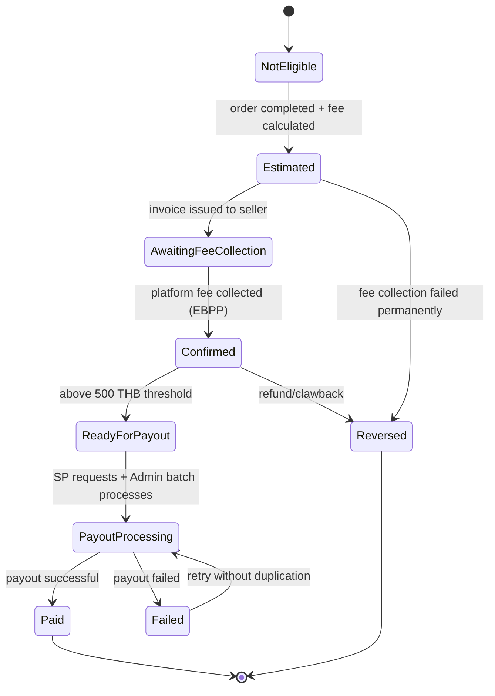
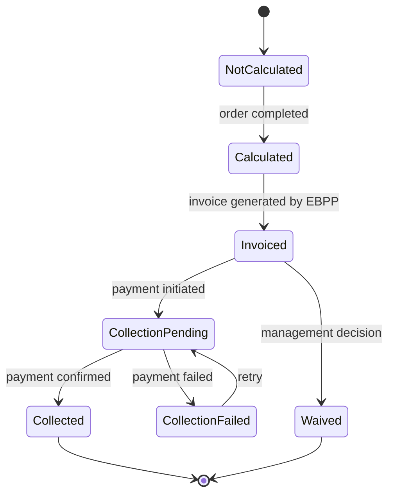
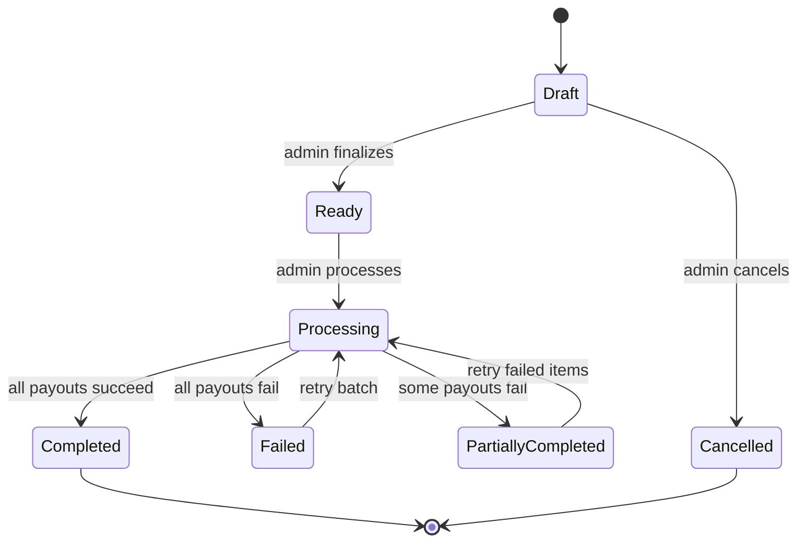

# Epic 11: SP Commission Management & Payout
**Author/Owner**: Business Systems Analyst (BSA)
**Module**: Startup Partner O2O
**Date**: 2026-03-26
**Status**: ⚪ Draft

## Change Log

| Version | Date | Author | Changes |
|---------|------|--------|---------|
| 1.0 | 2026-03-26 | BSA | Initial draft |

**Status:** ⚪ Draft / 🟡 In Review / 🟢 Final

> **💡 When updating:** Change Status to 🟢 Final / Approved ONLY AFTER explicit approval.

**PRD Reference:** `docs/modules/startup-partner-o2o/prd.md` (provided by PO)
**BRD Reference:** `docs/modules/startup-partner-o2o/brd.md`
**Maps to:** FR-085 to FR-097 (SP-facing), FR-098 to FR-120 (Admin-facing)

---

### 1. Epic Information

| Field | Value |
|-------|-------|
| **Epic ID** | EPIC-11 |
| **Epic Name** | SP Commission Management & Payout |
| **Epic Description** | Enable SPs to track commission earnings based on Platform Fee collection, view payout readiness, request withdrawals, and monitor adjustments; Enable Allkons Admin to manage full commission domain including policy setup, fee-to-commission monitoring, payout batch processing, exception handling, and audit governance with clear separation from Seller Sales Commission |
| **Business Objective** | Establish a transparent, auditable commission system that accurately calculates SP earnings from Platform Fees, ensures commissions are confirmed only after fee collection, and provides both SP self-service payout and Admin batch management capabilities |
| **Target Release** | TBD |
| **Epic Owner** | BSA |
| **Epic Status** | Backlog |
| **Priority** | P0 |
| **Estimated Story Points** | TBD |

#### Epic User Story
As Startup Partners and Allkons Admins, we want a comprehensive commission management and payout system, so that SPs can track and withdraw earnings transparently while Admins can configure policies, monitor lifecycles, process payouts, and maintain full audit governance.

#### Epic Scope
**In Scope:**
- SP commission calculation from Platform Fee only
- Estimated vs confirmed commission lifecycle
- Fee collection dependency tracking (3 fee collection methods)
- Payout with 5 THB withdrawal fee
- Commission adjustments / clawback
- Separate Orders and Commissions menus (UX architecture)
- Role-based visibility (SP Member / SP Leader / Admin)
- 3-layer transaction model (Buyer↔Seller, Seller↔Allkons, Allkons↔SP)
- Commission status flows and fee status flows
- Fee collection modes support (Payment Gateway, Direct Transfer, Store Credit)
- Admin commission policy management (Global / Category / Seller / Seller+Category / SP Tier / Campaign)
- Rule precedence and conflict detection
- Fee-to-commission lifecycle monitoring
- Payout batch management
- Exception handling (refunds, fee failures, manual adjustments)
- Comprehensive audit logging
- Role-based admin access (Viewer / Manager / Payout Manager / Finance Admin / Super Admin)

**Out of Scope:**
- Seller Sales Commission display
- Commission negotiation
- Automated payout approval without fee collection confirmation
- Commission display in early product discovery
- SP transaction management rights
- Commission rule stacking (single rule per transaction)

#### Related Epics
| Epic ID | Epic Name | Relationship |
|---------|-----------|--------------|
| EPIC-10 | Order Management & Checkout | Depends on (order completion triggers commission) |
| EPIC-06 | Seller & Branch Management | Related (seller data for commission policies) |
| EPIC-03 | SP Registration & Profile | Related (SP profile and tier data) |

#### Epic Success Criteria
- [ ] SP commissions calculated accurately from Platform Fee
- [ ] Commission becomes confirmed only after fee collection
- [ ] Payout displays gross amount, 5 THB withdrawal fee, and net amount
- [ ] Orders and Commissions separated into different menus
- [ ] Commission visibility restricted in product discovery
- [ ] Role-based access enforced (SP Member / SP Leader / Admin roles)
- [ ] Admin can create and manage commission policies with category/seller rules
- [ ] Admin can monitor fee collection and commission lifecycle
- [ ] Admin can create and process payout batches
- [ ] Admin can handle exceptions and adjustments
- [ ] All admin actions auditable

---

### 2. User Stories

> Each user story follows the BRD structure: US → AC (Given/When/Then) → BR → Validation → Edge Cases → Error Handling → State Behavior. This epic contains 16 user stories: 9 SP-facing (US-17A through US-17I) and 7 Admin-facing (US-17J through US-17P).

#### US-17A: Admin Configure SP Commission Engine
**As an** Allkons M admin, **I want to** configure SP commission base rates calculated from Platform Fee, **so that** I can adjust commission structure based on business needs while maintaining clear separation from Seller Sales Commission.

**Preconditions:**
- Admin is logged in to Admin Portal
- Admin has "Commission Manager" role

**Business Rules:**
| Rule ID | Rule Description | Priority |
|---------|------------------|----------|
| BR-179 | Seller Sales Commission is out of display scope for this module | P0 |
| BR-180 | Startup Partner Commission is the only commission type in functional UI/reporting scope | P0 |
| BR-181 | SP commission must be calculated from Platform Fee only | P0 |
| BR-182 | Payment Fee must not be used as commission base | P0 |
| BR-183 | SP Commission = Platform Fee × Base Commission Rate | P0 |
| BR-184 | Platform Fee = 2% of Sale Order | P0 |
| BR-185 | Commission rate is configurable by Admin | P0 |
| BR-186 | Different commission rates can be set for different SP tiers, product categories, or sellers | P1 |
| BR-187 | Commission rate changes apply to future transactions only (not retroactive) | P0 |
| BR-188 | Audit log of commission rate changes required | P0 |

**Validation Rules:**
| Field | Validation Rule | Error Message |
|-------|-----------------|---------------|
| Commission Rate | Must be 0-100%, decimal allowed | กรุณากรอกอัตราค่าคอมมิชชัน (0-100%) |
| Platform Fee Percentage | Must be positive number | กรุณากรอกเปอร์เซ็นต์ค่าธรรมเนียมแพลตฟอร์ม |

**Acceptance Criteria:**
| # | Given | When | Then |
|---|-------|------|------|
| AC-86 | Admin is on SP commission settings page | Admin views current rates | System displays SP commission rates by tier/category/seller with Platform Fee base calculation |
| AC-87 | Admin updates SP commission rate | Admin enters new rate and clicks "บันทึก" | System saves new rate, applies to future transactions, logs change with timestamp and admin name |
| AC-88 | Admin views audit log | Admin clicks "ประวัติการเปลี่ยนแปลง" | System displays all SP commission rate changes with timestamp, admin name, old/new values |
| AC-89 | Admin views commission calculation formula | Admin hovers over info icon | System displays "SP Commission = Platform Fee (2% of Order) × Base Rate" |

**Edge Cases (minimum 3):**
| # | Scenario | Expected Behavior |
|---|----------|-------------------|
| EC-69 | Admin sets rate to 0% | System allows; SPs earn no commission (valid for testing or special cases) |
| EC-70 | Admin sets rate above 100% | Display validation error "อัตราต้องไม่เกิน 100%" |
| EC-71 | Rate change during active transaction | Old rate applies to that transaction; new rate applies to next |

**Error Handling:**
| Error | Trigger | User Feedback | Recovery |
|-------|---------|---------------|----------|
| Save failure | Server error | ไม่สามารถบันทึกการตั้งค่าได้ กรุณาลองใหม่ | Retry button |

**State Behavior:**
| State | When | UI Requirements |
|-------|------|-----------------|
| Loading | Saving settings | Show loading spinner |
| Success | Settings saved | Display success message "บันทึกอัตราค่าคอมมิชชัน SP สำเร็จ" |
| Error | Save fails | Show error message with retry option |

#### US-17B: SP View Commission Overview Dashboard
**As a** Startup Partner, **I want to** view my commission overview dashboard with clear separation from Orders menu, **so that** I can track estimated, confirmed, and payout-ready earnings based on Platform Fee collection.

**Preconditions:**
- SP is logged in to SP Portal
- SP has access to Commissions menu (separate from Orders)

**Business Rules:**
| Rule ID | Rule Description | Priority |
|---------|------------------|----------|
| BR-189 | SP commission becomes confirmed only after Platform Fee is successfully collected from seller | P0 |
| BR-190 | Estimated commission may be created after order completion and fee calculation | P0 |
| BR-191 | Commission remains pending until platform fee collection is successful | P0 |
| BR-192 | Commission lifecycle must track: Not Eligible, Estimated, Awaiting Fee Collection, Confirmed, Ready for Payout, Payout Processing, Paid, Failed, Reversed/Clawed Back | P0 |
| BR-205 | Commissions and Orders must be separated in information architecture | P0 |
| BR-206 | Orders menu is for operational transaction and order tracking | P0 |
| BR-207 | Commissions menu is for earnings, fee dependency, payout readiness, payout history, adjustments | P0 |

**Validation Rules:**
| Field | Validation Rule | Error Message |
|-------|-----------------|---------------|
| N/A | N/A | N/A |

**Acceptance Criteria:**
| # | Given | When | Then |
|---|-------|------|------|
| AC-90 | SP navigates to Commissions menu | SP clicks "ค่าคอมมิชชัน" | System displays commission overview dashboard separate from Orders menu |
| AC-91 | SP views commission overview | SP sees dashboard | System displays: Estimated Commission, Confirmed Commission, Ready to Withdraw, Processing Payout, Paid This Month, Adjusted/Reversed |
| AC-92 | SP views estimated commission | SP sees estimated section | System shows commissions where order completed but fee not yet collected |
| AC-93 | SP views confirmed commission | SP sees confirmed section | System shows commissions where Platform Fee successfully collected |
| AC-94 | SP views ready to withdraw | SP sees payout section | System shows confirmed commissions above minimum threshold ready for payout |

**Edge Cases (minimum 3):**
| # | Scenario | Expected Behavior |
|---|----------|-------------------|
| EC-72 | SP with no commissions yet | Display "คุณยังไม่มีค่าคอมมิชชัน เริ่มต้นด้วยการสร้าง RFQ" |
| EC-73 | All commissions awaiting fee collection | Estimated section shows amounts, Confirmed section shows 0 |
| EC-74 | Confirmed amount below minimum threshold | Display "ยอดคงเหลือต่ำกว่าขั้นต่ำในการถอน (500 THB)" |

**Error Handling:**
| Error | Trigger | User Feedback | Recovery |
|-------|---------|---------------|----------|
| Dashboard load failure | Server error | ไม่สามารถโหลดข้อมูลได้ กรุณาลองใหม่ | Retry button |

**State Behavior:**
| State | When | UI Requirements |
|-------|------|-----------------|
| Loading | Loading dashboard | Show loading spinner with "กำลังโหลดข้อมูลค่าคอมมิชชัน..." |
| Empty | No commissions yet | Display empty state with "เริ่มต้นสร้าง RFQ" button |
| Success | Data loaded | Display commission overview with all status sections |
| Error | Load fails | Show error message with retry option |

#### US-17C: SP View Commission Transactions
**As a** Startup Partner, **I want to** view detailed commission transaction list with Platform Fee, fee collection status, and commission status, **so that** I can track earnings progression from estimated to confirmed.

**Preconditions:**
- SP is logged in to SP Portal
- SP navigates to Commissions > Transactions

**Business Rules:**
| Rule ID | Rule Description | Priority |
|---------|------------------|----------|
| BR-193 | Fee lifecycle must track: Not Calculated, Calculated, Invoiced/Billed, Collection Pending, Collected, Collection Failed, Waived/Adjusted | P0 |
| BR-194 | System must support 3 fee collection modes: Payment Gateway, Direct Transfer, Store Credit | P0 |
| BR-195 | Fee collection mode affects commission confirmation timing | P0 |
| BR-196 | If fee included in order and collected immediately, commission moves to confirmed faster | P0 |
| BR-197 | If fee collected later, commission remains in "Awaiting Fee Collection" status | P0 |

**Validation Rules:**
| Field | Validation Rule | Error Message |
|-------|-----------------|---------------|
| N/A | N/A | N/A |

**Acceptance Criteria:**
| # | Given | When | Then |
|---|-------|------|------|
| AC-95 | SP views commission transactions | SP clicks "ธุรกรรม" tab | System displays transaction table with: Order ID, Buyer Name, Seller/Branch, Order Amount, Platform Fee, Base Rate, Estimated Commission, Confirmed Commission, Fee Collection Status, Commission Status, Order Completion Date, Payout Batch/Date |
| AC-96 | SP filters transactions | SP selects status filter | System filters by commission status (Estimated, Awaiting Fee Collection, Confirmed, Paid, Reversed) |
| AC-97 | SP filters by date range | SP selects date range | System filters transactions by order completion date |
| AC-98 | SP exports commission statement | SP clicks "ดาวน์โหลดรายงาน" | System generates PDF/Excel with commission transaction details |

**Edge Cases (minimum 3):**
| # | Scenario | Expected Behavior |
|---|----------|-------------------|
| EC-75 | Transaction with fee collection pending | Show Estimated Commission, Fee Collection Status: "Collection Pending", Commission Status: "Awaiting Fee Collection" |
| EC-76 | Transaction with fee collected | Show Confirmed Commission, Fee Collection Status: "Collected", Commission Status: "Confirmed" |
| EC-77 | No transactions yet | Display "ยังไม่มีธุรกรรมค่าคอมมิชชัน" |

**Error Handling:**
| Error | Trigger | User Feedback | Recovery |
|-------|---------|---------------|----------|
| Transaction load failure | Server error | ไม่สามารถโหลดข้อมูลธุรกรรมได้ กรุณาลองใหม่ | Retry button |
| Export failure | Report generation error | ไม่สามารถสร้างรายงานได้ กรุณาลองใหม่ | Retry export |

**State Behavior:**
| State | When | UI Requirements |
|-------|------|-----------------|
| Loading | Loading transactions | Show loading spinner |
| Empty | No transactions | Display empty state |
| Success | Data loaded | Display transaction table with filters |
| Error | Load fails | Show error message with retry option |

#### US-17D: SP Request Commission Payout
**As a** Startup Partner, **I want to** request commission payout with clear visibility of gross amount, 5 THB withdrawal fee, and net amount, **so that** I understand the final payout I will receive.

**Preconditions:**
- SP is logged in to SP Portal
- SP has confirmed commission above minimum threshold (500 THB)

**Business Rules:**
| Rule ID | Rule Description | Priority |
|---------|------------------|----------|
| BR-198 | Commission payout to SP must deduct 5 THB withdrawal fee per payout transaction | P0 |
| BR-199 | System must show gross amount, withdrawal fee, and net payout amount | P0 |
| BR-200 | SP must see amount ready for payout and final net amount after fee deduction | P0 |
| BR-201 | Minimum payout threshold applies (e.g., 500 THB) | P0 |
| BR-202 | Payout processed through Allkons payment gateway | P0 |

**Validation Rules:**
| Field | Validation Rule | Error Message |
|-------|-----------------|---------------|
| Payout Amount | Must be >= 500 THB | ยอดถอนขั้นต่ำ 500 THB |

**Acceptance Criteria:**
| # | Given | When | Then |
|---|-------|------|------|
| AC-99 | SP has confirmed commission >= 500 THB | SP navigates to payout section | System displays gross amount, 5 THB withdrawal fee, net amount, and "ขอถอนเงิน" button |
| AC-100 | SP requests payout | SP clicks "ขอถอนเงิน" and confirms | System creates payout request, deducts 5 THB fee, displays net amount, updates status to "Processing Payout" |
| AC-101 | SP has confirmed commission < 500 THB | SP views payout section | System displays "ยอดคงเหลือต่ำกว่าขั้นต่ำในการถอน (500 THB)" with disabled button |

**Edge Cases (minimum 3):**
| # | Scenario | Expected Behavior |
|---|----------|-------------------|
| EC-78 | Confirmed amount exactly 500 THB | Allow payout, net amount = 495 THB (500 - 5) |
| EC-79 | Confirmed amount 499 THB | Disable payout button, show threshold message |
| EC-80 | Multiple payout requests in same month | Each payout deducts 5 THB fee separately |

**Error Handling:**
| Error | Trigger | User Feedback | Recovery |
|-------|---------|---------------|----------|
| Payout request failure | Server error | ไม่สามารถส่งคำขอถอนเงินได้ กรุณาลองใหม่ | Retry button |

**State Behavior:**
| State | When | UI Requirements |
|-------|------|-----------------|
| Loading | Processing payout request | Show loading spinner |
| Success | Payout requested | Display success message with net amount |
| Error | Request fails | Show error message with retry option |

#### US-17E: SP View Payout History
**As a** Startup Partner, **I want to** view my payout history with batch ID, gross amount, withdrawal fee, and net amount, **so that** I can track all my commission payouts.

**Preconditions:**
- SP is logged in to SP Portal
- SP navigates to Commissions > Payouts

**Business Rules:**
| Rule ID | Rule Description | Priority |
|---------|------------------|----------|
| BR-203 | Payout history must display: batch ID, gross amount, 5 THB withdrawal fee, net amount, status, date, reference | P0 |

**Validation Rules:**
| Field | Validation Rule | Error Message |
|-------|-----------------|---------------|
| N/A | N/A | N/A |

**Acceptance Criteria:**
| # | Given | When | Then |
|---|-------|------|------|
| AC-102 | SP views payout history | SP clicks "ประวัติการถอน" tab | System displays payout table with: Payout Batch ID, Gross Amount, Withdrawal Fee (5 THB), Net Amount, Payout Status, Payout Date, Payout Reference |
| AC-103 | SP filters payout history | SP selects date range | System filters payouts by payout date |
| AC-104 | SP exports payout history | SP clicks "ดาวน์โหลด" | System generates PDF/Excel with payout history |

**Edge Cases (minimum 3):**
| # | Scenario | Expected Behavior |
|---|----------|-------------------|
| EC-81 | No payouts yet | Display "ยังไม่มีประวัติการถอนเงิน" |
| EC-82 | Payout failed | Show status "Failed" with retry option |
| EC-83 | Payout processing | Show status "Processing" with estimated completion time |

**Error Handling:**
| Error | Trigger | User Feedback | Recovery |
|-------|---------|---------------|----------|
| History load failure | Server error | ไม่สามารถโหลดประวัติการถอนเงินได้ กรุณาลองใหม่ | Retry button |

**State Behavior:**
| State | When | UI Requirements |
|-------|------|-----------------|
| Loading | Loading payout history | Show loading spinner |
| Empty | No payouts | Display empty state |
| Success | Data loaded | Display payout history table |
| Error | Load fails | Show error message with retry option |

#### US-17F: SP View Commission Adjustments
**As a** Startup Partner, **I want to** view commission adjustments including clawbacks for refunds, **so that** I understand changes to my commission earnings.

**Preconditions:**
- SP is logged in to SP Portal
- SP navigates to Commissions > Adjustments

**Business Rules:**
| Rule ID | Rule Description | Priority |
|---------|------------------|----------|
| BR-204 | Refund, fee reversal, or manual correction must support commission adjustment or clawback | P0 |
| BR-205 | Full refund triggers full commission clawback | P0 |
| BR-206 | Partial refund triggers proportional commission adjustment | P0 |
| BR-207 | Manual adjustments require Admin approval and reason | P0 |

**Validation Rules:**
| Field | Validation Rule | Error Message |
|-------|-----------------|---------------|
| N/A | N/A | N/A |

**Acceptance Criteria:**
| # | Given | When | Then |
|---|-------|------|------|
| AC-105 | SP views adjustments | SP clicks "รายการปรับปรุง" tab | System displays adjustment table with: Order Reference, Adjustment Reason, Adjustment Type, Adjustment Amount, Before/After, Created Date |
| AC-106 | Full refund occurs | Order fully refunded | System creates clawback adjustment, displays in adjustment list |
| AC-107 | Partial refund occurs | Order partially refunded | System creates proportional adjustment, displays calculation |

**Edge Cases (minimum 3):**
| # | Scenario | Expected Behavior |
|---|----------|-------------------|
| EC-84 | No adjustments yet | Display "ยังไม่มีรายการปรับปรุงค่าคอมมิชชัน" |
| EC-85 | Multiple adjustments for same order | Display all adjustments chronologically |
| EC-86 | Adjustment reduces confirmed commission below 0 | Display negative balance, deduct from next confirmed commission |

**Error Handling:**
| Error | Trigger | User Feedback | Recovery |
|-------|---------|---------------|----------|
| Adjustment load failure | Server error | ไม่สามารถโหลดรายการปรับปรุงได้ กรุณาลองใหม่ | Retry button |

**State Behavior:**
| State | When | UI Requirements |
|-------|------|-----------------|
| Loading | Loading adjustments | Show loading spinner |
| Empty | No adjustments | Display empty state |
| Success | Data loaded | Display adjustment table |
| Error | Load fails | Show error message with retry option |

#### US-17G: Admin Manage Commission Adjustments
**As an** Allkons M admin, **I want to** create manual commission adjustments and process clawbacks, **so that** I can correct commission errors and handle refund scenarios.

**Preconditions:**
- Admin is logged in to Admin Portal
- Admin has "Commission Manager" role

**Business Rules:**
| Rule ID | Rule Description | Priority |
|---------|------------------|----------|
| BR-208 | Admin can create manual adjustments with reason | P0 |
| BR-209 | System automatically creates clawback adjustments for refunds | P0 |
| BR-210 | All adjustments require approval and audit trail | P0 |

**Validation Rules:**
| Field | Validation Rule | Error Message |
|-------|-----------------|---------------|
| Adjustment Reason | Required, max 500 chars | กรุณาระบุเหตุผลในการปรับปรุง |
| Adjustment Amount | Must be non-zero | กรุณากรอกจำนวนเงินที่ต้องการปรับปรุง |

**Acceptance Criteria:**
| # | Given | When | Then |
|---|-------|------|------|
| AC-108 | Admin creates manual adjustment | Admin enters SP, amount, reason, clicks "บันทึก" | System creates adjustment, notifies SP, logs in audit trail |
| AC-109 | Admin views adjustment history | Admin clicks "ประวัติการปรับปรุง" | System displays all adjustments with SP, amount, reason, created by, date |
| AC-110 | Refund processed | Order refunded in system | System automatically creates clawback adjustment |

**Edge Cases (minimum 3):**
| # | Scenario | Expected Behavior |
|---|----------|-------------------|
| EC-87 | Adjustment for SP with no commissions | Allow adjustment, create negative balance |
| EC-88 | Large adjustment amount | Require additional approval for amounts > 10,000 THB |
| EC-89 | Adjustment reversal needed | Admin can create offsetting adjustment |

**Error Handling:**
| Error | Trigger | User Feedback | Recovery |
|-------|---------|---------------|----------|
| Adjustment creation failure | Server error | ไม่สามารถสร้างรายการปรับปรุงได้ กรุณาลองใหม่ | Retry button |

**State Behavior:**
| State | When | UI Requirements |
|-------|------|-----------------|
| Loading | Creating adjustment | Show loading spinner |
| Success | Adjustment created | Display success message |
| Error | Creation fails | Show error message with retry option |

#### US-17H: SP Leader View Team Commission Data
**As a** SP Leader, **I want to** view team commission data in read-only mode, **so that** I can monitor team performance without editing capabilities.

**Preconditions:**
- SP Leader is logged in to SP Portal
- Leader has assigned team members

**Business Rules:**
| Rule ID | Rule Description | Priority |
|---------|------------------|----------|
| BR-211 | SP Leader sees team-level SP commission data in read-only mode | P0 |
| BR-212 | SP Leader cannot edit commission data or request payouts for team members | P0 |
| BR-213 | SP Leader can filter by team member, date range, status | P1 |

**Validation Rules:**
| Field | Validation Rule | Error Message |
|-------|-----------------|---------------|
| N/A | N/A | N/A |

**Acceptance Criteria:**
| # | Given | When | Then |
|---|-------|------|------|
| AC-111 | Leader views team commission | Leader clicks "ค่าคอมมิชชันทีม" | System displays team commission overview (read-only) |
| AC-112 | Leader views team transactions | Leader clicks team member | System shows member's commission transactions (read-only) |
| AC-113 | Leader attempts to edit | Leader tries to modify commission | System denies with "ดูข้อมูลเท่านั้น" message |

**Edge Cases (minimum 3):**
| # | Scenario | Expected Behavior |
|---|----------|-------------------|
| EC-90 | Leader with no team members | Display "ยังไม่มีสมาชิกในทีม" |
| EC-91 | Team member with no commissions | Display "สมาชิกยังไม่มีค่าคอมมิชชัน" |
| EC-92 | Leader views own commissions | Show separately from team view |

**Error Handling:**
| Error | Trigger | User Feedback | Recovery |
|-------|---------|---------------|----------|
| Team data load failure | Server error | ไม่สามารถโหลดข้อมูลทีมได้ กรุณาลองใหม่ | Retry button |

**State Behavior:**
| State | When | UI Requirements |
|-------|------|-----------------|
| Loading | Loading team data | Show loading spinner |
| Empty | No team data | Display empty state |
| Success | Data loaded | Display team commission data (read-only) |
| Error | Load fails | Show error message with retry option |

#### US-17I: SP View Orders with Commission Status
**As a** Startup Partner, **I want to** view orders with commission status badges in a separate Orders menu, **so that** I can track operational fulfillment while seeing related commission status without detailed calculations.

**Preconditions:**
- SP is logged in to SP Portal
- SP navigates to Orders menu (separate from Commissions)

**Business Rules:**
| Rule ID | Rule Description | Priority |
|---------|------------------|----------|
| BR-214 | Orders menu is for operational transaction and order tracking | P0 |
| BR-215 | Orders view may show commission status badge but not detailed calculations | P0 |
| BR-216 | Detailed commission calculations belong in Commissions menu only | P0 |
| BR-217 | Cancelled/Refunded orders should be tabs/filters within Orders menu for phase 1, not separate top-level menu | P0 |
| BR-218 | Order fulfillment status must track: Ordered, Delivering, Completed, Cancelled, Refunded/Partially Refunded | P0 |

**Validation Rules:**
| Field | Validation Rule | Error Message |
|-------|-----------------|---------------|
| N/A | N/A | N/A |

**Acceptance Criteria:**
| # | Given | When | Then |
|---|-------|------|------|
| AC-114 | SP views Orders menu | SP clicks "คำสั่งซื้อ" | System displays order list with tabs: All, In Progress, Completed, Cancelled, Refunded |
| AC-115 | SP views order details | SP clicks order | System shows: Order ID, Buyer Name, Seller/Branch, Order Amount, Payment Method, Payment Status, Fulfillment Status, Order Created Date, Delivery Date, Commission Status Badge |
| AC-116 | SP sees commission badge | SP views order | System displays badge: "No Commission Yet", "Estimated", "Awaiting Fee Collection", "Confirmed", "Paid", "Adjusted/Reversed" |
| AC-117 | SP clicks commission badge | SP wants commission details | System redirects to Commissions menu with that transaction highlighted |

**Edge Cases (minimum 3):**
| # | Scenario | Expected Behavior |
|---|----------|-------------------|
| EC-93 | Order with no commission eligibility | Display "No Commission Yet" badge |
| EC-94 | Order completed but fee not collected | Display "Awaiting Fee Collection" badge |
| EC-95 | Refunded order with clawback | Display "Adjusted/Reversed" badge |

**Error Handling:**
| Error | Trigger | User Feedback | Recovery |
|-------|---------|---------------|----------|
| Order load failure | Server error | ไม่สามารถโหลดคำสั่งซื้อได้ กรุณาลองใหม่ | Retry button |

**State Behavior:**
| State | When | UI Requirements |
|-------|------|-----------------|
| Loading | Loading orders | Show loading spinner |
| Empty | No orders | Display "ยังไม่มีคำสั่งซื้อ" |
| Success | Data loaded | Display order list with commission badges |
| Error | Load fails | Show error message with retry option |

#### US-17J: Admin Manage Commission Policies
**As an** Allkons M admin, **I want to** create and manage commission policies with different scope types, **so that** I can configure flexible commission rules for Global, Category, Seller, Seller+Category, SP Tier, and Campaign scenarios.

**Preconditions:**
- Admin is logged in to Admin Portal
- Admin has "Commission Manager" role or higher

**Business Rules:**
| Rule ID | Rule Description | Priority |
|---------|------------------|----------|
| BR-221 | System must support commission policy management for Global, Category, Seller, Seller+Category, SP Tier, Campaign scopes | P0 |
| BR-222 | Commission engine must apply only one commission rule per commission source unless future policy enables stacking | P0 |
| BR-223 | Rule precedence order: Campaign/Override → Seller+Category → Category → Seller → SP Tier → Global Base Rate | P0 |
| BR-224 | Most specific matching rule must override more general rules | P0 |
| BR-225 | Global base commission rate used only as fallback when no specific rule matches | P0 |
| BR-226 | System must detect overlapping commission rules with same scope and effective period | P0 |
| BR-227 | System must warn Admin of policy conflicts before save | P0 |
| BR-228 | System must display which rule will be applied based on priority and specificity | P0 |
| BR-229 | Commission policies must support effective date ranges (effectiveFrom, effectiveTo) | P0 |
| BR-230 | Admin can activate/deactivate policies without deletion | P0 |
| BR-231 | Policy changes must not be retroactive (apply to future transactions only) | P0 |
| BR-232 | All policy changes must be auditable with version history | P0 |
| BR-294 | Commission policy creation requires approval workflow (maker/checker pattern): Creator submits → Approver reviews → Approved/Rejected | P1 |
| BR-295 | Super Admin sees all commission data across the entire organization | P0 |
| BR-296 | Leader sees team commission data plus related data (sales, orders) | P0 |

**Validation Rules:**
| Field | Validation Rule | Error Message |
|-------|-----------------|---------------|
| Policy Name | Required, max 200 chars | กรุณากรอกชื่อนโยบาย |
| Commission Rate | Must be 0-100%, decimal allowed | กรุณากรอกอัตราค่าคอมมิชชัน (0-100%) |
| Effective From | Required, must be valid date | กรุณาเลือกวันที่เริ่มต้น |
| Scope Value | Required for non-global policies | กรุณาระบุขอบเขตนโยบาย |
| Priority | Must be positive integer | กรุณากรอกลำดับความสำคัญ |

**Acceptance Criteria:**
| # | Given | When | Then |
|---|-------|------|------|
| AC-118 | Admin creates new policy | Admin enters policy details and clicks "บันทึก" | System creates policy, logs in audit trail, displays success message |
| AC-119 | Admin creates overlapping policy | Admin saves policy with same scope and period | System warns "นโยบายนี้ทับซ้อนกับนโยบายที่มีอยู่" with conflict details |
| AC-120 | Admin views policy list | Admin navigates to Policy Setup | System displays all policies with name, type, scope, rate, effective dates, status |
| AC-121 | Admin activates policy | Admin clicks "เปิดใช้งาน" | System activates policy, applies to future transactions, logs action |
| AC-122 | Admin deactivates policy | Admin clicks "ปิดใช้งาน" | System deactivates policy, stops applying to new transactions, logs action |
| AC-123 | Admin views policy history | Admin clicks "ประวัติการเปลี่ยนแปลง" | System displays all changes with timestamp, admin name, before/after values |

**Edge Cases (minimum 3):**
| # | Scenario | Expected Behavior |
|---|----------|-------------------|
| EC-96 | Multiple policies match same transaction | System applies highest priority/most specific rule only |
| EC-97 | Policy effective date in past | System applies to transactions from effective date forward, not retroactively |
| EC-98 | Admin tries to delete active policy | System prevents deletion, requires deactivation first |

**Error Handling:**
| Error | Trigger | User Feedback | Recovery |
|-------|---------|---------------|----------|
| Policy save failure | Server error | ไม่สามารถบันทึกนโยบายได้ กรุณาลองใหม่ | Retry button |
| Invalid scope value | Category/Seller ID not found | ไม่พบหมวดหมู่/ร้านค้าที่ระบุ | Correct scope value |

**State Behavior:**
| State | When | UI Requirements |
|-------|------|-----------------|
| Loading | Saving policy | Show loading spinner |
| Success | Policy saved | Display success message with policy details |
| Warning | Conflict detected | Display warning dialog with conflict details and option to proceed |
| Error | Save fails | Show error message with retry option |

#### US-17K: Admin Configure Category-Based Commission Rules
**As an** Allkons M admin, **I want to** configure category-specific commission rates, **so that** I can offer different commission rates for different product categories.

**Preconditions:**
- Admin is logged in to Admin Portal
- Admin has "Commission Manager" role or higher
- Product categories exist in system

**Business Rules:**
| Rule ID | Rule Description | Priority |
|---------|------------------|----------|
| BR-233 | Category-based commission rules must reference valid product categories | P0 |
| BR-234 | Category rules override global base rate for matching transactions | P0 |
| BR-235 | Multiple category rules can exist with different effective periods | P0 |

**Validation Rules:**
| Field | Validation Rule | Error Message |
|-------|-----------------|---------------|
| Category ID | Must exist in product catalog | ไม่พบหมวดหมู่สินค้าที่ระบุ |
| Commission Rate | Must be 0-100% | กรุณากรอกอัตราค่าคอมมิชชัน (0-100%) |

**Acceptance Criteria:**
| # | Given | When | Then |
|---|-------|------|------|
| AC-124 | Admin creates category rule | Admin selects category, enters rate, clicks "บันทึก" | System creates category-based policy, validates category exists |
| AC-125 | Transaction matches category rule | Order contains product from category with specific rule | System applies category rule instead of global base rate |
| AC-126 | Admin views category rules | Admin filters by policy type "Category" | System displays all category-based policies |

**Edge Cases (minimum 3):**
| # | Scenario | Expected Behavior |
|---|----------|-------------------|
| EC-99 | Product belongs to multiple categories | System applies highest priority category rule |
| EC-100 | Category deleted from catalog | System marks policy as invalid, requires admin review |
| EC-101 | Order with mixed categories | System applies appropriate rule per product line item |

**Error Handling:**
| Error | Trigger | User Feedback | Recovery |
|-------|---------|---------------|----------|
| Invalid category | Category ID not found | ไม่พบหมวดหมู่สินค้าที่ระบุ | Select valid category |

**State Behavior:**
| State | When | UI Requirements |
|-------|------|-----------------|
| Loading | Loading categories | Show loading spinner |
| Success | Rule saved | Display success message |
| Error | Validation fails | Show error message with details |

#### US-17L: Admin Configure Seller-Based Commission Rules
**As an** Allkons M admin, **I want to** configure seller-specific and seller+category commission rates, **so that** I can offer customized commission structures for strategic partnerships.

**Preconditions:**
- Admin is logged in to Admin Portal
- Admin has "Commission Manager" role or higher
- Sellers exist in system

**Business Rules:**
| Rule ID | Rule Description | Priority |
|---------|------------------|----------|
| BR-236 | Seller-based commission rules must reference valid seller IDs | P0 |
| BR-237 | Seller+Category rules must have higher priority than individual Category or Seller rules | P0 |
| BR-238 | Seller rules override global base rate and category rules for matching transactions | P0 |

**Validation Rules:**
| Field | Validation Rule | Error Message |
|-------|-----------------|---------------|
| Seller ID | Must exist in seller database | ไม่พบร้านค้าที่ระบุ |
| Category ID (if combination) | Must exist in product catalog | ไม่พบหมวดหมู่สินค้าที่ระบุ |
| Commission Rate | Must be 0-100% | กรุณากรอกอัตราค่าคอมมิชชัน (0-100%) |

**Acceptance Criteria:**
| # | Given | When | Then |
|---|-------|------|------|
| AC-127 | Admin creates seller rule | Admin selects seller, enters rate, clicks "บันทึก" | System creates seller-based policy, validates seller exists |
| AC-128 | Admin creates seller+category rule | Admin selects seller and category, enters rate | System creates combination policy with highest priority |
| AC-129 | Transaction matches seller+category | Order from specific seller with specific category | System applies seller+category rule (highest specificity) |
| AC-130 | Admin views seller rules | Admin filters by policy type "Seller" | System displays all seller-based policies |

**Edge Cases (minimum 3):**
| # | Scenario | Expected Behavior |
|---|----------|-------------------|
| EC-102 | Seller has both seller rule and seller+category rule | System applies seller+category rule for matching category, seller rule for others |
| EC-103 | Seller deactivated in system | System marks policy as invalid, requires admin review |
| EC-104 | Multi-seller order | System applies appropriate rule per seller |

**Error Handling:**
| Error | Trigger | User Feedback | Recovery |
|-------|---------|---------------|----------|
| Invalid seller | Seller ID not found | ไม่พบร้านค้าที่ระบุ | Select valid seller |

**State Behavior:**
| State | When | UI Requirements |
|-------|------|-----------------|
| Loading | Loading sellers | Show loading spinner |
| Success | Rule saved | Display success message |
| Error | Validation fails | Show error message with details |

#### US-17M: Admin Monitor Fee Collection and Commission Lifecycle
**As an** Allkons M admin, **I want to** monitor the full chain from order completion to fee collection to commission confirmation, **so that** I can identify and resolve bottlenecks and exceptions.

**Preconditions:**
- Admin is logged in to Admin Portal
- Admin has "Commission Viewer" role or higher

**Business Rules:**
| Rule ID | Rule Description | Priority |
|---------|------------------|----------|
| BR-239 | Admin must be able to monitor full chain: Order → Fee Calculation → Fee Collection → Commission Confirmation → Payout | P0 |
| BR-240 | System must track and display fee lifecycle status per order | P0 |
| BR-241 | System must track and display commission lifecycle status per commission source | P0 |
| BR-242 | Admin dashboard must show exception cases requiring attention | P0 |
| BR-243 | System must support filtering and searching across fee and commission monitoring views | P1 |

**Validation Rules:**
| Field | Validation Rule | Error Message |
|-------|-----------------|---------------|
| N/A | N/A | N/A |

**Acceptance Criteria:**
| # | Given | When | Then |
|---|-------|------|------|
| AC-131 | Admin views fee monitoring | Admin navigates to Fee Monitoring | System displays orders grouped by: Fee Not Calculated, Fee Calculated Not Collected, Fee Collection Pending, Fee Collected |
| AC-132 | Admin views commission monitoring | Admin navigates to Commission Monitoring | System displays commissions grouped by: Estimated, Awaiting Fee Collection, Confirmed, Ready for Payout |
| AC-133 | Admin views exception queue | Admin clicks "Exception Cases" | System displays failed fee collections, stuck commissions, policy conflicts |
| AC-134 | Admin filters by date range | Admin selects date range | System filters monitoring views by order completion date |
| AC-135 | Admin searches by order ID | Admin enters order ID | System displays matching order with full lifecycle status |

**Edge Cases (minimum 3):**
| # | Scenario | Expected Behavior |
|---|----------|-------------------|
| EC-105 | Fee collection stuck for > 30 days | System highlights in exception queue with "Overdue" flag |
| EC-106 | Commission without matching fee record | System flags as data integrity issue |
| EC-107 | Large volume of exceptions | System paginates and provides export functionality |

**Error Handling:**
| Error | Trigger | User Feedback | Recovery |
|-------|---------|---------------|----------|
| Monitoring load failure | Server error | ไม่สามารถโหลดข้อมูลได้ กรุณาลองใหม่ | Retry button |

**State Behavior:**
| State | When | UI Requirements |
|-------|------|-----------------|
| Loading | Loading monitoring data | Show loading spinner |
| Success | Data loaded | Display monitoring dashboard with metrics and lists |
| Error | Load fails | Show error message with retry option |

#### US-17N: Admin Manage Payout Batches
**As an** Allkons M admin, **I want to** create and process payout batches for confirmed commissions, **so that** I can efficiently pay multiple SPs and track payout execution.

**Preconditions:**
- Admin is logged in to Admin Portal
- Admin has "Payout Manager" role or higher
- Confirmed commissions exist above minimum threshold

**Business Rules:**
| Rule ID | Rule Description | Priority |
|---------|------------------|----------|
| BR-244 | Admin must be able to create payout batches from confirmed commissions | P0 |
| BR-245 | Payout batch must calculate total gross amount, total withdrawal fee (5 THB × count), total net amount | P0 |
| BR-246 | Payout batch statuses: Draft, Ready, Processing, Completed, Failed, Partially Completed, Cancelled | P0 |
| BR-247 | Admin must be able to review batch details before processing | P0 |
| BR-248 | Payout processing must integrate with Allkons payment gateway | P0 |
| BR-249 | System must track payout batch creation, processing, and completion timestamps | P0 |
| BR-250 | Failed payouts must be retryable without creating duplicates | P0 |
| BR-251 | Partially completed batches must track which SPs were paid and which failed | P0 |
| BR-252 | Admin must be able to reconcile payout data with payment gateway records | P0 |
| BR-253 | Payout batches must be auditable with full history | P0 |

**Validation Rules:**
| Field | Validation Rule | Error Message |
|-------|-----------------|---------------|
| Batch Name | Required, max 200 chars | กรุณากรอกชื่อชุดการจ่าย |
| Commission Selection | At least 1 commission required | กรุณาเลือกค่าคอมมิชชันอย่างน้อย 1 รายการ |

**Acceptance Criteria:**
| # | Given | When | Then |
|---|-------|------|------|
| AC-136 | Admin creates payout batch | Admin selects confirmed commissions, enters batch name, clicks "สร้างชุด" | System creates batch with Draft status, calculates totals |
| AC-137 | Admin reviews batch | Admin views batch details | System displays: SP list, gross amounts, withdrawal fees (5 THB each), net amounts, total summary |
| AC-138 | Admin processes batch | Admin clicks "ดำเนินการจ่าย" | System changes status to Processing, initiates payment gateway integration |
| AC-139 | Batch completes successfully | All payouts succeed | System updates status to Completed, marks commissions as Paid |
| AC-140 | Batch partially fails | Some payouts fail | System updates status to Partially Completed, tracks failed SPs, allows retry |
| AC-141 | Admin retries failed payouts | Admin clicks "ลองใหม่" on failed items | System retries only failed payouts without duplicating successful ones |

**Edge Cases (minimum 3):**
| # | Scenario | Expected Behavior |
|---|----------|-------------------|
| EC-108 | Batch with 1000+ SPs | System processes in chunks, provides progress indicator |
| EC-109 | Payment gateway timeout | System marks batch as Failed, allows retry |
| EC-110 | SP bank account invalid | System marks that SP payout as Failed, continues with others |

**Error Handling:**
| Error | Trigger | User Feedback | Recovery |
|-------|---------|---------------|----------|
| Batch creation failure | Server error | ไม่สามารถสร้างชุดการจ่ายได้ กรุณาลองใหม่ | Retry button |
| Payment gateway error | Gateway unavailable | ไม่สามารถเชื่อมต่อระบบจ่ายเงินได้ กรุณาลองใหม่ภายหลัง | Retry later |

**State Behavior:**
| State | When | UI Requirements |
|-------|------|-----------------|
| Draft | Batch created | Show edit options, allow modifications |
| Ready | Batch finalized | Show process button, prevent edits |
| Processing | Payment in progress | Show progress indicator, disable actions |
| Completed | All payouts successful | Show success summary, allow export |
| Failed | All payouts failed | Show error details, allow retry |
| Partially Completed | Some payouts failed | Show mixed status, allow retry of failed items |

#### US-17O: Admin Handle Commission Exceptions
**As an** Allkons M admin, **I want to** handle commission exceptions including fee failures, refunds, and manual adjustments, **so that** I can maintain commission accuracy and resolve edge cases.

**Preconditions:**
- Admin is logged in to Admin Portal
- Admin has "Finance Admin" role or higher

**Business Rules:**
| Rule ID | Rule Description | Priority |
|---------|------------------|----------|
| BR-254 | Full refund must trigger full commission clawback | P0 |
| BR-255 | Partial refund must trigger proportional commission adjustment | P0 |
| BR-256 | Fee collection failure must prevent commission confirmation | P0 |
| BR-257 | Fee waiver must be handled as exception requiring manual decision | P0 |
| BR-258 | Manual adjustments must require reason and admin approval | P0 |
| BR-259 | Payout retry must check for existing successful payout to prevent duplicates | P0 |
| BR-260 | Exception queue must prioritize by impact and age | P1 |
| BR-261 | All exception handling actions must be auditable | P0 |

**Validation Rules:**
| Field | Validation Rule | Error Message |
|-------|-----------------|---------------|
| Adjustment Reason | Required, max 500 chars | กรุณาระบุเหตุผลในการปรับปรุง |
| Adjustment Amount | Must be non-zero | กรุณากรอกจำนวนเงินที่ต้องการปรับปรุง |

**Acceptance Criteria:**
| # | Given | When | Then |
|---|-------|------|------|
| AC-142 | Full refund processed | Order fully refunded | System automatically creates clawback adjustment, updates commission status to Reversed |
| AC-143 | Partial refund processed | Order partially refunded | System calculates proportional adjustment, creates adjustment record |
| AC-144 | Admin creates manual adjustment | Admin enters amount, reason, clicks "บันทึก" | System creates adjustment, requires approval if > threshold, logs in audit trail |
| AC-145 | Admin views exception queue | Admin navigates to Exceptions | System displays: fee collection failures, stuck commissions, policy conflicts, sorted by priority |
| AC-146 | Admin retries failed payout | Admin clicks "ลองใหม่" | System checks for duplicate, retries payout if safe |

**Edge Cases (minimum 3):**
| # | Scenario | Expected Behavior |
|---|----------|-------------------|
| EC-111 | Clawback exceeds SP balance | System creates negative balance, deducts from future commissions |
| EC-112 | Multiple refunds for same order | System creates separate adjustment for each refund |
| EC-113 | Fee waived by management | Admin manually marks fee as Waived, decides commission treatment |

**Error Handling:**
| Error | Trigger | User Feedback | Recovery |
|-------|---------|---------------|----------|
| Adjustment creation failure | Server error | ไม่สามารถสร้างรายการปรับปรุงได้ กรุณาลองใหม่ | Retry button |

**State Behavior:**
| State | When | UI Requirements |
|-------|------|-----------------|
| Loading | Processing exception | Show loading spinner |
| Success | Exception resolved | Display success message, remove from queue |
| Error | Resolution fails | Show error message with retry option |

#### US-17P: Admin Review Commission Audit Logs
**As an** Allkons M admin, **I want to** review comprehensive audit logs for all commission operations, **so that** I can ensure compliance, investigate issues, and maintain governance.

**Preconditions:**
- Admin is logged in to Admin Portal
- Admin has "Commission Viewer" role or higher

**Business Rules:**
| Rule ID | Rule Description | Priority |
|---------|------------------|----------|
| BR-262 | All commission policy creation and updates must be logged with admin user, timestamp, before/after values | P0 |
| BR-263 | All payout batch actions must be logged (creation, processing, completion, cancellation) | P0 |
| BR-264 | All manual adjustments must record reason, actor, timestamp, before/after values | P0 |
| BR-265 | All clawback actions must be logged with reason and related refund reference | P0 |
| BR-266 | Audit logs must be immutable and retained per regulatory requirements | P0 |

**Validation Rules:**
| Field | Validation Rule | Error Message |
|-------|-----------------|---------------|
| N/A | N/A | N/A |

**Acceptance Criteria:**
| # | Given | When | Then |
|---|-------|------|------|
| AC-147 | Admin views audit logs | Admin navigates to Audit Logs | System displays all commission-related actions with timestamp, admin, action type, entity |
| AC-148 | Admin filters by action type | Admin selects "Policy Changes" | System filters to show only policy creation/update/activation/deactivation |
| AC-149 | Admin filters by date range | Admin selects date range | System filters logs by action timestamp |
| AC-150 | Admin views log details | Admin clicks on log entry | System displays full details: before/after values, reason, IP address |
| AC-151 | Admin exports audit report | Admin clicks "ดาวน์โหลดรายงาน" | System generates CSV/PDF with filtered audit logs |

**Edge Cases (minimum 3):**
| # | Scenario | Expected Behavior |
|---|----------|-------------------|
| EC-114 | Large audit log volume | System paginates results, provides search functionality |
| EC-115 | Admin searches for specific order | System finds all related audit entries across policies, commissions, payouts |
| EC-116 | Audit log export for compliance | System includes all required fields per regulatory standards |

**Error Handling:**
| Error | Trigger | User Feedback | Recovery |
|-------|---------|---------------|----------|
| Audit log load failure | Server error | ไม่สามารถโหลดประวัติการตรวจสอบได้ กรุณาลองใหม่ | Retry button |
| Export failure | Report generation error | ไม่สามารถสร้างรายงานได้ กรุณาลองใหม่ | Retry export |

**State Behavior:**
| State | When | UI Requirements |
|-------|------|-----------------|
| Loading | Loading audit logs | Show loading spinner |
| Success | Data loaded | Display audit log table with filters |
| Error | Load fails | Show error message with retry option |

---

### 3. Description

**Business Context:**
- **Problem Statement:** Startup Partners currently lack visibility into how their commission earnings are calculated, when commissions become confirmed, and how payouts are processed. Admins need tools to manage commission policies, monitor fee-to-commission lifecycles, and process payouts at scale.
- **Current State:** No structured SP commission management system exists. Commission calculations are manual or opaque, fee collection status is not linked to commission confirmation, and payout processing lacks batch management and audit capabilities.
- **Desired State:** A fully transparent, automated commission management system where SP commissions are calculated from Platform Fees using a 3-layer transaction model, commission confirmation depends on fee collection, and both SPs and Admins have role-appropriate tools for management and governance.
- **Business Value:** Increases SP trust and retention through transparent earnings visibility; reduces financial errors through automated commission calculations; enables flexible business strategies through configurable commission policies; ensures regulatory compliance through comprehensive audit trails.

**3-Layer Transaction Model (from commission.md):**

Every SP commission originates from a completed purchase. The fee flows through 3 layers:

```
Layer 1: Buyer <-> Seller          Purchase transaction (Sale Order)
                                          |
Layer 2: Seller <-> Allkons        Platform Fee = 2% of Sale Order
                                          |
Layer 3: Allkons <-> SP            SP Commission = Platform Fee x Base Rate
```

All 3 layers reference the same transaction. Commission only exists if Layer 1 completes successfully.

**Fee Structure:**

| Fee Type | Calculation | Used for Commission? |
|----------|-------------|---------------------|
| **Platform Fee** | 2% of Sale Order amount | YES -- this is the commission base |
| **Payment Fee** | Service fee for Allkons Payment Gateway usage | NO -- excluded from commission calculation |

**Formula:**
```
SP Commission = Platform Fee x Base Commission Rate
             = (Sale Order x 2%) x Base Rate%
```

**Example:** Sale Order = 100,000 THB
- Platform Fee = 100,000 x 2% = 2,000 THB
- If Base Rate = 30% then SP Commission = 2,000 x 30% = 600 THB

**Fee Collection Methods (3 types):**

| Method | Description | Fee Timing | Commission Impact |
|--------|-------------|-----------|-------------------|
| **1. Payment Gateway** | Seller pays via Allkons payment gateway | Seller can choose: include in Order OR collect later | If included in Order then confirmed immediately; If later then awaits collection |
| **2. Direct Transfer** | Seller transfers directly to store/bank | Always collected separately later | Commission stays "Awaiting Fee Collection" until EBPP confirms |
| **3. Store Credit** | Seller uses store credit balance | Seller can choose: include in Order OR collect later | Same as Method 1 |

The fee collection method and timing directly impacts the commission lifecycle -- this must be reflected in the UI design for both Estimated and Confirmed commission displays.

**Related Systems:**

| System | Role | Key Data |
|--------|------|----------|
| **Mac 5** (Order System) | Source of truth for orders | Order ID, amounts, delivery status, completion date |
| **Fee Management** | Calculates Fee and Commission (both Sale and SP types) | Platform Fee amount, commission rate, estimated/confirmed commission |
| **EBPP** (Billing/Collection) | Allkons ERP -- invoices and collects Platform Fee from Sellers | Invoice status, collection status, payment confirmation |
| **Payment Gateway** | Processes SP commission payouts | Payout transactions, 5 THB withdrawal fee |

**Menu Separation (UX Architecture):**

| Menu | Purpose | Content |
|------|---------|---------|
| **Orders** | Operational -- transaction tracking | Order list, delivery status, order detail. Shows commission status badge (link to Commissions menu) |
| **Commissions** | Financial -- earnings tracking | Overview dashboard, transaction list, payout history, adjustments |

---

### 4. Prerequisites

| Prerequisite | Description | Status |
|--------------|-------------|--------|
| Order System Integration | Mac 5 order completion events must be available | [ ] |
| Fee Management System | Fee Management system must calculate Platform Fee and SP Commission | [ ] |
| EBPP Integration | EBPP must provide fee collection status updates | [ ] |
| Payment Gateway Integration | Allkons Payment Gateway must support SP payout processing | [ ] |
| SP Registration | SP profiles and tier data must exist (EPIC-03) | [ ] |
| Seller/Branch Data | Seller and branch information must be available (EPIC-06) | [ ] |
| Order Management | Order completion flow must be functional (EPIC-10) | [ ] |

**Dependencies:**
- Mac 5 (Order System) for order completion triggers
- Fee Management system for fee calculation and commission computation
- EBPP for fee collection confirmation (Estimated to Confirmed transition)
- Allkons Payment Gateway for SP payout disbursement
- SP profile and tier data from EPIC-03
- Seller and product category data for policy configuration

---

### 5. Terminology

| Term | Definition |
|------|------------|
| **SP Commission** | Startup Partner Commission -- the only commission type in scope for this module, calculated from Platform Fee |
| **Seller Sales Commission** | Commission for store sales reps (existing system) -- OUT OF SCOPE for this module |
| **Platform Fee** | 2% of Sale Order amount charged to sellers; the base for SP commission calculation |
| **Payment Fee** | Service fee for Allkons Payment Gateway usage; explicitly excluded from commission calculation |
| **3-Layer Transaction Model** | Buyer<->Seller (purchase), Seller<->Allkons (Platform Fee), Allkons<->SP (commission) -- all referencing the same transaction |
| **Estimated Commission** | Commission amount calculated after order completion and fee calculation, but before Platform Fee is collected from seller |
| **Confirmed Commission** | Commission amount verified after Platform Fee has been successfully collected by EBPP |
| **Ready for Payout** | Confirmed commissions above 500 THB minimum threshold, eligible for withdrawal |
| **Payout Batch** | Admin-created group of confirmed commissions for bulk processing via Payment Gateway |
| **Withdrawal Fee** | 5 THB fee deducted per payout transaction |
| **Clawback** | Full or proportional reversal of commission due to order refund or fee reversal |
| **Commission Policy** | Configurable rule defining commission rate for a specific scope (Global, Category, Seller, SP Tier, Campaign) |
| **Rule Precedence** | Priority order: Campaign/Override (1) > Seller+Category (2) > Category (3) > Seller (4) > SP Tier (5) > Global (6) |
| **Mac 5** | Allkons Order System -- source of truth for orders, delivery, and completion |
| **Fee Management** | System that calculates Platform Fee and SP Commission amounts |
| **EBPP** | Electronic Bill Presentment and Payment -- Allkons ERP for invoicing and collecting fees from sellers |
| **Commission Status Lifecycle** | Not Eligible > Estimated > Awaiting Fee Collection > Confirmed > Ready for Payout > Payout Processing > Paid (or Failed / Reversed) |
| **Fee Status Lifecycle** | Not Calculated > Calculated > Invoiced/Billed > Collection Pending > Collected (or Collection Failed / Waived / Adjusted) |
| **Maker/Checker Pattern** | Approval workflow where one admin creates a policy and another reviews/approves it |

---

### 6. Role and Permission Matrix

| Role | Permission | Access Level |
|------|------------|--------------|
| SP (Member) | `commission:view_own` | Read own commissions, transactions, payouts, adjustments |
| SP (Member) | `payout:request` | Request payout for own confirmed commissions |
| SP Leader | `commission:view_team` | Read-only access to team members' commission data |
| SP Leader | `commission:view_own` | Read and manage own commissions |
| Admin (Viewer) | `commission:view_all` | Read-only access to all dashboards |
| Admin (Manager) | `commission:manage_policies` | Create, edit, activate/deactivate commission policies |
| Admin (Manager) | `commission:manage_adjustments` | Create manual adjustments, process clawbacks |
| Admin (Payout Manager) | `payout:manage_batches` | Create, process, and manage payout batches |
| Admin (Finance Admin) | `commission:full_access` | Full payout + adjustment + exception handling access |
| Admin (Super Admin) | `commission:super_admin` | Full access including audit logs and all operations |

**Permission Definitions:**
- `commission:view_own` - View own commission dashboard, transactions, payouts, adjustments
- `commission:view_team` - View team members' commission data (read-only)
- `commission:view_all` - View all commission data across all SPs
- `commission:manage_policies` - Create, update, activate/deactivate commission policies
- `commission:manage_adjustments` - Create manual adjustments, approve clawbacks
- `payout:request` - Request payout withdrawal (SP self-service)
- `payout:manage_batches` - Create, process, retry payout batches
- `commission:full_access` - All commission and payout operations
- `commission:super_admin` - Full access including audit log management

---

### 7. Information in the List

#### SP Commission Transaction List

| Field Name | Format | Example | No Value | Condition |
|------------|--------|---------|----------|-----------|
| Order ID | String | ORD-2026-001234 | - | Always present |
| Buyer Name | String | สมชาย จริงใจ | - | Always present |
| Seller/Branch | String | ร้านวัสดุภัณฑ์ สาขาบางนา | - | Always present |
| Order Amount | Currency (THB) | 100,000.00 | 0.00 | Always present |
| Platform Fee | Currency (THB) | 2,000.00 | 0.00 | Calculated from order amount |
| Base Rate | Percentage | 30% | - | From matching commission policy |
| Estimated Commission | Currency (THB) | 600.00 | 0.00 | Calculated: Platform Fee x Base Rate |
| Confirmed Commission | Currency (THB) | 600.00 | 0.00 | Populated after fee collection |
| Fee Collection Status | Badge | Collected | Not Calculated | From EBPP |
| Commission Status | Badge | Confirmed | Not Eligible | From commission lifecycle |
| Order Completion Date | Date | 2026-03-15 | - | From Mac 5 |
| Payout Batch/Date | String | BATCH-2026-03-001 / 2026-03-20 | - | Populated after payout |

#### SP Payout History List

| Field Name | Format | Example | No Value | Condition |
|------------|--------|---------|----------|-----------|
| Payout Batch ID | String | BATCH-2026-03-001 | - | Always present |
| Gross Amount | Currency (THB) | 5,000.00 | 0.00 | Sum of confirmed commissions |
| Withdrawal Fee | Currency (THB) | 5.00 | 5.00 | Fixed 5 THB per transaction |
| Net Amount | Currency (THB) | 4,995.00 | 0.00 | Gross - Withdrawal Fee |
| Payout Status | Badge | Completed | - | Draft/Ready/Processing/Completed/Failed |
| Payout Date | Date | 2026-03-20 | - | Date of payout execution |
| Payout Reference | String | PAY-REF-001234 | - | From Payment Gateway |

#### Admin Policy List

| Field Name | Format | Example | No Value | Condition |
|------------|--------|---------|----------|-----------|
| Policy Name | String | Building Materials - High Rate | - | Required |
| Policy Type | Badge | Category | - | Global/Category/Seller/Seller+Category/SP Tier/Campaign |
| Scope | String | Building Materials | Global | Depends on policy type |
| Commission Rate | Percentage | 35% | - | Required |
| Effective From | Date | 2026-04-01 | - | Required |
| Effective To | Date | 2026-12-31 | No end date | Optional |
| Status | Badge | Active | - | Active/Inactive |
| Priority | Number | 3 | - | Based on scope type |

**Display Rules:**
- Currency amounts displayed with 2 decimal places and comma separators
- Commission Status badges color-coded: Estimated (yellow), Confirmed (green), Paid (blue), Reversed (red)
- Fee Collection Status badges: Collected (green), Collection Pending (orange), Collection Failed (red)
- Payout Status badges: Completed (green), Processing (blue), Failed (red)
- Default sort: Most recent first (by date)
- Pagination: 20 items per page

---

### 8. Requirements

#### 8.1 General Information

| Field | Value |
|-------|-------|
| **Story Type** | New feature |
| **Application** | SP Portal (SP-facing), Admin Portal (Admin-facing) |
| **Module** | Commission Management & Payout |
| **Pages** | SP: /commissions, /commissions/transactions, /commissions/payouts, /commissions/adjustments, /orders; Admin: /admin/commissions/policies, /admin/commissions/monitoring, /admin/commissions/payouts, /admin/commissions/exceptions, /admin/commissions/audit |
| **Priority** | P0 |
| **Complexity** | High |

#### 8.2 Happy Path

**SP Commission Flow:**
1. Buyer completes purchase (Mac 5 creates order)
2. Order delivered and completed (Mac 5 confirms)
3. Fee Management calculates Platform Fee (2% of Sale Order)
4. System creates Estimated Commission (Platform Fee x Base Rate)
5. EBPP issues invoice to Seller for Platform Fee
6. Seller pays Platform Fee (via Payment Gateway / Direct Transfer / Store Credit)
7. EBPP confirms fee collection
8. Commission status moves from Estimated to Confirmed
9. SP views confirmed commission on dashboard
10. SP requests payout (confirmed amount >= 500 THB)
11. System displays gross amount, 5 THB withdrawal fee, net amount
12. SP confirms payout request
13. Admin creates payout batch including SP's commission
14. Admin processes batch via Payment Gateway
15. SP receives payout, status updated to Paid

**Admin Policy Flow:**
1. Admin navigates to Commission Policy Setup
2. Admin creates new policy (selects scope type, enters rate, sets effective dates)
3. System checks for conflicts with existing policies
4. Admin reviews and saves policy
5. Policy applies to future transactions matching the scope
6. Admin monitors fee collection and commission lifecycle on dashboards
7. Admin handles exceptions (fee failures, refunds, manual adjustments)
8. Admin reviews audit logs for compliance

#### 8.3 Allowed Roles

- SP (Member) -- own commission view and payout request
- SP Leader -- team commission view (read-only)
- Admin (Viewer) -- read-only dashboard access
- Admin (Manager) -- policy and adjustment management
- Admin (Payout Manager) -- payout batch management
- Admin (Finance Admin) -- full payout and exception handling
- Admin (Super Admin) -- full access including audit

#### 8.4 Business Rules

| Rule ID | Rule Description | Priority |
|---------|------------------|----------|
| BR-179 | Seller Sales Commission is out of display scope for this module | P0 |
| BR-181 | SP commission must be calculated from Platform Fee only | P0 |
| BR-183 | SP Commission = Platform Fee x Base Commission Rate | P0 |
| BR-184 | Platform Fee = 2% of Sale Order | P0 |
| BR-187 | Commission rate changes apply to future transactions only (not retroactive) | P0 |
| BR-189 | SP commission becomes confirmed only after Platform Fee is successfully collected | P0 |
| BR-192 | Commission lifecycle: Not Eligible, Estimated, Awaiting Fee Collection, Confirmed, Ready for Payout, Payout Processing, Paid, Failed, Reversed/Clawed Back | P0 |
| BR-193 | Fee lifecycle: Not Calculated, Calculated, Invoiced/Billed, Collection Pending, Collected, Collection Failed, Waived/Adjusted | P0 |
| BR-194 | System must support 3 fee collection modes: Payment Gateway, Direct Transfer, Store Credit | P0 |
| BR-198 | Commission payout must deduct 5 THB withdrawal fee per transaction | P0 |
| BR-201 | Minimum payout threshold: 500 THB | P0 |
| BR-205 | Commissions and Orders must be separated in information architecture | P0 |
| BR-222 | Single commission rule per transaction (no stacking) | P0 |
| BR-223 | Rule precedence: Campaign > Seller+Category > Category > Seller > SP Tier > Global | P0 |
| BR-231 | Policy changes are non-retroactive | P0 |
| BR-250 | Failed payouts must be retryable without duplication | P0 |

#### 8.5 Validation Rules

| Field | Validation Rule | Error Message |
|-------|-----------------|---------------|
| Commission Rate | 0-100%, decimal allowed | กรุณากรอกอัตราค่าคอมมิชชัน (0-100%) |
| Payout Amount | >= 500 THB | ยอดถอนขั้นต่ำ 500 THB |
| Policy Name | Required, max 200 chars | กรุณากรอกชื่อนโยบาย |
| Effective From Date | Required, valid date | กรุณาเลือกวันที่เริ่มต้น |
| Adjustment Reason | Required, max 500 chars | กรุณาระบุเหตุผลในการปรับปรุง |
| Adjustment Amount | Non-zero | กรุณากรอกจำนวนเงินที่ต้องการปรับปรุง |
| Batch Name | Required, max 200 chars | กรุณากรอกชื่อชุดการจ่าย |
| Seller ID | Must exist in seller database | ไม่พบร้านค้าที่ระบุ |
| Category ID | Must exist in product catalog | ไม่พบหมวดหมู่สินค้าที่ระบุ |

---

### 9. Acceptance Criteria

> All acceptance criteria use **Given/When/Then** format. Cover all 6 scenario categories below.

#### 9.1 View Mode Scenarios

**Scenario: Empty State -- SP Commission Dashboard**

**Given** SP has no commission transactions
**When** SP navigates to Commissions dashboard
**Then** System displays empty state with message "คุณยังไม่มีค่าคอมมิชชัน เริ่มต้นด้วยการสร้าง RFQ" and a call-to-action button

**Scenario: Loading State -- Commission Dashboard**

**Given** SP navigates to Commissions dashboard
**When** Data is being fetched from server
**Then** System displays loading spinner with "กำลังโหลดข้อมูลค่าคอมมิชชัน..."

**Scenario: Success State -- SP Commission Overview**

**Given** SP has commission transactions in various statuses
**When** SP views Commissions dashboard
**Then** System displays: Estimated Commission total, Confirmed Commission total, Ready to Withdraw amount, Processing Payout amount, Paid This Month total, Adjusted/Reversed total

**Scenario: Error States**

**Given** SP navigates to any commission page
**When** Server returns 500 error
**Then** System displays "ไม่สามารถโหลดข้อมูลได้ กรุณาลองใหม่" with retry button

**Given** SP session has expired
**When** SP attempts to view commissions
**Then** System redirects to login page (401)

**Given** SP tries to access admin commission pages
**When** SP navigates to admin-only route
**Then** System displays "คุณไม่มีสิทธิ์เข้าถึงหน้านี้" (403)

#### 9.2 Action Mode Scenarios

**Scenario: Payout Request Success**

**Given** SP has confirmed commission >= 500 THB
**When** SP clicks "ขอถอนเงิน" and confirms
**Then** System creates payout request, deducts 5 THB fee, displays net amount, updates status to "Processing Payout"

**Scenario: Policy Create Success**

**Given** Admin has "Commission Manager" role
**When** Admin enters valid policy details and clicks "บันทึก"
**Then** System creates policy, logs in audit trail, displays success message

**Scenario: Payout Batch Process Success**

**Given** Admin has created a payout batch with confirmed commissions
**When** Admin clicks "ดำเนินการจ่าย"
**Then** System changes batch status to Processing, initiates payment gateway integration, updates to Completed on success

**Scenario: Manual Adjustment Creation**

**Given** Admin has "Finance Admin" role
**When** Admin enters SP, adjustment amount, reason and saves
**Then** System creates adjustment record, notifies SP, logs in audit trail

**Scenario: Payout Request Validation Error**

**Given** SP has confirmed commission of 400 THB (below 500 THB threshold)
**When** SP attempts to request payout
**Then** System displays "ยอดคงเหลือต่ำกว่าขั้นต่ำในการถอน (500 THB)" with disabled button

**Scenario: Policy Conflict Warning**

**Given** Admin creates policy overlapping with existing active policy
**When** Admin saves the new policy
**Then** System warns "นโยบายนี้ทับซ้อนกับนโยบายที่มีอยู่" with conflict details and option to proceed or cancel

#### 9.3 Race Condition Scenarios

**Scenario: Concurrent Payout Request**

**Given** SP has confirmed commission of 600 THB
**When** SP submits two payout requests simultaneously
**Then** System processes first request successfully, rejects second with "มีคำขอถอนเงินอยู่ในระบบแล้ว" to prevent double payout

**Scenario: Concurrent Policy Update**

**Given** Two admins edit the same commission policy simultaneously
**When** Second admin tries to save after first admin saved
**Then** System detects conflict and displays "นโยบายนี้ถูกแก้ไขโดยผู้ดูแลระบบอื่น กรุณาโหลดข้อมูลใหม่"

**Scenario: Commission Confirmation During Payout**

**Given** Admin is processing a payout batch
**When** New commissions become confirmed for the same SPs
**Then** New confirmed commissions are not included in current batch; available for next batch

#### 9.4 Loading State Scenarios (Action Mode)

**Scenario: Loading during payout request**

**Given** SP clicks "ขอถอนเงิน" and confirms
**When** System is processing the payout request
**Then** Submit button is disabled, spinner is displayed, form fields are disabled, "กำลังดำเนินการ..." message shown

**Scenario: Loading during batch processing**

**Given** Admin clicks "ดำเนินการจ่าย" on a batch
**When** System is processing payouts via Payment Gateway
**Then** Progress indicator shows completion percentage, all action buttons disabled, cancel option available for unprocessed items

#### 9.5 Field Validation Scenarios

**Scenario: Commission rate validation**

**Given** Admin is creating/editing a commission policy
**When** Admin enters rate of 150%
**Then** System displays validation error "กรุณากรอกอัตราค่าคอมมิชชัน (0-100%)" and blocks submission

**Scenario: Policy name length validation**

**Given** Admin is creating a commission policy
**When** Admin enters policy name exceeding 200 characters
**Then** System displays validation error "กรุณากรอกชื่อนโยบาย" and blocks submission

**Scenario: Adjustment reason required**

**Given** Admin is creating a manual adjustment
**When** Admin leaves reason field empty and tries to save
**Then** System displays validation error "กรุณาระบุเหตุผลในการปรับปรุง" and blocks submission

#### 9.6 Edge Cases

**Scenario: Fee collection method affects timing**

**Given** Order completed with Payment Gateway method and fee included in order
**When** Fee is collected immediately
**Then** Commission moves to Confirmed status without "Awaiting Fee Collection" delay

**Scenario: Negative commission balance after clawback**

**Given** SP has 300 THB confirmed commission
**When** Full refund triggers 600 THB clawback (from a larger paid commission)
**Then** System creates -300 THB balance, deducted from future confirmed commissions

**Scenario: Large data volumes**

**Given** SP has 10,000+ commission transactions
**When** SP views commission transaction list
**Then** System paginates results (20 per page), provides date range filters, and supports export

---

### 10. Risk Assessment

| Risk ID | Risk Description | Category | Probability | Impact | Risk Level | Mitigation Strategy | Owner | Status |
|---------|------------------|----------|-------------|--------|------------|---------------------|-------|--------|
| R-001 | Incorrect commission calculation due to Platform Fee rounding | Financial | M | H | High | Implement consistent rounding rules (2 decimal places, round half up); add reconciliation checks | Tech Lead | Open |
| R-002 | EBPP fee collection status not syncing in real-time | Technical | M | H | High | Implement polling/webhook mechanism with retry; add manual override for stuck statuses | Tech Lead | Open |
| R-003 | Double payout due to race condition | Financial | L | H | High | Implement idempotency keys; check existing payouts before processing; use database transactions | Tech Lead | Open |
| R-004 | Commission policy conflict causing incorrect rate application | Operational | M | M | Medium | Implement conflict detection at save time; preview which rule applies per transaction; audit trail | BSA | Open |
| R-005 | Payment Gateway downtime blocking payouts | Technical | M | M | Medium | Implement retry mechanism with exponential backoff; provide manual payout alternative; batch queue | Tech Lead | Open |
| R-006 | Unauthorized access to commission data | Compliance | L | H | High | Enforce role-based access at API level; audit all access; implement data isolation per SP | Tech Lead | Open |
| R-007 | Audit log data loss or tampering | Compliance | L | H | High | Use append-only storage; implement checksums; separate audit log database; regular backup | Tech Lead | Open |
| R-008 | Mac 5 order data inconsistency with commission records | Technical | M | H | High | Implement data validation on order events; reconciliation reports; alert on mismatches | Tech Lead | Open |
| R-009 | Commission clawback exceeding SP available balance | Financial | M | M | Medium | Allow negative balance with clear visibility; cap clawback at original commission amount; notify SP | BSA | Open |
| R-010 | Admin policy misconfiguration affecting all commissions | Operational | M | H | High | Implement maker/checker approval workflow; policy preview/simulation; non-retroactive changes only | BSA | Open |
| R-011 | Fee collection method data not available from EBPP | Technical | M | M | Medium | Define EBPP integration contract early; implement fallback to manual status update | Tech Lead | Open |
| R-012 | Strategic misalignment if commission rates not competitive | Strategic | M | M | Medium | Regular market benchmarking; flexible policy engine; campaign override capability | PO | Open |

#### Risk Summary
- **Total Risks:** 12
- **Critical Risks:** 0
- **High Risks:** 6
- **Medium Risks:** 6
- **Low Risks:** 0

---

### 11. Data Dictionary

#### Entity: CommissionPolicy

| Attribute Name | Data Type | Length | Required | Unique | Default Value | Description |
|----------------|-----------|--------|----------|--------|---------------|-------------|
| policy_id | UUID | 36 | Yes | Yes | Auto-generated | Unique policy identifier |
| policy_name | VARCHAR | 200 | Yes | No | - | Human-readable policy name |
| scope_type | ENUM | - | Yes | No | GLOBAL | Global, Category, Seller, SellerCategory, SPTier, Campaign |
| scope_value | VARCHAR | 255 | No | No | NULL | Category ID, Seller ID, etc. (NULL for Global) |
| commission_rate | DECIMAL | 5,2 | Yes | No | - | Commission rate percentage (0-100) |
| effective_from | DATE | - | Yes | No | - | Policy start date |
| effective_to | DATE | - | No | No | NULL | Policy end date (NULL = no end) |
| priority | INTEGER | - | Yes | No | - | Rule priority (lower = higher priority) |
| status | ENUM | - | Yes | No | ACTIVE | Active, Inactive |
| created_by | UUID | 36 | Yes | No | - | Admin who created the policy |
| created_at | TIMESTAMP | - | Yes | No | NOW() | Creation timestamp |
| updated_at | TIMESTAMP | - | Yes | No | NOW() | Last update timestamp |
| version | INTEGER | - | Yes | No | 1 | Policy version for audit trail |

#### Entity: CommissionTransaction

| Attribute Name | Data Type | Length | Required | Unique | Default Value | Description |
|----------------|-----------|--------|----------|--------|---------------|-------------|
| commission_id | UUID | 36 | Yes | Yes | Auto-generated | Unique commission record identifier |
| order_id | VARCHAR | 50 | Yes | No | - | Reference to Mac 5 order |
| sp_id | UUID | 36 | Yes | No | - | Startup Partner ID |
| seller_id | VARCHAR | 50 | Yes | No | - | Seller ID |
| order_amount | DECIMAL | 12,2 | Yes | No | - | Original sale order amount |
| platform_fee | DECIMAL | 12,2 | Yes | No | - | Platform Fee (2% of order) |
| base_rate | DECIMAL | 5,2 | Yes | No | - | Applied commission rate |
| policy_id | UUID | 36 | Yes | No | - | Which policy was applied |
| estimated_commission | DECIMAL | 12,2 | Yes | No | 0.00 | Estimated commission amount |
| confirmed_commission | DECIMAL | 12,2 | No | No | NULL | Confirmed amount after fee collection |
| fee_collection_status | ENUM | - | Yes | No | NOT_CALCULATED | Not Calculated, Calculated, Invoiced, Collection Pending, Collected, Failed, Waived |
| fee_collection_method | ENUM | - | No | No | NULL | Payment Gateway, Direct Transfer, Store Credit |
| commission_status | ENUM | - | Yes | No | NOT_ELIGIBLE | Not Eligible, Estimated, Awaiting Fee Collection, Confirmed, Ready for Payout, Payout Processing, Paid, Failed, Reversed |
| order_completion_date | TIMESTAMP | - | No | No | NULL | When order was completed |
| fee_collected_date | TIMESTAMP | - | No | No | NULL | When Platform Fee was collected |
| payout_batch_id | UUID | 36 | No | No | NULL | Reference to payout batch |
| created_at | TIMESTAMP | - | Yes | No | NOW() | Record creation timestamp |
| updated_at | TIMESTAMP | - | Yes | No | NOW() | Last update timestamp |

#### Entity: PayoutBatch

| Attribute Name | Data Type | Length | Required | Unique | Default Value | Description |
|----------------|-----------|--------|----------|--------|---------------|-------------|
| batch_id | UUID | 36 | Yes | Yes | Auto-generated | Unique batch identifier |
| batch_name | VARCHAR | 200 | Yes | No | - | Batch display name |
| total_gross_amount | DECIMAL | 14,2 | Yes | No | 0.00 | Sum of all commission amounts |
| total_withdrawal_fee | DECIMAL | 10,2 | Yes | No | 0.00 | 5 THB x number of SPs |
| total_net_amount | DECIMAL | 14,2 | Yes | No | 0.00 | Gross - withdrawal fees |
| sp_count | INTEGER | - | Yes | No | 0 | Number of SPs in batch |
| status | ENUM | - | Yes | No | DRAFT | Draft, Ready, Processing, Completed, Failed, Partially Completed, Cancelled |
| created_by | UUID | 36 | Yes | No | - | Admin who created the batch |
| processed_by | UUID | 36 | No | No | NULL | Admin who processed the batch |
| created_at | TIMESTAMP | - | Yes | No | NOW() | Batch creation timestamp |
| processed_at | TIMESTAMP | - | No | No | NULL | Processing start timestamp |
| completed_at | TIMESTAMP | - | No | No | NULL | Processing completion timestamp |

#### Entity: PayoutItem

| Attribute Name | Data Type | Length | Required | Unique | Default Value | Description |
|----------------|-----------|--------|----------|--------|---------------|-------------|
| payout_item_id | UUID | 36 | Yes | Yes | Auto-generated | Unique payout item identifier |
| batch_id | UUID | 36 | Yes | No | - | Reference to PayoutBatch |
| sp_id | UUID | 36 | Yes | No | - | Startup Partner ID |
| gross_amount | DECIMAL | 12,2 | Yes | No | 0.00 | Commission amount before fee |
| withdrawal_fee | DECIMAL | 6,2 | Yes | No | 5.00 | Fixed 5 THB withdrawal fee |
| net_amount | DECIMAL | 12,2 | Yes | No | 0.00 | Gross - withdrawal fee |
| status | ENUM | - | Yes | No | PENDING | Pending, Processing, Completed, Failed |
| payment_reference | VARCHAR | 100 | No | No | NULL | Payment Gateway reference |
| failure_reason | VARCHAR | 500 | No | No | NULL | Reason for failure |
| processed_at | TIMESTAMP | - | No | No | NULL | Processing timestamp |

#### Entity: CommissionAdjustment

| Attribute Name | Data Type | Length | Required | Unique | Default Value | Description |
|----------------|-----------|--------|----------|--------|---------------|-------------|
| adjustment_id | UUID | 36 | Yes | Yes | Auto-generated | Unique adjustment identifier |
| commission_id | UUID | 36 | Yes | No | - | Related commission transaction |
| sp_id | UUID | 36 | Yes | No | - | Startup Partner ID |
| adjustment_type | ENUM | - | Yes | No | - | Clawback, Proportional, Manual, Correction |
| adjustment_amount | DECIMAL | 12,2 | Yes | No | - | Adjustment amount (negative for deductions) |
| reason | VARCHAR | 500 | Yes | No | - | Reason for adjustment |
| before_amount | DECIMAL | 12,2 | Yes | No | - | Commission amount before adjustment |
| after_amount | DECIMAL | 12,2 | Yes | No | - | Commission amount after adjustment |
| refund_reference | VARCHAR | 100 | No | No | NULL | Related refund order ID |
| created_by | UUID | 36 | Yes | No | - | Admin or system that created |
| approved_by | UUID | 36 | No | No | NULL | Admin who approved |
| created_at | TIMESTAMP | - | Yes | No | NOW() | Creation timestamp |

#### Entity: CommissionAuditLog

| Attribute Name | Data Type | Length | Required | Unique | Default Value | Description |
|----------------|-----------|--------|----------|--------|---------------|-------------|
| log_id | UUID | 36 | Yes | Yes | Auto-generated | Unique log entry identifier |
| entity_type | ENUM | - | Yes | No | - | Policy, Commission, PayoutBatch, Adjustment |
| entity_id | UUID | 36 | Yes | No | - | ID of affected entity |
| action_type | ENUM | - | Yes | No | - | Create, Update, Activate, Deactivate, Process, Approve, Reject |
| actor_id | UUID | 36 | Yes | No | - | User who performed the action |
| actor_role | VARCHAR | 50 | Yes | No | - | Role at time of action |
| before_value | JSONB | - | No | No | NULL | State before change |
| after_value | JSONB | - | No | No | NULL | State after change |
| reason | VARCHAR | 500 | No | No | NULL | Reason for action |
| ip_address | VARCHAR | 45 | No | No | NULL | IP address of actor |
| created_at | TIMESTAMP | - | Yes | No | NOW() | Log entry timestamp |

#### Relationships

| Related Entity | Relationship Type | Cardinality | Description |
|----------------|-------------------|-------------|-------------|
| CommissionPolicy → CommissionTransaction | One-to-Many | 1:N | One policy applies to many transactions |
| SP → CommissionTransaction | One-to-Many | 1:N | One SP has many commission transactions |
| PayoutBatch → PayoutItem | One-to-Many | 1:N | One batch contains many payout items |
| CommissionTransaction → PayoutItem | One-to-Many | 1:N | One commission can be in one payout item |
| CommissionTransaction → CommissionAdjustment | One-to-Many | 1:N | One commission can have multiple adjustments |

---

### 12. Audit Trail Requirements

| Action | Data to Capture | Retention Period |
|--------|-----------------|------------------|
| POLICY_CREATE | Admin user, timestamp, policy details, IP address | 7 years |
| POLICY_UPDATE | Admin user, timestamp, policy ID, before/after values, IP address | 7 years |
| POLICY_ACTIVATE | Admin user, timestamp, policy ID, IP address | 7 years |
| POLICY_DEACTIVATE | Admin user, timestamp, policy ID, reason, IP address | 7 years |
| COMMISSION_ESTIMATE | System, timestamp, order ID, commission details | 7 years |
| COMMISSION_CONFIRM | System, timestamp, commission ID, fee collection reference | 7 years |
| PAYOUT_REQUEST | SP user, timestamp, amount, commission IDs | 7 years |
| PAYOUT_BATCH_CREATE | Admin user, timestamp, batch details, SP list | 7 years |
| PAYOUT_BATCH_PROCESS | Admin user, timestamp, batch ID, payment gateway reference | 7 years |
| PAYOUT_BATCH_COMPLETE | System, timestamp, batch ID, success/failure details | 7 years |
| ADJUSTMENT_CREATE | Admin user, timestamp, commission ID, amount, reason, IP address | 7 years |
| ADJUSTMENT_APPROVE | Admin user, timestamp, adjustment ID, IP address | 7 years |
| CLAWBACK_CREATE | System/Admin, timestamp, commission ID, refund reference, amount | 7 years |
| AUDIT_EXPORT | Admin user, timestamp, filter criteria, IP address | 7 years |

---

### 13. Notes

- Commission is calculated from **Platform Fee only** (2% of Sale Order). Payment Fee is explicitly excluded.
- A person can be both a Seller Sales rep AND a Startup Partner simultaneously, earning both types of commission on different transactions.
- The transition from Estimated to Confirmed commission depends entirely on EBPP confirming Platform Fee collection from the Seller.
- Orders and Commissions are **separate menus** in the SP Portal -- Orders for operational tracking, Commissions for financial/earnings tracking.
- Commission status badges on Orders menu serve as navigation links to the Commissions menu.
- Commission rule stacking is not supported in this phase -- only one rule applies per transaction based on precedence.
- Cancelled/Refunded orders should be tabs/filters within Orders menu (not separate top-level menus) for phase 1.
- The 5 THB withdrawal fee is per payout transaction, not per commission item.

**Questions for Tech Lead / Designer:**
- What is the EBPP integration method (API polling vs webhook) for fee collection status updates?
- Should the Payment Gateway integration for payouts be synchronous or asynchronous (batch processing)?
- What is the maximum batch size for payout processing via Payment Gateway?
- How should the system handle the lag between Mac 5 order completion and Fee Management calculation?
- What is the data retention policy for commission audit logs beyond 7 years?
- Should commission calculation be done in real-time or via a scheduled batch job?
- How should the system handle currency rounding (banker's rounding vs standard rounding)?

---

### 14. Draft Technical Design

#### 14.1 API Endpoints

**SP Portal APIs:**

| Method | Endpoint | Description | Authentication |
|--------|----------|-------------|----------------|
| GET | /api/sp/commissions/overview | Get commission dashboard overview | SP Token |
| GET | /api/sp/commissions/transactions | List commission transactions with filters | SP Token |
| GET | /api/sp/commissions/transactions/:id | Get commission transaction detail | SP Token |
| GET | /api/sp/commissions/payouts | List payout history | SP Token |
| POST | /api/sp/commissions/payouts/request | Request commission payout | SP Token |
| GET | /api/sp/commissions/adjustments | List commission adjustments | SP Token |
| GET | /api/sp/commissions/export | Export commission statement (PDF/Excel) | SP Token |
| GET | /api/sp/orders | List orders with commission badges | SP Token |
| GET | /api/sp/orders/:id | Get order detail with commission badge | SP Token |
| GET | /api/sp/team/commissions | List team commission data (Leader only) | SP Leader Token |

**Admin Portal APIs:**

| Method | Endpoint | Description | Authentication |
|--------|----------|-------------|----------------|
| GET | /api/admin/commissions/policies | List all commission policies | Admin Token |
| POST | /api/admin/commissions/policies | Create new commission policy | Admin (Manager+) |
| PUT | /api/admin/commissions/policies/:id | Update commission policy | Admin (Manager+) |
| PATCH | /api/admin/commissions/policies/:id/activate | Activate policy | Admin (Manager+) |
| PATCH | /api/admin/commissions/policies/:id/deactivate | Deactivate policy | Admin (Manager+) |
| GET | /api/admin/commissions/policies/:id/history | Get policy version history | Admin (Viewer+) |
| POST | /api/admin/commissions/policies/check-conflicts | Check policy conflicts | Admin (Manager+) |
| GET | /api/admin/commissions/monitoring/fees | Fee collection monitoring dashboard | Admin (Viewer+) |
| GET | /api/admin/commissions/monitoring/commissions | Commission lifecycle monitoring | Admin (Viewer+) |
| GET | /api/admin/commissions/monitoring/exceptions | Exception queue | Admin (Viewer+) |
| GET | /api/admin/commissions/payouts/batches | List payout batches | Admin (Payout Manager+) |
| POST | /api/admin/commissions/payouts/batches | Create payout batch | Admin (Payout Manager+) |
| GET | /api/admin/commissions/payouts/batches/:id | Get batch details | Admin (Payout Manager+) |
| POST | /api/admin/commissions/payouts/batches/:id/process | Process payout batch | Admin (Payout Manager+) |
| POST | /api/admin/commissions/payouts/batches/:id/retry | Retry failed payouts in batch | Admin (Payout Manager+) |
| POST | /api/admin/commissions/adjustments | Create manual adjustment | Admin (Finance Admin+) |
| GET | /api/admin/commissions/adjustments | List all adjustments | Admin (Viewer+) |
| GET | /api/admin/commissions/audit-logs | List audit logs with filters | Admin (Viewer+) |
| GET | /api/admin/commissions/audit-logs/:id | Get audit log detail | Admin (Viewer+) |
| GET | /api/admin/commissions/audit-logs/export | Export audit logs (CSV/PDF) | Admin (Viewer+) |

#### 14.2 Database Schema

```sql
-- Commission Policy
CREATE TABLE commission_policy (
    policy_id UUID PRIMARY KEY DEFAULT gen_random_uuid(),
    policy_name VARCHAR(200) NOT NULL,
    scope_type VARCHAR(20) NOT NULL CHECK (scope_type IN ('GLOBAL', 'CATEGORY', 'SELLER', 'SELLER_CATEGORY', 'SP_TIER', 'CAMPAIGN')),
    scope_value VARCHAR(255),
    commission_rate DECIMAL(5,2) NOT NULL CHECK (commission_rate >= 0 AND commission_rate <= 100),
    effective_from DATE NOT NULL,
    effective_to DATE,
    priority INTEGER NOT NULL,
    status VARCHAR(10) NOT NULL DEFAULT 'ACTIVE' CHECK (status IN ('ACTIVE', 'INACTIVE')),
    created_by UUID NOT NULL,
    created_at TIMESTAMP NOT NULL DEFAULT NOW(),
    updated_at TIMESTAMP NOT NULL DEFAULT NOW(),
    version INTEGER NOT NULL DEFAULT 1
);

-- Commission Transaction
CREATE TABLE commission_transaction (
    commission_id UUID PRIMARY KEY DEFAULT gen_random_uuid(),
    order_id VARCHAR(50) NOT NULL,
    sp_id UUID NOT NULL,
    seller_id VARCHAR(50) NOT NULL,
    order_amount DECIMAL(12,2) NOT NULL,
    platform_fee DECIMAL(12,2) NOT NULL,
    base_rate DECIMAL(5,2) NOT NULL,
    policy_id UUID NOT NULL REFERENCES commission_policy(policy_id),
    estimated_commission DECIMAL(12,2) NOT NULL DEFAULT 0.00,
    confirmed_commission DECIMAL(12,2),
    fee_collection_status VARCHAR(20) NOT NULL DEFAULT 'NOT_CALCULATED',
    fee_collection_method VARCHAR(20),
    commission_status VARCHAR(25) NOT NULL DEFAULT 'NOT_ELIGIBLE',
    order_completion_date TIMESTAMP,
    fee_collected_date TIMESTAMP,
    payout_batch_id UUID REFERENCES payout_batch(batch_id),
    created_at TIMESTAMP NOT NULL DEFAULT NOW(),
    updated_at TIMESTAMP NOT NULL DEFAULT NOW()
);

-- Payout Batch
CREATE TABLE payout_batch (
    batch_id UUID PRIMARY KEY DEFAULT gen_random_uuid(),
    batch_name VARCHAR(200) NOT NULL,
    total_gross_amount DECIMAL(14,2) NOT NULL DEFAULT 0.00,
    total_withdrawal_fee DECIMAL(10,2) NOT NULL DEFAULT 0.00,
    total_net_amount DECIMAL(14,2) NOT NULL DEFAULT 0.00,
    sp_count INTEGER NOT NULL DEFAULT 0,
    status VARCHAR(25) NOT NULL DEFAULT 'DRAFT',
    created_by UUID NOT NULL,
    processed_by UUID,
    created_at TIMESTAMP NOT NULL DEFAULT NOW(),
    processed_at TIMESTAMP,
    completed_at TIMESTAMP
);

-- Payout Item
CREATE TABLE payout_item (
    payout_item_id UUID PRIMARY KEY DEFAULT gen_random_uuid(),
    batch_id UUID NOT NULL REFERENCES payout_batch(batch_id),
    sp_id UUID NOT NULL,
    gross_amount DECIMAL(12,2) NOT NULL DEFAULT 0.00,
    withdrawal_fee DECIMAL(6,2) NOT NULL DEFAULT 5.00,
    net_amount DECIMAL(12,2) NOT NULL DEFAULT 0.00,
    status VARCHAR(15) NOT NULL DEFAULT 'PENDING',
    payment_reference VARCHAR(100),
    failure_reason VARCHAR(500),
    processed_at TIMESTAMP
);

-- Commission Adjustment
CREATE TABLE commission_adjustment (
    adjustment_id UUID PRIMARY KEY DEFAULT gen_random_uuid(),
    commission_id UUID NOT NULL REFERENCES commission_transaction(commission_id),
    sp_id UUID NOT NULL,
    adjustment_type VARCHAR(20) NOT NULL CHECK (adjustment_type IN ('CLAWBACK', 'PROPORTIONAL', 'MANUAL', 'CORRECTION')),
    adjustment_amount DECIMAL(12,2) NOT NULL,
    reason VARCHAR(500) NOT NULL,
    before_amount DECIMAL(12,2) NOT NULL,
    after_amount DECIMAL(12,2) NOT NULL,
    refund_reference VARCHAR(100),
    created_by UUID NOT NULL,
    approved_by UUID,
    created_at TIMESTAMP NOT NULL DEFAULT NOW()
);

-- Commission Audit Log (append-only)
CREATE TABLE commission_audit_log (
    log_id UUID PRIMARY KEY DEFAULT gen_random_uuid(),
    entity_type VARCHAR(20) NOT NULL,
    entity_id UUID NOT NULL,
    action_type VARCHAR(20) NOT NULL,
    actor_id UUID NOT NULL,
    actor_role VARCHAR(50) NOT NULL,
    before_value JSONB,
    after_value JSONB,
    reason VARCHAR(500),
    ip_address VARCHAR(45),
    created_at TIMESTAMP NOT NULL DEFAULT NOW()
);

-- Indexes
CREATE INDEX idx_commission_tx_sp ON commission_transaction(sp_id);
CREATE INDEX idx_commission_tx_order ON commission_transaction(order_id);
CREATE INDEX idx_commission_tx_status ON commission_transaction(commission_status);
CREATE INDEX idx_commission_tx_fee_status ON commission_transaction(fee_collection_status);
CREATE INDEX idx_payout_item_batch ON payout_item(batch_id);
CREATE INDEX idx_payout_item_sp ON payout_item(sp_id);
CREATE INDEX idx_adjustment_commission ON commission_adjustment(commission_id);
CREATE INDEX idx_adjustment_sp ON commission_adjustment(sp_id);
CREATE INDEX idx_audit_entity ON commission_audit_log(entity_type, entity_id);
CREATE INDEX idx_audit_actor ON commission_audit_log(actor_id);
CREATE INDEX idx_audit_created ON commission_audit_log(created_at);
CREATE INDEX idx_policy_scope ON commission_policy(scope_type, status);
```

#### 14.3 State Management

**Commission Status Lifecycle:**



**Fee Status Lifecycle:**



**Payout Batch Lifecycle:**



#### 14.4 UI/UX Considerations

- **Menu Separation:** Orders and Commissions must be visually distinct top-level menu items in SP Portal sidebar
- **Commission Status Badges:** Use consistent color-coding across both Orders and Commissions menus (yellow=Estimated, orange=Awaiting, green=Confirmed, blue=Paid, red=Reversed)
- **Payout Breakdown:** Always show gross → withdrawal fee (5 THB) → net in a clear visual breakdown before confirmation
- **Fee Collection Dependency:** Visual indicator showing the relationship between fee collection status and commission status (e.g., a progress bar or chain diagram)
- **Dashboard Cards:** Commission overview should use card-based layout with clear numeric summaries per status
- **Admin Policy Management:** Table view with inline status toggles, sort by priority, filter by scope type
- **Batch Processing Progress:** Real-time progress indicator for payout batch processing with per-SP status
- **Exception Queue:** Prioritized list with age indicators, impact severity badges, and quick-action buttons
- **Responsive Design:** Commission dashboard and transaction lists must be fully usable on tablet devices
- **Thai Language:** All user-facing text in Thai; admin portal supports Thai interface with English data labels where needed

**Integration Architecture (from commission.md):**

```
Mac 5 (Orders) → Fee Management (Fee + Commission Calculation) → EBPP (Billing/Collection) → Payment Gateway (SP Payouts)
```

- Mac 5 sends order completion events to trigger fee calculation
- Fee Management calculates Platform Fee and SP Commission, writes to commission_transaction
- EBPP receives fee data, issues invoices, and sends collection confirmations back
- Payment Gateway processes SP payouts initiated by Admin payout batches

---

### 15. Testing Checklist

#### Pre-Testing
- [ ] All prerequisites are met (Mac 5, Fee Management, EBPP, Payment Gateway integrations available)
- [ ] Test environment is set up with mock data for all 3 fee collection methods
- [ ] Test data includes orders at various stages of the commission lifecycle
- [ ] Test accounts created for: SP Member, SP Leader, Admin Viewer, Admin Manager, Payout Manager, Finance Admin, Super Admin
- [ ] Commission policies created for all scope types (Global, Category, Seller, Seller+Category, SP Tier, Campaign)

#### Functional Testing
- [ ] SP commission calculated correctly from Platform Fee (not Payment Fee)
- [ ] Commission = Platform Fee (2% of Order) x Base Rate formula verified
- [ ] Commission status transitions match defined lifecycle
- [ ] Fee collection status transitions match defined lifecycle
- [ ] Estimated commission created after order completion + fee calculation
- [ ] Commission moves to Confirmed only after EBPP fee collection confirmation
- [ ] Payout request blocked when confirmed < 500 THB threshold
- [ ] Payout displays gross, 5 THB withdrawal fee, and net correctly
- [ ] Commission policy precedence applied correctly (Campaign > Seller+Category > Category > Seller > SP Tier > Global)
- [ ] Policy conflict detection and warning works
- [ ] Policy changes are non-retroactive
- [ ] Payout batch creation, processing, completion flow works end-to-end
- [ ] Failed payout retry does not create duplicates
- [ ] Full refund triggers full clawback
- [ ] Partial refund triggers proportional adjustment
- [ ] Manual adjustment with reason and approval works
- [ ] Audit logs capture all commission operations
- [ ] SP Leader can view team data in read-only mode
- [ ] SP Leader cannot edit team commission or request payouts for team members
- [ ] Orders and Commissions menus are separated
- [ ] Commission status badges on Orders menu link to Commissions menu
- [ ] Export functionality works for transactions, payouts, and audit logs
- [ ] All 3 fee collection methods (Payment Gateway, Direct Transfer, Store Credit) handled correctly

#### Security Testing
- [ ] SP can only view own commission data
- [ ] SP Leader can view team data but not other teams
- [ ] Admin role-based access enforced (Viewer/Manager/Payout Manager/Finance Admin/Super Admin)
- [ ] Unauthorized access to admin endpoints blocked
- [ ] Audit logs are immutable (cannot be modified or deleted)
- [ ] SQL injection prevented on all filter/search inputs
- [ ] XSS prevention on all displayed fields
- [ ] CSRF protection on all POST/PUT/PATCH/DELETE endpoints

#### Performance Testing
- [ ] Commission dashboard loads within 2 seconds
- [ ] Transaction list with 10,000+ records paginates correctly
- [ ] Payout batch with 1000+ SPs processes within acceptable time
- [ ] Audit log search performs well with large volumes
- [ ] Concurrent payout requests handled without race conditions
- [ ] Export functionality handles large datasets without timeout

#### Cross-Browser Testing
- [ ] Chrome
- [ ] Firefox
- [ ] Safari
- [ ] Edge

#### Mobile Testing
- [ ] SP commission dashboard responsive on tablet
- [ ] Transaction list scrollable and readable on mobile
- [ ] Payout request flow usable on mobile

---

### 16. Approval

| Role | Name | Signature | Date |
|------|------|-----------|------|
| Product Owner | | | |
| Business Analyst | | | |
| Technical Lead | | | |
| QA Lead | | | |

---

**Document Version:** 1.0
**Last Updated:** 2026-03-26
**Author:** BSA
**Status:** Draft
