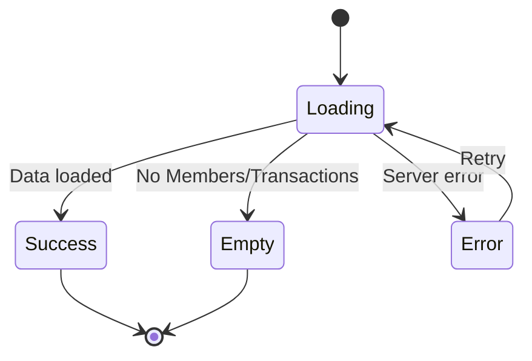

# Epic 12: SP Hierarchy Management
**Author/Owner**: Business Systems Analyst (BSA)
**Module**: Startup Partner O2O
**Date**: 2026-03-26
**Status**: ⚪ Draft

## Change Log

| Version | Date | Author | Changes |
|---------|------|--------|---------|
| 1.0 | 2026-03-26 | BSA | Initial draft |

**Status:** ⚪ Draft / 🟡 In Review / 🟢 Final

> **💡 When updating:** Change Status to 🟢 Final / Approved ONLY AFTER explicit approval.

**PRD Reference:** `docs/modules/startup-partner-o2o/prd.md` (provided by PO)
**BRD Reference:** `docs/modules/startup-partner-o2o/brd.md`
**Maps to:** FR-044, FR-045, FR-046, FR-082

---

### 1. Epic Information

| Field | Value |
|-------|-------|
| **Epic ID** | EPIC-12 |
| **Epic Name** | SP Hierarchy Management |
| **Epic Description** | Support 2-level hierarchy where Thammasorn internal sales reps (Leaders) supervise public freelance SPs (Members) |
| **Business Objective** | Enable Leaders to view and manage assigned Members, monitor performance metrics, and view team transaction data in read-only mode to provide guidance and support |
| **Target Release** | TBD |
| **Epic Owner** | BSA |
| **Epic Status** | Backlog |
| **Priority** | P0 |
| **Estimated Story Points** | TBD |

#### Epic User Story
As a Leader (Thammasorn internal sales rep), I want to view and manage my assigned Members and their transaction data, so that I can provide guidance, support, and monitor team performance.

#### Epic Scope
**In Scope:**
- Leader-Member hierarchy
- Leader capabilities
- Member assignment
- Performance visibility
- Leader transaction visibility (read-only)
- Auto-provisioning for Thammasorn reps

**Out of Scope:**
- Multi-level hierarchy (>2 levels)
- Commission sharing between Leader and Member
- Leader performance bonuses
- Leader transaction management rights

#### Related Epics
| Epic ID | Epic Name | Relationship |
|---------|-----------|--------------|
| EPIC-03 | SP Registration & Profile | Related (SP profile and hierarchy assignment) |
| EPIC-11 | SP Commission Management & Payout | Related (commission visibility for Leaders) |

#### Epic Success Criteria
- [ ] Leaders can view and manage assigned Members
- [ ] Member assignment works correctly
- [ ] Performance metrics visible
- [ ] Leaders can view team transaction data in read-only mode

---

### 2. User Stories

> Each user story follows the BRD structure: US → AC (Given/When/Then) → BR → Validation → Edge Cases → Error Handling → State Behavior. This epic contains 2 user stories: US-19 and US-19A.

#### US-19: Leader View and Manage Team Members
**As a** Leader (Thammasorn internal sales rep), **I want to** view and manage my assigned Members, **so that** I can provide guidance and support.

**Preconditions:**
- Leader is logged in to SP Portal
- Leader has assigned Members

**Business Rules:**
| Rule ID | Rule Description | Priority |
|---------|------------------|----------|
| BR-108 | Leader level: Thammasorn internal sales reps (global service areas) | P0 |
| BR-109 | Member level: Public freelance SPs (assigned service areas) | P0 |
| BR-110 | Each Member assigned to one Leader | P0 |
| BR-111 | Leaders can have multiple Members | P0 |
| BR-112 | Leaders can view Member performance metrics but cannot edit Member data or commissions | P0 |
| BR-113 | Leaders can provide feedback or recommendations to Admin | P1 |
| BR-297 | Leader and Admin can track each SP's training and certification status, including module progress and assessment outcomes | P0 |
| BR-298 | Leader and Admin can assign retraining to specific SPs | P1 |
| BR-299 | Leader and Admin can control activation/deactivation of live selling permissions based on certification status | P0 |
| BR-300 | SP detail view must show comprehensive data including: profile, service areas, training status, sales, orders, commissions | P0 |

**Validation Rules:**
| Field | Validation Rule | Error Message |
|-------|-----------------|---------------|
| N/A | N/A | N/A |

**Acceptance Criteria:**
| # | Given | When | Then |
|---|-------|------|------|
| AC-74 | Leader is on team page | Leader views assigned Members | System displays list of Members with performance metrics (RFQs submitted, Quotes received, Conversions, Commissions earned) |
| AC-75 | Leader clicks on Member | Leader views Member detail | System displays Member profile, service areas, performance history |
| AC-76 | Leader wants to communicate with Member | Leader clicks "ส่งข้อความ" | System opens messaging interface |
| AC-77 | Leader provides feedback | Leader submits feedback to Admin | System sends feedback to Admin for review |

**Edge Cases (minimum 3):**
| # | Scenario | Expected Behavior |
|---|----------|-------------------|
| EC-60 | Leader has no assigned Members yet | Display "คุณยังไม่มีสมาชิกในทีม รอการมอบหมายจากแอดมิน" |
| EC-61 | Member performance is poor | Leader can flag for Admin review but cannot suspend Member |
| EC-62 | Leader tries to edit Member commission | System prevents action; display "ไม่สามารถแก้ไขค่าคอมมิชชันได้" |

**Error Handling:**
| Error | Trigger | User Feedback | Recovery |
|-------|---------|---------------|----------|
| Team load failure | Server error | ไม่สามารถโหลดข้อมูลทีมได้ กรุณาลองใหม่ | Retry button |

**State Behavior:**
| State | When | UI Requirements |
|-------|------|-----------------|
| Loading | Loading team data | Show loading spinner |
| Empty | No Members assigned | Display empty state with message |
| Success | Data loaded | Display Member list with performance metrics |
| Error | Load fails | Show error message with retry option |

#### US-19A: SP Leader View Team Transaction Data
**As a** Leader (Thammasorn internal sales rep), **I want to** view transaction data of my team members, **so that** I can monitor team performance and provide support.

**Preconditions:**
- Leader is logged in to SP Portal
- Leader has assigned Members
- Members have completed transactions

**Business Rules:**
| Rule ID | Rule Description | Priority |
|---------|------------------|----------|
| BR-148 | SP Leaders can view transaction data for their team members | P0 |
| BR-149 | Leader transaction visibility must be display-only (read-only) | P0 |
| BR-150 | Leaders must not be able to edit, override, or operate on transaction records | P0 |

**Validation Rules:**
| Field | Validation Rule | Error Message |
|-------|-----------------|---------------|
| N/A | N/A | N/A |

**Acceptance Criteria:**
| # | Given | When | Then |
|---|-------|------|------|
| AC-62 | Leader views team dashboard | Leader clicks "ธุรกรรมทีม" | System displays member transaction summary (read-only) |
| AC-63 | Leader clicks member transaction | Leader views transaction details | System shows transaction details (read-only) |
| AC-64 | Leader attempts to edit transaction | Leader tries to modify transaction | System denies with "ดูข้อมูลเท่านั้น ไม่สามารถแก้ไขได้" message |

**Edge Cases (minimum 3):**
| # | Scenario | Expected Behavior |
|---|----------|-------------------|
| EC-63 | Leader with no members | Display "ไม่มีสมาชิกในทีม" message |
| EC-64 | Leader viewing own transactions | System shows leader's own transactions separately from team view |
| EC-65 | Member has no transactions yet | Display "สมาชิกยังไม่มีธุรกรรม" for that member |

**Error Handling:**
| Error | Trigger | User Feedback | Recovery |
|-------|---------|---------------|----------|
| Transaction load failure | Server error | ไม่สามารถโหลดข้อมูลธุรกรรมได้ กรุณาลองใหม่ | Retry button |

**State Behavior:**
| State | When | UI Requirements |
|-------|------|-----------------|
| Loading | Fetching transaction data | Show loading spinner with "กำลังโหลดธุรกรรม..." |
| Empty | No transactions | Display "ยังไม่มีธุรกรรม" message |
| Success | Data loaded | Display transaction list (read-only) |
| Error | Load fails | Show error message with retry option |

---

### 3. Description

**Business Context:**
- **Problem Statement:** Thammasorn internal sales reps (Leaders) need visibility into their assigned freelance SP (Member) activities, performance, and transactions to provide effective guidance and support.
- **Current State:** No hierarchy structure exists for supervising freelance SPs; Leaders have no visibility into Member performance or transaction data.
- **Desired State:** A 2-level Leader-Member hierarchy where Leaders can view Member lists, performance metrics, training status, and transaction data (read-only) while providing feedback to Admin.
- **Business Value:** Improved oversight and mentoring of freelance SPs leads to better performance, higher conversion rates, and more effective platform utilization.

---

### 4. Prerequisites

| Prerequisite | Description | Status |
|--------------|-------------|--------|
| SP Portal Authentication | Leader must be authenticated via SP Portal | [ ] |
| Member Assignment | Admin must have assigned Members to Leader | [ ] |
| Transaction Data | Members must have transaction history for US-19A | [ ] |

**Dependencies:**
- SP Registration & Profile (EPIC-03) for SP profile data
- Commission Management (EPIC-11) for commission data visibility
- Admin SP Management for Leader-Member assignment

---

### 5. Terminology

| Term | Definition |
|------|------------|
| Leader | Thammasorn internal sales rep with global service areas who supervises Members |
| Member | Public freelance SP with assigned service areas, assigned to one Leader |
| Hierarchy | 2-level Leader-Member structure for team management |
| Performance Metrics | RFQs submitted, Quotes received, Conversions, Commissions earned |

---

### 6. Role and Permission Matrix

| Role | Permission | Access Level |
|------|------------|--------------|
| Leader | team:view | Read (view assigned Members and their data) |
| Leader | team:feedback | Write (submit feedback to Admin) |
| Leader | team:transactions | Read (view team transaction data, read-only) |
| Leader | training:view | Read (view SP training and certification status) |
| Leader | training:assign | Write (assign retraining to specific SPs) |
| Leader | selling:control | Write (activate/deactivate live selling permissions based on certification) |
| Admin | team:manage | Write (assign/reassign Members to Leaders) |

**Permission Definitions:**
- `team:view` - View assigned Members, performance metrics, and profiles
- `team:feedback` - Submit feedback or recommendations to Admin
- `team:transactions` - View team member transaction data (display-only)
- `training:view` - View SP training and certification status
- `training:assign` - Assign retraining to specific SPs
- `selling:control` - Activate/deactivate live selling permissions
- `team:manage` - Admin-level Member assignment management

---

### 7. Information in the List

| Field Name | Format | Example | No Value | Condition |
|------------|--------|---------|----------|-----------|
| Member Name | Text | สมชาย ใจดี | - | Always displayed |
| Service Areas | Text list | กรุงเทพฯ, นนทบุรี | ยังไม่มีพื้นที่ | Assigned areas |
| RFQs Submitted | Number | 45 | 0 | Cumulative count |
| Quotes Received | Number | 30 | 0 | Cumulative count |
| Conversions | Number | 12 | 0 | Cumulative count |
| Commissions Earned | Currency (THB) | ฿15,000.00 | ฿0.00 | Cumulative total |
| Training Status | Badge | Certified / In Progress | ยังไม่เริ่ม | Current status |
| Transaction Date | Date | 2026-03-25 | - | Transaction timestamp |
| Transaction Amount | Currency (THB) | ฿5,000.00 | - | Order amount |

**Display Rules:**
- Member list sorted by name alphabetically by default
- Performance metrics shown as summary cards and detailed table
- Transaction data displayed in read-only mode with no edit controls
- Training status shown as color-coded badge

---

### 8. Requirements

#### 8.1 General Information

| Field | Value |
|-------|-------|
| **Story Type** | New feature |
| **Application** | SP Portal |
| **Module** | SP Hierarchy Management |
| **Pages** | /sp/team, /sp/team/:memberId, /sp/team/transactions |
| **Priority** | P0 |
| **Complexity** | Medium |

#### 8.2 Happy Path

1. Leader logs in to SP Portal
2. Leader navigates to Team page
3. System displays list of assigned Members with performance metrics
4. Leader clicks on a Member to view details
5. System displays Member profile, service areas, training status, performance history
6. Leader navigates to Team Transactions
7. System displays member transaction summary (read-only)
8. Leader clicks on a specific transaction to view details
9. System shows transaction details in read-only mode

#### 8.3 Allowed Roles

- Leader (Thammasorn internal sales rep)
- Admin (for team assignment management)

#### 8.4 Business Rules

| Rule ID | Rule Description | Priority |
|---------|------------------|----------|
| BR-108 | Leader level: Thammasorn internal sales reps (global service areas) | P0 |
| BR-109 | Member level: Public freelance SPs (assigned service areas) | P0 |
| BR-110 | Each Member assigned to one Leader | P0 |
| BR-111 | Leaders can have multiple Members | P0 |
| BR-112 | Leaders can view Member performance metrics but cannot edit Member data or commissions | P0 |
| BR-113 | Leaders can provide feedback or recommendations to Admin | P1 |
| BR-148 | SP Leaders can view transaction data for their team members | P0 |
| BR-149 | Leader transaction visibility must be display-only (read-only) | P0 |
| BR-150 | Leaders must not be able to edit, override, or operate on transaction records | P0 |
| BR-297 | Leader and Admin can track each SP's training and certification status, including module progress and assessment outcomes | P0 |
| BR-298 | Leader and Admin can assign retraining to specific SPs | P1 |
| BR-299 | Leader and Admin can control activation/deactivation of live selling permissions based on certification status | P0 |
| BR-300 | SP detail view must show comprehensive data including: profile, service areas, training status, sales, orders, commissions | P0 |

#### 8.5 Validation Rules

| Field | Validation Rule | Error Message |
|-------|-----------------|---------------|
| N/A | N/A | N/A |

---

### 9. Acceptance Criteria

> All acceptance criteria use **Given/When/Then** format.

#### 9.1 View Mode Scenarios

**Scenario: Empty State (No Members)**

**Given** Leader is logged in and has no assigned Members
**When** Leader navigates to Team page
**Then** System displays "คุณยังไม่มีสมาชิกในทีม รอการมอบหมายจากแอดมิน"

**Scenario: Loading State**

**Given** Leader navigates to Team page
**When** System is fetching team data
**Then** System displays loading spinner

**Scenario: Success State (Member List)**

**Given** Leader is on team page
**When** Leader views assigned Members
**Then** System displays list of Members with performance metrics (RFQs submitted, Quotes received, Conversions, Commissions earned)

**Scenario: Success State (Member Detail)**

**Given** Leader clicks on Member
**When** Leader views Member detail
**Then** System displays Member profile, service areas, performance history

**Scenario: Error State**

**Given** Leader navigates to Team page
**When** Server returns error
**Then** System displays "ไม่สามารถโหลดข้อมูลทีมได้ กรุณาลองใหม่" with retry button

#### 9.2 Action Mode Scenarios

**Scenario: Send Message to Member**

**Given** Leader wants to communicate with Member
**When** Leader clicks "ส่งข้อความ"
**Then** System opens messaging interface

**Scenario: Submit Feedback to Admin**

**Given** Leader provides feedback
**When** Leader submits feedback to Admin
**Then** System sends feedback to Admin for review

**Scenario: Attempt to Edit Member Commission (Denied)**

**Given** Leader tries to edit Member commission
**When** Leader attempts the edit action
**Then** System prevents action; displays "ไม่สามารถแก้ไขค่าคอมมิชชันได้"

#### 9.3 Transaction View Scenarios

**Scenario: View Team Transactions**

**Given** Leader views team dashboard
**When** Leader clicks "ธุรกรรมทีม"
**Then** System displays member transaction summary (read-only)

**Scenario: View Transaction Details**

**Given** Leader clicks member transaction
**When** Leader views transaction details
**Then** System shows transaction details (read-only)

**Scenario: Attempt to Edit Transaction (Denied)**

**Given** Leader attempts to edit transaction
**When** Leader tries to modify transaction
**Then** System denies with "ดูข้อมูลเท่านั้น ไม่สามารถแก้ไขได้" message

**Scenario: Empty Transaction State (No Members)**

**Given** Leader has no members
**When** Leader navigates to team transactions
**Then** System displays "ไม่มีสมาชิกในทีม" message

**Scenario: Empty Transaction State (Member Has No Transactions)**

**Given** Member has no transactions yet
**When** Leader views that member's transactions
**Then** System displays "สมาชิกยังไม่มีธุรกรรม" for that member

**Scenario: Leader Own Transactions**

**Given** Leader viewing own transactions
**When** Leader navigates to transactions
**Then** System shows leader's own transactions separately from team view

#### 9.4 Loading State Scenarios (Action Mode)

**Scenario: Loading during transaction fetch**

**Given** Leader navigates to team transactions
**When** System is fetching transaction data
**Then** Show loading spinner with "กำลังโหลดธุรกรรม...", form/navigation disabled

#### 9.5 Field Validation Scenarios

N/A — This epic is primarily read-only with no data entry fields.

#### 9.6 Edge Cases

**Scenario: Poor Member Performance**

**Given** Member performance is poor
**When** Leader reviews Member metrics
**Then** Leader can flag for Admin review but cannot suspend Member

---

### 10. Risk Assessment

| Risk ID | Risk Description | Category | Probability | Impact | Risk Level | Mitigation Strategy | Owner | Status |
|---------|------------------|----------|-------------|--------|------------|---------------------|-------|--------|
| R-001 | Leader attempts to modify Member data despite read-only restrictions | Operational | M | H | High | Enforce read-only at API level; UI disables all edit controls | Tech Lead | Open |
| R-002 | Performance metrics inaccuracy due to data sync delays | Technical | M | M | Medium | Implement near-real-time data sync with clear "last updated" timestamps | Tech Lead | Open |
| R-003 | Unauthorized access to Member data by non-assigned Leaders | Compliance | L | H | Medium | Enforce Leader-Member assignment validation on every API call | Tech Lead | Open |
| R-004 | Transaction data leakage across team boundaries | Compliance | L | H | Medium | Server-side filtering ensures Leaders only see their own team's data | Tech Lead | Open |
| R-005 | Hierarchy assignment errors causing orphaned Members | Operational | M | M | Medium | Admin validation workflow for Member assignment; alerts for unassigned Members | BSA | Open |

#### Risk Summary
- **Total Risks:** 5
- **Critical Risks:** 0
- **High Risks:** 1
- **Medium Risks:** 4
- **Low Risks:** 0

---

### 11. Data Dictionary

#### Entity: SP Hierarchy

| Attribute Name | Data Type | Length | Required | Unique | Default Value | Description |
|----------------|-----------|--------|----------|--------|---------------|-------------|
| hierarchy_id | UUID | 36 | Yes | Yes | Auto-generated | Unique hierarchy record ID |
| leader_id | UUID | 36 | Yes | No | - | Reference to Leader SP profile |
| member_id | UUID | 36 | Yes | Yes | - | Reference to Member SP profile (unique — one Leader per Member) |
| assigned_date | DateTime | - | Yes | No | Current timestamp | Date Member was assigned to Leader |
| assigned_by | UUID | 36 | Yes | No | - | Admin who made the assignment |
| status | Enum | - | Yes | No | Active | Active / Inactive |

#### Relationships

| Related Entity | Relationship Type | Cardinality | Description |
|----------------|-------------------|-------------|-------------|
| SP Profile (Leader) | Many-to-One | N:1 | Multiple hierarchy records can reference one Leader |
| SP Profile (Member) | One-to-One | 1:1 | Each Member assigned to exactly one Leader |
| Transaction | One-to-Many | 1:N | Each Member can have multiple transactions viewable by Leader |

---

### 12. Audit Trail Requirements

| Action | Data to Capture | Retention Period |
|--------|-----------------|------------------|
| VIEW_TEAM | Leader ID, Timestamp, IP address | 1 year |
| VIEW_MEMBER_DETAIL | Leader ID, Member ID, Timestamp, IP address | 1 year |
| VIEW_TRANSACTION | Leader ID, Member ID, Transaction ID, Timestamp, IP address | 1 year |
| SUBMIT_FEEDBACK | Leader ID, Member ID, Feedback content, Timestamp, IP address | 2 years |
| ASSIGN_MEMBER | Admin ID, Leader ID, Member ID, Timestamp, IP address | 2 years |
| REASSIGN_MEMBER | Admin ID, Old Leader ID, New Leader ID, Member ID, Timestamp, IP address | 2 years |

---

### 13. Notes

- Leader role is exclusively for Thammasorn internal sales reps; auto-provisioning should be implemented for these reps
- Transaction visibility is strictly read-only — no edit, override, or operational controls for Leaders
- The hierarchy is limited to 2 levels only; multi-level hierarchy is explicitly out of scope
- Commission sharing between Leader and Member is out of scope for this epic

**Questions for Tech Lead / Designer:**
- What is the auto-provisioning mechanism for Thammasorn reps as Leaders?
- Should the messaging interface (AC-76) use an in-app messaging system or external channels?
- What are the performance metric refresh intervals?
- How should the "flag for Admin review" workflow (EC-61) be implemented?

---

### 14. Draft Technical Design

#### 14.1 API Endpoints

| Method | Endpoint | Description | Authentication |
|--------|----------|-------------|----------------|
| GET | /api/sp/team/members | List assigned Members for Leader | Required (Leader role) |
| GET | /api/sp/team/members/:memberId | Get Member detail | Required (Leader role) |
| GET | /api/sp/team/transactions | List team transaction summary | Required (Leader role) |
| GET | /api/sp/team/transactions/:transactionId | Get transaction detail (read-only) | Required (Leader role) |
| POST | /api/sp/team/feedback | Submit feedback to Admin | Required (Leader role) |
| POST | /api/sp/team/members/:memberId/flag | Flag Member for Admin review | Required (Leader role) |

#### 14.2 Database Schema

```sql
-- SP Hierarchy
CREATE TABLE sp_hierarchy (
    hierarchy_id UUID PRIMARY KEY DEFAULT gen_random_uuid(),
    leader_id UUID NOT NULL,
    member_id UUID NOT NULL UNIQUE,
    assigned_date TIMESTAMP NOT NULL DEFAULT NOW(),
    assigned_by UUID NOT NULL,
    status VARCHAR(20) NOT NULL DEFAULT 'Active',
    created_at TIMESTAMP NOT NULL DEFAULT NOW(),
    updated_at TIMESTAMP NOT NULL DEFAULT NOW(),
    CONSTRAINT fk_leader FOREIGN KEY (leader_id) REFERENCES sp_profiles(id),
    CONSTRAINT fk_member FOREIGN KEY (member_id) REFERENCES sp_profiles(id),
    CONSTRAINT fk_assigned_by FOREIGN KEY (assigned_by) REFERENCES admin_users(id)
);

-- Leader Feedback
CREATE TABLE sp_leader_feedback (
    feedback_id UUID PRIMARY KEY DEFAULT gen_random_uuid(),
    leader_id UUID NOT NULL,
    member_id UUID NOT NULL,
    feedback_content TEXT NOT NULL,
    status VARCHAR(20) NOT NULL DEFAULT 'Pending',
    created_at TIMESTAMP NOT NULL DEFAULT NOW(),
    CONSTRAINT fk_feedback_leader FOREIGN KEY (leader_id) REFERENCES sp_profiles(id),
    CONSTRAINT fk_feedback_member FOREIGN KEY (member_id) REFERENCES sp_profiles(id)
);
```

#### 14.3 State Management



#### 14.4 UI/UX Considerations

- Team page should display Member cards with key metrics at a glance
- Transaction view must have no edit buttons, no inline editing, no action menus
- Read-only enforcement should be visually clear (no clickable edit elements)
- Performance metrics should use charts/graphs for quick comprehension
- Mobile-responsive layout for Leader field use

---

### 15. Testing Checklist

#### Pre-Testing
- [ ] All prerequisites are met
- [ ] Test environment is set up
- [ ] Test data is prepared (Leaders with assigned Members, Members with transactions)
- [ ] Test accounts are created with Leader permissions

#### Functional Testing
- [ ] Happy path: Leader views Member list with performance metrics
- [ ] Happy path: Leader views Member detail
- [ ] Happy path: Leader views team transaction summary (read-only)
- [ ] Happy path: Leader views transaction details (read-only)
- [ ] Empty state: No Members assigned displays correct message
- [ ] Empty state: No transactions displays correct message
- [ ] Loading state displays correctly
- [ ] Error states display correctly with retry option
- [ ] Leader cannot edit Member data or commissions
- [ ] Leader cannot edit or operate on transaction records
- [ ] Feedback submission to Admin works correctly
- [ ] Leader can only see their own assigned Members' data

#### Security Testing
- [ ] Unauthorized access to other Leaders' Members is blocked
- [ ] Read-only enforcement at API level (no write endpoints for transaction data)
- [ ] Permission checks work correctly for Leader role
- [ ] SQL injection is prevented
- [ ] XSS is prevented

#### Performance Testing
- [ ] Page load time is acceptable with large Member lists
- [ ] Transaction list loads acceptably with high volume
- [ ] API response time is acceptable

#### Cross-Browser Testing
- [ ] Chrome
- [ ] Firefox
- [ ] Safari
- [ ] Edge

#### Mobile Testing
- [ ] Responsive design works on mobile
- [ ] Touch interactions work correctly

---

### 16. Approval

| Role | Name | Signature | Date |
|------|------|-----------|------|
| Product Owner | | | |
| Business Analyst | | | |
| Technical Lead | | | |
| QA Lead | | | |

---

**Document Version:** 1.0
**Last Updated:** 2026-03-26
**Author:** BSA
**Status:** Draft
