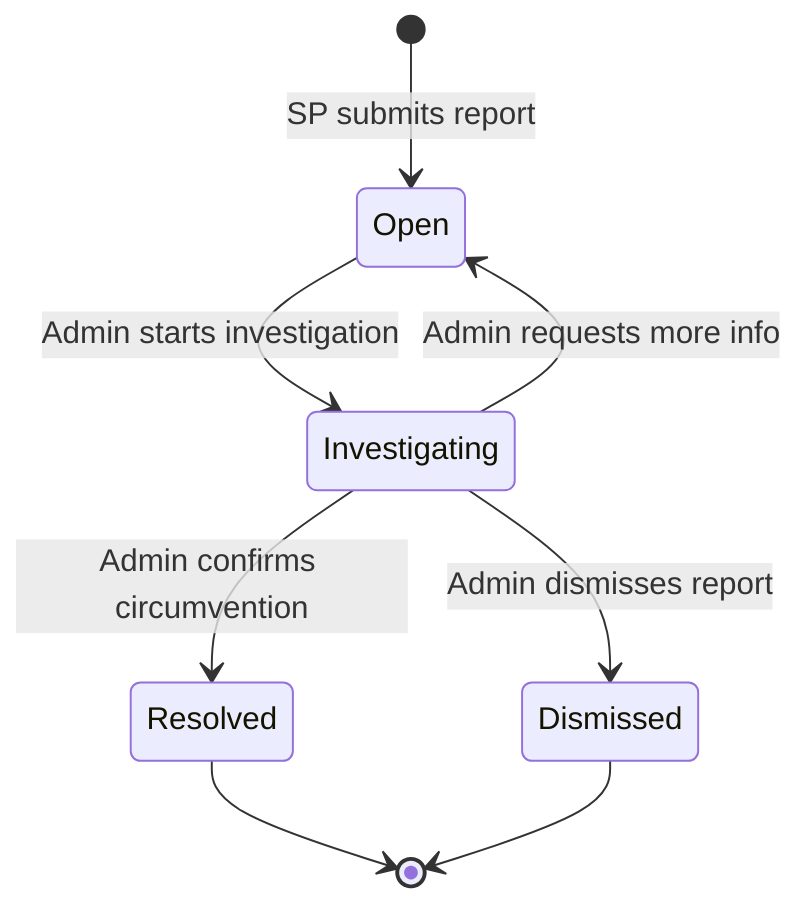

# Epic 13: Dispute Resolution & Platform Mediation
**Author/Owner**: Business Systems Analyst (BSA)
**Module**: Startup Partner O2O
**Date**: 2026-03-26
**Status**: ⚪ Draft

## Change Log

| Version | Date | Author | Changes |
|---------|------|--------|---------|
| 1.0 | 2026-03-26 | BSA | Initial draft |

**Status:** ⚪ Draft / 🟡 In Review / 🟢 Final

> **💡 When updating:** Change Status to 🟢 Final / Approved ONLY AFTER explicit approval.

**PRD Reference:** `docs/modules/startup-partner-o2o/prd.md` (provided by PO)
**BRD Reference:** `docs/modules/startup-partner-o2o/brd.md`
**Maps to:** FR-047, FR-048, FR-049

---

### 1. Epic Information

| Field | Value |
|-------|-------|
| **Epic ID** | EPIC-13 |
| **Epic Name** | Dispute Resolution & Platform Mediation |
| **Epic Description** | Provide dispute resolution workflows with Allkons M Admin as sole mediator and mechanisms to prevent platform circumvention |
| **Business Objective** | Protect SP commissions by enabling SPs to report sellers who attempt to bypass the platform, with Admin-mediated investigation and resolution |
| **Target Release** | TBD |
| **Epic Owner** | BSA |
| **Epic Status** | Backlog |
| **Priority** | P0 |
| **Estimated Story Points** | TBD |

#### Epic User Story
As a Startup Partner, I want to report sellers who attempt to bypass the platform, so that my commissions are protected and disputes are resolved fairly through Admin mediation.

#### Epic Scope
**In Scope:**
- Dispute creation
- Dispute categorization
- Admin mediation
- Circumvention reporting
- Dispute resolution history

**Out of Scope:**
- Automated dispute resolution
- Third-party arbitration
- Legal proceedings

#### Related Epics
| Epic ID | Epic Name | Relationship |
|---------|-----------|--------------|
| EPIC-11 | SP Commission Management & Payout | Related (commission protection) |
| EPIC-09 | Magic Link Generation | Related (transaction tracking for evidence) |
| EPIC-12 | SP Hierarchy Management | Related (Leader visibility into disputes) |

#### Epic Success Criteria
- [ ] Disputes resolved within 7 days
- [ ] Circumvention reports investigated
- [ ] Dispute history maintained

---

### 2. User Stories

> Each user story follows the BRD structure: US → AC (Given/When/Then) → BR → Validation → Edge Cases → Error Handling → State Behavior. This epic contains 1 user story: US-20.

#### US-20: SP Report Platform Circumvention
**As a** Startup Partner, **I want to** report sellers who attempt to bypass the platform, **so that** my commissions are protected.

**Preconditions:**
- SP is logged in to SP Portal
- SP has evidence of circumvention attempt

**Business Rules:**
| Rule ID | Rule Description | Priority |
|---------|------------------|----------|
| BR-114 | Digital Quotation (approved via Offer Link) is the absolute legal source of truth for all transactions | P0 |
| BR-115 | Offline promises made by SPs are not recognized by the platform | P0 |
| BR-116 | Admin portal includes reporting mechanism for SPs to flag Sellers attempting to bypass platform | P0 |
| BR-117 | Admin investigates circumvention reports | P0 |
| BR-118 | Penalties for Sellers found guilty of circumvention (suspension from SP program, account suspension) | P0 |
| BR-119 | Evidence collection: Message history, timestamps, buyer confirmation | P0 |

**Validation Rules:**
| Field | Validation Rule | Error Message |
|-------|-----------------|---------------|
| Description | Required, max 1000 chars | กรุณาระบุรายละเอียดการรายงาน |
| Evidence | At least 1 file attachment (screenshot, document) | กรุณาแนบหลักฐาน |

**Acceptance Criteria:**
| # | Given | When | Then |
|---|-------|------|------|
| AC-78 | SP suspects circumvention | SP clicks "รายงานปัญหา" | System displays report form with description field and file upload |
| AC-79 | SP submits report | SP fills form and clicks "ส่งรายงาน" | System creates dispute with status "Open", notifies Admin, displays confirmation |
| AC-80 | Admin investigates report | Admin reviews evidence | Admin can request additional info, contact parties, make decision |
| AC-81 | Admin finds seller guilty | Admin confirms circumvention | System suspends seller from SP program, notifies SP and seller |

**Edge Cases (minimum 3):**
| # | Scenario | Expected Behavior |
|---|----------|-------------------|
| EC-63 | SP reports without sufficient evidence | Admin requests additional evidence before proceeding |
| EC-64 | Seller denies circumvention | Admin reviews message history and buyer confirmation to determine truth |
| EC-65 | Multiple SPs report same seller | Admin consolidates reports and investigates once |

**Error Handling:**
| Error | Trigger | User Feedback | Recovery |
|-------|---------|---------------|----------|
| Report submission failure | Server error | ไม่สามารถส่งรายงานได้ กรุณาลองใหม่ | Retry button |
| File upload failure | Network error | การอัปโหลดไฟล์ล้มเหลว กรุณาลองใหม่ | Retry upload |

**State Behavior:**
| State | When | UI Requirements |
|-------|------|-----------------|
| Loading | Submitting report | Show loading spinner |
| Success | Report submitted | Display confirmation with report ID |
| Error | Submission fails | Show error message with retry option |

---

### 3. Description

**Business Context:**
- **Problem Statement:** Sellers may attempt to bypass the platform to avoid paying Platform Fees, which directly impacts SP commissions and undermines the marketplace model.
- **Current State:** No formal mechanism exists for SPs to report circumvention attempts or for Admin to investigate and resolve disputes.
- **Desired State:** SPs can submit circumvention reports with evidence, Admin investigates and mediates, and penalties are enforced for guilty sellers within a 7-day resolution target.
- **Business Value:** Protects SP commission integrity, deters platform circumvention, maintains trust in the marketplace, and ensures all transactions flow through the official platform.

---

### 4. Prerequisites

| Prerequisite | Description | Status |
|--------------|-------------|--------|
| SP Portal Authentication | SP must be authenticated via SP Portal | [ ] |
| Admin Portal | Admin mediation interface must be available | [ ] |
| File Upload Service | Evidence upload capability must be operational | [ ] |
| Notification Service | Admin and SP notification system must be operational | [ ] |

**Dependencies:**
- SP Registration & Profile (EPIC-03) for SP identity
- Admin SP Management for Admin mediation capabilities
- Notification system for alerting Admin and parties

---

### 5. Terminology

| Term | Definition |
|------|------------|
| Platform Circumvention | Seller attempting to bypass the platform to transact directly with buyer, avoiding Platform Fees |
| Digital Quotation | Official quote approved via Offer Link; the absolute legal source of truth for all transactions |
| Dispute | A formal report submitted by SP alleging platform circumvention by a seller |
| Mediation | Admin-led investigation and resolution process for disputes |
| Evidence | Supporting materials (screenshots, message history, timestamps, buyer confirmation) submitted with a dispute report |

---

### 6. Role and Permission Matrix

| Role | Permission | Access Level |
|------|------------|--------------|
| SP (Member/Leader) | dispute:create | Write (submit circumvention reports) |
| SP (Member/Leader) | dispute:view_own | Read (view own submitted reports and status) |
| Admin | dispute:investigate | Write (review, request info, make decisions) |
| Admin | dispute:resolve | Write (confirm/dismiss circumvention, apply penalties) |
| Admin | dispute:view_all | Read (view all dispute reports) |

**Permission Definitions:**
- `dispute:create` - Submit a new circumvention report with evidence
- `dispute:view_own` - View status and history of own submitted reports
- `dispute:investigate` - Review evidence, request additional information, contact parties
- `dispute:resolve` - Make final decision on dispute, apply penalties if guilty
- `dispute:view_all` - View all dispute reports across the platform

---

### 7. Information in the List

| Field Name | Format | Example | No Value | Condition |
|------------|--------|---------|----------|-----------|
| Report ID | Text | RPT-20260326-001 | - | Auto-generated |
| Seller Name | Text | ร้านค้า ABC | - | Always displayed |
| Description | Text (truncated) | ผู้ขายพยายามติดต่อ... | - | Max 1000 chars |
| Evidence Count | Number | 3 files | 0 files | Minimum 1 required |
| Status | Badge | Open / Investigating / Resolved / Dismissed | - | Current dispute status |
| Submitted Date | Date | 2026-03-25 | - | Submission timestamp |
| Resolution Date | Date | 2026-03-30 | รอการพิจารณา | When resolved |

**Display Rules:**
- Reports sorted by submitted date (newest first)
- Status displayed as color-coded badge (Open=Yellow, Investigating=Blue, Resolved=Green, Dismissed=Gray)
- Description truncated in list view, full text in detail view
- Evidence files displayed as thumbnails/icons in detail view

---

### 8. Requirements

#### 8.1 General Information

| Field | Value |
|-------|-------|
| **Story Type** | New feature |
| **Application** | SP Portal / Admin Portal |
| **Module** | Dispute Resolution & Platform Mediation |
| **Pages** | /sp/disputes/new, /sp/disputes, /admin/disputes, /admin/disputes/:disputeId |
| **Priority** | P0 |
| **Complexity** | Medium |

#### 8.2 Happy Path

1. SP suspects a seller of platform circumvention
2. SP clicks "รายงานปัญหา" on SP Portal
3. System displays report form with description field and file upload
4. SP fills in description (max 1000 chars) and attaches evidence (at least 1 file)
5. SP clicks "ส่งรายงาน"
6. System creates dispute with status "Open", notifies Admin, displays confirmation with report ID
7. Admin receives notification and reviews the report
8. Admin investigates evidence (message history, timestamps, buyer confirmation)
9. Admin may request additional information from SP or contact parties
10. Admin makes decision and confirms circumvention
11. System suspends seller from SP program, notifies SP and seller

#### 8.3 Allowed Roles

- Startup Partner (Member or Leader) — for report submission
- Admin — for investigation and resolution

#### 8.4 Business Rules

| Rule ID | Rule Description | Priority |
|---------|------------------|----------|
| BR-114 | Digital Quotation (approved via Offer Link) is the absolute legal source of truth for all transactions | P0 |
| BR-115 | Offline promises made by SPs are not recognized by the platform | P0 |
| BR-116 | Admin portal includes reporting mechanism for SPs to flag Sellers attempting to bypass platform | P0 |
| BR-117 | Admin investigates circumvention reports | P0 |
| BR-118 | Penalties for Sellers found guilty of circumvention (suspension from SP program, account suspension) | P0 |
| BR-119 | Evidence collection: Message history, timestamps, buyer confirmation | P0 |

#### 8.5 Validation Rules

| Field | Validation Rule | Error Message |
|-------|-----------------|---------------|
| Description | Required, max 1000 chars | กรุณาระบุรายละเอียดการรายงาน |
| Evidence | At least 1 file attachment (screenshot, document) | กรุณาแนบหลักฐาน |

---

### 9. Acceptance Criteria

> All acceptance criteria use **Given/When/Then** format.

#### 9.1 View Mode Scenarios

**Scenario: Empty State (No Disputes)**

**Given** SP has not submitted any dispute reports
**When** SP navigates to disputes page
**Then** System displays empty state with option to create new report

**Scenario: Loading State**

**Given** SP navigates to disputes page
**When** System is fetching dispute data
**Then** System displays loading spinner

**Scenario: Success State (Dispute List)**

**Given** SP has submitted dispute reports
**When** SP views disputes page
**Then** System displays list of submitted reports with status badges

**Scenario: Error State**

**Given** SP navigates to disputes page
**When** Server returns error
**Then** System displays error message with retry option

#### 9.2 Action Mode Scenarios

**Scenario: Open Report Form**

**Given** SP suspects circumvention
**When** SP clicks "รายงานปัญหา"
**Then** System displays report form with description field and file upload

**Scenario: Submit Report Success**

**Given** SP fills form and attaches evidence
**When** SP clicks "ส่งรายงาน"
**Then** System creates dispute with status "Open", notifies Admin, displays confirmation

**Scenario: Admin Investigation**

**Given** Admin receives circumvention report
**When** Admin reviews evidence
**Then** Admin can request additional info, contact parties, make decision

**Scenario: Admin Confirms Circumvention**

**Given** Admin finds seller guilty
**When** Admin confirms circumvention
**Then** System suspends seller from SP program, notifies SP and seller

**Scenario: Submit Report — Frontend Validation Failure**

**Given** SP has not filled required fields
**When** SP clicks "ส่งรายงาน"
**Then** System displays validation errors: "กรุณาระบุรายละเอียดการรายงาน" and/or "กรุณาแนบหลักฐาน"

**Scenario: Submit Report — Server Error**

**Given** SP submits completed form
**When** Server returns error
**Then** System displays "ไม่สามารถส่งรายงานได้ กรุณาลองใหม่" with retry button

**Scenario: File Upload — Network Error**

**Given** SP attaches evidence file
**When** Network error occurs during upload
**Then** System displays "การอัปโหลดไฟล์ล้มเหลว กรุณาลองใหม่" with retry upload option

#### 9.3 Race Condition Scenarios

**Scenario: Multiple SPs Report Same Seller**

**Given** Multiple SPs report the same seller for circumvention
**When** Admin views reports
**Then** Admin consolidates reports and investigates once

#### 9.4 Loading State Scenarios (Action Mode)

**Scenario: Loading during report submission**

**Given** SP clicks "ส่งรายงาน" with valid data
**When** System is submitting the report
**Then** Show loading spinner, submit button disabled, form disabled

#### 9.5 Field Validation Scenarios

**Scenario: Description exceeds max length**

**Given** SP is filling report form
**When** SP enters more than 1000 characters in description
**Then** System displays validation error "กรุณาระบุรายละเอียดการรายงาน" and blocks submission

**Scenario: No evidence attached**

**Given** SP is filling report form
**When** SP attempts to submit without attaching any file
**Then** System displays validation error "กรุณาแนบหลักฐาน" and blocks submission

#### 9.6 Edge Cases

**Scenario: Insufficient Evidence**

**Given** SP reports without sufficient evidence
**When** Admin reviews the report
**Then** Admin requests additional evidence before proceeding

**Scenario: Seller Denies Circumvention**

**Given** Seller denies circumvention
**When** Admin investigates
**Then** Admin reviews message history and buyer confirmation to determine truth

---

### 10. Risk Assessment

| Risk ID | Risk Description | Category | Probability | Impact | Risk Level | Mitigation Strategy | Owner | Status |
|---------|------------------|----------|-------------|--------|------------|---------------------|-------|--------|
| R-001 | False circumvention reports submitted maliciously | Operational | M | M | Medium | Require evidence attachments; Admin verification before action | BSA | Open |
| R-002 | Dispute resolution exceeds 7-day target | Operational | M | M | Medium | SLA monitoring dashboard for Admin; escalation workflow | BSA | Open |
| R-003 | Evidence files contain malicious content | Technical | L | H | Medium | File scanning on upload; restrict allowed file types | Tech Lead | Open |
| R-004 | Seller suspension without due process | Compliance | L | H | Medium | Mandatory investigation steps before suspension; appeal mechanism | BSA | Open |
| R-005 | Loss of evidence data | Technical | L | H | Medium | Redundant storage; backup policies for dispute evidence | Tech Lead | Open |

#### Risk Summary
- **Total Risks:** 5
- **Critical Risks:** 0
- **High Risks:** 0
- **Medium Risks:** 5
- **Low Risks:** 0

---

### 11. Data Dictionary

#### Entity: Dispute Report

| Attribute Name | Data Type | Length | Required | Unique | Default Value | Description |
|----------------|-----------|--------|----------|--------|---------------|-------------|
| dispute_id | UUID | 36 | Yes | Yes | Auto-generated | Unique dispute record ID |
| report_id | VARCHAR | 20 | Yes | Yes | Auto-generated | Human-readable report ID (e.g., RPT-20260326-001) |
| sp_id | UUID | 36 | Yes | No | - | Reference to reporting SP |
| seller_id | UUID | 36 | Yes | No | - | Reference to reported seller |
| description | TEXT | 1000 | Yes | No | - | Circumvention description |
| status | Enum | - | Yes | No | Open | Open / Investigating / Resolved / Dismissed |
| resolution_notes | TEXT | - | No | No | NULL | Admin resolution notes |
| resolved_by | UUID | 36 | No | No | NULL | Admin who resolved the dispute |
| resolved_at | DateTime | - | No | No | NULL | Resolution timestamp |
| created_at | DateTime | - | Yes | No | Current timestamp | Report submission timestamp |
| updated_at | DateTime | - | Yes | No | Current timestamp | Last update timestamp |

#### Entity: Dispute Evidence

| Attribute Name | Data Type | Length | Required | Unique | Default Value | Description |
|----------------|-----------|--------|----------|--------|---------------|-------------|
| evidence_id | UUID | 36 | Yes | Yes | Auto-generated | Unique evidence record ID |
| dispute_id | UUID | 36 | Yes | No | - | Reference to parent dispute |
| file_url | VARCHAR | 500 | Yes | No | - | Storage URL for evidence file |
| file_name | VARCHAR | 255 | Yes | No | - | Original file name |
| file_type | VARCHAR | 50 | Yes | No | - | MIME type of the file |
| file_size | INTEGER | - | Yes | No | - | File size in bytes |
| uploaded_at | DateTime | - | Yes | No | Current timestamp | Upload timestamp |

#### Relationships

| Related Entity | Relationship Type | Cardinality | Description |
|----------------|-------------------|-------------|-------------|
| SP Profile | Many-to-One | N:1 | Multiple disputes can be filed by one SP |
| Seller | Many-to-One | N:1 | Multiple disputes can reference one seller |
| Dispute Evidence | One-to-Many | 1:N | Each dispute has at least one evidence file |
| Admin User | Many-to-One | N:1 | Multiple disputes can be resolved by one Admin |

---

### 12. Audit Trail Requirements

| Action | Data to Capture | Retention Period |
|--------|-----------------|------------------|
| CREATE | SP ID, Seller ID, Description, Evidence files, Timestamp, IP address | 3 years |
| UPDATE_STATUS | Admin ID, Dispute ID, Old status, New status, Timestamp, IP address | 3 years |
| REQUEST_INFO | Admin ID, Dispute ID, Request details, Timestamp, IP address | 3 years |
| RESOLVE | Admin ID, Dispute ID, Resolution decision, Resolution notes, Timestamp, IP address | 3 years |
| APPLY_PENALTY | Admin ID, Seller ID, Penalty type, Dispute ID, Timestamp, IP address | 5 years |
| VIEW | User ID, Dispute ID, Timestamp, IP address | 1 year |

---

### 13. Notes

- Digital Quotation (approved via Offer Link) is the absolute legal source of truth — this is critical for dispute resolution
- Offline promises made by SPs are not recognized by the platform and cannot be used as evidence of circumvention
- Admin is the sole mediator; no automated dispute resolution or third-party arbitration
- Resolution target is 7 days from report submission
- Penalties include suspension from SP program and account suspension

**Questions for Tech Lead / Designer:**
- What file types and size limits should be allowed for evidence uploads?
- Should there be an appeal mechanism for sellers who are penalized?
- How should consolidated reports (EC-65: multiple SPs reporting same seller) be presented to Admin?
- What notification channels should be used (email, in-app, SMS)?
- Should dispute history be visible to the reported seller?

---

### 14. Draft Technical Design

#### 14.1 API Endpoints

| Method | Endpoint | Description | Authentication |
|--------|----------|-------------|----------------|
| POST | /api/sp/disputes | Create new circumvention report | Required (SP role) |
| GET | /api/sp/disputes | List SP's own dispute reports | Required (SP role) |
| GET | /api/sp/disputes/:disputeId | Get dispute detail (own report) | Required (SP role) |
| POST | /api/sp/disputes/:disputeId/evidence | Upload additional evidence | Required (SP role) |
| GET | /api/admin/disputes | List all dispute reports | Required (Admin role) |
| GET | /api/admin/disputes/:disputeId | Get dispute detail for investigation | Required (Admin role) |
| PUT | /api/admin/disputes/:disputeId/status | Update dispute status | Required (Admin role) |
| POST | /api/admin/disputes/:disputeId/request-info | Request additional info from SP | Required (Admin role) |
| POST | /api/admin/disputes/:disputeId/resolve | Resolve dispute with decision | Required (Admin role) |

#### 14.2 Database Schema

```sql
-- Dispute Reports
CREATE TABLE dispute_reports (
    dispute_id UUID PRIMARY KEY DEFAULT gen_random_uuid(),
    report_id VARCHAR(20) NOT NULL UNIQUE,
    sp_id UUID NOT NULL,
    seller_id UUID NOT NULL,
    description TEXT NOT NULL CHECK (char_length(description) <= 1000),
    status VARCHAR(20) NOT NULL DEFAULT 'Open',
    resolution_notes TEXT,
    resolved_by UUID,
    resolved_at TIMESTAMP,
    created_at TIMESTAMP NOT NULL DEFAULT NOW(),
    updated_at TIMESTAMP NOT NULL DEFAULT NOW(),
    CONSTRAINT fk_sp FOREIGN KEY (sp_id) REFERENCES sp_profiles(id),
    CONSTRAINT fk_seller FOREIGN KEY (seller_id) REFERENCES sellers(id),
    CONSTRAINT fk_resolved_by FOREIGN KEY (resolved_by) REFERENCES admin_users(id),
    CONSTRAINT chk_status CHECK (status IN ('Open', 'Investigating', 'Resolved', 'Dismissed'))
);

-- Dispute Evidence
CREATE TABLE dispute_evidence (
    evidence_id UUID PRIMARY KEY DEFAULT gen_random_uuid(),
    dispute_id UUID NOT NULL,
    file_url VARCHAR(500) NOT NULL,
    file_name VARCHAR(255) NOT NULL,
    file_type VARCHAR(50) NOT NULL,
    file_size INTEGER NOT NULL,
    uploaded_at TIMESTAMP NOT NULL DEFAULT NOW(),
    CONSTRAINT fk_dispute FOREIGN KEY (dispute_id) REFERENCES dispute_reports(dispute_id)
);

-- Index for performance
CREATE INDEX idx_disputes_sp ON dispute_reports(sp_id);
CREATE INDEX idx_disputes_seller ON dispute_reports(seller_id);
CREATE INDEX idx_disputes_status ON dispute_reports(status);
CREATE INDEX idx_evidence_dispute ON dispute_evidence(dispute_id);
```

#### 14.3 State Management



#### 14.4 UI/UX Considerations

- Report form should be simple and intuitive with clear instructions
- File upload should support drag-and-drop and show upload progress
- Status badges should use distinct colors for each state
- Admin investigation view should show all evidence, parties, and timeline
- Confirmation dialogs required before penalty actions
- Mobile-responsive for SP field reporting

---

### 15. Testing Checklist

#### Pre-Testing
- [ ] All prerequisites are met
- [ ] Test environment is set up
- [ ] Test data is prepared (SPs, sellers, sample disputes)
- [ ] Test accounts are created with SP and Admin permissions
- [ ] File upload service is operational

#### Functional Testing
- [ ] Happy path: SP submits circumvention report with evidence
- [ ] Happy path: Admin investigates and resolves dispute
- [ ] Report form validates description (required, max 1000 chars)
- [ ] Report form validates evidence (at least 1 file required)
- [ ] Dispute status transitions work correctly (Open → Investigating → Resolved/Dismissed)
- [ ] Admin can request additional information from SP
- [ ] Seller suspension applies correctly upon guilty verdict
- [ ] Notifications sent to Admin on new report
- [ ] Notifications sent to SP and seller on resolution
- [ ] Empty state displays correctly (no disputes)
- [ ] Loading state displays correctly
- [ ] Error states display correctly with retry option
- [ ] Multiple SPs reporting same seller are handled correctly

#### Security Testing
- [ ] SP can only view own dispute reports
- [ ] Admin can view all dispute reports
- [ ] Unauthorized access is blocked
- [ ] File upload security (malicious file scanning)
- [ ] SQL injection is prevented
- [ ] XSS is prevented
- [ ] CSRF protection is in place

#### Performance Testing
- [ ] Report submission with large evidence files is acceptable
- [ ] Dispute list loads acceptably with high volume
- [ ] API response time is acceptable

#### Cross-Browser Testing
- [ ] Chrome
- [ ] Firefox
- [ ] Safari
- [ ] Edge

#### Mobile Testing
- [ ] Responsive design works on mobile
- [ ] File upload works on mobile
- [ ] Touch interactions work correctly

---

### 16. Approval

| Role | Name | Signature | Date |
|------|------|-----------|------|
| Product Owner | | | |
| Business Analyst | | | |
| Technical Lead | | | |
| QA Lead | | | |

---

**Document Version:** 1.0
**Last Updated:** 2026-03-26
**Author:** BSA
**Status:** Draft
