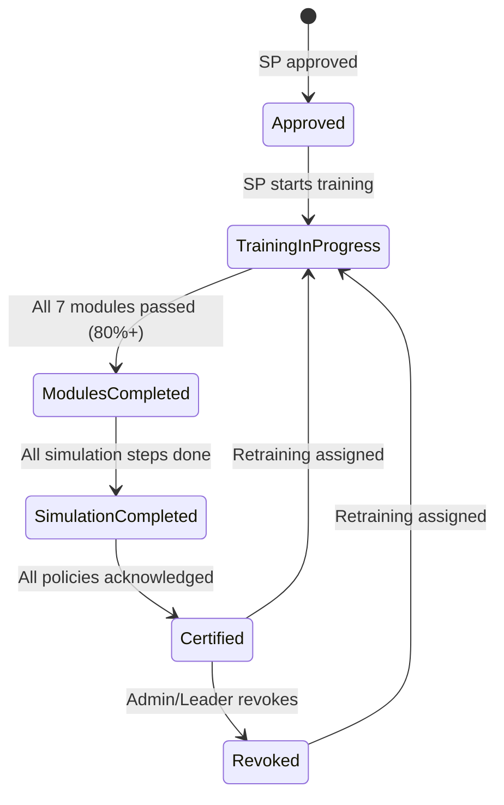

# Epic 14: SP Training & Certification
**Author/Owner**: Business Systems Analyst (BSA)
**Module**: Startup Partner O2O
**Date**: 2026-03-26
**Status**: ⚪ Draft

## Change Log

| Version | Date | Author | Changes |
|---------|------|--------|---------|
| 1.0 | 2026-03-26 | BSA | Initial draft |

**Status:** ⚪ Draft / 🟡 In Review / 🟢 Final

> **💡 When updating:** Change Status to 🟢 Final / Approved ONLY AFTER explicit approval.

**PRD Reference:** `docs/modules/startup-partner-o2o/startup-partner-o2o prd.md` (Status: 🟢 Final / Approved v1.5)
**BRD Reference:** `docs/modules/startup-partner-o2o/brd.md`
**Maps to:** FR-121 to FR-130

---

### 1. Epic Information

| Field | Value |
|-------|-------|
| **Epic ID** | EPIC-14 |
| **Epic Name** | SP Training & Certification |
| **Epic Description** | Ensure all Startup Partners complete mandatory training, pass assessments, and achieve certification before accessing live selling features; enable Admin/Leader to track training progress and manage certifications |
| **Business Objective** | All SPs complete training before live selling; assessment pass rate tracked; certification gate enforced; Admin can view training progress; retraining assignable |
| **Target Release** | TBD |
| **Epic Owner** | TBD |
| **Epic Status** | Backlog |
| **Priority** | P0 |
| **Estimated Story Points** | TBD |

#### Epic User Story
As the platform, I want to ensure all Startup Partners complete mandatory training, pass knowledge assessments, practice workflow simulations, and acknowledge compliance policies before accessing live selling features, so that SPs are properly equipped and compliant.

#### Epic Scope
**In Scope:**
- Training module delivery
- Knowledge assessments
- Workflow simulations
- Compliance acknowledgment
- Certification gate for live selling
- Retraining
- Admin/Leader training management

**Out of Scope:**
- LMS platform integration
- Video hosting (use external links)
- Gamification
- Training content creation tools

#### Related Epics
| Epic ID | Epic Name | Relationship |
|---------|-----------|--------------|
| EPIC-02 | SP Registration & Onboarding | Depends on (SP must be approved first) |
| EPIC-03 | Admin SP Management | Related (Admin manages training progress) |
| EPIC-12 | SP Hierarchy Management | Related (Leader views team training) |
| EPIC-05 | Product Discovery & Sourcing | Blocks (live selling gated by certification) |
| EPIC-06 | RFQ Creation & Management | Blocks (live selling gated by certification) |

#### Epic Success Criteria
- [ ] All SPs complete training before live selling
- [ ] Assessment pass rate tracked
- [ ] Certification gate enforced
- [ ] Admin can view training progress
- [ ] Retraining assignable

---

### 2. User Stories

> Each user story follows the BRD structure: US → AC (Given/When/Then) → BR → Validation → Edge Cases → Error Handling → State Behavior. ID scheme: `US-20A`, `US-20B`, `US-20C`, `US-20D` (scoped to this epic).

#### US-20A: SP Complete Required Training Modules
**As a** newly approved Startup Partner, **I want to** complete required training modules covering portal features, RFQ workflow, and compliance, **so that** I understand how to use the platform effectively and can earn my certification.

**Preconditions:**
- SP is approved (status = Approved)
- SP has not yet completed certification

**Business Rules:**
| Rule ID | Rule Description | Priority |
|---------|------------------|----------|
| BR-301 | Training is mandatory — SP cannot access live selling without certification | P0 |
| BR-302 | Training modules include: Portal Navigation, RFQ Creation, Quote Comparison, Magic Link Generation, Commission Understanding, Compliance & Code of Conduct, Dispute Resolution | P0 |
| BR-303 | Each module has learning content (text/video/screenshots) and a knowledge assessment | P0 |
| BR-304 | SP must pass each assessment with minimum 80% score | P0 |
| BR-305 | Failed assessments can be retried unlimited times | P1 |
| BR-306 | Training progress is saved — SP can resume where they left off | P0 |

**Validation Rules:**
| Field | Validation Rule | Error Message |
|-------|-----------------|---------------|
| Assessment Score | Minimum 80% to pass | ไม่ผ่าน — กรุณาลองใหม่ |

**Acceptance Criteria:**
| # | Given | When | Then |
|---|-------|------|------|
| AC-110 | SP is approved but not certified | SP logs into portal | System shows training dashboard with module list and progress |
| AC-111 | SP opens a training module | SP clicks module | System displays learning content with next/previous navigation |
| AC-112 | SP completes a module | SP finishes content and takes assessment | System records pass/fail and updates progress |
| AC-113 | SP fails assessment | Score below 80% | System shows "ไม่ผ่าน — กรุณาลองใหม่" with retry option |
| AC-114 | SP passes all modules | All 7 modules passed | System shows "ยินดีด้วย! คุณผ่านการอบรมแล้ว" |

**Edge Cases:**
| # | Scenario | Expected Behavior |
|---|----------|-------------------|
| EC-90 | SP closes browser during training | Progress saved, resume on next login |
| EC-91 | Training content updated after SP started | SP sees updated content, completed modules remain valid |
| EC-92 | SP approved but training system unavailable | Show error with retry, do not block portal access for status/profile |

**Error Handling:**
| Error | Trigger | User Feedback | Recovery |
|-------|---------|---------------|----------|
| Module load failure | Server error | ไม่สามารถโหลดบทเรียนได้ กรุณาลองใหม่ | Retry button |
| Assessment submit failure | Server error | ไม่สามารถส่งคำตอบได้ กรุณาลองใหม่ | Retry, answers preserved |

**State Behavior:**
| State | When | UI Requirements |
|-------|------|-----------------|
| Loading | Fetching training modules | Show loading spinner |
| Empty | No training modules configured | Display "ยังไม่มีบทเรียน กรุณาติดต่อผู้ดูแลระบบ" |
| Success | Modules loaded | Display training dashboard with module list, progress bars, and assessment status |
| Error | Fetch fails | Show error message with retry option |

#### US-20B: SP Complete Workflow Simulations
**As a** Startup Partner in training, **I want to** practice RFQ creation, quote comparison, and Magic Link generation in a sandbox environment, **so that** I can learn by doing before working with real sellers and buyers.

**Preconditions:**
- SP has completed all training modules
- SP has not yet completed certification

**Business Rules:**
| Rule ID | Rule Description | Priority |
|---------|------------------|----------|
| BR-307 | Workflow simulations use sandbox/demo data (not real sellers or buyers) | P0 |
| BR-308 | Simulations cover: Create RFQ → View Quotes → Compare → Generate Magic Link | P0 |
| BR-309 | SP must complete all simulation steps to proceed to compliance acknowledgment | P0 |

**Validation Rules:**
| Field | Validation Rule | Error Message |
|-------|-----------------|---------------|
| Simulation Steps | All steps must be completed | กรุณาทำทุกขั้นตอนให้ครบ |

**Acceptance Criteria:**
| # | Given | When | Then |
|---|-------|------|------|
| AC-115 | SP completed all training modules | SP enters simulation section | System shows sandbox environment with demo data |
| AC-116 | SP creates practice RFQ | SP fills form and submits | System simulates RFQ submission with demo stores |
| AC-117 | SP completes all simulation steps | All steps done | System marks simulations as complete |

**Edge Cases:**
| # | Scenario | Expected Behavior |
|---|----------|-------------------|
| EC-93 | SP tries to access simulation before completing modules | System blocks with "กรุณาเรียนบทเรียนทั้งหมดก่อน" |
| EC-94 | SP exits simulation midway | Progress saved, resume on next login |
| EC-95 | Demo data changes while SP is in simulation | Simulation continues with original data; no disruption |

**Error Handling:**
| Error | Trigger | User Feedback | Recovery |
|-------|---------|---------------|----------|
| Sandbox load failure | Server error | ไม่สามารถโหลดสภาพแวดล้อมฝึกหัดได้ กรุณาลองใหม่ | Retry button |
| Simulation step failure | Server error | ไม่สามารถดำเนินการได้ กรุณาลองใหม่ | Retry, progress preserved |

**State Behavior:**
| State | When | UI Requirements |
|-------|------|-----------------|
| Loading | Fetching sandbox environment | Show loading spinner with "กำลังโหลดสภาพแวดล้อมฝึกหัด..." |
| Success | Sandbox loaded | Display sandbox with demo data and step-by-step guide |
| Error | Fetch fails | Show error message with retry option |

#### US-20C: SP Acknowledge Compliance Policies
**As a** Startup Partner completing certification, **I want to** review and digitally acknowledge compliance policies, **so that** I understand the rules and responsibilities of being a certified SP.

**Preconditions:**
- SP has completed training modules and simulations

**Business Rules:**
| Rule ID | Rule Description | Priority |
|---------|------------------|----------|
| BR-310 | SP must read and acknowledge: Code of Conduct, Commission Structure, Dispute Resolution Process, Circumvention Penalties, Data Privacy Policy | P0 |
| BR-311 | Acknowledgment is digital signature with timestamp | P0 |
| BR-312 | All acknowledgments logged via Consent Center API | P0 |

**Validation Rules:**
| Field | Validation Rule | Error Message |
|-------|-----------------|---------------|
| All Policy Checkboxes | All must be checked before submit | กรุณาอ่านและยอมรับนโยบายทั้งหมด |

**Acceptance Criteria:**
| # | Given | When | Then |
|---|-------|------|------|
| AC-118 | SP completed modules and simulations | SP enters compliance section | System displays policies requiring acknowledgment |
| AC-119 | SP acknowledges all policies | SP checks all boxes and clicks "ยืนยัน" | System records acknowledgment, SP becomes "Certified", live selling unlocked |
| AC-120 | SP tries to skip acknowledgment | SP tries to access live selling | System blocks with "กรุณาอ่านและยอมรับนโยบายก่อน" |

**Edge Cases:**
| # | Scenario | Expected Behavior |
|---|----------|-------------------|
| EC-96 | SP tries to acknowledge without reading (scrolling) | System requires scroll-to-bottom or minimum time on each policy before checkbox becomes active |
| EC-97 | Consent Center API unavailable | Show error "ไม่สามารถบันทึกการยอมรับได้ กรุณาลองใหม่"; do not grant certification |
| EC-98 | Policies updated after SP certified | SP may need to re-acknowledge updated policies (at Admin discretion) |

**Error Handling:**
| Error | Trigger | User Feedback | Recovery |
|-------|---------|---------------|----------|
| Consent API failure | Server error | ไม่สามารถบันทึกการยอมรับได้ กรุณาลองใหม่ | Retry button |
| Policy load failure | Server error | ไม่สามารถโหลดนโยบายได้ กรุณาลองใหม่ | Retry button |

**State Behavior:**
| State | When | UI Requirements |
|-------|------|-----------------|
| Loading | Fetching policies | Show loading spinner |
| Success | Policies loaded | Display policy list with checkboxes and "ยืนยัน" button |
| Error | Fetch fails | Show error message with retry option |
| Certified | All acknowledged | Display "คุณได้รับการรับรองแล้ว" with access to live selling |

#### US-20D: Admin/Leader Manage Training & Certification
**As an** Admin or Leader, **I want to** track SP training progress, view assessment outcomes, assign retraining, and control live selling activation, **so that** I can ensure all SPs are properly trained before serving real buyers.

**Preconditions:**
- Admin or Leader is logged in

**Business Rules:**
| Rule ID | Rule Description | Priority |
|---------|------------------|----------|
| BR-313 | Admin sees training status for all SPs | P0 |
| BR-314 | Leader sees training status for team members only | P0 |
| BR-315 | Admin/Leader can assign retraining to specific modules | P1 |
| BR-316 | Admin/Leader can revoke certification (disable live selling) | P0 |
| BR-317 | Training progress notification sent via LINE OA when SP completes certification | P1 |

**Validation Rules:**
| Field | Validation Rule | Error Message |
|-------|-----------------|---------------|
| Retraining Modules | At least one module must be selected | กรุณาเลือกบทเรียนอย่างน้อย 1 บท |

**Acceptance Criteria:**
| # | Given | When | Then |
|---|-------|------|------|
| AC-121 | Admin views SP network | Admin clicks SP detail | System shows training section: modules completed, assessment scores, certification status, simulation completion |
| AC-122 | Admin assigns retraining | Admin selects modules and clicks "มอบหมายอบรมใหม่" | System resets selected modules for SP, sends LINE OA notification |
| AC-123 | Admin revokes certification | Admin clicks "ระงับสิทธิ์การขาย" | System disables live selling, SP sees "สิทธิ์การขายถูกระงับ — กรุณาติดต่อผู้ดูแล" |

**Edge Cases:**
| # | Scenario | Expected Behavior |
|---|----------|-------------------|
| EC-99 | Leader tries to manage SP outside their team | System blocks with "คุณไม่มีสิทธิ์จัดการ SP คนนี้" |
| EC-100 | Admin revokes certification for SP with active RFQs | System warns "SP มี RFQ ที่ดำเนินการอยู่"; Admin confirms to proceed |
| EC-101 | LINE OA notification fails | System retries; logs failure; does not block the operation |

**Error Handling:**
| Error | Trigger | User Feedback | Recovery |
|-------|---------|---------------|----------|
| Training data load failure | Server error | ไม่สามารถโหลดข้อมูลการอบรมได้ กรุณาลองใหม่ | Retry button |
| Retraining assignment failure | Server error | ไม่สามารถมอบหมายการอบรมใหม่ได้ กรุณาลองใหม่ | Retry button |
| Certification revocation failure | Server error | ไม่สามารถระงับสิทธิ์ได้ กรุณาลองใหม่ | Retry button |

**State Behavior:**
| State | When | UI Requirements |
|-------|------|-----------------|
| Loading | Fetching SP training data | Show loading spinner |
| Success | Data loaded | Display training progress, assessment scores, certification status |
| Error | Fetch fails | Show error message with retry option |

---

### 3. Description

**Business Context:**
- **Problem Statement:** Untrained SPs may misuse the platform, provide poor buyer experiences, or violate compliance policies, leading to reputational and financial risk.
- **Current State:** There is no structured training or certification gate; approved SPs immediately gain access to live selling features.
- **Desired State:** All SPs must complete mandatory training modules, pass knowledge assessments (80% minimum), practice workflows in a sandbox, and digitally acknowledge compliance policies before live selling is unlocked. Admin/Leader can track progress and assign retraining.
- **Business Value:** Ensures SP quality and compliance, reduces disputes and circumvention, protects buyer experience, and provides measurable training outcomes for management visibility.

---

### 4. Prerequisites

| Prerequisite | Description | Status |
|--------------|-------------|--------|
| EPIC-02 | SP Registration & Onboarding must be functional (SP approved status) | [ ] |
| EPIC-01 | SSO & Unified Authentication for SP login | [ ] |
| Consent Center API | Integration for logging compliance acknowledgments | [ ] |
| LINE OA Integration | For sending training completion notifications | [ ] |
| Training Content | Training module content must be authored and available | [ ] |

**Dependencies:**
- EPIC-02: SP Registration & Onboarding (SP must be approved before training)
- EPIC-01: SSO & Unified Authentication (SP login)
- Consent Center API (BR-312: logging compliance acknowledgments)
- LINE OA (BR-317: training progress notifications)

---

### 5. Terminology

| Term | Definition |
|------|------------|
| Certification | Status granted to SP after completing all training modules, simulations, and compliance acknowledgment |
| Training Module | A unit of learning content covering a specific topic (e.g., RFQ Creation, Quote Comparison) |
| Knowledge Assessment | Quiz/test at the end of each training module; minimum 80% score required to pass |
| Workflow Simulation | Sandbox environment where SP practices real workflows with demo data |
| Compliance Acknowledgment | Digital signature confirming SP has read and accepted platform policies |
| Retraining | Admin/Leader-assigned repeat of specific training modules |
| Live Selling | Access to real product discovery, RFQ creation, and buyer interaction features |

---

### 6. Role and Permission Matrix

| Role | Permission | Access Level |
|------|------------|--------------|
| Startup Partner (SP) | training:view | Read |
| Startup Partner (SP) | training:complete | Write |
| Startup Partner (SP) | simulation:access | Write |
| Startup Partner (SP) | compliance:acknowledge | Write |
| SP Leader | training:view (team) | Read |
| SP Leader | training:assign_retraining (team) | Write |
| SP Leader | certification:revoke (team) | Write |
| Admin | training:view (all) | Read |
| Admin | training:assign_retraining (all) | Write |
| Admin | certification:revoke (all) | Write |

**Permission Definitions:**
- `training:view` - View training modules and progress
- `training:complete` - Complete training modules and assessments
- `simulation:access` - Access sandbox simulation environment
- `compliance:acknowledge` - Digitally acknowledge compliance policies
- `training:assign_retraining` - Assign retraining to SP for specific modules
- `certification:revoke` - Revoke SP certification and disable live selling

---

### 7. Information in the List

| Field Name | Format | Example | No Value | Condition |
|------------|--------|---------|----------|-----------|
| SP Name | Text | "สมชาย ใจดี" | — | Always displayed |
| Training Status | Badge | "In Progress" / "Completed" / "Not Started" | "Not Started" | Always displayed |
| Modules Completed | Fraction | "5/7" | "0/7" | Always displayed |
| Assessment Scores | Percentage per module | "85%, 90%, 75%..." | "—" | Displayed after attempt |
| Simulation Status | Badge | "Completed" / "Not Started" | "Not Started" | After modules completed |
| Compliance Status | Badge | "Acknowledged" / "Pending" | "Pending" | After simulation completed |
| Certification Status | Badge | "Certified" / "Not Certified" / "Revoked" | "Not Certified" | Always displayed |
| Last Activity | DateTime | "2026-03-25 14:30" | "—" | When SP last accessed training |

**Display Rules:**
- Admin sees all SPs; Leader sees team members only (BR-313, BR-314)
- Certification status highlighted: green for Certified, yellow for In Progress, red for Revoked
- Assessment scores below 80% highlighted in red

---

### 8. Requirements

#### 8.1 General Information

| Field | Value |
|-------|-------|
| **Story Type** | New feature |
| **Application** | SP Portal, Admin Portal |
| **Module** | Startup Partner O2O |
| **Pages** | /sp/training, /sp/training/:moduleId, /sp/training/simulation, /sp/training/compliance, /admin/sp/:spId/training |
| **Priority** | P0 |
| **Complexity** | High |

#### 8.2 Happy Path

1. SP is approved and logs into the portal
2. System shows training dashboard with 7 modules and progress indicators
3. SP opens first training module and reads/watches learning content
4. SP takes knowledge assessment at end of module
5. SP scores 80% or above and module is marked as passed
6. SP repeats steps 3-5 for all 7 modules
7. SP enters workflow simulation section and practices RFQ → Quote → Compare → Magic Link flow with demo data
8. SP completes all simulation steps
9. SP enters compliance section and reads all 5 policies
10. SP checks all acknowledgment boxes and clicks "ยืนยัน"
11. System records acknowledgment via Consent Center API, grants "Certified" status, unlocks live selling
12. Admin/Leader can view training progress for SPs in their scope

#### 8.3 Allowed Roles

- Startup Partner (SP) — complete training
- SP Leader — view team training, assign retraining, revoke certification
- Admin — view all training, assign retraining, revoke certification

#### 8.4 Business Rules

| Rule ID | Rule Description | Priority |
|---------|------------------|----------|
| BR-301 | Training is mandatory — SP cannot access live selling without certification | P0 |
| BR-302 | Training modules include: Portal Navigation, RFQ Creation, Quote Comparison, Magic Link Generation, Commission Understanding, Compliance & Code of Conduct, Dispute Resolution | P0 |
| BR-303 | Each module has learning content (text/video/screenshots) and a knowledge assessment | P0 |
| BR-304 | SP must pass each assessment with minimum 80% score | P0 |
| BR-305 | Failed assessments can be retried unlimited times | P1 |
| BR-306 | Training progress is saved — SP can resume where they left off | P0 |
| BR-307 | Workflow simulations use sandbox/demo data (not real sellers or buyers) | P0 |
| BR-308 | Simulations cover: Create RFQ → View Quotes → Compare → Generate Magic Link | P0 |
| BR-309 | SP must complete all simulation steps to proceed to compliance acknowledgment | P0 |
| BR-310 | SP must read and acknowledge: Code of Conduct, Commission Structure, Dispute Resolution Process, Circumvention Penalties, Data Privacy Policy | P0 |
| BR-311 | Acknowledgment is digital signature with timestamp | P0 |
| BR-312 | All acknowledgments logged via Consent Center API | P0 |
| BR-313 | Admin sees training status for all SPs | P0 |
| BR-314 | Leader sees training status for team members only | P0 |
| BR-315 | Admin/Leader can assign retraining to specific modules | P1 |
| BR-316 | Admin/Leader can revoke certification (disable live selling) | P0 |
| BR-317 | Training progress notification sent via LINE OA when SP completes certification | P1 |

#### 8.5 Validation Rules

| Field | Validation Rule | Error Message |
|-------|-----------------|---------------|
| Assessment Score | Minimum 80% to pass | ไม่ผ่าน — กรุณาลองใหม่ |
| All Policy Checkboxes | All must be checked before submit | กรุณาอ่านและยอมรับนโยบายทั้งหมด |
| Retraining Modules | At least one module must be selected for retraining | กรุณาเลือกบทเรียนอย่างน้อย 1 บท |
| Simulation Steps | All steps must be completed | กรุณาทำทุกขั้นตอนให้ครบ |

---

### 9. Acceptance Criteria

> All acceptance criteria use **Given/When/Then** format. Cover all 6 scenario categories below.

#### 9.1 View Mode Scenarios

**Scenario: Training Dashboard — Not Started**

**Given** SP is approved but has not started training
**When** SP logs into the portal
**Then** System shows training dashboard with all 7 modules in "Not Started" state and progress at 0/7

**Scenario: Training Dashboard — In Progress**

**Given** SP has completed 3 of 7 modules
**When** SP logs into the portal
**Then** System shows training dashboard with 3 modules marked "Passed", 4 modules "Not Started", progress at 3/7

**Scenario: Loading State**

**Given** SP navigates to training section
**When** System is fetching training data
**Then** System shows loading spinner

**Scenario: Error State**

**Given** SP navigates to training section
**When** Server returns an error
**Then** System displays error message with retry option; does not block portal access for status/profile

#### 9.2 Action Mode Scenarios

**Scenario: Complete Training Module**

**Given** SP opens a training module
**When** SP finishes content and takes assessment, scoring 80% or above
**Then** System records pass, updates progress, and unlocks next step

**Scenario: Fail Training Assessment**

**Given** SP takes assessment
**When** Score is below 80%
**Then** System shows "ไม่ผ่าน — กรุณาลองใหม่" with retry option; failed assessments can be retried unlimited times

**Scenario: Complete All Simulations**

**Given** SP has completed all training modules
**When** SP completes all simulation steps (Create RFQ → View Quotes → Compare → Generate Magic Link)
**Then** System marks simulations as complete and unlocks compliance acknowledgment

**Scenario: Acknowledge Compliance Policies**

**Given** SP completed modules and simulations
**When** SP checks all policy boxes and clicks "ยืนยัน"
**Then** System records acknowledgment via Consent Center API, SP becomes "Certified", live selling unlocked

**Scenario: Admin Assigns Retraining**

**Given** Admin views SP detail
**When** Admin selects modules and clicks "มอบหมายอบรมใหม่"
**Then** System resets selected modules for SP, sends LINE OA notification

**Scenario: Admin Revokes Certification**

**Given** Admin views certified SP
**When** Admin clicks "ระงับสิทธิ์การขาย"
**Then** System disables live selling, SP sees "สิทธิ์การขายถูกระงับ — กรุณาติดต่อผู้ดูแล"

**Scenario: SP Tries to Access Live Selling Without Certification**

**Given** SP has not completed certification
**When** SP tries to access product discovery, RFQ creation, or other live selling features
**Then** System blocks with "กรุณาอ่านและยอมรับนโยบายก่อน" or redirects to training dashboard

#### 9.3 Race Condition Scenarios

**Scenario: Admin Revokes Certification While SP Is Creating RFQ**

**Given** SP is in the middle of creating an RFQ
**When** Admin revokes SP's certification
**Then** System blocks submission; SP sees "สิทธิ์การขายถูกระงับ — กรุณาติดต่อผู้ดูแล" on next action

**Scenario: Training Content Updated While SP Is Mid-Module**

**Given** SP is reading a training module
**When** Admin updates the training content for that module
**Then** SP sees updated content; completed modules remain valid (EC-91)

#### 9.4 Loading State Scenarios (Action Mode)

**Scenario: Loading during assessment submission**

**Given** SP submits assessment answers
**When** System is processing the submission
**Then** System shows loading indicator; submit button disabled; answers preserved if failure occurs

**Scenario: Loading during compliance acknowledgment**

**Given** SP clicks "ยืนยัน" for compliance
**When** System is recording acknowledgment via Consent Center API
**Then** System shows loading indicator; "ยืนยัน" button disabled

#### 9.5 Field Validation Scenarios

**Scenario: Assessment score below threshold**

**Given** SP takes a knowledge assessment
**When** SP scores below 80%
**Then** System displays "ไม่ผ่าน — กรุณาลองใหม่" and blocks progression until retried and passed

**Scenario: Incomplete policy acknowledgment**

**Given** SP is on compliance acknowledgment page
**When** SP tries to click "ยืนยัน" without checking all policy boxes
**Then** System displays "กรุณาอ่านและยอมรับนโยบายทั้งหมด" and blocks submission

#### 9.6 Edge Cases

**Scenario: Browser Closed During Training**

**Given** SP is in the middle of a training module
**When** SP closes the browser
**Then** Progress is saved; SP resumes where they left off on next login (EC-90)

**Scenario: Training System Unavailable**

**Given** SP is approved
**When** Training system is unavailable
**Then** Show error with retry; do not block portal access for status/profile (EC-92)

**Scenario: Leader Tries to Manage SP Outside Their Team**

**Given** Leader is viewing SP management
**When** Leader tries to manage an SP not in their team
**Then** System blocks with "คุณไม่มีสิทธิ์จัดการ SP คนนี้" (EC-99)

**Scenario: Admin Revokes Certification for SP with Active RFQs**

**Given** Admin views a certified SP who has active RFQs
**When** Admin clicks "ระงับสิทธิ์การขาย"
**Then** System warns "SP มี RFQ ที่ดำเนินการอยู่"; Admin confirms to proceed (EC-100)

**Scenario: LINE OA Notification Fails**

**Given** SP completes certification or Admin assigns retraining
**When** LINE OA notification fails
**Then** System retries; logs failure; does not block the operation (EC-101)

---

### 10. Risk Assessment

| Risk ID | Risk Description | Category | Probability | Impact | Risk Level | Mitigation Strategy | Owner | Status |
|---------|------------------|----------|-------------|--------|------------|---------------------|-------|--------|
| R-001 | Training content not ready at launch, delaying SP onboarding | Operational | M | H | High | Start content creation early; have fallback minimal content | BSA | Open |
| R-002 | SP bypasses certification gate through direct URL access | Technical | L | H | Medium | Enforce certification check on all live selling API endpoints, not just UI | Tech Lead | Open |
| R-003 | Consent Center API downtime prevents certification completion | Technical | L | H | Medium | Implement retry mechanism with exponential backoff; queue acknowledgments | Tech Lead | Open |
| R-004 | SP gaming assessments by memorizing answers across retries | Operational | M | M | Medium | Randomize question order and use question pools; track attempt patterns | BSA | Open |
| R-005 | Training progress data loss | Technical | L | H | Medium | Regular backups; progress saved per interaction | Tech Lead | Open |
| R-006 | Non-compliance risk if policies are not properly acknowledged | Compliance | L | H | Medium | Enforce scroll-to-bottom and minimum read time; audit all acknowledgments | BSA | Open |
| R-007 | LINE OA notification delivery failure for training updates | Operational | M | L | Low | Implement retry with logging; in-app notification as fallback | Tech Lead | Open |

#### Risk Summary
- **Total Risks:** 7
- **Critical Risks:** 0
- **High Risks:** 1
- **Medium Risks:** 5
- **Low Risks:** 1

---

### 11. Data Dictionary

#### Entity: TrainingProgress

| Attribute Name | Data Type | Length | Required | Unique | Default Value | Description |
|----------------|-----------|--------|----------|--------|---------------|-------------|
| progressId | UUID | 36 | Yes | Yes | Auto-generated | Unique progress record identifier |
| spId | UUID | 36 | Yes | No | — | Reference to Startup Partner |
| moduleId | String | 50 | Yes | No | — | Training module identifier |
| moduleName | String | 255 | Yes | No | — | Training module name |
| status | Enum | — | Yes | No | NOT_STARTED | Module status (NOT_STARTED, IN_PROGRESS, PASSED, FAILED) |
| assessmentScore | Decimal | 5,2 | No | No | — | Latest assessment score (percentage) |
| assessmentAttempts | Integer | — | No | No | 0 | Number of assessment attempts |
| completedAt | DateTime | — | No | No | — | Timestamp when module was passed |
| lastAccessedAt | DateTime | — | No | No | — | Timestamp of last access |
| createdAt | DateTime | — | Yes | No | Auto-generated | Record creation timestamp |
| updatedAt | DateTime | — | No | No | — | Last update timestamp |

#### Entity: SimulationProgress

| Attribute Name | Data Type | Length | Required | Unique | Default Value | Description |
|----------------|-----------|--------|----------|--------|---------------|-------------|
| simulationId | UUID | 36 | Yes | Yes | Auto-generated | Unique simulation record identifier |
| spId | UUID | 36 | Yes | No | — | Reference to Startup Partner |
| step | String | 100 | Yes | No | — | Simulation step identifier |
| status | Enum | — | Yes | No | NOT_STARTED | Step status (NOT_STARTED, IN_PROGRESS, COMPLETED) |
| completedAt | DateTime | — | No | No | — | Timestamp when step was completed |

#### Entity: ComplianceAcknowledgment

| Attribute Name | Data Type | Length | Required | Unique | Default Value | Description |
|----------------|-----------|--------|----------|--------|---------------|-------------|
| acknowledgmentId | UUID | 36 | Yes | Yes | Auto-generated | Unique acknowledgment record identifier |
| spId | UUID | 36 | Yes | No | — | Reference to Startup Partner |
| policyId | String | 100 | Yes | No | — | Policy identifier |
| policyName | String | 255 | Yes | No | — | Policy name |
| acknowledged | Boolean | — | Yes | No | false | Whether policy was acknowledged |
| acknowledgedAt | DateTime | — | No | No | — | Timestamp of acknowledgment |
| digitalSignature | String | 500 | No | No | — | Digital signature hash |
| consentCenterRef | String | 255 | No | No | — | Reference ID from Consent Center API |

#### Entity: Certification

| Attribute Name | Data Type | Length | Required | Unique | Default Value | Description |
|----------------|-----------|--------|----------|--------|---------------|-------------|
| certificationId | UUID | 36 | Yes | Yes | Auto-generated | Unique certification record identifier |
| spId | UUID | 36 | Yes | Yes | — | Reference to Startup Partner (one cert per SP) |
| status | Enum | — | Yes | No | NOT_CERTIFIED | Certification status (NOT_CERTIFIED, CERTIFIED, REVOKED) |
| certifiedAt | DateTime | — | No | No | — | Timestamp when certified |
| revokedAt | DateTime | — | No | No | — | Timestamp when revoked |
| revokedBy | UUID | 36 | No | No | — | Admin/Leader who revoked |
| revokeReason | String | 500 | No | No | — | Reason for revocation |

#### Relationships

| Related Entity | Relationship Type | Cardinality | Description |
|----------------|-------------------|-------------|-------------|
| StartupPartner | One-to-Many | 1:N | One SP has multiple training progress records |
| StartupPartner | One-to-Many | 1:N | One SP has multiple simulation progress records |
| StartupPartner | One-to-Many | 1:N | One SP has multiple compliance acknowledgments |
| StartupPartner | One-to-One | 1:1 | One SP has one certification record |

---

### 12. Audit Trail Requirements

| Action | Data to Capture | Retention Period |
|--------|-----------------|------------------|
| MODULE_COMPLETE | SP ID, Module ID, Score, Pass/Fail, Timestamp, IP address | 3 years |
| ASSESSMENT_ATTEMPT | SP ID, Module ID, Score, Attempt number, Timestamp, IP address | 3 years |
| SIMULATION_COMPLETE | SP ID, Simulation step, Timestamp, IP address | 3 years |
| COMPLIANCE_ACKNOWLEDGE | SP ID, Policy ID, Digital signature, Consent Center ref, Timestamp, IP address | 5 years |
| CERTIFICATION_GRANTED | SP ID, Timestamp, IP address | 5 years |
| CERTIFICATION_REVOKED | SP ID, Revoked by (Admin/Leader ID), Reason, Timestamp, IP address | 5 years |
| RETRAINING_ASSIGNED | SP ID, Assigned by (Admin/Leader ID), Module IDs, Timestamp, IP address | 3 years |

---

### 13. Notes

- Training is a P0 blocker for all live selling features (product discovery, RFQ, quote comparison, Magic Link)
- The 7 training modules (BR-302) cover the complete SP workflow
- Sandbox simulation data must be isolated from production data (BR-307)
- Compliance acknowledgment is a legal requirement and must be logged via Consent Center API (BR-312)
- LINE OA is the primary notification channel for training events (BR-317)

**Questions for Tech Lead / Designer:**
- How should training content be structured for easy updates (CMS vs static files)?
- What is the recommended approach for sandbox/demo data isolation?
- Should assessment questions be randomized from a pool or fixed per module?
- How should the Consent Center API integration handle retries and failures?
- What is the UX flow for the transition from "Certified" to "Live Selling Unlocked"?

---

### 14. Draft Technical Design

#### 14.1 API Endpoints

| Method | Endpoint | Description | Authentication |
|--------|----------|-------------|----------------|
| GET | /api/training/modules | List all training modules with SP progress | Required (SP) |
| GET | /api/training/modules/:moduleId | Get training module content | Required (SP) |
| POST | /api/training/modules/:moduleId/assessment | Submit assessment answers | Required (SP) |
| GET | /api/training/simulation | Get simulation environment | Required (SP) |
| POST | /api/training/simulation/:step | Complete simulation step | Required (SP) |
| GET | /api/training/compliance | Get compliance policies | Required (SP) |
| POST | /api/training/compliance/acknowledge | Submit compliance acknowledgment | Required (SP) |
| GET | /api/admin/sp/:spId/training | Get SP training progress (Admin/Leader) | Required (Admin/Leader) |
| POST | /api/admin/sp/:spId/training/retrain | Assign retraining | Required (Admin/Leader) |
| POST | /api/admin/sp/:spId/certification/revoke | Revoke certification | Required (Admin/Leader) |

#### 14.2 Database Schema

```sql
-- training_progress
CREATE TABLE training_progress (
    progress_id UUID PRIMARY KEY DEFAULT gen_random_uuid(),
    sp_id UUID NOT NULL,
    module_id VARCHAR(50) NOT NULL,
    module_name VARCHAR(255) NOT NULL,
    status VARCHAR(20) NOT NULL DEFAULT 'NOT_STARTED',
    assessment_score DECIMAL(5,2),
    assessment_attempts INTEGER DEFAULT 0,
    completed_at TIMESTAMP,
    last_accessed_at TIMESTAMP,
    created_at TIMESTAMP NOT NULL DEFAULT NOW(),
    updated_at TIMESTAMP,
    CONSTRAINT fk_sp_training FOREIGN KEY (sp_id) REFERENCES startup_partners(sp_id),
    CONSTRAINT uq_sp_module UNIQUE (sp_id, module_id)
);

-- simulation_progress
CREATE TABLE simulation_progress (
    simulation_id UUID PRIMARY KEY DEFAULT gen_random_uuid(),
    sp_id UUID NOT NULL,
    step VARCHAR(100) NOT NULL,
    status VARCHAR(20) NOT NULL DEFAULT 'NOT_STARTED',
    completed_at TIMESTAMP,
    CONSTRAINT fk_sp_simulation FOREIGN KEY (sp_id) REFERENCES startup_partners(sp_id),
    CONSTRAINT uq_sp_step UNIQUE (sp_id, step)
);

-- compliance_acknowledgments
CREATE TABLE compliance_acknowledgments (
    acknowledgment_id UUID PRIMARY KEY DEFAULT gen_random_uuid(),
    sp_id UUID NOT NULL,
    policy_id VARCHAR(100) NOT NULL,
    policy_name VARCHAR(255) NOT NULL,
    acknowledged BOOLEAN NOT NULL DEFAULT false,
    acknowledged_at TIMESTAMP,
    digital_signature VARCHAR(500),
    consent_center_ref VARCHAR(255),
    CONSTRAINT fk_sp_compliance FOREIGN KEY (sp_id) REFERENCES startup_partners(sp_id),
    CONSTRAINT uq_sp_policy UNIQUE (sp_id, policy_id)
);

-- certifications
CREATE TABLE certifications (
    certification_id UUID PRIMARY KEY DEFAULT gen_random_uuid(),
    sp_id UUID NOT NULL UNIQUE,
    status VARCHAR(20) NOT NULL DEFAULT 'NOT_CERTIFIED',
    certified_at TIMESTAMP,
    revoked_at TIMESTAMP,
    revoked_by UUID,
    revoke_reason VARCHAR(500),
    CONSTRAINT fk_sp_certification FOREIGN KEY (sp_id) REFERENCES startup_partners(sp_id)
);
```

#### 14.3 State Management



#### 14.4 UI/UX Considerations

- Training dashboard shows clear progress visualization (e.g., progress bar, module checklist)
- Each module has a clear "Start" / "Continue" / "Completed" state
- Assessment results shown immediately after submission with correct/incorrect indicators
- Sandbox simulation clearly labeled as "demo" to avoid confusion with real data
- Compliance policies displayed in full with scroll tracking
- Certification badge prominently displayed in SP profile after completion
- Admin/Leader view includes filterable SP list with training status columns

---

### 15. Testing Checklist

#### Pre-Testing
- [ ] All prerequisites are met (EPIC-02 SP approval functional)
- [ ] Test environment is set up with training content
- [ ] Consent Center API integration is available
- [ ] LINE OA integration is available
- [ ] Test accounts are created with SP, SP Leader, and Admin roles
- [ ] Sandbox/demo data is prepared

#### Functional Testing
- [ ] Training dashboard displays correctly for new SP (AC-110)
- [ ] Training module content loads and navigates correctly (AC-111)
- [ ] Assessment records pass/fail correctly with 80% threshold (AC-112, AC-113)
- [ ] All 7 modules completion triggers correct message (AC-114)
- [ ] Failed assessments can be retried unlimited times (BR-305)
- [ ] Training progress is saved across sessions (BR-306, EC-90)
- [ ] Simulation sandbox loads with demo data (AC-115)
- [ ] Simulation steps can be completed in order (AC-116, AC-117)
- [ ] Compliance policies display correctly (AC-118)
- [ ] Compliance acknowledgment records correctly, grants certification (AC-119)
- [ ] Live selling blocked without certification (AC-120)
- [ ] Admin can view SP training progress (AC-121)
- [ ] Admin can assign retraining (AC-122)
- [ ] Admin can revoke certification (AC-123)
- [ ] Leader can only see team members (BR-314)
- [ ] LINE OA notification sent on certification completion (BR-317)

#### Security Testing
- [ ] Certification gate enforced on all live selling API endpoints
- [ ] SP cannot access other SPs' training data
- [ ] Leader cannot manage SPs outside their team
- [ ] Admin permissions correctly scoped
- [ ] SQL injection is prevented
- [ ] XSS is prevented
- [ ] CSRF protection is in place

#### Performance Testing
- [ ] Training module content loads within acceptable time
- [ ] Assessment submission processes within acceptable time
- [ ] Simulation environment loads within acceptable time
- [ ] Admin training dashboard loads within acceptable time with many SPs

#### Cross-Browser Testing
- [ ] Chrome
- [ ] Firefox
- [ ] Safari
- [ ] Edge

#### Mobile Testing
- [ ] Training content displays correctly on mobile
- [ ] Assessments are completable on mobile
- [ ] Touch interactions work correctly

---

### 16. Approval

| Role | Name | Signature | Date |
|------|------|-----------|------|
| Product Owner | | | |
| Business Analyst | | | |
| Technical Lead | | | |
| QA Lead | | | |

---

**Document Version:** 1.0
**Last Updated:** 2026-03-26
**Author:** BSA
**Status:** Draft
