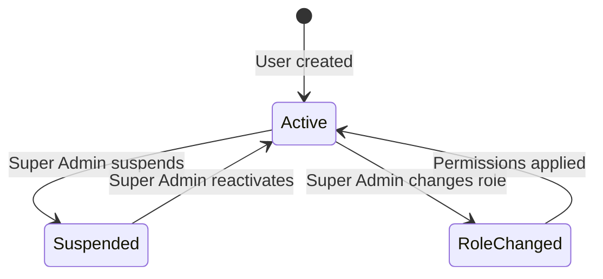

# Epic 15: User Management & Role/Permission
**Author/Owner**: Business Systems Analyst (BSA)
**Module**: Startup Partner O2O
**Date**: 2026-03-26
**Status**: ⚪ Draft

## Change Log

| Version | Date | Author | Changes |
|---------|------|--------|---------|
| 1.0 | 2026-03-26 | BSA | Initial draft |

**Status:** ⚪ Draft / 🟡 In Review / 🟢 Final

> **💡 When updating:** Change Status to 🟢 Final / Approved ONLY AFTER explicit approval.

**PRD Reference:** `docs/modules/startup-partner-o2o/startup-partner-o2o prd.md` (Status: 🟢 Final / Approved v1.5)
**BRD Reference:** `docs/modules/startup-partner-o2o/brd.md`
**Maps to:** FR-131 to FR-140

---

### 1. Epic Information

| Field | Value |
|-------|-------|
| **Epic ID** | EPIC-15 |
| **Epic Name** | User Management & Role/Permission |
| **Epic Description** | Enable Super Admin to manage portal users and configure role-based access control across the SP Portal and Admin Portal |
| **Business Objective** | Super Admin can create/edit/suspend users; roles and permissions configurable; access enforced per role across all portal features |
| **Target Release** | TBD |
| **Epic Owner** | TBD |
| **Epic Status** | Backlog |
| **Priority** | P1 |
| **Estimated Story Points** | TBD |

#### Epic User Story
As a Super Admin, I want to manage portal users and configure role-based access control, so that access to portal features is properly controlled and secured across the organization.

#### Epic Scope
**In Scope:**
- User CRUD operations
- Role definition
- Permission matrix
- Role assignment
- Role-based access enforcement

**Out of Scope:**
- SSO provider management (handled by Allkons ID/Keycloak)
- Buyer/seller user management (separate portals)

#### Related Epics
| Epic ID | Epic Name | Relationship |
|---------|-----------|--------------|
| EPIC-01 | Single Sign-On (SSO) & Unified Authentication | Depends on |
| EPIC-03 | Admin SP Management | Related |
| EPIC-11 | Commission Tracking & Payment | Related (commission permissions) |
| EPIC-12 | SP Hierarchy Management | Related (Leader role) |
| EPIC-14 | SP Training & Certification | Related (training permissions) |

#### Epic Success Criteria
- [ ] Super Admin can create/edit/suspend users
- [ ] Roles and permissions are configurable
- [ ] Access is enforced per role across all portal features
- [ ] At least one Super Admin must exist at all times

---

### 2. User Stories

> Each user story follows the BRD structure: US → AC (Given/When/Then) → BR → Validation → Edge Cases → Error Handling → State Behavior. ID scheme: `US-21`, `US-22`, `US-23` (scoped to this epic).

#### US-21: Super Admin Manage Users
**As a** Super Admin, **I want to** create, edit, suspend, and manage user accounts in the SP Portal and Admin Portal, **so that** I can control who has access to the system.

**Preconditions:**
- User is logged in with Super Admin role

**Business Rules:**
| Rule ID | Rule Description | Priority |
|---------|------------------|----------|
| BR-318 | Super Admin can create new admin/leader accounts | P0 |
| BR-319 | Super Admin can edit user profiles and role assignments | P0 |
| BR-320 | Super Admin can suspend/reactivate user accounts | P0 |
| BR-321 | Super Admin can view all users across the organization | P0 |
| BR-322 | User changes are audit-logged with timestamp and actor | P0 |

**Validation Rules:**
| Field | Validation Rule | Error Message |
|-------|-----------------|---------------|
| Name | Required, max 255 characters | กรุณากรอกชื่อ |
| Email | Required, valid email format | กรุณากรอกอีเมลให้ถูกต้อง |
| Role | Required, must be valid role | กรุณาเลือกบทบาท |
| Phone | 10 digits, Thai format | กรุณากรอกหมายเลขโทรศัพท์ให้ถูกต้อง (10 หลัก) |

**Acceptance Criteria:**
| # | Given | When | Then |
|---|-------|------|------|
| AC-124 | Super Admin on user management page | Admin views user list | System displays all users with: name, email, role, status, last login |
| AC-125 | Super Admin creates new user | Admin fills form and clicks "สร้างผู้ใช้" | System creates account, sends credentials via LINE OA/email |
| AC-126 | Super Admin suspends user | Admin clicks "ระงับบัญชี" | System suspends user, revokes active sessions |
| AC-127 | Super Admin changes user role | Admin selects new role | System updates permissions immediately, logs change |

**Edge Cases:**
| # | Scenario | Expected Behavior |
|---|----------|-------------------|
| EC-102 | Super Admin tries to suspend themselves | System blocks with "ไม่สามารถระงับบัญชีตัวเองได้" |
| EC-103 | Duplicate email during user creation | System displays "อีเมลนี้มีผู้ใช้งานแล้ว" |
| EC-104 | User has active sessions when suspended | All active sessions are immediately revoked |
| EC-105 | Super Admin creates user with role that doesn't exist | System blocks creation; display valid roles only in dropdown |

**Error Handling:**
| Error | Trigger | User Feedback | Recovery |
|-------|---------|---------------|----------|
| User creation failure | Server error | ไม่สามารถสร้างผู้ใช้ได้ กรุณาลองใหม่ | Retry button, form data preserved |
| User suspension failure | Server error | ไม่สามารถระงับบัญชีได้ กรุณาลองใหม่ | Retry button |
| Credential delivery failure | LINE OA/email error | สร้างบัญชีสำเร็จ แต่ไม่สามารถส่งข้อมูลเข้าสู่ระบบได้ กรุณาส่งใหม่ | Resend credentials button |

**State Behavior:**
| State | When | UI Requirements |
|-------|------|-----------------|
| Loading | Fetching user list | Show loading spinner |
| Empty | No users (unlikely) | Display "ไม่พบผู้ใช้ในระบบ" |
| Success | Users loaded | Display user list with search, filter, and action buttons |
| Error | Fetch fails | Show error message with retry option |

#### US-22: Super Admin Manage Roles & Permissions
**As a** Super Admin, **I want to** define roles and configure permission matrices, **so that** I can control what each role can access across the portal.

**Preconditions:**
- User is logged in with Super Admin role

**Business Rules:**
| Rule ID | Rule Description | Priority |
|---------|------------------|----------|
| BR-323 | System has predefined roles: Super Admin, Admin, Leader, SP (Member) | P0 |
| BR-324 | Super Admin can create custom roles with specific permission sets | P1 |
| BR-325 | Permissions are per-module: SP Management, Commission, Payout, RFQ, Training, Disputes, Audit, User Management | P0 |
| BR-326 | Permission levels per module: No Access, View Only, Edit, Full Control | P0 |
| BR-327 | Role changes apply immediately to all users with that role | P0 |
| BR-328 | At least one Super Admin must exist at all times (cannot remove last Super Admin) | P0 |

**Validation Rules:**
| Field | Validation Rule | Error Message |
|-------|-----------------|---------------|
| Role Name | Required, max 100 characters, unique | กรุณากรอกชื่อบทบาท / ชื่อบทบาทนี้มีอยู่แล้ว |
| Permissions | At least one module permission must be set | กรุณากำหนดสิทธิ์อย่างน้อย 1 โมดูล |

**Acceptance Criteria:**
| # | Given | When | Then |
|---|-------|------|------|
| AC-128 | Super Admin on role management page | Admin views roles | System displays role list with permission summary |
| AC-129 | Super Admin edits role permissions | Admin toggles permission checkboxes | System saves changes, applies to all users with that role |
| AC-130 | Super Admin tries to remove last Super Admin | Admin attempts action | System blocks with "ไม่สามารถลบ Super Admin คนสุดท้ายได้" |

**Edge Cases:**
| # | Scenario | Expected Behavior |
|---|----------|-------------------|
| EC-106 | Super Admin edits predefined role (e.g., Admin) | System allows permission changes but prevents deletion of predefined roles |
| EC-107 | Custom role has same name as predefined role | System blocks with "ชื่อบทบาทนี้มีอยู่แล้ว" |
| EC-108 | Role with assigned users is deleted | System blocks with "บทบาทนี้มีผู้ใช้งานอยู่ ไม่สามารถลบได้ กรุณาย้ายผู้ใช้ก่อน" |
| EC-109 | Super Admin removes all permissions from a role | System warns "บทบาทนี้จะไม่มีสิทธิ์เข้าถึงใด ๆ"; Admin confirms |

**Error Handling:**
| Error | Trigger | User Feedback | Recovery |
|-------|---------|---------------|----------|
| Role save failure | Server error | ไม่สามารถบันทึกบทบาทได้ กรุณาลองใหม่ | Retry button, changes preserved |
| Permission update failure | Server error | ไม่สามารถอัปเดตสิทธิ์ได้ กรุณาลองใหม่ | Retry button |

**State Behavior:**
| State | When | UI Requirements |
|-------|------|-----------------|
| Loading | Fetching roles | Show loading spinner |
| Success | Roles loaded | Display role list with permission matrix grid |
| Error | Fetch fails | Show error message with retry option |

#### US-23: Role-Based Access Enforcement
**As the** system, **I want to** enforce role-based access control across all portal features, **so that** users can only access what their role permits.

**Preconditions:**
- User is authenticated
- User has a role assigned

**Business Rules:**
| Rule ID | Rule Description | Priority |
|---------|------------------|----------|
| BR-329 | Every API endpoint must check user's role and permissions before processing | P0 |
| BR-330 | UI must hide/disable features the user's role cannot access | P0 |
| BR-331 | Unauthorized access attempts are logged for security audit | P0 |
| BR-332 | Role-based access applies to both SP Portal and Admin Portal | P0 |

**Validation Rules:**
| Field | Validation Rule | Error Message |
|-------|-----------------|---------------|
| N/A | N/A | N/A |

**Acceptance Criteria:**
| # | Given | When | Then |
|---|-------|------|------|
| AC-131 | User with "View Only" on Commission | User tries to edit commission policy | System shows "คุณไม่มีสิทธิ์ในการดำเนินการนี้" |
| AC-132 | Leader user | Leader accesses SP network | System shows team members only, not all SPs |
| AC-133 | Admin without Payout permission | Admin tries to create payout batch | System blocks access, shows permission error |

**Edge Cases:**
| # | Scenario | Expected Behavior |
|---|----------|-------------------|
| EC-110 | User's role permissions change while they are logged in | New permissions take effect on next API call; cached UI permissions refreshed on next page load |
| EC-111 | User with no role assigned | System blocks all access; redirects to login with "กรุณาติดต่อผู้ดูแลระบบ" |
| EC-112 | Direct API access attempt bypassing UI | API endpoint enforces permission check; returns 403 Forbidden |
| EC-113 | User with suspended account tries to access API | System returns 401 Unauthorized; all endpoints blocked |

**Error Handling:**
| Error | Trigger | User Feedback | Recovery |
|-------|---------|---------------|----------|
| 403 Forbidden | Insufficient permissions | คุณไม่มีสิทธิ์ในการดำเนินการนี้ | Contact Admin message |
| 401 Unauthorized | Invalid/expired session or suspended account | กรุณาเข้าสู่ระบบใหม่ | Redirect to login |

**State Behavior:**
| State | When | UI Requirements |
|-------|------|-----------------|
| Authorized | User has permission | Feature visible and functional |
| Unauthorized | User lacks permission | Feature hidden or disabled; menu items not shown |
| Forbidden | User attempts restricted action | Show "คุณไม่มีสิทธิ์ในการดำเนินการนี้" message |

---

### 3. Description

**Business Context:**
- **Problem Statement:** Without centralized user management and role-based access control, there is no way to properly govern who can access which features, creating security and compliance risks.
- **Current State:** User access is managed informally or through basic authentication without granular permission control.
- **Desired State:** Super Admin can manage all portal users (create, edit, suspend), define roles with per-module permission levels (No Access, View Only, Edit, Full Control), and the system enforces access control on both UI and API levels across SP Portal and Admin Portal.
- **Business Value:** Ensures proper access governance, reduces unauthorized access risk, enables audit compliance, and provides flexible role management as the organization scales.

---

### 4. Prerequisites

| Prerequisite | Description | Status |
|--------------|-------------|--------|
| EPIC-01 | SSO & Unified Authentication must be functional | [ ] |
| Keycloak | Role and permission storage integrated with Keycloak | [ ] |
| LINE OA/Email | For sending credentials to new users | [ ] |

**Dependencies:**
- EPIC-01: SSO & Unified Authentication (Keycloak role integration)
- Allkons ID: User identity management
- LINE OA/Email: Credential delivery channel

---

### 5. Terminology

| Term | Definition |
|------|------------|
| Super Admin | Highest privilege role; can manage users, roles, and permissions |
| Admin | Administrative role with configurable permissions per module |
| Leader | SP hierarchy role; manages a team of SP Members |
| SP (Member) | Startup Partner individual contributor role |
| Permission Matrix | Grid defining access levels (No Access, View Only, Edit, Full Control) per module per role |
| Custom Role | User-defined role with specific permission sets (in addition to predefined roles) |
| RBAC | Role-Based Access Control — access governance model |

---

### 6. Role and Permission Matrix

| Role | SP Management | Commission | Payout | RFQ | Training | Disputes | Audit | User Management |
|------|---------------|------------|--------|-----|----------|----------|-------|-----------------|
| Super Admin | Full Control | Full Control | Full Control | Full Control | Full Control | Full Control | Full Control | Full Control |
| Admin | Full Control | Configurable | Configurable | Configurable | Configurable | Configurable | View Only | No Access |
| Leader | View Only (team) | View Only (team) | No Access | View Only (team) | View Only (team) | View Only (team) | No Access | No Access |
| SP (Member) | No Access | View Only (own) | View Only (own) | Edit (own) | Edit (own) | View Only (own) | No Access | No Access |

**Permission Levels:**
- `No Access` - Feature not visible, API returns 403
- `View Only` - Can view data but cannot create, edit, or delete
- `Edit` - Can view, create, and edit but cannot delete
- `Full Control` - Can view, create, edit, and delete

---

### 7. Information in the List

| Field Name | Format | Example | No Value | Condition |
|------------|--------|---------|----------|-----------|
| User Name | Text | "สมชาย ใจดี" | — | Always displayed |
| Email | Email | "somchai@example.com" | — | Always displayed |
| Role | Badge | "Super Admin" / "Admin" / "Leader" / "SP" | — | Always displayed |
| Status | Badge | "Active" / "Suspended" | — | Always displayed |
| Last Login | DateTime | "2026-03-25 14:30" | "ไม่เคยเข้าสู่ระบบ" | Always displayed |
| Created Date | Date | "2026-01-15" | — | Always displayed |
| Created By | Text | "Admin Name" | — | Admin view |

**Display Rules:**
- Active users shown with green status badge, Suspended with red
- Super Admin role highlighted with distinct badge color
- User list supports search by name/email and filter by role/status
- Pagination for large user lists

---

### 8. Requirements

#### 8.1 General Information

| Field | Value |
|-------|-------|
| **Story Type** | New feature |
| **Application** | Admin Portal |
| **Module** | Startup Partner O2O |
| **Pages** | /admin/users, /admin/users/:userId, /admin/roles, /admin/roles/:roleId |
| **Priority** | P1 |
| **Complexity** | High |

#### 8.2 Happy Path

1. Super Admin logs in and navigates to User Management
2. System displays all users with name, email, role, status, last login
3. Super Admin clicks "สร้างผู้ใช้" to create a new user
4. Super Admin fills in name, email, phone, and selects role
5. System creates account and sends credentials via LINE OA/email
6. Super Admin navigates to Role Management
7. System displays role list with permission summary
8. Super Admin edits Admin role permissions (toggles Commission from View Only to Edit)
9. System saves changes and applies to all Admin users immediately
10. Users with Admin role now have Edit access to Commission module

#### 8.3 Allowed Roles

- Super Admin (full access to user and role management)

#### 8.4 Business Rules

| Rule ID | Rule Description | Priority |
|---------|------------------|----------|
| BR-318 | Super Admin can create new admin/leader accounts | P0 |
| BR-319 | Super Admin can edit user profiles and role assignments | P0 |
| BR-320 | Super Admin can suspend/reactivate user accounts | P0 |
| BR-321 | Super Admin can view all users across the organization | P0 |
| BR-322 | User changes are audit-logged with timestamp and actor | P0 |
| BR-323 | System has predefined roles: Super Admin, Admin, Leader, SP (Member) | P0 |
| BR-324 | Super Admin can create custom roles with specific permission sets | P1 |
| BR-325 | Permissions are per-module: SP Management, Commission, Payout, RFQ, Training, Disputes, Audit, User Management | P0 |
| BR-326 | Permission levels per module: No Access, View Only, Edit, Full Control | P0 |
| BR-327 | Role changes apply immediately to all users with that role | P0 |
| BR-328 | At least one Super Admin must exist at all times (cannot remove last Super Admin) | P0 |
| BR-329 | Every API endpoint must check user's role and permissions before processing | P0 |
| BR-330 | UI must hide/disable features the user's role cannot access | P0 |
| BR-331 | Unauthorized access attempts are logged for security audit | P0 |
| BR-332 | Role-based access applies to both SP Portal and Admin Portal | P0 |

#### 8.5 Validation Rules

| Field | Validation Rule | Error Message |
|-------|-----------------|---------------|
| Name | Required, max 255 characters | กรุณากรอกชื่อ |
| Email | Required, valid email format, unique | กรุณากรอกอีเมลให้ถูกต้อง / อีเมลนี้มีผู้ใช้งานแล้ว |
| Role | Required, must be valid role | กรุณาเลือกบทบาท |
| Phone | 10 digits, Thai format | กรุณากรอกหมายเลขโทรศัพท์ให้ถูกต้อง (10 หลัก) |
| Role Name | Required, max 100 characters, unique | กรุณากรอกชื่อบทบาท / ชื่อบทบาทนี้มีอยู่แล้ว |
| Permissions | At least one module permission must be set | กรุณากำหนดสิทธิ์อย่างน้อย 1 โมดูล |

---

### 9. Acceptance Criteria

> All acceptance criteria use **Given/When/Then** format. Cover all 6 scenario categories below.

#### 9.1 View Mode Scenarios

**Scenario: User List**

**Given** Super Admin is on user management page
**When** Admin views user list
**Then** System displays all users with: name, email, role, status, last login

**Scenario: Role List**

**Given** Super Admin is on role management page
**When** Admin views roles
**Then** System displays role list with permission summary per module

**Scenario: Loading State**

**Given** Super Admin navigates to user or role management
**When** System is fetching data
**Then** System shows loading spinner

**Scenario: Error State**

**Given** Super Admin navigates to user or role management
**When** Server returns an error
**Then** System displays error message with retry option

#### 9.2 Action Mode Scenarios

**Scenario: Create User**

**Given** Super Admin on user management page
**When** Admin fills form and clicks "สร้างผู้ใช้"
**Then** System creates account, sends credentials via LINE OA/email

**Scenario: Suspend User**

**Given** Super Admin on user management page
**When** Admin clicks "ระงับบัญชี" on a user
**Then** System suspends user, revokes active sessions

**Scenario: Change User Role**

**Given** Super Admin viewing user detail
**When** Admin selects new role
**Then** System updates permissions immediately, logs change

**Scenario: Edit Role Permissions**

**Given** Super Admin on role management page
**When** Admin toggles permission checkboxes
**Then** System saves changes, applies to all users with that role

**Scenario: Create Custom Role**

**Given** Super Admin on role management page
**When** Admin clicks "สร้างบทบาท" and configures permissions
**Then** System creates new role available for assignment

**Scenario: Remove Last Super Admin — Blocked**

**Given** Only one Super Admin exists
**When** Admin tries to remove or change role of the last Super Admin
**Then** System blocks with "ไม่สามารถลบ Super Admin คนสุดท้ายได้"

#### 9.3 Race Condition Scenarios

**Scenario: Role Permissions Change While User Is Active**

**Given** User is logged in with Admin role
**When** Super Admin changes Admin role permissions
**Then** New permissions take effect on the user's next API call; cached UI permissions refreshed on next page load

**Scenario: User Suspended While Active**

**Given** User has active session
**When** Super Admin suspends the user
**Then** All active sessions are immediately revoked; user sees login page on next action

#### 9.4 Loading State Scenarios (Action Mode)

**Scenario: Loading during user creation**

**Given** Super Admin submits new user form
**When** System is creating the account and sending credentials
**Then** System shows loading indicator; "สร้างผู้ใช้" button disabled; form data preserved

**Scenario: Loading during role permission update**

**Given** Super Admin saves role permission changes
**When** System is applying changes
**Then** System shows loading indicator; permission checkboxes disabled temporarily

#### 9.5 Field Validation Scenarios

**Scenario: Invalid email format**

**Given** Super Admin is creating a new user
**When** Admin enters invalid email format
**Then** System displays "กรุณากรอกอีเมลให้ถูกต้อง" and blocks submission

**Scenario: Duplicate email**

**Given** Super Admin is creating a new user
**When** Admin enters an email that already exists
**Then** System displays "อีเมลนี้มีผู้ใช้งานแล้ว" and blocks submission

**Scenario: Empty role name**

**Given** Super Admin is creating a custom role
**When** Admin leaves role name empty
**Then** System displays "กรุณากรอกชื่อบทบาท" and blocks submission

#### 9.6 Edge Cases

**Scenario: Super Admin Tries to Suspend Themselves**

**Given** Super Admin is on user management page
**When** Super Admin tries to suspend their own account
**Then** System blocks with "ไม่สามารถระงับบัญชีตัวเองได้"

**Scenario: Delete Role With Assigned Users**

**Given** A role has users assigned to it
**When** Super Admin tries to delete the role
**Then** System blocks with "บทบาทนี้มีผู้ใช้งานอยู่ ไม่สามารถลบได้ กรุณาย้ายผู้ใช้ก่อน"

**Scenario: Remove All Permissions From Role**

**Given** Super Admin is editing a role
**When** Admin removes all permissions
**Then** System warns "บทบาทนี้จะไม่มีสิทธิ์เข้าถึงใด ๆ"; Admin confirms

**Scenario: User With No Role Assigned**

**Given** A user exists without a role
**When** User tries to access the portal
**Then** System blocks all access; redirects to login with "กรุณาติดต่อผู้ดูแลระบบ"

**Scenario: Direct API Access Bypass**

**Given** A user with insufficient permissions
**When** User attempts direct API call bypassing UI
**Then** API endpoint enforces permission check; returns 403 Forbidden; attempt logged

---

### 10. Risk Assessment

| Risk ID | Risk Description | Category | Probability | Impact | Risk Level | Mitigation Strategy | Owner | Status |
|---------|------------------|----------|-------------|--------|------------|---------------------|-------|--------|
| R-001 | Privilege escalation through role manipulation | Technical | L | H | Medium | Validate role changes server-side; audit all role modifications; protect Super Admin role | Tech Lead | Open |
| R-002 | Last Super Admin accidentally removed | Operational | L | H | Medium | Enforce BR-328 check on all Super Admin role changes; database constraint | Tech Lead | Open |
| R-003 | Role permission changes not propagated in real-time | Technical | M | M | Medium | Implement permission cache invalidation on role change; short cache TTL | Tech Lead | Open |
| R-004 | Unauthorized access through stale sessions after suspension | Technical | M | H | High | Implement immediate session revocation on suspension; token blacklisting | Tech Lead | Open |
| R-005 | Credential delivery failure leaving user unable to access | Operational | M | M | Medium | Provide resend credentials feature; manual credential reset option | Tech Lead | Open |
| R-006 | Non-compliance with access control audit requirements | Compliance | L | H | Medium | Log all access attempts (successful and failed); regular audit reports | BSA | Open |
| R-007 | Misalignment between Keycloak roles and portal permissions | Technical | M | H | High | Sync roles between Keycloak and portal database; validate on login | Tech Lead | Open |

#### Risk Summary
- **Total Risks:** 7
- **Critical Risks:** 0
- **High Risks:** 2
- **Medium Risks:** 5
- **Low Risks:** 0

---

### 11. Data Dictionary

#### Entity: PortalUser

| Attribute Name | Data Type | Length | Required | Unique | Default Value | Description |
|----------------|-----------|--------|----------|--------|---------------|-------------|
| userId | UUID | 36 | Yes | Yes | Auto-generated | Unique user identifier |
| name | String | 255 | Yes | No | — | User display name |
| email | String | 255 | Yes | Yes | — | User email address |
| phone | String | 10 | Yes | No | — | User phone number (Thai format) |
| roleId | UUID | 36 | Yes | No | — | Reference to assigned role |
| status | Enum | — | Yes | No | ACTIVE | User status (ACTIVE, SUSPENDED) |
| lastLoginAt | DateTime | — | No | No | — | Last login timestamp |
| createdAt | DateTime | — | Yes | No | Auto-generated | Account creation timestamp |
| createdBy | UUID | 36 | Yes | No | — | Super Admin who created the account |
| updatedAt | DateTime | — | No | No | — | Last update timestamp |
| updatedBy | UUID | 36 | No | No | — | Last modifier |
| suspendedAt | DateTime | — | No | No | — | Suspension timestamp |
| suspendedBy | UUID | 36 | No | No | — | Super Admin who suspended |

#### Entity: Role

| Attribute Name | Data Type | Length | Required | Unique | Default Value | Description |
|----------------|-----------|--------|----------|--------|---------------|-------------|
| roleId | UUID | 36 | Yes | Yes | Auto-generated | Unique role identifier |
| roleName | String | 100 | Yes | Yes | — | Role display name |
| description | String | 500 | No | No | — | Role description |
| isPredefined | Boolean | — | Yes | No | false | Whether role is system-predefined |
| createdAt | DateTime | — | Yes | No | Auto-generated | Role creation timestamp |
| updatedAt | DateTime | — | No | No | — | Last update timestamp |

#### Entity: RolePermission

| Attribute Name | Data Type | Length | Required | Unique | Default Value | Description |
|----------------|-----------|--------|----------|--------|---------------|-------------|
| permissionId | UUID | 36 | Yes | Yes | Auto-generated | Unique permission record identifier |
| roleId | UUID | 36 | Yes | No | — | Reference to role |
| module | Enum | — | Yes | No | — | Module name (SP_MANAGEMENT, COMMISSION, PAYOUT, RFQ, TRAINING, DISPUTES, AUDIT, USER_MANAGEMENT) |
| accessLevel | Enum | — | Yes | No | NO_ACCESS | Permission level (NO_ACCESS, VIEW_ONLY, EDIT, FULL_CONTROL) |

#### Entity: AccessAuditLog

| Attribute Name | Data Type | Length | Required | Unique | Default Value | Description |
|----------------|-----------|--------|----------|--------|---------------|-------------|
| logId | UUID | 36 | Yes | Yes | Auto-generated | Unique log entry identifier |
| userId | UUID | 36 | Yes | No | — | User who performed the action |
| action | String | 100 | Yes | No | — | Action attempted |
| resource | String | 255 | Yes | No | — | Resource accessed |
| result | Enum | — | Yes | No | — | Result (ALLOWED, DENIED) |
| ipAddress | String | 45 | No | No | — | Client IP address |
| userAgent | String | 500 | No | No | — | Client user agent |
| timestamp | DateTime | — | Yes | No | Auto-generated | Action timestamp |

#### Relationships

| Related Entity | Relationship Type | Cardinality | Description |
|----------------|-------------------|-------------|-------------|
| PortalUser → Role | Many-to-One | N:1 | Multiple users can have the same role |
| Role → RolePermission | One-to-Many | 1:N | One role has multiple module permissions |
| PortalUser → AccessAuditLog | One-to-Many | 1:N | One user has multiple audit log entries |

---

### 12. Audit Trail Requirements

| Action | Data to Capture | Retention Period |
|--------|-----------------|------------------|
| USER_CREATE | Actor ID, New user details, Role assigned, Timestamp, IP address | 5 years |
| USER_UPDATE | Actor ID, User ID, Changes (before/after), Timestamp, IP address | 5 years |
| USER_SUSPEND | Actor ID, User ID, Reason, Timestamp, IP address | 5 years |
| USER_REACTIVATE | Actor ID, User ID, Timestamp, IP address | 5 years |
| ROLE_CREATE | Actor ID, Role details, Permissions, Timestamp, IP address | 5 years |
| ROLE_UPDATE | Actor ID, Role ID, Permission changes (before/after), Timestamp, IP address | 5 years |
| ROLE_DELETE | Actor ID, Role ID, Role details, Timestamp, IP address | 5 years |
| ACCESS_DENIED | User ID, Resource, Action, Timestamp, IP address | 3 years |
| SESSION_REVOKE | Actor ID, Target User ID, Reason, Timestamp, IP address | 3 years |

---

### 13. Notes

- User Management and Role/Permission is a cross-cutting concern that affects all other epics
- Super Admin role is protected and cannot be deleted or left without at least one assignee (BR-328)
- Permission enforcement must happen at both UI level (hide/disable) and API level (403 response) (BR-329, BR-330)
- All access attempts (successful and denied) must be logged for security audit (BR-331)
- Role-based access applies to both SP Portal and Admin Portal (BR-332)
- Keycloak integration must be kept in sync with portal role/permission configuration

**Questions for Tech Lead / Designer:**
- How should role/permission changes propagate in real-time to active sessions?
- Should permissions be cached client-side, and what is the appropriate cache invalidation strategy?
- How should the permission matrix UI handle many modules (horizontal scroll vs tabs)?
- What is the credential delivery flow for new users (LINE OA primary, email fallback)?
- Should there be a "preview as role" feature for Super Admin to test role configurations?

---

### 14. Draft Technical Design

#### 14.1 API Endpoints

| Method | Endpoint | Description | Authentication |
|--------|----------|-------------|----------------|
| GET | /api/admin/users | List all users | Required (Super Admin) |
| GET | /api/admin/users/:userId | Get user detail | Required (Super Admin) |
| POST | /api/admin/users | Create new user | Required (Super Admin) |
| PUT | /api/admin/users/:userId | Update user profile/role | Required (Super Admin) |
| POST | /api/admin/users/:userId/suspend | Suspend user account | Required (Super Admin) |
| POST | /api/admin/users/:userId/reactivate | Reactivate user account | Required (Super Admin) |
| POST | /api/admin/users/:userId/resend-credentials | Resend credentials | Required (Super Admin) |
| GET | /api/admin/roles | List all roles | Required (Super Admin) |
| GET | /api/admin/roles/:roleId | Get role detail with permissions | Required (Super Admin) |
| POST | /api/admin/roles | Create custom role | Required (Super Admin) |
| PUT | /api/admin/roles/:roleId | Update role permissions | Required (Super Admin) |
| DELETE | /api/admin/roles/:roleId | Delete custom role | Required (Super Admin) |
| GET | /api/auth/permissions | Get current user's permissions | Required (Any authenticated user) |

#### 14.2 Database Schema

```sql
-- portal_users
CREATE TABLE portal_users (
    user_id UUID PRIMARY KEY DEFAULT gen_random_uuid(),
    name VARCHAR(255) NOT NULL,
    email VARCHAR(255) NOT NULL UNIQUE,
    phone VARCHAR(10) NOT NULL,
    role_id UUID NOT NULL,
    status VARCHAR(20) NOT NULL DEFAULT 'ACTIVE',
    last_login_at TIMESTAMP,
    created_at TIMESTAMP NOT NULL DEFAULT NOW(),
    created_by UUID NOT NULL,
    updated_at TIMESTAMP,
    updated_by UUID,
    suspended_at TIMESTAMP,
    suspended_by UUID,
    CONSTRAINT fk_user_role FOREIGN KEY (role_id) REFERENCES roles(role_id)
);

-- roles
CREATE TABLE roles (
    role_id UUID PRIMARY KEY DEFAULT gen_random_uuid(),
    role_name VARCHAR(100) NOT NULL UNIQUE,
    description VARCHAR(500),
    is_predefined BOOLEAN NOT NULL DEFAULT false,
    created_at TIMESTAMP NOT NULL DEFAULT NOW(),
    updated_at TIMESTAMP
);

-- role_permissions
CREATE TABLE role_permissions (
    permission_id UUID PRIMARY KEY DEFAULT gen_random_uuid(),
    role_id UUID NOT NULL,
    module VARCHAR(50) NOT NULL,
    access_level VARCHAR(20) NOT NULL DEFAULT 'NO_ACCESS',
    CONSTRAINT fk_perm_role FOREIGN KEY (role_id) REFERENCES roles(role_id),
    CONSTRAINT uq_role_module UNIQUE (role_id, module)
);

-- access_audit_logs
CREATE TABLE access_audit_logs (
    log_id UUID PRIMARY KEY DEFAULT gen_random_uuid(),
    user_id UUID NOT NULL,
    action VARCHAR(100) NOT NULL,
    resource VARCHAR(255) NOT NULL,
    result VARCHAR(20) NOT NULL,
    ip_address VARCHAR(45),
    user_agent VARCHAR(500),
    timestamp TIMESTAMP NOT NULL DEFAULT NOW()
);

-- Seed predefined roles
INSERT INTO roles (role_id, role_name, description, is_predefined) VALUES
    (gen_random_uuid(), 'Super Admin', 'Full system access', true),
    (gen_random_uuid(), 'Admin', 'Administrative access with configurable permissions', true),
    (gen_random_uuid(), 'Leader', 'Team leader with team visibility', true),
    (gen_random_uuid(), 'SP', 'Startup Partner member', true);
```

#### 14.3 State Management



#### 14.4 UI/UX Considerations

- User management page: searchable/filterable table with inline action buttons
- Role management page: permission matrix grid with toggle controls per module
- Visual feedback on permission changes (highlight changed cells)
- Confirmation dialogs for destructive actions (suspend, delete role)
- Clear indication of predefined vs custom roles
- Session revocation indicator when user is suspended
- Responsive design for admin portal

---

### 15. Testing Checklist

#### Pre-Testing
- [ ] All prerequisites are met (EPIC-01 SSO functional)
- [ ] Test environment is set up with Keycloak integration
- [ ] LINE OA/email integration available for credential delivery
- [ ] Test accounts created for all predefined roles
- [ ] At least 2 Super Admin accounts exist for testing

#### Functional Testing
- [ ] User list displays correctly with all fields (AC-124)
- [ ] User creation works with credential delivery (AC-125)
- [ ] User suspension works with session revocation (AC-126)
- [ ] User role change applies immediately (AC-127)
- [ ] Role list displays with permission summary (AC-128)
- [ ] Role permission editing works and applies to all users (AC-129)
- [ ] Last Super Admin protection works (AC-130)
- [ ] View Only permission prevents editing (AC-131)
- [ ] Leader sees team members only (AC-132)
- [ ] Permission-less admin blocked from payout (AC-133)
- [ ] Custom role creation works (BR-324)
- [ ] Predefined roles cannot be deleted
- [ ] User changes are audit-logged (BR-322)
- [ ] All edge cases handled (EC-102 through EC-113)

#### Security Testing
- [ ] Only Super Admin can access user/role management
- [ ] API endpoints enforce permission checks (BR-329)
- [ ] UI hides/disables unauthorized features (BR-330)
- [ ] Direct API bypass attempts return 403 (EC-112)
- [ ] Suspended user sessions are immediately revoked (EC-104)
- [ ] Unauthorized access attempts are logged (BR-331)
- [ ] SQL injection is prevented
- [ ] XSS is prevented
- [ ] CSRF protection is in place

#### Performance Testing
- [ ] User list loads within acceptable time with 1000+ users
- [ ] Role permission changes propagate within acceptable time
- [ ] Audit log queries perform within acceptable time

#### Cross-Browser Testing
- [ ] Chrome
- [ ] Firefox
- [ ] Safari
- [ ] Edge

#### Mobile Testing
- [ ] Admin portal responsive design works on tablets
- [ ] Permission matrix readable on smaller screens

---

### 16. Approval

| Role | Name | Signature | Date |
|------|------|-----------|------|
| Product Owner | | | |
| Business Analyst | | | |
| Technical Lead | | | |
| QA Lead | | | |

---

**Document Version:** 1.0
**Last Updated:** 2026-03-26
**Author:** BSA
**Status:** Draft
