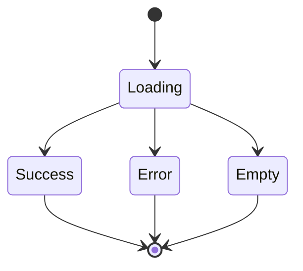

# Epic 2: [Epic Name]
**Author/Owner**: Business Systems Analyst (BSA)
**Module**: [Module Name]
**Date**: [YYYY-MM-DD]
**Status**: ⚪ Draft

## Change Log

| Version | Date | Author | Changes |
|---------|------|--------|---------|
| 1.0 | [YYYY-MM-DD] | BSA | Initial draft |

**Status:** ⚪ Draft / 🟡 In Review / 🟢 Final

> **💡 When updating:** Change Status to 🟢 Final / Approved ONLY AFTER explicit approval.

**PRD Reference:** `docs/modules/[module-name]/prd.md` (provided by PO)
**BRD Reference:** `docs/modules/[module-name]/brd.md`
**Maps to:** FR-xxx, FR-xxx, ... (list all related BRD functional requirements)

---

### 1. Epic Information

| Field | Value |
|-------|-------|
| **Epic ID** | EPIC-02 |
| **Epic Name** | [Epic Name] |
| **Epic Description** | [High-level description of the epic] |
| **Business Objective** | [What business goal does this epic achieve?] |
| **Target Release** | [Release version/date] |
| **Epic Owner** | [Name] |
| **Epic Status** | [Backlog / In Progress / In Review / Done] |
| **Priority** | [P0 / P1 / P2 / P3] |
| **Estimated Story Points** | [Total points] |

#### Epic User Story
As a [stakeholder], I want to [high-level goal], so that [business value].

#### Epic Scope
**In Scope:**
- [Module 1]
- [Module 2]

**Out of Scope:**
- [Module 3]
- [Module 4]

#### Related Epics
| Epic ID | Epic Name | Relationship |
|---------|-----------|--------------|
| [EPIC-XXX] | [Epic Name] | [Depends on / Blocks / Related] |

#### Epic Success Criteria
- [ ] [Success criterion 1]
- [ ] [Success criterion 2]

---

### 2. User Stories

> Each user story follows the BRD structure: US → AC (Given/When/Then) → BR → Validation → Edge Cases → Error Handling → State Behavior. ID scheme: `US-01`, `US-02`, ... (scoped to this epic).

#### US-01: [User Story Title]
**As a** [user type], **I want to** [action], **so that** [benefit].

**Preconditions:**
- [Precondition 1]

**Business Rules:**
| Rule ID | Rule Description | Priority |
|---------|------------------|----------|
| BR-001 | [Specific rule with exact thresholds] | P0/P1 |

**Validation Rules:**
| Field | Validation Rule | Error Message |
|-------|-----------------|---------------|
| [Field] | [Rule] | [Message] |

**Acceptance Criteria:**
| # | Given | When | Then |
|---|-------|------|------|
| AC-01 | [Precondition] | [Action] | [Expected result] |
| AC-02 | [Precondition] | [Action] | [Expected result] |

**Edge Cases (minimum 3):**
| # | Scenario | Expected Behavior |
|---|----------|-------------------|
| EC-01 | [Edge case] | [Behavior] |
| EC-02 | [Edge case] | [Behavior] |
| EC-03 | [Edge case] | [Behavior] |

**Error Handling:**
| Error | Trigger | User Feedback | Recovery |
|-------|---------|---------------|----------|
| [Type] | [Condition] | [Message] | [Path] |

**State Behavior:**
| State | When | UI Requirements |
|-------|------|-----------------|
| Loading | [Trigger] | [Spec] |
| Empty | [Condition] | [Spec] |
| Success | [Condition] | [Spec] |
| Error | [Condition] | [Spec] |

#### US-02: [User Story Title]
(Same structure as US-01)

---

### 3. Description

**Business Context:**
- **Problem Statement:** [Describe the business problem being solved]
- **Current State:** [Describe the current situation/pain points]
- **Desired State:** [Describe the expected outcome]
- **Business Value:** [Explain the value this module brings to the business]

---

### 4. Prerequisites

| Prerequisite | Description | Status |
|--------------|-------------|--------|
| [Prereq 1] | [Description] | [ ] |
| [Prereq 2] | [Description] | [ ] |

**Dependencies:**
- [Dependency 1]
- [Dependency 2]

---

### 5. Terminology

| Term | Definition |
|------|------------|
| [Term 1] | [Definition] |
| [Term 2] | [Definition] |

---

### 6. Role and Permission Matrix

| Role | Permission | Access Level |
|------|------------|--------------|
| [Role 1] | [permission:action] | [Read/Write/Delete] |
| [Role 2] | [permission:action] | [Read/Write/Delete] |

**Permission Definitions:**
- `[permission:view]` - View [resource]
- `[permission:create]` - Create new [resource]
- `[permission:edit]` - Edit existing [resource]
- `[permission:delete]` - Delete [resource]

---

### 7. Information in the List

| Field Name | Format | Example | No Value | Condition |
|------------|--------|---------|----------|-----------|
| [Field 1] | [Format] | [Example] | [Display when empty] | [Validation rules] |
| [Field 2] | [Format] | [Example] | [Display when empty] | [Validation rules] |

**Display Rules:**
- [Display rule 1]
- [Display rule 2]

---

### 8. Requirements

#### 8.1 General Information

| Field | Value |
|-------|-------|
| **Story Type** | [New feature / Enhancement / Bug fix] |
| **Application** | [Application Name] |
| **Module** | [Module Name] |
| **Pages** | [URL/Route] |
| **Priority** | [P0 / P1 / P2 / P3] |
| **Complexity** | [Low / Medium / High] |

#### 8.2 Happy Path

1. [Step 1 - User action]
2. [Step 2 - System response]
3. [Step 3 - User action]
4. [Step 4 - System response]

#### 8.3 Allowed Roles

- [Role 1]
- [Role 2]

#### 8.4 Business Rules

| Rule ID | Rule Description | Priority |
|---------|------------------|----------|
| BR-001 | [Business rule description] | [P0/P1/P2] |
| BR-002 | [Business rule description] | [P0/P1/P2] |

#### 8.5 Validation Rules

| Field | Validation Rule | Error Message |
|-------|-----------------|---------------|
| [Field 1] | [Validation rule] | [Error message] |
| [Field 2] | [Validation rule] | [Error message] |

---

### 9. Acceptance Criteria

> All acceptance criteria use **Given/When/Then** format. Cover all 6 scenario categories below. See `docs/ai/skills/write-brd/SKILL.md` (Epic Template § 9) for fully expanded scenario examples.

#### 9.1 View Mode Scenarios

**Scenario: Empty State**

**Given** [precondition]
**When** [action]
**Then** [expected result]

**Scenario: Loading State**

**Given** [precondition]
**When** [action]
**Then** [expected result]

**Scenario: Success State**

**Given** [precondition]
**When** [action]
**Then** [expected result]

**Scenario: Error States** (cover 500, 401, 403, 404, network, 400)

**Given** [precondition]
**When** [action]
**Then** [expected result]

#### 9.2 Action Mode Scenarios

**Scenario: Create Success**

**Given** [precondition]
**When** [action]
**Then** [expected result]

**Scenario: Update Success**

**Given** [precondition]
**When** [action]
**Then** [expected result]

**Scenario: Delete Success**

**Given** [precondition]
**When** [action]
**Then** [expected result]

(Include error scenarios for each action: frontend validation, business validation, server errors, unauthorized, forbidden)

#### 9.3 Race Condition Scenarios

**Scenario: Concurrent Update**

**Given** [precondition]
**When** [action]
**Then** [expected result]

**Scenario: Concurrent Delete**

**Given** [precondition]
**When** [action]
**Then** [expected result]

#### 9.4 Loading State Scenarios (Action Mode)

**Scenario: Loading during create/update/delete**

**Given** [precondition]
**When** [action]
**Then** [expected result — submit button disabled, spinner, form disabled]

#### 9.5 Field Validation Scenarios

**Scenario: Max/min length, pattern, range, date validations**

**Given** [precondition]
**When** [action]
**Then** [expected result — validation error displayed, submission blocked]

#### 9.6 Edge Cases

**Scenario: Special characters, null/empty values, large data volumes, Unicode/multi-language**

**Given** [precondition]
**When** [action]
**Then** [expected result]

---

### 10. Risk Assessment

**Mandatory risk categories** — assess all 5 (see `docs/ai/roles/business-analyst.md` §Risk Categories):

| Category | What to Assess |
|----------|---------------|
| **Operational** | Process failures, system downtime, human error |
| **Financial** | Revenue loss, cost overruns, payment errors |
| **Compliance** | Regulatory violations, data privacy breaches |
| **Technical** | System failures, data corruption, integration issues |
| **Strategic** | Misalignment with business goals |

**Risk level:** Probability (H/M/L) × Impact (H/M/L) → Critical / High / Medium / Low.
**Mitigation strategy:** Avoid, Mitigate, Transfer, or Accept.

| Risk ID | Risk Description | Category | Probability | Impact | Risk Level | Mitigation Strategy | Owner | Status |
|---------|------------------|----------|-------------|--------|------------|---------------------|-------|--------|
| R-001 | [Risk description] | [Category] | [H/M/L] | [H/M/L] | [Critical/High/Medium/Low] | [Strategy] | [Name] | [Open/Mitigated/Closed] |

#### Risk Summary
- **Total Risks:** [Count]
- **Critical Risks:** [Count]
- **High Risks:** [Count]
- **Medium Risks:** [Count]
- **Low Risks:** [Count]

---

### 11. Data Dictionary

#### Entity: [Entity Name]

| Attribute Name | Data Type | Length | Required | Unique | Default Value | Description |
|----------------|-----------|--------|----------|--------|---------------|-------------|
| [Field 1] | [Type] | [Length] | [Yes/No] | [Yes/No] | [Value] | [Description] |
| [Field 2] | [Type] | [Length] | [Yes/No] | [Yes/No] | [Value] | [Description] |

#### Relationships

| Related Entity | Relationship Type | Cardinality | Description |
|----------------|-------------------|-------------|-------------|
| [Entity 1] | One-to-Many | 1:N | [Description] |

---

### 12. Audit Trail Requirements

| Action | Data to Capture | Retention Period |
|--------|-----------------|------------------|
| CREATE | [User, Timestamp, Resource details, IP address] | [Period] |
| UPDATE | [User, Timestamp, Resource ID, Changes, IP address] | [Period] |
| DELETE | [User, Timestamp, Resource ID, Deleted data, IP address] | [Period] |
| VIEW | [User, Timestamp, Resource ID, IP address] | [Period] |

---

### 13. Notes

- [Note 1]
- [Note 2]

**Questions for Tech Lead / Designer:**
- [Question 1]
- [Question 2]

---

### 14. Draft Technical Design

#### 14.1 API Endpoints

| Method | Endpoint | Description | Authentication |
|--------|----------|-------------|----------------|
| GET | /api/[resource] | List [resources] | Required |
| GET | /api/[resource]/:id | Get [resource] by ID | Required |
| POST | /api/[resource] | Create new [resource] | Required |
| PUT | /api/[resource]/:id | Update [resource] | Required |
| DELETE | /api/[resource]/:id | Delete [resource] | Required |

#### 14.2 Database Schema

```sql
-- [Table name]
CREATE TABLE [table_name] (
    [field_1] [data_type] [constraints],
    [field_2] [data_type] [constraints],
    PRIMARY KEY ([primary_key]),
    CONSTRAINT [constraint_name] FOREIGN KEY ([foreign_key]) REFERENCES [related_table]([related_field])
);
```

#### 14.3 State Management



#### 14.4 UI/UX Considerations

- [UI consideration 1]
- [UI consideration 2]

---

### 15. Testing Checklist

#### Pre-Testing
- [ ] All prerequisites are met
- [ ] Test environment is set up
- [ ] Test data is prepared
- [ ] Test accounts are created with appropriate permissions

#### Functional Testing
- [ ] Happy path scenarios pass
- [ ] Empty state displays correctly
- [ ] Loading state displays correctly
- [ ] Error states display correctly for all error codes
- [ ] All validation rules work as expected
- [ ] Business validations work as expected
- [ ] Race conditions are handled correctly

#### Security Testing
- [ ] Unauthorized access is blocked
- [ ] Permission checks work correctly
- [ ] SQL injection is prevented
- [ ] XSS is prevented
- [ ] CSRF protection is in place

#### Performance Testing
- [ ] Page load time is acceptable
- [ ] API response time is acceptable
- [ ] Large data volumes are handled correctly

#### Cross-Browser Testing
- [ ] Chrome
- [ ] Firefox
- [ ] Safari
- [ ] Edge

#### Mobile Testing
- [ ] Responsive design works on mobile
- [ ] Touch interactions work correctly

---

### 16. Approval

| Role | Name | Signature | Date |
|------|------|-----------|------|
| Product Owner | | | |
| Business Analyst | | | |
| Technical Lead | | | |
| QA Lead | | | |

---

**Document Version:** 1.0
**Last Updated:** [YYYY-MM-DD]
**Author:** [Name]
**Status:** [Draft / Review / Approved]
