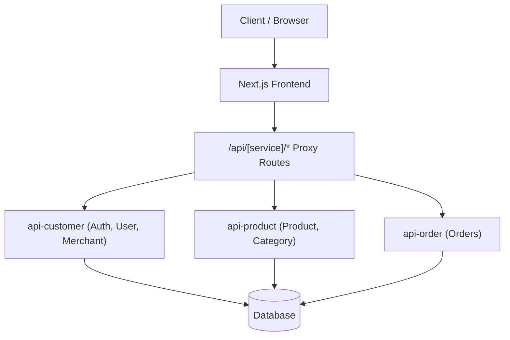
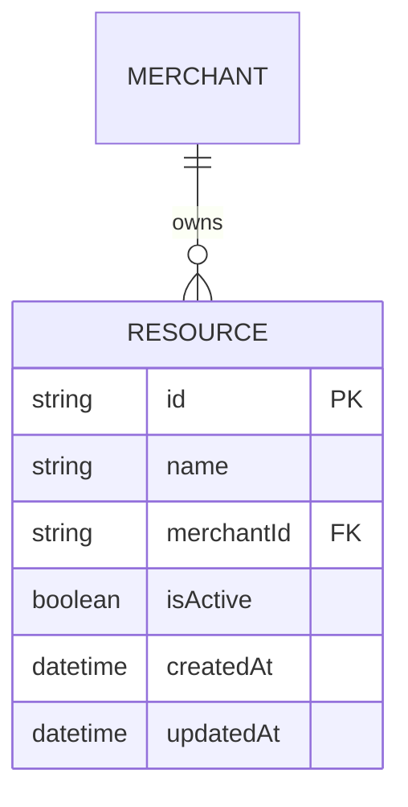
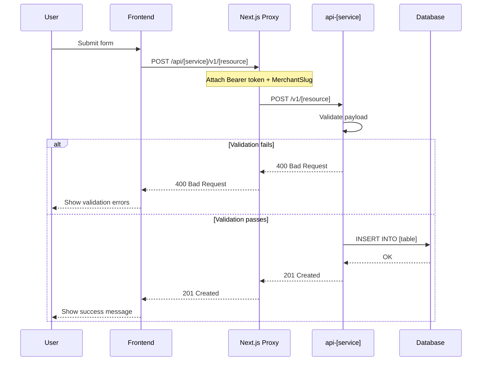
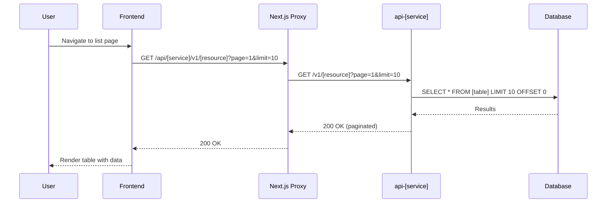

# Technical Specification: [Epic Name]

**Author/Owner**: Tech Lead
**Epic**: EPIC-02 — [Epic Name]
**Module**: [Module Name]
**Date**: [YYYY-MM-DD]
**Status**: ⚪ Draft

## Change Log

| Version | Date | Changes | Updated By | BRD Version | Status |
|---------|------|---------|------------|-------------|--------|
| v1.0 | [YYYY-MM-DD] | Initial spec — system architecture, DB schema, API contracts | Tech Lead | v1.0 | ⚪ Draft |

> **💡 When updating:** Change Status to 🟢 Final / Approved ONLY AFTER explicit Tech Lead approval.

**BRD Reference:** `docs/modules/[module-name]/brd.md`
**Epic Reference:** `docs/modules/[module-name]/[epic]/01-epic.md` (Section 2: User Stories, Section 11: Data Dictionary, Section 14: Draft Technical Design)
**Frontend Spec Reference:** `docs/modules/[module-name]/[epic]/03-frontend-spec.md`

---

## 1. System Architecture

### Component Interaction Diagram



### Microservice Mapping

| Module | Service | Proxy Route | Reason |
|---------|---------|-------------|--------|
| [Module 1] | `api-product` | `/api/product/v1/[resource]` | [Reason] |
| [Module 2] | `api-customer` | `/api/customer/v1/[resource]` | [Reason] |

### Key Architecture Decisions

| Decision | Rationale | Alternatives Considered |
|----------|-----------|------------------------|
| [Decision 1] | [Rationale] | [Alternatives] |
| [Decision 2] | [Rationale] | [Alternatives] |

---

## 2. Database Design

### ER Diagram



### Schema Definitions

**Table: `[table_name]`**
**Maps to:** `01-epic.md` Section 11 (Data Dictionary) — Entity: [Entity Name]

| Column | Type | Constraints | Default | Description |
|--------|------|-------------|---------|-------------|
| id | UUID | PRIMARY KEY | `gen_random_uuid()` | Unique identifier |
| name | VARCHAR(255) | NOT NULL | — | Resource name |
| merchantId | UUID | FOREIGN KEY → merchants(id) | — | Owner merchant |
| isActive | BOOLEAN | NOT NULL | `true` | Soft delete flag |
| createdAt | TIMESTAMP | NOT NULL | `now()` | Creation timestamp |
| updatedAt | TIMESTAMP | NOT NULL | `now()` | Last update timestamp |
| createdBy | UUID | NOT NULL | — | Audit: creator user ID |
| updatedBy | UUID | NOT NULL | — | Audit: last updater user ID |

**Indexes:**
| Index Name | Columns | Type | Purpose |
|------------|---------|------|---------|
| `idx_[table]_merchant` | `merchantId` | B-Tree | Filter by merchant |
| `idx_[table]_name` | `name, merchantId` | Unique | Prevent duplicate names per merchant |

**Table: `[table_name_2]`**
(Same structure as above)

### Migration Notes
- [Migration consideration 1]
- [Migration consideration 2]

---

## 3. API Specifications

> **Proxy pattern:** All client-side calls use `/api/[service]/*` proxy routes. See `docs/ai/rules/developer/03-api-and-data-fetching.md` "Microservices Proxy Pattern".

### 3.1 List [Resources]

**Endpoint:** `GET /api/[service]/v1/[resource]`
**Description:** List resources with pagination and filtering.
**Maps to:** FR-001, US-01
**Auth:** Required — `Bearer` token via httpOnly cookie
**Permission:** [Role(s)] from `01-epic.md` Section 6

**Query Parameters:**
| Param | Type | Required | Default | Description |
|-------|------|----------|---------|-------------|
| page | number | No | 1 | Page number |
| limit | number | No | 10 | Items per page |
| search | string | No | — | Search by name |

**Request Headers:**
```
Authorization: Bearer <token>    (auto-attached by interceptor)
CurrentMerchantSlug: <slug>      (auto-attached by interceptor)
```

**Response (200 OK):**
```json
{
  "success": true,
  "data": {
    "items": [
      {
        "id": "uuid",
        "name": "string",
        "isActive": true,
        "createdAt": "2024-01-01T00:00:00Z"
      }
    ],
    "total": 100,
    "page": 1,
    "limit": 10
  }
}
```

**Error Responses:**
| Code | Condition | Body |
|------|-----------|------|
| 401 | Missing/invalid token | `{ "success": false, "message": "Unauthorized" }` |
| 403 | Insufficient permissions | `{ "success": false, "message": "Forbidden" }` |
| 500 | Server error | `{ "success": false, "message": "Internal Server Error" }` |

### 3.2 Get [Resource] by ID

**Endpoint:** `GET /api/[service]/v1/[resource]/:id`
**Maps to:** FR-002, US-01
(Same auth/permission/error pattern as 3.1)

**Response (200 OK):**
```json
{
  "success": true,
  "data": {
    "id": "uuid",
    "name": "string",
    "isActive": true
  }
}
```

**Error Responses:**
| Code | Condition | Body |
|------|-----------|------|
| 404 | Resource not found | `{ "success": false, "message": "Not Found" }` |

### 3.3 Create [Resource]

**Endpoint:** `POST /api/[service]/v1/[resource]`
**Maps to:** FR-003, US-02
(Same auth/permission pattern)

**Request Payload:**
```json
{
  "name": "string",
  "categoryId": "string"
}
```

**Validation Rules** (from `01-epic.md` Section 2 — US-xx Validation Rules):
| Field | Rule | Error Message |
|-------|------|---------------|
| name | Required, max 255 chars | "Name is required" / "Name must be at most 255 characters" |
| categoryId | Required, must exist | "Category is required" / "Category not found" |

**Response (201 Created):**
```json
{
  "success": true,
  "data": {
    "id": "uuid",
    "name": "string"
  }
}
```

**Error Responses:**
| Code | Condition | Body |
|------|-----------|------|
| 400 | Validation failure | `{ "success": false, "errors": [{ "field": "name", "message": "..." }] }` |
| 409 | Duplicate resource | `{ "success": false, "message": "Resource already exists" }` |

### 3.4 Update [Resource]

**Endpoint:** `PUT /api/[service]/v1/[resource]/:id`
**Maps to:** FR-004, US-03
(Same patterns as 3.3)

### 3.5 Delete [Resource]

**Endpoint:** `DELETE /api/[service]/v1/[resource]/:id`
**Maps to:** FR-005, US-04
(Same auth/permission/error pattern)

**Response (200 OK):**
```json
{
  "success": true,
  "data": null
}
```

---

## 4. Sequence Diagrams

### 4.1 Create Flow



### 4.2 List Flow (with pagination)



---

## 5. Data Models (TypeScript)

> Follow `docs/ai/rules/developer/05-typescript-conventions.md` for naming and style.

### Request Interfaces

```typescript
// src/interfaces/[domain]/[resource].request.interface.ts

export interface ICreate[Resource]Request {
  name: string;
  categoryId: string;
}

export interface IUpdate[Resource]Request {
  name?: string;
  categoryId?: string;
}

export interface IList[Resource]Params {
  page?: number;
  limit?: number;
  search?: string;
}
```

### Response Interfaces

```typescript
// src/interfaces/[domain]/[resource].response.interface.ts

import type { ApiResponse, PaginatedData } from '@/types/common.type';

export interface I[Resource] {
  id: string;
  name: string;
  merchantId: string;
  isActive: boolean;
  createdAt: string;
  updatedAt: string;
}

export type I[Resource]ListResponse = ApiResponse<PaginatedData<I[Resource]>>;
export type I[Resource]DetailResponse = ApiResponse<I[Resource]>;
export type ICreate[Resource]Response = ApiResponse<I[Resource]>;
```

---

## 6. Security & Permissions

### Authentication
- All endpoints require `Bearer` token (auto-attached by Axios interceptor)
- 401 handling: interceptor clears cookies + Zustand store → redirects to `/login`

### Authorization (from `01-epic.md` Section 6: Role and Permission Matrix)

| Endpoint | Allowed Roles | Permission Check |
|----------|--------------|-----------------|
| GET /v1/[resource] | [Role 1], [Role 2] | Merchant-scoped (`CurrentMerchantSlug` header) |
| POST /v1/[resource] | [Role 1] | Merchant-scoped + role check |
| PUT /v1/[resource]/:id | [Role 1] | Merchant-scoped + ownership check |
| DELETE /v1/[resource]/:id | [Role 1] | Merchant-scoped + ownership check |

### Security Considerations
- [ ] All inputs validated server-side (never trust client)
- [ ] SQL injection prevention (parameterized queries)
- [ ] XSS prevention (output encoding)
- [ ] Rate limiting on write endpoints
- [ ] Merchant isolation (always filter by `merchantId`)

---

## 7. Audit Trail

> From `01-epic.md` Section 12: Audit Trail Requirements.

| Action | Data to Capture | Retention Period |
|--------|-----------------|------------------|
| CREATE | userId, timestamp, resourceId, payload, IP | [Period] |
| UPDATE | userId, timestamp, resourceId, changes (diff), IP | [Period] |
| DELETE | userId, timestamp, resourceId, deleted data snapshot, IP | [Period] |
| VIEW | userId, timestamp, resourceId, IP | [Period] |

---

## 8. External Dependencies

| Dependency | Type | Purpose | Version |
|-----------|------|---------|---------|
| [Service A] | Microservice | [Purpose] | [Version] |
| [Library B] | npm package | [Purpose] | [Version] |

---

## 9. Traceability Matrix

| User Story | API Endpoint | DB Table | FR Reference | Epic Section |
|-----------|-------------|----------|-------------|-------------|
| US-01 | GET /v1/[resource] | [table_name] | FR-001 | Section 2, Section 8 |
| US-02 | POST /v1/[resource] | [table_name] | FR-003 | Section 2, Section 8 |
| US-03 | PUT /v1/[resource]/:id | [table_name] | FR-004 | Section 2, Section 8 |
| US-04 | DELETE /v1/[resource]/:id | [table_name] | FR-005 | Section 2, Section 8 |

---

## 10. Questions for BSA / Developer

- [ ] [Question 1]
- [ ] [Question 2]

---

## Related Links
- **BRD**: `docs/modules/[module-name]/brd.md`
- **Epic**: `docs/modules/[module-name]/[epic]/01-epic.md`
- **Frontend Spec**: `docs/modules/[module-name]/[epic]/03-frontend-spec.md`
- **API Patterns**: `docs/ai/rules/developer/03-api-and-data-fetching.md`
- **TypeScript Conventions**: `docs/ai/rules/developer/05-typescript-conventions.md`
