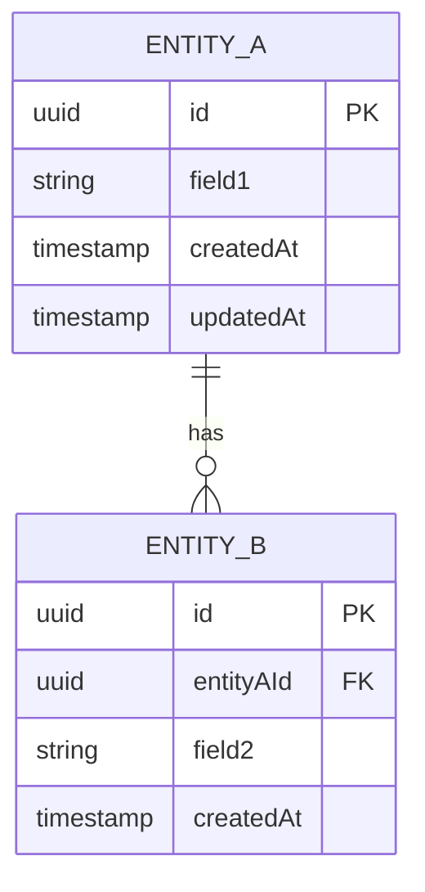
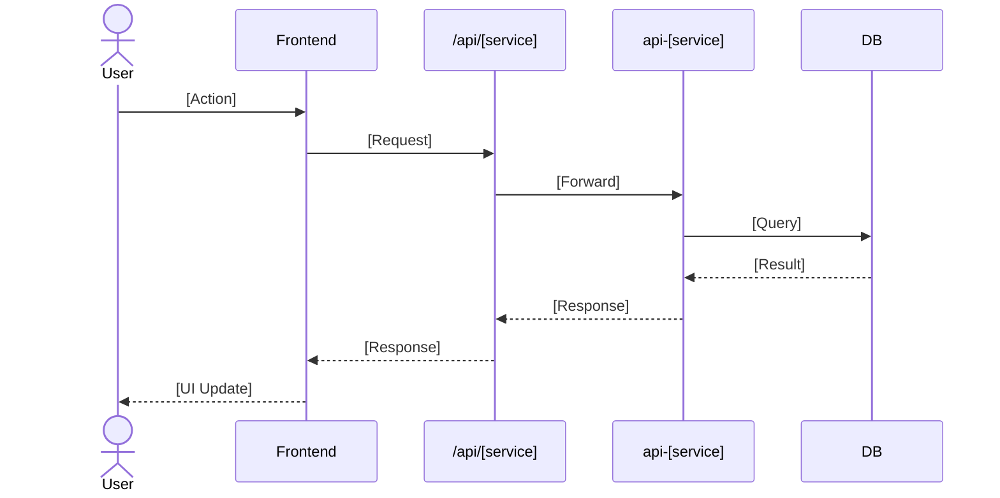

# Module Architecture

**Module**: [Module Name]
**Author/Owner**: Tech Lead
**Date**: [YYYY-MM-DD]
**Status**: ⚪ Draft

## Change Log

| Version | Date         | Changes                     | Updated By | Status   |
| ------- | ------------ | --------------------------- | ---------- | -------- |
| v1.0    | [YYYY-MM-DD] | Initial module architecture | Tech Lead  | ⚪ Draft |

> **💡 When updating:** Change Status to 🟢 Final / Approved ONLY AFTER explicit Tech Lead approval.

**PRD Reference:** `docs/modules/[module-name]/prd.md`
**BRD Reference:** `docs/modules/[module-name]/brd.md`

---

## 1. Module Overview

[Brief description of what this module does from a technical perspective — 2–3 sentences covering the business purpose, which services are involved, and what data it owns or modifies.]

---

## 2. Services & Proxy Routes

| Feature Area | Service         | Proxy Route Prefix             | Description             |
| ------------ | --------------- | ------------------------------ | ----------------------- |
| [Area]       | `api-[service]` | `/api/[service]/v1/[resource]` | [What this area covers] |

---

## 3. Module Data Model

> **Note:** Database is managed by backend services. Schema documented here for cross-epic reference only.

### Entity Descriptions

| Entity   | Service         | Description                                   |
| -------- | --------------- | --------------------------------------------- |
| [Entity] | `api-[service]` | [What this entity represents and who owns it] |

---

## 4. Cross-Epic Sequence Diagrams

> High-level flows that span multiple epics. Epic-specific flows are documented per epic in `02-technical-spec.md`.

### [Flow Name — e.g., Full Registration Flow]

---

## 5. Integration Points

| This Module   | Integrates With | Integration Type         | Description                                            |
| ------------- | --------------- | ------------------------ | ------------------------------------------------------ |
| [module-name] | [other-module]  | API call / shared entity | [What data is shared or what triggers the integration] |

---

## 6. Module-Level Tech Decisions

| Decision   | Rationale                      | Alternatives Considered     |
| ---------- | ------------------------------ | --------------------------- |
| [Decision] | [Why this approach was chosen] | [What was rejected and why] |

---

## 7. Epic Breakdown

| Epic             | Folder           | Tech Scope                                       | Status   |
| ---------------- | ---------------- | ------------------------------------------------ | -------- |
| EPIC-01 — [Name] | `01-[EpicName]/` | [Services, entities, and APIs this epic touches] | ⚪ Draft |
| EPIC-02 — [Name] | `02-[EpicName]/` | [Services, entities, and APIs this epic touches] | ⚪ Draft |

---

## 8. Open Questions

| #   | Question                                                      | Asked By  | Status  |
| --- | ------------------------------------------------------------- | --------- | ------- |
| 1   | [Question needing clarification before or during development] | Tech Lead | ⏳ Open |
