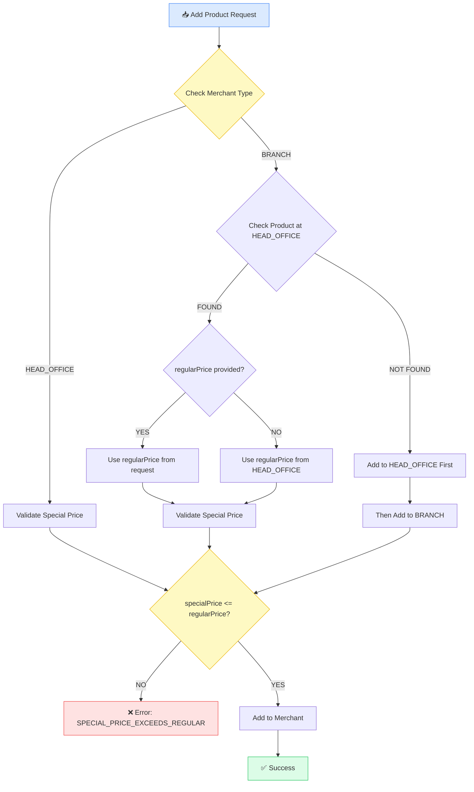
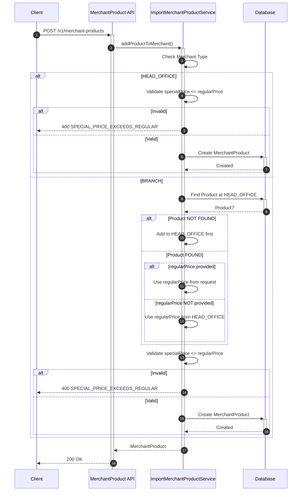

# Add Product to Merchant - Business Specification

## Overview

กระบวนการนำสินค้าเข้าร้านค้า (Merchant) ในระบบ Allkons Marketplace

## Merchant Types

| Type          | Thai Name | Description                        |
| ------------- | --------- | ---------------------------------- |
| `HEAD_OFFICE` | สาขาใหญ่  | ร้านค้าหลัก เป็น parent ของทุกสาขา |
| `BRANCH`      | สาขาย่อย  | ร้านค้าสาขา อยู่ภายใต้ HEAD_OFFICE |

## Business Rules

### Rule 1: Product Must Exist at HEAD_OFFICE First

**Condition:** เมื่อต้องการเพิ่มสินค้าใหม่เข้าร้านค้า

**Logic:**

```
IF product NOT EXISTS at HEAD_OFFICE
  THEN add product to HEAD_OFFICE first
  THEN add product to BRANCH (if requested)
ELSE
  add product to BRANCH directly
```

**Validation:**

- ตรวจสอบว่า HEAD_OFFICE มีสินค้านี้หรือไม่ (by `productId` or `barcode`)
- หากไม่มี → ต้องเพิ่มที่ HEAD_OFFICE ก่อน
- หากมีแล้ว → สามารถเพิ่มที่ BRANCH ได้เลย

### Rule 2: Regular Price Logic

**Condition:** เมื่อเพิ่มสินค้าเข้า BRANCH

**Logic:**

```
IF request.regularPrice IS PROVIDED
  THEN branch.regularPrice = request.regularPrice
ELSE
  THEN branch.regularPrice = headOffice.regularPrice (as default)
```

**Details:**

- ราคาปกติ (`regularPrice`) เป็นของแต่ละสาขา
- BRANCH สามารถตั้งราคาปกติที่แตกต่างจาก HEAD_OFFICE ได้
- หากไม่ระบุ regularPrice ตอนสร้าง จะดึงจาก HEAD_OFFICE มาเป็นค่าเริ่มต้น

### Rule 3: Special Price Validation

**Condition:** เมื่อต้องการกำหนดราคาพิเศษ

**Logic:**

```
branch.specialPrice = branch-specific value (independent)
CONSTRAINT: specialPrice <= regularPrice
branch.specialPriceStartDate = branch-specific
branch.specialPriceEndDate = branch-specific
```

**Details:**

- ราคาพิเศษ (`specialPrice`) เป็นของแต่ละร้านค้าเอง
- ราคาพิเศษต้องน้อยกว่าหรือเท่ากับราคาปกติเท่านั้น
- แต่ละ BRANCH สามารถกำหนดราคาพิเศษและช่วงเวลาโปรโมชั่นได้อิสระ
- ราคาพิเศษของ BRANCH A ไม่ส่งผลต่อ BRANCH B

## Data Flow



## Sequence Diagram



## Price Structure

| Field                   | HEAD_OFFICE    | BRANCH                            | Notes                           |
| ----------------------- | -------------- | --------------------------------- | ------------------------------- |
| `regularPrice`          | ✅ Independent | ✅ Independent (default from HEAD) | Each branch can set own price   |
| `specialPrice`          | ✅ Independent | ✅ Independent                     | Must be <= regularPrice         |
| `specialPriceStartDate` | ✅ Independent | ✅ Independent                     | Branch-specific period          |
| `specialPriceEndDate`   | ✅ Independent | ✅ Independent                     | Branch-specific period          |

## Example Scenarios

### Scenario 1: Add New Product to BRANCH

```
Input:
  - merchantType: BRANCH
  - productId: 12345
  - specialPrice: 500

Process:
  1. Check if product 12345 exists at HEAD_OFFICE
  2. NOT FOUND → Error: "Product must be added to HEAD_OFFICE first"
```

### Scenario 2: Add Existing Product to BRANCH (with regularPrice)

```
Input:
  - merchantType: BRANCH
  - productId: 12345 (exists at HEAD_OFFICE with regularPrice: 1000)
  - regularPrice: 900 (branch wants different price)
  - specialPrice: 800

Process:
  1. Check if product 12345 exists at HEAD_OFFICE ✅
  2. regularPrice provided in request → use 900
  3. Validate specialPrice (800) <= regularPrice (900) ✅
  4. Add to BRANCH with:
     - regularPrice: 900 (from request)
     - specialPrice: 800 (branch-specific)
```

### Scenario 2b: Add Existing Product to BRANCH (without regularPrice)

```
Input:
  - merchantType: BRANCH
  - productId: 12345 (exists at HEAD_OFFICE with regularPrice: 1000)
  - specialPrice: 800

Process:
  1. Check if product 12345 exists at HEAD_OFFICE ✅
  2. No regularPrice in request → use HEAD_OFFICE price: 1000
  3. Validate specialPrice (800) <= regularPrice (1000) ✅
  4. Add to BRANCH with:
     - regularPrice: 1000 (from HEAD_OFFICE)
     - specialPrice: 800 (branch-specific)
```

### Scenario 2c: Add Product with Invalid Special Price

```
Input:
  - merchantType: BRANCH
  - productId: 12345 (exists at HEAD_OFFICE)
  - regularPrice: 500
  - specialPrice: 600

Process:
  1. Check if product 12345 exists at HEAD_OFFICE ✅
  2. Validate specialPrice (600) <= regularPrice (500) ❌
  3. Error: "SPECIAL_PRICE_EXCEEDS_REGULAR"
```

### Scenario 3: Update Special Price at BRANCH

```
Input:
  - merchantType: BRANCH
  - productId: 12345
  - specialPrice: 700
  - specialPriceStartDate: 01/03/2569
  - specialPriceEndDate: 31/03/2569

Process:
  1. Update BRANCH product with new special price
  2. Does NOT affect HEAD_OFFICE or other BRANCH
```

## Error Codes

| Code                            | Message                                                  | Condition                                               |
| ------------------------------- | -------------------------------------------------------- | ------------------------------------------------------- |
| `PRODUCT_NOT_IN_HEAD_OFFICE`    | Product must be added to HEAD_OFFICE first               | Adding product to BRANCH when not exists at HEAD_OFFICE |
| `INVALID_MERCHANT_TYPE`         | Invalid merchant type                                    | merchantType is not HEAD_OFFICE or BRANCH               |
| `PRODUCT_ALREADY_EXISTS`        | Product already exists in this merchant                  | Duplicate product in same merchant                      |
| `SPECIAL_PRICE_EXCEEDS_REGULAR` | Special price must be less than or equal to regular price | specialPrice > regularPrice                             |

## Related Entities

- `Merchant` - ร้านค้า (HEAD_OFFICE / BRANCH)
- `Product` - สินค้า (master data)
- `MerchantProduct` - สินค้าในร้านค้า (junction table with price)

## API Endpoints

| Method | Endpoint                    | Description                             |
| ------ | --------------------------- | --------------------------------------- |
| `POST` | `/v1/merchant-products`     | Add product to merchant                 |
| `PUT`  | `/v1/merchant-products/:id` | Update merchant product (price, status) |
| `GET`  | `/v1/merchant-products`     | List products in merchant               |
