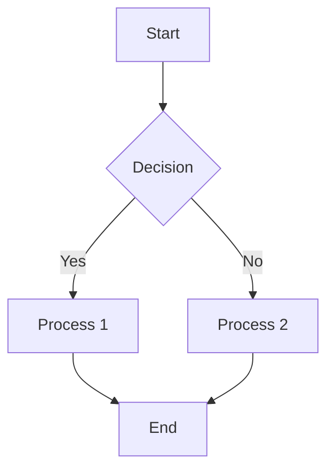
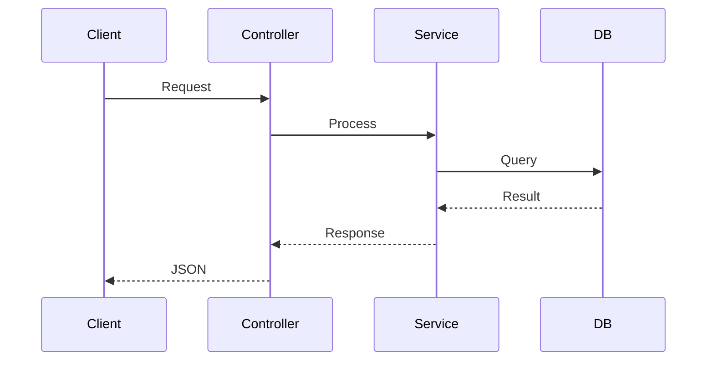
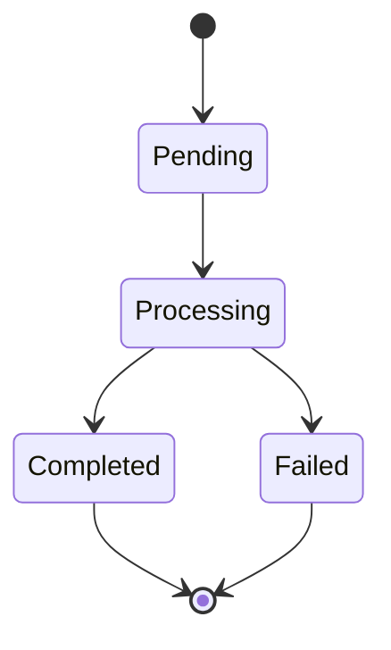
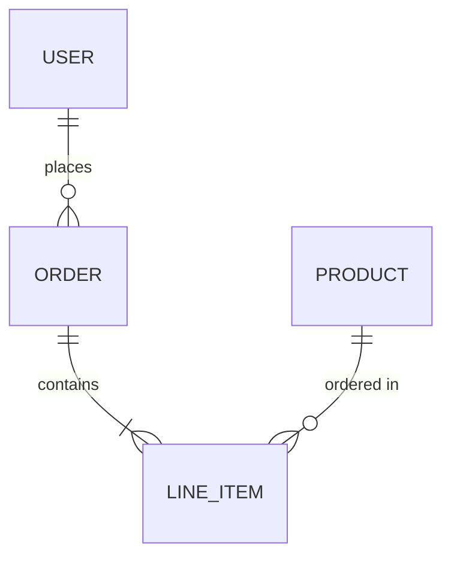
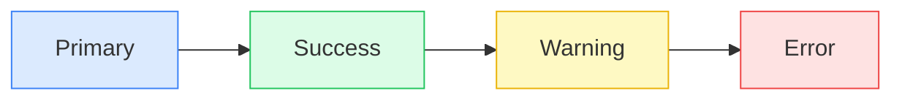
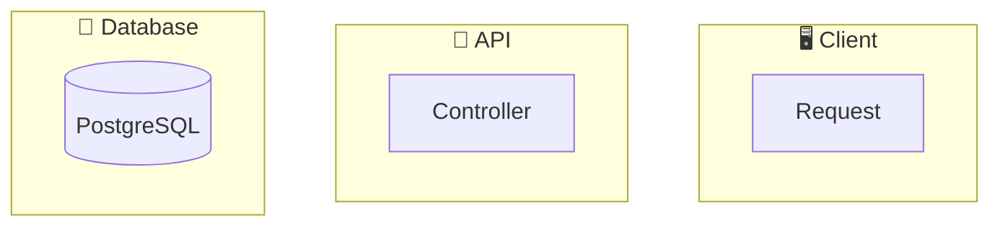

# API Flow Documentation

This directory contains Mermaid flow diagrams for documenting complicated API flows in the project.

## 📁 Directory Structure

```
docs/flows/
├── README.md              # This file
├── _template.md           # Template for creating new flow diagrams
├── .mermaidrc             # Mermaid CLI configuration
├── import-product-flow.md # Import product API flow
└── images/                # Generated PNG/SVG images (auto-generated)
```

## 🚀 Quick Start

### 1. Create a New Flow Diagram

Copy the template file and rename it:

```bash
cp docs/flows/_template.md docs/flows/your-api-flow.md
```

### 2. Edit the Flow Diagram

Open the file and edit the Mermaid diagrams. Use the following diagram types:

| Type           | Use Case                         | Mermaid Syntax    |
| -------------- | -------------------------------- | ----------------- |
| **Flowchart**  | Process flow, decision trees     | `flowchart TD`    |
| **Sequence**   | API call sequences, interactions | `sequenceDiagram` |
| **State**      | State machines, status flow      | `stateDiagram-v2` |
| **ER Diagram** | Database relationships           | `erDiagram`       |
| **Class**      | Class relationships              | `classDiagram`    |

### 3. Preview the Diagram

**Option A: VS Code Extension (Recommended)**

Install one of these extensions:

- [Markdown Preview Mermaid Support](https://marketplace.visualstudio.com/items?itemName=bierner.markdown-mermaid)
- [Mermaid Preview](https://marketplace.visualstudio.com/items?itemName=vstirbu.vscode-mermaid-preview)

Then press `Cmd+Shift+V` to preview markdown.

**Option B: Mermaid Live Editor**

Copy Mermaid code to [https://mermaid.live](https://mermaid.live)

**Option C: Generate Images**

```bash
# Generate PNG from markdown file
yarn docs:mermaid docs/flows/your-api-flow.md -o docs/flows/images/

# Generate all diagrams
yarn docs:mermaid:all
```

## 📝 Diagram Types Reference

### Flowchart (Process Flow)



### Sequence Diagram (API Interactions)



### State Diagram



### ER Diagram (Database)



## 🎨 Styling Guide

### Node Colors



| Purpose            | Fill Color | Stroke Color |
| ------------------ | ---------- | ------------ |
| Primary/Input      | `#dbeafe`  | `#3b82f6`    |
| Success/Output     | `#dcfce7`  | `#22c55e`    |
| Warning/Validation | `#fef9c3`  | `#eab308`    |
| Error              | `#fee2e2`  | `#ef4444`    |
| Processing         | `#fef3c7`  | `#f59e0b`    |
| Async/Queue        | `#fce7f3`  | `#ec4899`    |

### Subgraph Labels with Emojis



Common emojis:

- 🖥️ Client
- 🔌 API Gateway
- ⚙️ Processing
- 💾 Storage/Database
- ✅ Validation
- 📤 Response
- ❌ Error
- 🔄 Background Job
- 📨 Message Queue

## 🛠️ CLI Commands

```bash
# Preview in terminal (requires iTerm2 or similar)
yarn docs:mermaid:preview docs/flows/import-product-flow.md

# Generate PNG
yarn docs:mermaid docs/flows/import-product-flow.md -o docs/flows/images/ -e png

# Generate SVG
yarn docs:mermaid docs/flows/import-product-flow.md -o docs/flows/images/ -e svg

# Generate all flows
yarn docs:mermaid:all
```

## 📚 Available Flow Diagrams

| File                                                   | Description                               |
| ------------------------------------------------------ | ----------------------------------------- |
| [import-product-flow.md](./import-product-flow.md)     | Import product from Excel validation flow |
| [product-matching-flow.md](./product-matching-flow.md) | Product matching with external API flow   |
| [\_template.md](./_template.md)                        | Template for new diagrams                 |

## 🔗 Resources

- [Mermaid Official Documentation](https://mermaid.js.org/)
- [Mermaid Live Editor](https://mermaid.live)
- [Mermaid CLI](https://github.com/mermaid-js/mermaid-cli)

## 💡 Tips

1. **Keep it simple**: Don't try to show everything in one diagram
2. **Use subgraphs**: Group related nodes together
3. **Add context**: Use notes in sequence diagrams
4. **Color coding**: Use consistent colors across diagrams
5. **Version control**: Markdown-based diagrams are easy to diff and review
