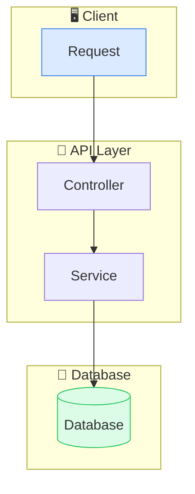
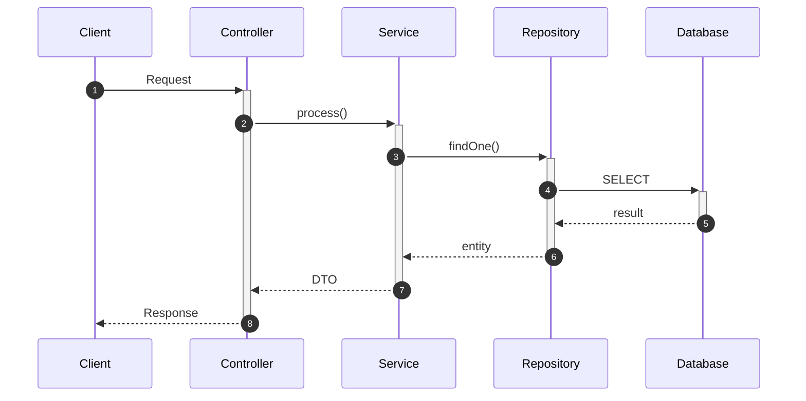
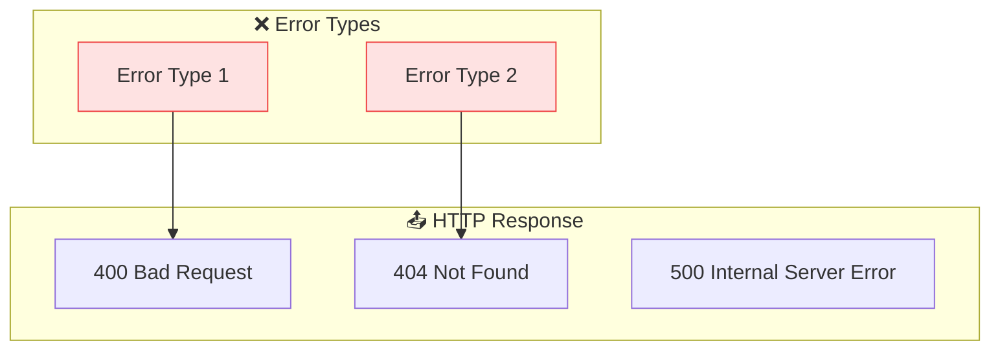
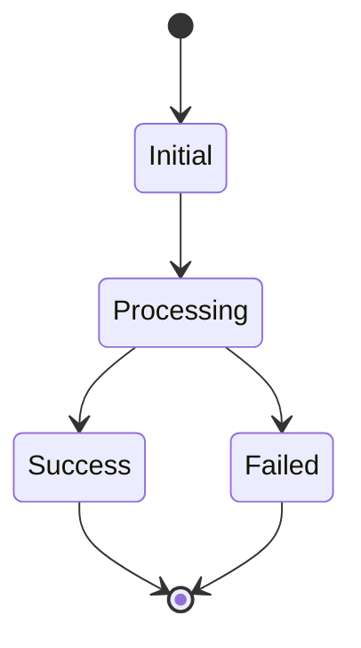
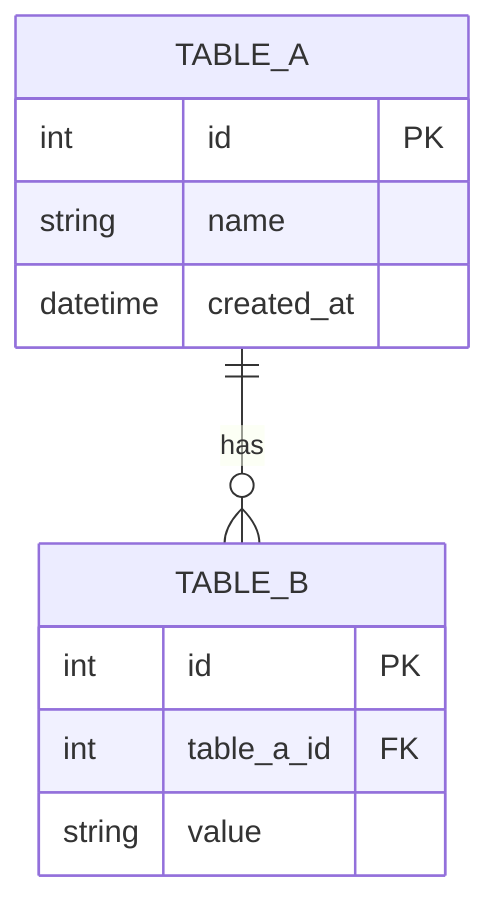
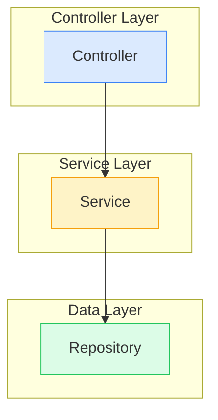

# [API Name] Flow

> [Brief description in Thai/English]

## Overview Flowchart

## Sequence Diagram

## Error Handling

## State Diagram (Optional)

## Entity Relationship (Optional)

## Component Architecture (Optional)

---

## Notes

- Add any additional notes or considerations here
- Document any edge cases or special handling

## Related Documentation

- [Link to related docs]
- [Link to API specification]
