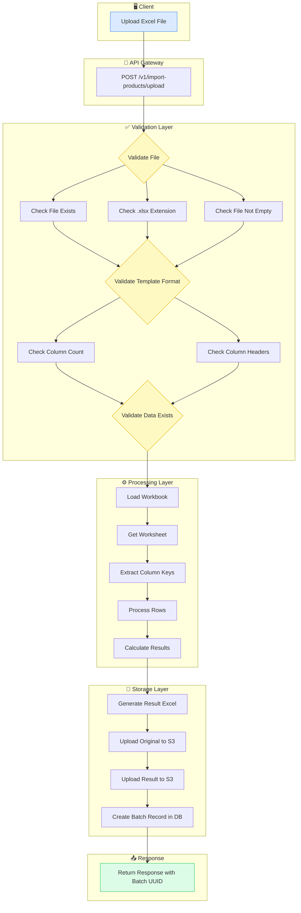
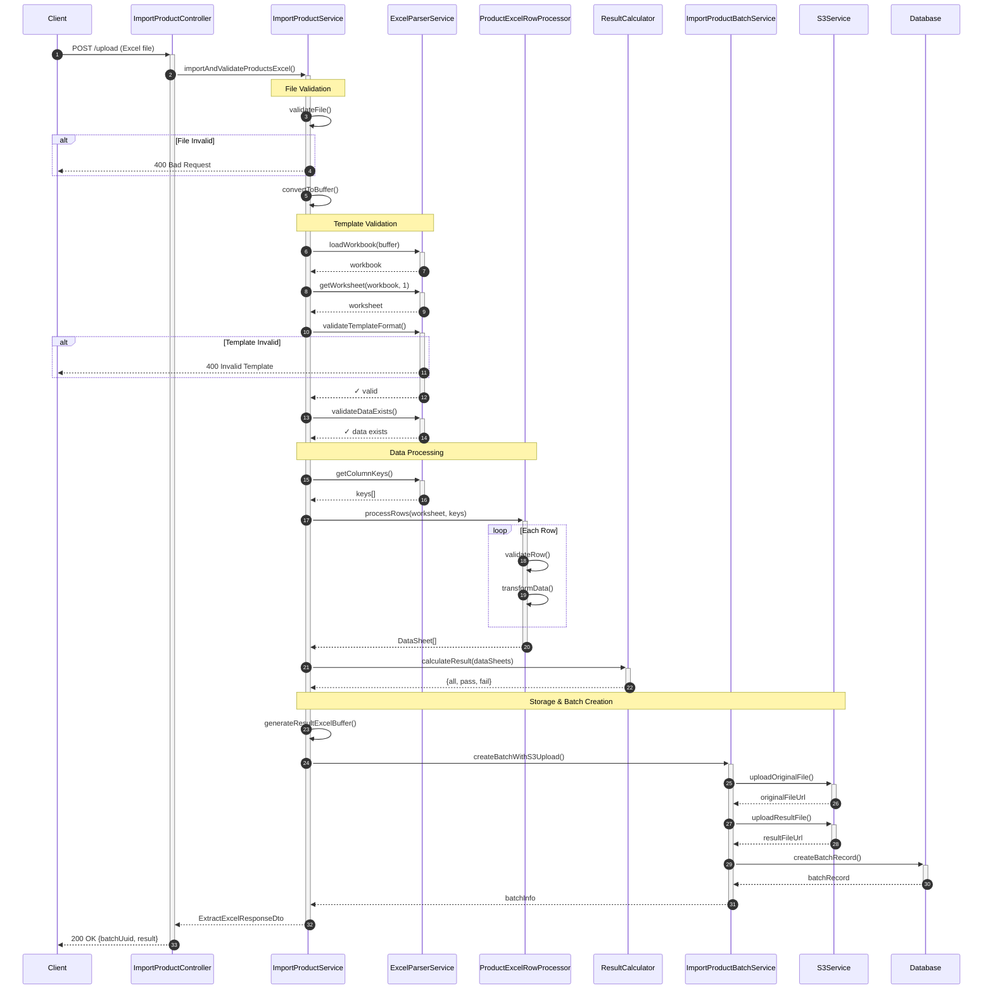
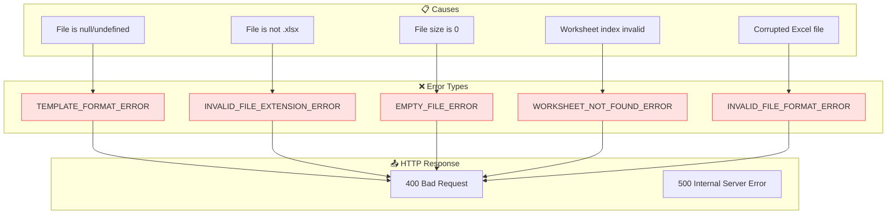
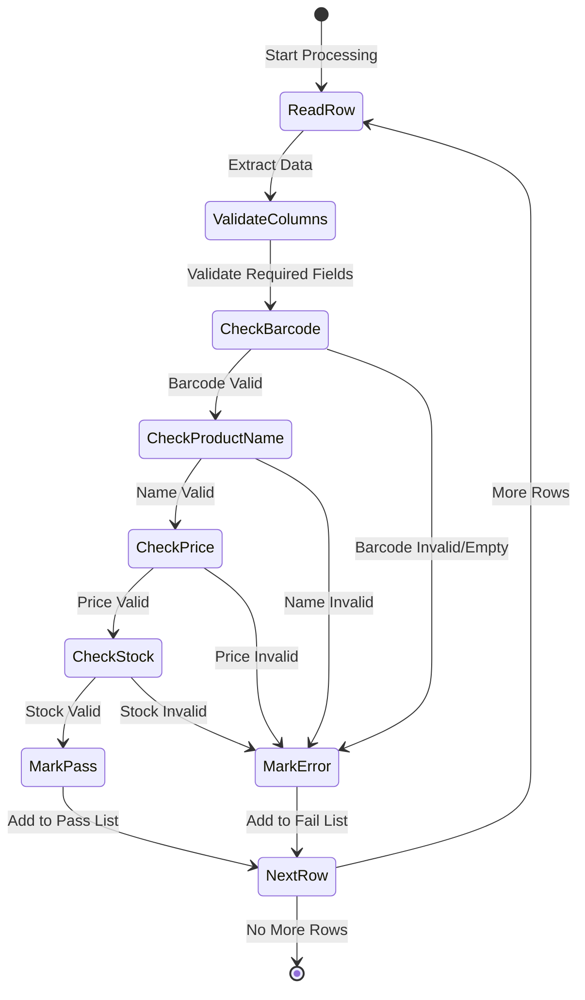
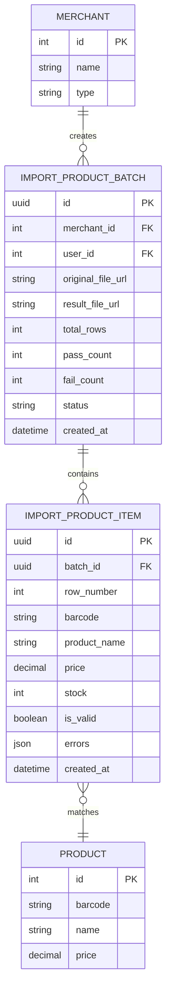
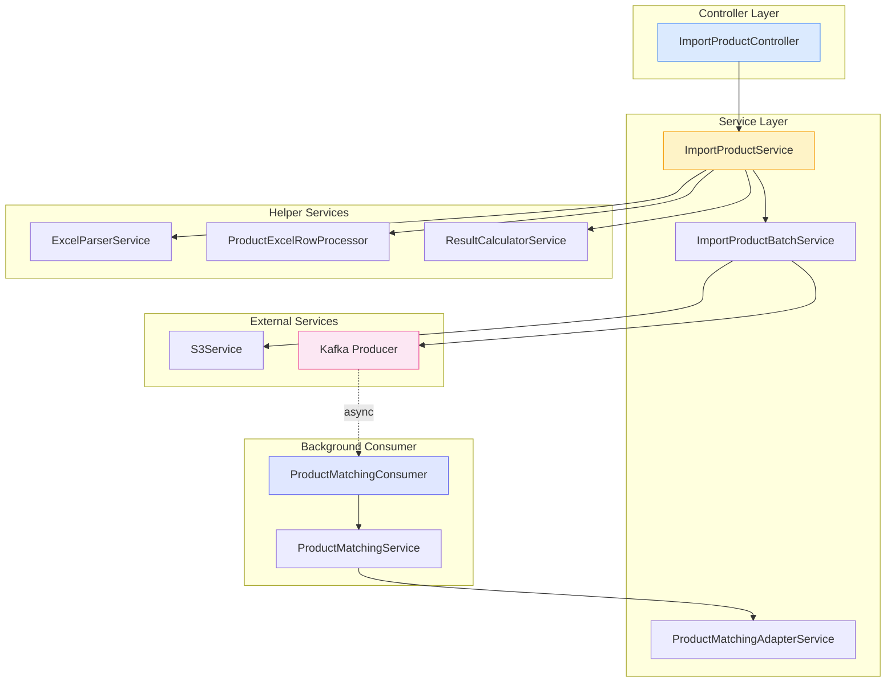

# Import Product Flow

> กระบวนการนำเข้าสินค้าจากไฟล์ Excel เข้าสู่ระบบ

## Overview Flowchart



## Detailed Sequence Diagram



## Error Handling Flow



## Row Processing State Diagram



## Data Model Diagram



## Component Architecture



---

## How to Generate Diagrams

### Option 1: View in VS Code

Install the "Markdown Preview Mermaid Support" extension in VS Code.

### Option 2: Generate PNG/SVG

```bash
# Generate single diagram
yarn docs:mermaid:generate docs/flows/import-product-flow.md

# Generate all diagrams
yarn docs:mermaid:all
```

### Option 3: View Online

Copy the Mermaid code to [Mermaid Live Editor](https://mermaid.live)
