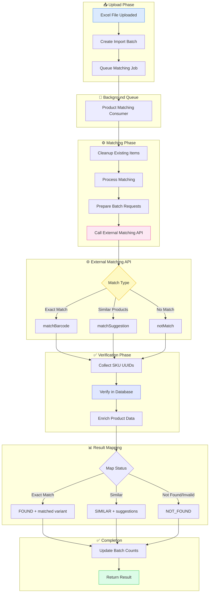
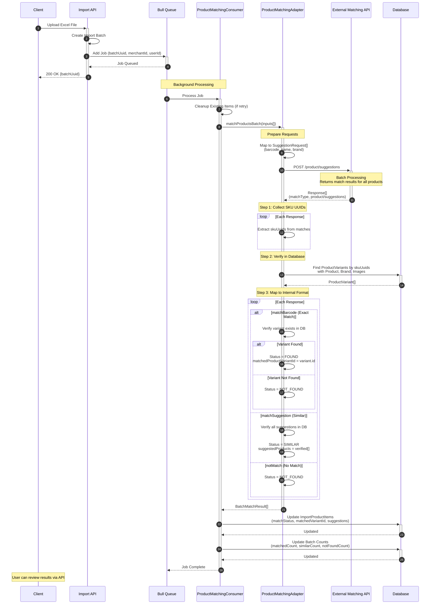
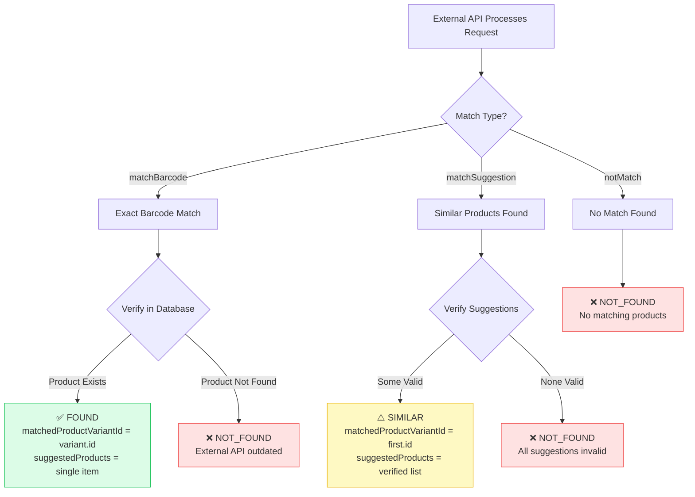
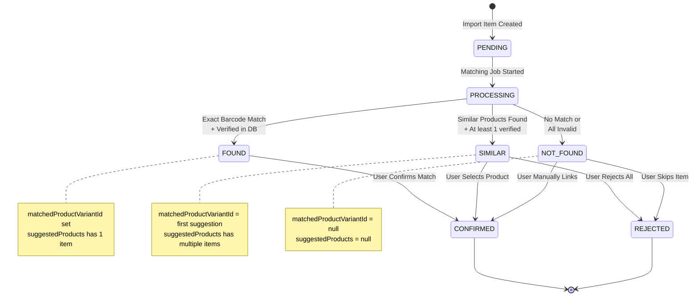
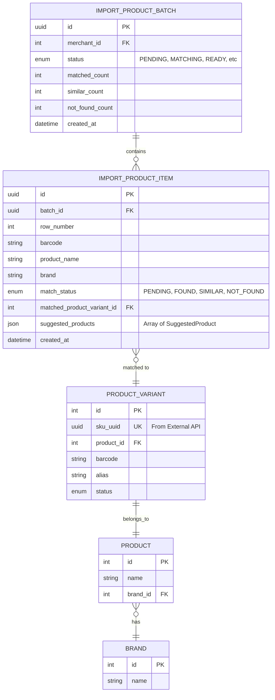
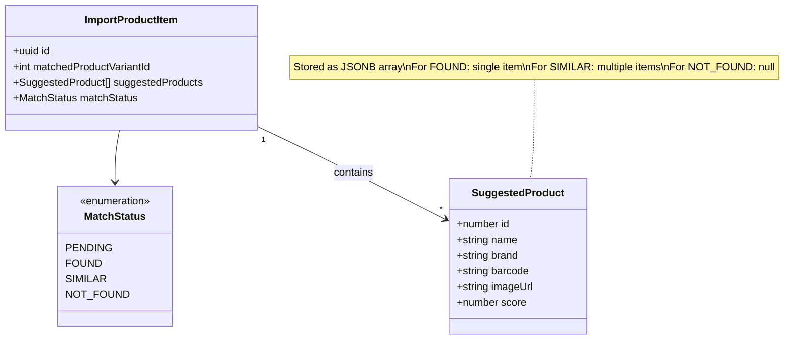
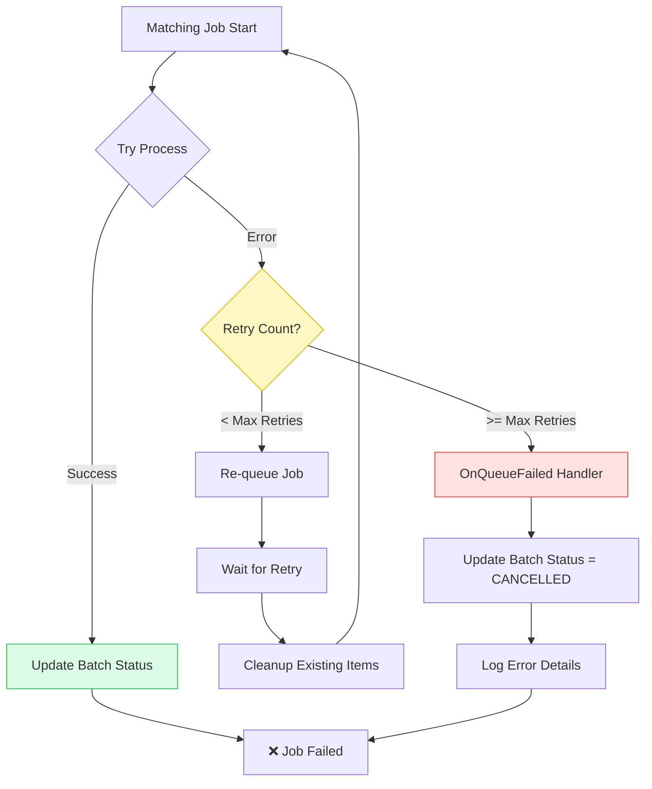
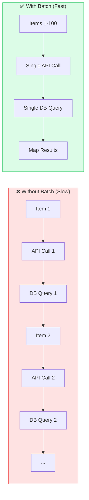

# Product Matching Flow

> กระบวนการจับคู่สินค้าที่นำเข้าจากไฟล์ Excel กับสินค้าในระบบ

## Overview Flowchart



## Detailed Sequence Diagram



## Match Type Decision Tree



## Match Status States



## Adapter Service Flow

```mermaid
flowchart TD
    subgraph Input["📥 Input"]
        A[BatchMatchInput[]]
        A1[- rowNo<br/>- productName<br/>- brand<br/>- barcode]
    end

    subgraph Prepare["🔧 Prepare"]
        B[Map to SuggestionRequest[]]
        B1[- barcode<br/>- name<br/>- brand]
    end

    subgraph External["🌐 External API Call"]
        C[POST /product/suggestions]
        C1[Returns Response[] with<br/>matchType + products]
    end

    subgraph Collect["📦 Collect UUIDs"]
        D{Extract skuUuids}
        D1[From matchBarcode products]
        D2[From matchSuggestion suggestions]
        D3[Create Set of unique UUIDs]
    end

    subgraph Verify["✅ Database Verification"]
        E[Batch Query ProductVariants]
        E1[JOIN Product<br/>JOIN Brand<br/>JOIN Images]
        E2[WHERE skuUuid IN (...)]
        E3[AND status != Deleted]
    end

    subgraph Enrich["🎨 Enrich Data"]
        F[Create Map: skuUuid → VariantData]
        F1[- id: variant.id<br/>- productId<br/>- name<br/>- brand<br/>- barcode<br/>- imageUrl]
    end

    subgraph Map["🗺️ Map Results"]
        G[Loop Each Response]
        G1{matchType?}
        G2[matchBarcode]
        G3[matchSuggestion]
        G4[notMatch]

        G2 --> H1{Verified?}
        H1 -->|Yes| H2[FOUND + variant.id]
        H1 -->|No| H3[NOT_FOUND]

        G3 --> I1{Any Verified?}
        I1 -->|Yes| I2[SIMILAR + suggestions]
        I1 -->|No| I3[NOT_FOUND]

        G4 --> J1[NOT_FOUND]
    end

    subgraph Output["📤 Output"]
        K[BatchMatchResult[]]
        K1[- rowNo<br/>- matchStatus<br/>- matchedProductVariantId<br/>- suggestedProducts]
    end

    A --> B --> C --> D
    D --> D1 & D2 --> D3
    D3 --> E --> E1 & E2 & E3
    E --> F --> F1
    F --> G --> G1
    G1 --> G2 & G3 & G4
    H2 & H3 & I2 & I3 & J1 --> K

    style C fill:#fce7f3,stroke:#ec4899
    style E fill:#e0e7ff,stroke:#6366f1
    style F fill:#dbeafe,stroke:#3b82f6
    style K fill:#dcfce7,stroke:#22c55e
```

## Data Model



## Suggested Product Structure



## Error Handling Flow



## Component Architecture

```mermaid
graph TB
    subgraph Consumer["Consumer Layer"]
        PMC[ProductMatchingConsumer<br/>@Processor: product-matching-queue]
    end

    subgraph Service["Service Layer"]
        IPBS[ImportProductBatchService<br/>processMatching]
        PMA[ProductMatchingAdapterService<br/>matchProductsBatch]
        PMS[ProductMatchingService<br/>getSuggestions]
    end

    subgraph External["External Services"]
        API[External Matching API<br/>POST /product/suggestions]
    end

    subgraph Database["Database"]
        IPBR[ImportProductBatch<br/>Repository]
        IPIR[ImportProductItem<br/>Repository]
        PVR[ProductVariant<br/>Repository]
    end

    subgraph Queue["Message Queue"]
        BQ[Bull Queue<br/>product-matching-queue]
    end

    BQ -.->|consume| PMC
    PMC --> IPBS
    IPBS --> PMA
    PMA --> PMS
    PMS --> API

    PMA --> PVR
    IPBS --> IPIR
    PMC --> IPBR

    style PMC fill:#e0e7ff,stroke:#6366f1
    style API fill:#fce7f3,stroke:#ec4899
    style BQ fill:#fef3c7,stroke:#f59e0b
```

## Batch Processing Performance



---

## Key Features

### 1. Batch Processing

- Processes multiple products in a single API call
- Reduces network overhead
- Single database query for verification

### 2. UUID to ID Mapping

- External API uses UUID (skuUuid)
- Internal system uses integer ID (variant.id)
- Adapter service handles the mapping seamlessly

### 3. Database Verification

- Validates all external API results against local database
- Ensures products exist and are not deleted
- Enriches with relations (Product, Brand, Images)

### 4. Three-Tier Matching

1. **FOUND**: Exact barcode match + verified in DB
2. **SIMILAR**: Similar products found + at least one verified
3. **NOT_FOUND**: No match or all suggestions invalid

### 5. Error Resilience

- Automatic retry on failure
- Cleanup on retry to prevent duplicates
- Graceful degradation to CANCELLED status

## Usage Example

```typescript
// Input from Excel rows
const inputs: BatchMatchInput[] = [
  {
    rowNo: 1,
    productName: 'Coca Cola',
    brand: 'Coca Cola',
    barcode: '8850999320057',
  },
  {
    rowNo: 2,
    productName: 'Pepsi',
    brand: 'PepsiCo',
    barcode: '8850100823311',
  },
];

// Process matching
const results = await adapter.matchProductsBatch(inputs);

// Results
// [
//   { rowNo: 1, matchStatus: 'FOUND', matchedProductVariantId: 12345, suggestedProducts: [...] },
//   { rowNo: 2, matchStatus: 'SIMILAR', matchedProductVariantId: 67890, suggestedProducts: [...] }
// ]
```
